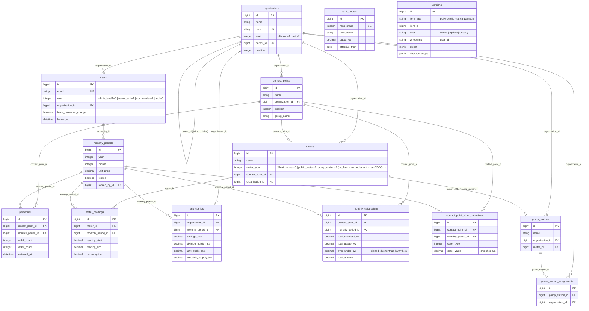

# 04. Database & Models — v1.0.1

> **Đọc lần đầu?** Đọc 01_OVERVIEW trước để hiểu dự án là gì. Tra thuật ngữ tại 02_GLOSSARY.
>
> **Mục đích file này:** Tài liệu chi tiết toàn bộ database schema — mỗi bảng, mỗi cột, kèm giải thích nghiệp vụ.
>
> **Đối tượng đọc:** Developer cần hiểu data model, hoặc bất kỳ ai cần biết dữ liệu được lưu trữ như thế nào.
>
> **Nghiệp vụ chi tiết:** Xem 13_BUSINESS_RULES cho công thức, ví dụ số, edge cases.

---

## Mục lục

1. [Tổng quan schema](#1-tổng-quan-schema)
2. [Chi tiết từng model](#2-chi-tiết-từng-model)
3. [Bảng PaperTrail `versions`](#3-bảng-papertrail-versions)
4. [Quyết định thiết kế](#4-quyết-định-thiết-kế)
5. [Lịch sử migration](#5-lịch-sử-migration)
6. [TODO — sai lệch giữa code và glossary](#todo--sai-lệch-giữa-code-và-glossary)

---

## 1. Tổng quan schema

### 1.1 Số liệu

- **Tổng số bảng:** 14 (13 bảng nghiệp vụ + 1 bảng `versions` của PaperTrail).
- **Tổng số migration:** 18 file (xem mục 5 cho danh sách đầy đủ).
- **Schema version hiện tại:** `2026_04_14_000002` (file `db/schema.rb`).
- **Database engine:** PostgreSQL (extension `pg_catalog.plpgsql` được bật).
- **Kiểu số quan trọng:** Mọi cột tiền và kW đều dùng `decimal` (mapping ra `BigDecimal` ở Ruby), không dùng `float`. Xem mục 4.1.

### 1.2 ERD (Mermaid)

Quan hệ giữa các bảng chính. FK được ghi nhãn trên từng đường quan hệ. `rank_quotas` và `versions` đứng độc lập (không có đường FK nối ra ngoài).



**Ghi chú:**
- `rank_quotas` — độc lập, không có FK đến bảng khác. Được tra cứu bởi `CalculationEngine` tại thời điểm tính.
- `versions` (PaperTrail) — polymorphic qua `item_type + item_id`, không có FK thực ở tầng DB. Tất cả 13 model nghiệp vụ đều có `has_paper_trail`.
- `pump_station_assignments` — bảng nối (join table) giữa `pump_stations` và `organizations`.

### 1.3 13 bảng nghiệp vụ — tóm tắt mục đích

| # | Bảng | Model | Mục đích nghiệp vụ |
|---|------|-------|---------------------|
| 1 | `organizations` | `Organization` | Sư đoàn (cấp 1) + 13 đơn vị trực thuộc (cấp 2). Cấu trúc 2 cấp phẳng qua `parent_id`. |
| 2 | `users` | `User` | Tài khoản đăng nhập + role (4 vai trò). Devise modules: database_authenticatable, lockable, trackable, timeoutable. |
| 3 | `contact_points` | `ContactPoint` | Đầu mối — đơn vị nhỏ nhất có công tơ riêng. Sư đoàn bộ có 79 đầu mối (tháng 02/2026). |
| 4 | `meters` | `Meter` | Công tơ điện gắn tại đầu mối (hoặc trạm bơm). Có loại (`meter_type` enum). |
| 5 | `rank_quotas` | `RankQuota` | Định mức 7 nhóm cấp bậc (kW/người/tháng) theo Nghị định 02. Có `effective_from` để hỗ trợ thay đổi định mức. |
| 6 | `monthly_periods` | `MonthlyPeriod` | Kỳ tính toán (năm + tháng). Lưu đơn giá và trạng thái khoá. |
| 7 | `personnel` | `Personnel` | Quân số đầu mối theo 7 nhóm cấp bậc, mỗi tháng. |
| 8 | `meter_readings` | `MeterReading` | Chỉ số đầu kỳ và cuối kỳ của công tơ, mỗi tháng. |
| 9 | `unit_configs` | `UnitConfig` | Cấu hình tỷ lệ (tiết kiệm, công cộng) + số điện lực, theo đơn vị và tháng. |
| 10 | `pump_stations` | `PumpStation` | Trạm bơm nước. Có thể liên kết với một công tơ (loại `pump_station`). |
| 11 | `pump_station_assignments` | `PumpStationAssignment` | Bảng nối: trạm bơm phục vụ đơn vị nào. |
| 12 | `monthly_calculations` | `MonthlyCalculation` | Snapshot kết quả tính toán bảng 22 cột — mỗi đầu mối, mỗi tháng. |
| 13 | `contact_point_other_deductions` | `ContactPointOtherDeduction` | Khoản trừ "Khác" (cột 18) đặc thù từng đầu mối + tháng. Cho phép giá trị âm. |

### 1.4 Quy ước chung của schema

- **Tên bảng:** snake_case, số nhiều (Rails convention). Ngoại lệ: `personnel` (uncountable trong tiếng Anh, không phải `personnels`). Model dùng `self.table_name = "personnel"` để map đúng.
- **Khoá chính:** `bigint id`, tự sinh.
- **Timestamps:** `created_at`, `updated_at` (datetime, không null) trên mọi bảng nghiệp vụ.
- **Foreign keys:** có ràng buộc ở tầng database (PostgreSQL), không chỉ tầng Rails.
- **Decimal precision:** mọi cột kW và tiền dùng `precision: 12, scale: 2`. Cột tỷ lệ (rate) dùng `precision: 5, scale: 4` (lưu 0.0500 = 5%). Cột "Khác" giá trị dùng `scale: 4` để chứa hệ số nhân chính xác hơn.
- **PaperTrail:** mọi model nghiệp vụ đều có `has_paper_trail` — toàn bộ thay đổi được ghi vào bảng `versions` (xem mục 3).
- **Display ordering:** các bảng cần sắp xếp trên UI có cột `position` (integer, default 0).

---

## 2. Chi tiết từng model

Thứ tự trình bày theo dependency — bảng cha trước bảng con. Các thông tin (cột, validation, association, scope, callback) đọc trực tiếp từ `db/schema.rb`, `db/migrate/*.rb` và `app/models/*.rb`.

### 2.1 `organizations` — `Organization`

**Nghiệp vụ:** Sư đoàn (`level: division`) + 13 đơn vị cấp 2 (`level: unit`). Tất cả vai trò người dùng đều thuộc một organization. Map vào toàn bộ 21 chức năng F01–F21 vì mọi dữ liệu đều scope theo `organization_id`. Xem `02_GLOSSARY` mục 1 và mục 11.

**Cột:**

| Cột | Kiểu | Null? | Default | Giải thích nghiệp vụ |
|---|---|---|---|---|
| `id` | `bigint` | ❌ | — | Khoá chính. |
| `name` | `string` | ❌ | — | Tên hiển thị, ví dụ "Sư đoàn", "Trung đoàn 101". Tối đa 100 ký tự. |
| `code` | `string` | ❌ | — | Mã tổ chức ngắn, unique. Ví dụ: `SD`, `SDB`, `TR101`, `TD14`. Tối đa 20 ký tự. |
| `level` | `integer` | ❌ | `2` | Enum: `1 = division` (Sư đoàn), `2 = unit` (đơn vị cấp 2). Có index. |
| `parent_id` | `bigint` | ✅ | — | FK self-reference đến `organizations`. `division` = NULL, `unit` = ID Sư đoàn. Có index. |
| `position` | `integer` | ✅ | `0` | Thứ tự hiển thị trên UI. |
| `created_at` | `datetime` | ❌ | — | |
| `updated_at` | `datetime` | ❌ | — | |

**Index:**

- `code` (unique)
- `level`
- `parent_id`

**Associations:**

- `belongs_to :parent, class_name: "Organization", optional: true`
- `has_many :children, class_name: "Organization", foreign_key: :parent_id, dependent: :restrict_with_error`
- `has_many :users, dependent: :restrict_with_error`
- `has_many :contact_points, dependent: :restrict_with_error`
- `has_many :meters, dependent: :restrict_with_error`
- `has_many :unit_configs, dependent: :destroy`
- `has_many :pump_stations, dependent: :restrict_with_error`
- `has_many :pump_station_assignments, dependent: :destroy`
- `has_many :served_by_pump_stations, through: :pump_station_assignments, source: :pump_station`

**Validations:**

- `code`: presence, uniqueness, length ≤ 20
- `name`: presence, length ≤ 100
- `level`: presence + enum validate
- `position`: integer ≥ 0
- Custom `parent_must_be_division` (chỉ khi `level == "unit"` và có `parent_id`): parent phải là một `division`.
- Custom `division_has_no_parent` (chỉ khi `level == "division"`): `parent_id` phải NULL.

**Scopes:**

- `ordered` — sắp xếp theo `position`, `name`.
- `divisions` — chỉ Sư đoàn.
- `units` — chỉ đơn vị cấp 2.
- `by_parent(parent_id)` — đơn vị thuộc Sư đoàn cụ thể.

**Callbacks:** không có callback ngoài PaperTrail tự động.

**Enums:**

- `level`: `{ division: 1, unit: 2 }`, có `validate: true`.

**PaperTrail:** ✅ track toàn bộ thay đổi. Khi đổi tên Sư đoàn hoặc thêm/xoá/sửa đơn vị cấp 2, một version mới được lưu.

---

### 2.2 `users` — `User`

**Nghiệp vụ:** Tài khoản đăng nhập + 4 vai trò. Mỗi user thuộc một `organization`. Map vào F15 (quản lý tài khoản), F16 (đăng nhập), F17 (khoá tài khoản 5 lần sai), F18 (bắt buộc đổi mật khẩu lần đầu). Xem `02_GLOSSARY` mục 7.

**Cột:**

| Cột | Kiểu | Null? | Default | Giải thích nghiệp vụ |
|---|---|---|---|---|
| `id` | `bigint` | ❌ | — | |
| `email` | `string` | ❌ | `""` | Login. Unique. |
| `encrypted_password` | `string` | ❌ | `""` | Devise bcrypt hash. |
| `full_name` | `string` | ❌ | — | Tên hiển thị, tối đa 100. |
| `reset_password_token` | `string` | ✅ | — | Devise Recoverable. Unique. |
| `reset_password_sent_at` | `datetime` | ✅ | — | |
| `sign_in_count` | `integer` | ❌ | `0` | Devise Trackable. |
| `current_sign_in_at` | `datetime` | ✅ | — | |
| `last_sign_in_at` | `datetime` | ✅ | — | |
| `current_sign_in_ip` | `string` | ✅ | — | |
| `last_sign_in_ip` | `string` | ✅ | — | |
| `failed_attempts` | `integer` | ❌ | `0` | Devise Lockable. Đếm số lần nhập sai mật khẩu liên tiếp. |
| `unlock_token` | `string` | ✅ | — | Devise Lockable. Unique. |
| `locked_at` | `datetime` | ✅ | — | Khi != NULL → tài khoản bị khoá (F17 — sau 5 lần sai). |
| `role` | `integer` | ❌ | `1` | Enum: `0 = admin_level1`, `1 = admin_unit`, `2 = commander`, `3 = tech`. Có index. |
| `organization_id` | `bigint` | ❌ | — | FK đến `organizations`. Có index. |
| `force_password_change` | `boolean` | ❌ | `true` | Mặc định `true` cho tài khoản mới (F18). User phải đổi mật khẩu lần đầu. |
| `remember_created_at` | `datetime` | ✅ | — | Devise Rememberable (thêm sau, migration `20260413162304`). |
| `created_at`, `updated_at` | `datetime` | ❌ | — | |

**Index:**

- `email` (unique)
- `reset_password_token` (unique)
- `unlock_token` (unique)
- `role`
- `organization_id`

**Associations:**

- `belongs_to :organization`
- `has_many :locked_monthly_periods, class_name: "MonthlyPeriod", foreign_key: :locked_by_id, dependent: :nullify` — các kỳ mà user này đã khoá. Khi xoá user, các kỳ vẫn giữ nhưng `locked_by_id` thành NULL.

**Devise modules:** `database_authenticatable`, `rememberable`, `validatable`, `trackable`, `lockable`, `timeoutable`. (Không có `recoverable` bật trong model dù DB có cột `reset_password_*` — flow reset mật khẩu thực tế đi qua rake task quản trị.)

**Validations:**

- `full_name`: presence, length ≤ 100.
- `role`: presence + enum validate.
- `organization_id`: presence.
- Custom `organization_must_be_unit` (chỉ khi `admin_unit?` hoặc `commander?`): organization phải là `level: unit`. Tức `admin_level1` và `tech` thuộc Sư đoàn, hai vai trò còn lại thuộc đơn vị cấp 2.
- Custom `password_complexity`: nếu password được set, phải có ít nhất 1 chữ cái và 1 số. Quy tắc cứng tránh password yếu.
- Custom `prevent_locking_last_admin_level1` (validation, chạy khi `locked_at` thay đổi): không cho phép khoá `admin_level1` cuối cùng còn active. Lý do: nếu khoá hết admin_level1 thì không còn ai có thể mở khoá lại.

**Callbacks:**

- `before_destroy :prevent_destroying_last_admin_level1` — không cho phép xoá `admin_level1` cuối cùng còn active.

**Scopes:**

- `by_organization(org_id)`
- `admins` — chỉ `admin_level1` + `admin_unit`.
- `ordered` — theo `full_name`.

**Enums:**

- `role`: `{ admin_level1: 0, admin_unit: 1, commander: 2, tech: 3 }`, validate.

**Phương thức nghiệp vụ:**

- `last_active_admin_level1?` — true nếu user này là `admin_level1` cuối cùng còn active (chưa locked).
- `lock_access!(opts)` — override Devise hook. Khi user là `admin_level1` cuối cùng và bị auto-lock do nhập sai 5 lần, log warning `[SECURITY]` để tech biết. Không chặn auto-lock vì có thể là tấn công thật. Nhưng manual lock (validation `prevent_locking_last_admin_level1`) thì chặn.

**PaperTrail:** ✅. Track thay đổi `email`, `role`, `organization_id`, `locked_at`, `force_password_change`, v.v.

---

### 2.3 `contact_points` — `ContactPoint`

**Nghiệp vụ:** Đầu mối — đơn vị nhỏ nhất có công tơ riêng. Mỗi đầu mối thuộc một `organization` (cấp 2). Sư đoàn bộ có 79 đầu mối tháng 02/2026. Map vào F01 (CRUD đầu mối). Xem `02_GLOSSARY` mục 1.

**Cột:**

| Cột | Kiểu | Null? | Default | Giải thích nghiệp vụ |
|---|---|---|---|---|
| `id` | `bigint` | ❌ | — | |
| `name` | `string` | ❌ | — | Tên đầu mối, ví dụ "Ban Tác huấn", "Tổ xe", "Nhà ăn". Unique trong cùng `organization`. |
| `organization_id` | `bigint` | ❌ | — | FK. |
| `position` | `integer` | ✅ | `0` | Thứ tự hiển thị trên bảng 22 cột (cột TT). |
| `group_name` | `string` | ✅ | — | Nhóm con trong đơn vị, ví dụ "Ban Tham mưu", "Ban Chính trị". Tối đa 100. |
| `created_at`, `updated_at` | `datetime` | ❌ | — | |

**Index:**

- `(organization_id, name)` unique
- `organization_id`

**Associations:**

- `belongs_to :organization`
- `has_many :meters, dependent: :restrict_with_error`
- `has_many :personnel_records, class_name: "Personnel", dependent: :destroy`
- `has_many :monthly_calculations, dependent: :destroy`
- `has_many :other_deductions, class_name: "ContactPointOtherDeduction", dependent: :destroy`

**Validations:**

- `name`: presence, length ≤ 100, uniqueness trong scope `organization_id`.
- `group_name`: length ≤ 100, allow_blank.
- `position`: integer ≥ 0.

**Scopes:**

- `ordered` — theo `position`, `name`.
- `by_organization(org_id)`.
- `by_group(group)`.

**Ransackable:** mở `name`, `group_name`, `organization_id`, `position`, `created_at`, `updated_at` cho ransack search. Association: `organization`.

**Callbacks:** không có ngoài PaperTrail.

**PaperTrail:** ✅.

---

### 2.4 `meters` — `Meter`

**Nghiệp vụ:** Công tơ điện. Hai trường hợp gắn:
1. Gắn tại đầu mối (`contact_point_id` != NULL) — công tơ thường, công tơ công cộng.
2. Gắn tại trạm bơm (`contact_point_id = NULL`, được liên kết qua `pump_station.meter_id`) — công tơ trạm bơm.

Map vào F02 (CRUD công tơ). Xem `02_GLOSSARY` mục 2.

**Cột:**

| Cột | Kiểu | Null? | Default | Giải thích nghiệp vụ |
|---|---|---|---|---|
| `id` | `bigint` | ❌ | — | |
| `name` | `string` | ❌ | — | Tên công tơ. Tối đa 100. |
| `serial_number` | `string` | ✅ | — | Số seri thiết bị. Unique nếu có giá trị. Tối đa 50. |
| `meter_type` | `integer` | ❌ | `0` | Enum: xem bên dưới. Có index. |
| `contact_point_id` | `bigint` | ✅ | — | FK đầu mối. NULL với công tơ trạm bơm. Có index. |
| `organization_id` | `bigint` | ❌ | — | FK đơn vị. Có index. |
| `position` | `integer` | ✅ | `0` | Thứ tự hiển thị. |
| `notes` | `text` | ✅ | — | Ghi chú tự do, tối đa 1000 ký tự (thêm sau, migration `20260412122327`). |
| `created_at`, `updated_at` | `datetime` | ❌ | — | |

**Index:**

- `meter_type`
- `serial_number`
- `contact_point_id`
- `organization_id`

**Associations:**

- `belongs_to :organization`
- `belongs_to :contact_point, optional: true`
- `has_many :meter_readings, dependent: :destroy`
- `has_one :pump_station, dependent: :nullify`

**Validations:**

- `name`: presence, length ≤ 100.
- `meter_type`: presence + enum validate.
- `serial_number`: uniqueness, allow_blank, length ≤ 50.
- `notes`: length ≤ 1000, allow_blank.
- `position`: integer ≥ 0.

**Scopes:**

- `ordered`
- `by_organization(org_id)`
- `by_type(type)`

**Enums:**

- `meter_type`: `{ normal: 0, public_meter: 1, pump_station: 2 }`, validate.
  - `normal` — công tơ thường, xuất hiện trong bản thu tiền.
  - `public_meter` — công tơ công cộng (hội trường, đèn đường…). KHÔNG xuất hiện trong bản thu tiền nhưng vẫn tham gia tính tổn hao.
  - `pump_station` — công tơ trạm bơm, không có `contact_point_id`.

**ℹ️ Ghi chú:** `02_GLOSSARY v1.1.0` đã cập nhật khớp code: key là `public_meter` (không phải `public_use`). Loại `no_loss` ("vị trí không tổn hao") được đánh dấu "chưa implement" trong glossary. Xem mục TODO #1.

**Callbacks:** không có ngoài PaperTrail.

**PaperTrail:** ✅.

---

### 2.5 `rank_quotas` — `RankQuota`

**Nghiệp vụ:** Định mức điện cho 7 nhóm cấp bậc theo Nghị định 02. Mỗi nhóm có thể có nhiều bản ghi với `effective_from` khác nhau — cho phép thay đổi định mức theo thời gian (Nghị định mới). Map vào F21 (quản lý định mức cấp bậc — admin_level1 sửa). Xem `02_GLOSSARY` mục 9 và `13_BUSINESS_RULES` mục 3.

**Cột:**

| Cột | Kiểu | Null? | Default | Giải thích nghiệp vụ |
|---|---|---|---|---|
| `id` | `bigint` | ❌ | — | |
| `rank_group` | `integer` | ❌ | — | Số nhóm 1..7. |
| `rank_name` | `string` | ❌ | — | Tên đầy đủ nhóm cấp bậc. Tối đa 100. |
| `quota_kw` | `decimal(10,2)` | ❌ | — | Định mức kW/người/tháng. Phải > 0. |
| `effective_from` | `date` | ❌ | — | Ngày bắt đầu hiệu lực. |
| `created_at`, `updated_at` | `datetime` | ❌ | — | |

**Index:**

- `(rank_group, effective_from)` unique — không cho hai bản ghi cùng nhóm có cùng ngày hiệu lực.

**Associations:** không có.

**Validations:**

- `rank_group`: presence, inclusion 1..7, uniqueness trong scope `effective_from`.
- `rank_name`: presence, length ≤ 100.
- `quota_kw`: presence, > 0.
- `effective_from`: presence.

**Scopes:**

- `ordered` — theo `rank_group`, `effective_from`.
- `for_rank(group)`.
- `effective_at(date)` — bản ghi có `effective_from ≤ date`, sắp xếp giảm dần để `.first` lấy bản hiệu lực mới nhất tại thời điểm đó.

**Class methods:**

- `RankQuota.current_quotas_for(date)` — trả về hash `{1 => 570, 2 => 440, ...}` chứa định mức kW của 7 nhóm tại ngày đó.
- `RankQuota.current_names(date)` — trả về hash `{1 => "Chỉ huy sư đoàn…", ...}` tên 7 nhóm tại ngày đó. Fallback `"Nhóm #{group}"` nếu không có bản ghi.

**Constants:**

- `RANK_GROUPS = [1, 2, 3, 4, 5, 6, 7]`
- `STANDARD_QUOTAS = {1 => 570, 2 => 440, 3 => 305, 4 => 130, 5 => 210, 6 => 110, 7 => 24}` — định mức theo Nghị định 02 hiện hành. Dùng trong `db/seeds.rb`.

**Seed (db/seeds.rb):** tạo 7 bản ghi với `effective_from = 2024-01-01`, `quota_kw` từ `STANDARD_QUOTAS`, `rank_name` lấy từ hash `rank_names` (tên đầy đủ theo nghị định gốc — dài hơn tên rút gọn trong `02_GLOSSARY` mục 9). Xem mục TODO.

**Callbacks:** không có ngoài PaperTrail.

**PaperTrail:** ✅. Lịch sử thay đổi định mức (F21) được lưu ở bảng `versions` để xem được qua F19.

---

### 2.6 `monthly_periods` — `MonthlyPeriod`

**Nghiệp vụ:** Kỳ tính toán (năm + tháng). Mỗi kỳ có đơn giá và trạng thái khoá. Map vào F20 (quản lý đơn giá). Xem `02_GLOSSARY` mục 6.

**Cột:**

| Cột | Kiểu | Null? | Default | Giải thích nghiệp vụ |
|---|---|---|---|---|
| `id` | `bigint` | ❌ | — | |
| `year` | `integer` | ❌ | — | Năm 2020..2100. |
| `month` | `integer` | ❌ | — | Tháng 1..12. |
| `unit_price` | `decimal(12,2)` | ✅ | — | Đơn giá đồng/kW. Thay đổi hàng tháng theo nhà nước. Data tháng 02/2026 = 2.336,4 đồng/kW. |
| `locked` | `boolean` | ❌ | `false` | Khi `true`, admin_unit không sửa được dữ liệu tháng đó. |
| `locked_by_id` | `bigint` | ✅ | — | FK đến `users`. User đã khoá kỳ này. |
| `locked_at` | `datetime` | ✅ | — | Thời điểm khoá. |
| `created_at`, `updated_at` | `datetime` | ❌ | — | |

**Index:**

- `(year, month)` unique
- `locked_by_id`

**Associations:**

- `belongs_to :locked_by, class_name: "User", optional: true`
- `has_many :meter_readings, dependent: :destroy`
- `has_many :personnel_records, class_name: "Personnel", dependent: :destroy`
- `has_many :unit_configs, dependent: :destroy`
- `has_many :contact_point_other_deductions, dependent: :destroy`
- `has_many :monthly_calculations, dependent: :destroy`

**Validations:**

- `year`: presence, integer 2020..2100.
- `month`: presence, integer 1..12, uniqueness trong scope `year`.
- `unit_price`: > 0, allow_nil (tạo trước, nhập đơn giá sau).
- `locked`: phải là true/false.
- Custom `locked_by_required_when_locked`: khi `locked = true`, `locked_by_id` không được NULL.

**Scopes:**

- `ordered` — năm/tháng giảm dần.
- `unlocked` / `locked`.
- `for_year(year)`.

**Phương thức nghiệp vụ:**

- `label` — string `"YYYY/MM"`.
- `lock!(user)` — đặt `locked = true`, `locked_at = Time.current`, `locked_by = user`.
- `unlock!` — xoá hết 3 cột khoá. Theo nghiệp vụ, chỉ admin_level1 được gọi (kiểm soát ở controller/Ability).

**Callbacks:** không có ngoài PaperTrail.

**PaperTrail:** ✅. Mọi thay đổi đơn giá (F20) hoặc khoá/mở khoá đều có version.

---

### 2.7 `personnel` — `Personnel`

**Nghiệp vụ:** Quân số đầu mối theo 7 nhóm cấp bậc, ghi nhận theo từng tháng. Kế thừa từ tháng trước sang tháng sau (nghiệp vụ kế thừa tháng — xem `02_GLOSSARY` mục 6, `13_BUSINESS_RULES` mục 8.1). Map vào F03 (khai báo quân số) và F07 (soát lại quân số).

**Tên bảng:** `personnel` (uncountable). Model dùng `self.table_name = "personnel"`.

**Cột:**

| Cột | Kiểu | Null? | Default | Giải thích nghiệp vụ |
|---|---|---|---|---|
| `id` | `bigint` | ❌ | — | |
| `contact_point_id` | `bigint` | ❌ | — | FK đầu mối. |
| `monthly_period_id` | `bigint` | ❌ | — | FK kỳ tính toán. |
| `rank1_count` | `integer` | ❌ | `0` | Số người nhóm 1 (Đại tá, 570 kW). |
| `rank2_count` | `integer` | ❌ | `0` | Số người nhóm 2 (Thượng tá, 440 kW). |
| `rank3_count` | `integer` | ❌ | `0` | Số người nhóm 3 (Trung tá/Thiếu tá, 305 kW). |
| `rank4_count` | `integer` | ❌ | `0` | Số người nhóm 4 (cấp Úy, 130 kW). |
| `rank5_count` | `integer` | ❌ | `0` | Số người nhóm 5 (Cơ quan Sư đoàn, Trung đoàn, 210 kW). |
| `rank6_count` | `integer` | ❌ | `0` | Số người nhóm 6 (Tiểu đoàn, Đại đội, 110 kW). |
| `rank7_count` | `integer` | ❌ | `0` | Số người nhóm 7 (Hạ sĩ quan, Binh sĩ, 24 kW). |
| `reviewed_at` | `datetime` | ✅ | — | F07: thời điểm admin_unit "soát lại" quân số đã kế thừa. NULL = chưa soát. |
| `created_at`, `updated_at` | `datetime` | ❌ | — | |

**Index:**

- `(contact_point_id, monthly_period_id)` unique — mỗi đầu mối chỉ có 1 bản ghi quân số/tháng.
- `contact_point_id`
- `monthly_period_id`

**Associations:**

- `belongs_to :contact_point`
- `belongs_to :monthly_period`

**Validations:**

- Uniqueness `contact_point_id` trong scope `monthly_period_id`.
- Tất cả 7 cột `rankN_count`: integer ≥ 0.

**Scopes:**

- `for_period(period_id)`
- `for_contact_point(cp_id)`
- `by_organization(org_id)` — join qua `contact_point`.

**Constants:**

- `RANK_COLUMNS = [:rank1_count, :rank2_count, :rank3_count, :rank4_count, :rank5_count, :rank6_count, :rank7_count]`
- `WATER_PUMP_RATE = BigDecimal("9.45")` — tiêu chuẩn bơm nước kW/người/tháng (cố định theo NĐ 02). Sử dụng trong `CalculationEngine`.

**Phương thức nghiệp vụ:**

- `total_count` — tổng quân số 7 nhóm.
- `reviewed?` — `reviewed_at.present?`.
- `mark_reviewed!` — `touch(:reviewed_at)` (F07 "Đã soát").
- `unmark_reviewed!` — set `reviewed_at = nil`.

**Lịch sử migration cột `reviewed_at`:**
- `20260414000001_add_reviewed_at_to_personnel.rb` — thêm cột datetime.
- `20260414000002_remove_reviewed_boolean_from_personnel.rb` — xoá cột `reviewed` boolean cũ. Tức ban đầu là boolean, sau chuyển sang datetime để biết "ai soát lúc nào". Xem mục 5.

**Callbacks:** không có ngoài PaperTrail.

**PaperTrail:** ✅.

---

### 2.8 `meter_readings` — `MeterReading`

**Nghiệp vụ:** Chỉ số công tơ đầu kỳ và cuối kỳ, mỗi tháng. Phần mềm tự tính `consumption = reading_end − reading_start`. Map vào F06 (nhập chỉ số công tơ). Xem `02_GLOSSARY` mục 2.

**Cột:**

| Cột | Kiểu | Null? | Default | Giải thích nghiệp vụ |
|---|---|---|---|---|
| `id` | `bigint` | ❌ | — | |
| `meter_id` | `bigint` | ❌ | — | FK công tơ. |
| `monthly_period_id` | `bigint` | ❌ | — | FK kỳ. |
| `reading_start` | `decimal(12,2)` | ✅ | — | Chỉ số đầu kỳ. Tháng đầu nhập tay; tháng sau = `reading_end` tháng trước (kế thừa). |
| `reading_end` | `decimal(12,2)` | ✅ | — | Chỉ số cuối kỳ. Admin_unit nhập mỗi tháng. |
| `consumption` | `decimal(12,2)` | ✅ | — | = `reading_end − reading_start`. Phần mềm tự tính qua `before_save` callback. |
| `created_at`, `updated_at` | `datetime` | ❌ | — | |

**✅ Đã sửa trong 02_GLOSSARY v1.1.0:** Tên cột trong glossary đã cập nhật khớp code thực tế (`reading_start`, `reading_end`, `consumption`). Xem mục TODO #2.

**Index:**

- `(meter_id, monthly_period_id)` unique — mỗi công tơ chỉ 1 bản ghi/tháng.
- `meter_id`
- `monthly_period_id`

**Associations:**

- `belongs_to :meter`
- `belongs_to :monthly_period`

**Validations:**

- Uniqueness `meter_id` trong scope `monthly_period_id`.
- `reading_start`, `reading_end`, `consumption`: số ≥ 0, allow_nil.
- `reading_start` bắt buộc khi `reading_end` có giá trị (và ngược lại) — không cho phép nhập 1 nửa.
- Custom `reading_end_not_less_than_start`: `reading_end ≥ reading_start`.

**Scopes:**

- `for_period(period_id)`
- `for_meter(meter_id)`
- `by_organization(org_id)` — join qua `meter`.

**Callbacks:**

- `before_save :calculate_consumption` — nếu cả `reading_start` và `reading_end` đều có giá trị, tự gán `consumption = reading_end - reading_start`.

**PaperTrail:** ✅.

---

### 2.9 `unit_configs` — `UnitConfig`

**Nghiệp vụ:** Cấu hình tỷ lệ + số điện lực, theo từng đơn vị và từng tháng. Lưu cả 2 cấp tỷ lệ + cột "Khác" mặc định + số điện lực đồng hồ tổng (F05). Map vào F04 (cấu hình tỷ lệ và "Khác"), F05 (nhập số điện lực). Xem `02_GLOSSARY` mục 4 và 6.

**Cột:**

| Cột | Kiểu | Null? | Default | Giải thích nghiệp vụ |
|---|---|---|---|---|
| `id` | `bigint` | ❌ | — | |
| `organization_id` | `bigint` | ❌ | — | FK đơn vị. |
| `monthly_period_id` | `bigint` | ❌ | — | FK kỳ. |
| `savings_rate` | `decimal(5,4)` | ✅ | — | Tỷ lệ tiết kiệm (5–10%). Lưu dạng phân số: `0.0500` = 5%. Cấp 1 cấu hình, áp chung tất cả đơn vị (giá trị giống nhau ở mọi `unit_configs` cùng tháng). |
| `division_public_rate` | `decimal(5,4)` | ✅ | — | Tỷ lệ công cộng Sư đoàn (5–10%). Cấp 1 cấu hình. |
| `unit_public_rate` | `decimal(5,4)` | ✅ | — | Tỷ lệ công cộng đơn vị (10–20%). Mỗi đơn vị tự cấu hình, có thể khác nhau. |
| `other_deduction_type` | `integer` | ✅ | `0` | Enum: `0 = fixed_kw`, `1 = percent`. Cách nhập "Khác" mặc định cho đơn vị này tháng này. |
| `other_deduction_value` | `decimal(12,4)` | ❌ | `0.0` | Giá trị "Khác" mặc định. Không phải số "Khác" cuối cùng — số cuối cùng theo từng đầu mối lưu ở `contact_point_other_deductions`. |
| `electricity_supply_kw` | `decimal(12,2)` | ✅ | — | **Số điện lực** (F05) — tổng kW điện lực cấp cho đơn vị trong tháng (đồng hồ tổng). Dùng để tính tổn hao = `electricity_supply_kw − Σ(consumption các công tơ)`. Thêm sau, migration `20260412010012`. |
| `created_at`, `updated_at` | `datetime` | ❌ | — | |

**Index:**

- `(organization_id, monthly_period_id)` unique — mỗi đơn vị chỉ 1 cấu hình/tháng.
- `organization_id`
- `monthly_period_id`

**Associations:**

- `belongs_to :organization`
- `belongs_to :monthly_period`

**Validations:**

- Uniqueness `organization_id` trong scope `monthly_period_id`.
- `savings_rate`, `division_public_rate`, `unit_public_rate`: số 0..< 1, allow_nil.
- `other_deduction_value`: số ≥ 0.
- `electricity_supply_kw`: số ≥ 0, allow_nil.

**Scopes:**

- `for_period(period_id)`
- `for_organization(org_id)`

**Enums:**

- `other_deduction_type`: `{ fixed_kw: 0, percent: 1 }`, validate.

**Callbacks:** không có ngoài PaperTrail.

**PaperTrail:** ✅. Mọi thay đổi tỷ lệ + số điện lực được track.

---

### 2.10 `pump_stations` — `PumpStation`

**Nghiệp vụ:** Trạm bơm nước. Có thể liên kết với một công tơ (loại `pump_station`). Quản trị viên chỉ định trạm bơm phục vụ đơn vị nào qua `pump_station_assignments`. Map vào F10 (phân bổ bơm nước). Xem `02_GLOSSARY` mục 5 và `13_BUSINESS_RULES` mục 7.

**Cột:**

| Cột | Kiểu | Null? | Default | Giải thích nghiệp vụ |
|---|---|---|---|---|
| `id` | `bigint` | ❌ | — | |
| `name` | `string` | ❌ | — | Tên trạm bơm, ví dụ "Trạm nước bên sông". Tối đa 100. |
| `organization_id` | `bigint` | ❌ | — | FK chủ sở hữu (thường là Sư đoàn — vì trạm bơm cấp Sư đoàn). |
| `meter_id` | `bigint` | ✅ | — | FK đến công tơ đo điện trạm bơm. |
| `created_at`, `updated_at` | `datetime` | ❌ | — | |

**Index:**

- `meter_id`
- `organization_id`

**Associations:**

- `belongs_to :organization`
- `belongs_to :meter, optional: true`
- `has_many :pump_station_assignments, dependent: :destroy`
- `has_many :served_organizations, through: :pump_station_assignments, source: :organization`

**Validations:**

- `name`: presence, length ≤ 100.

**Scopes:**

- `ordered` — theo `name`.
- `by_organization(org_id)`.

**Callbacks:** không có ngoài PaperTrail.

**PaperTrail:** ✅.

---

### 2.11 `pump_station_assignments` — `PumpStationAssignment`

**Nghiệp vụ:** Bảng nối: trạm bơm phục vụ đơn vị nào. Mỗi cặp `(pump_station, organization)` chỉ tồn tại 1 bản ghi. Tham chiếu cho engine khi phân bổ điện bơm theo quân số.

**Cột:**

| Cột | Kiểu | Null? | Default | Giải thích nghiệp vụ |
|---|---|---|---|---|
| `id` | `bigint` | ❌ | — | |
| `pump_station_id` | `bigint` | ❌ | — | |
| `organization_id` | `bigint` | ❌ | — | Đơn vị được trạm bơm này phục vụ. |
| `created_at`, `updated_at` | `datetime` | ❌ | — | |

**Index:**

- `(pump_station_id, organization_id)` unique
- `pump_station_id`
- `organization_id`

**Associations:**

- `belongs_to :pump_station`
- `belongs_to :organization`

**Validations:**

- Uniqueness `pump_station_id` trong scope `organization_id`.

**Scopes:**

- `for_pump_station(ps_id)`
- `for_organization(org_id)`

**⚠️ Hạn chế nghiệp vụ:** model hiện tại không có cột tỷ lệ (%) phục vụ. `13_BUSINESS_RULES` mục 7.2 mô tả nghiệp vụ "30% riêng cho Chỉ huy Sư đoàn + nhà khách, 70% chia đều theo quân số". Cần verify trong `CalculationEngine` xem nghiệp vụ này được implement bằng cách khác (hardcode logic, hay chưa support). Xem mục TODO ở `13_BUSINESS_RULES`.

**Callbacks:** không có ngoài PaperTrail.

**PaperTrail:** ✅.

---

### 2.12 `monthly_calculations` — `MonthlyCalculation`

**Nghiệp vụ:** Snapshot kết quả tính toán bảng 22 cột — mỗi đầu mối, mỗi tháng. Các cột Thừa/Thiếu (cột 21–24 trong glossary) **không tồn tại ở DB** mà tách ra ở view layer từ `over_under_kw` (signed). Map vào F08–F11 (engine + bảng 22 cột).

**Cột:** (sắp xếp theo nghiệp vụ — không phải alphabet)

| Cột | Kiểu | Null? | Default | Giải thích nghiệp vụ |
|---|---|---|---|---|
| `id` | `bigint` | ❌ | — | |
| `contact_point_id` | `bigint` | ❌ | — | FK đầu mối. |
| `monthly_period_id` | `bigint` | ❌ | — | FK kỳ. |
| **— Quân số snapshot —** | | | | |
| `total_personnel` | `integer` | ❌ | `0` | Tổng 7 nhóm. Cột 3 và cột 13 trong bảng 22 cột (lặp lại). |
| **— Tiêu chuẩn 7 nhóm cấp bậc (kW) —** | | | | |
| `rank1_kw` | `decimal(12,2)` | ✅ | `0.0` | = `rank1_count × quota_kw_nhóm_1`. Không phải số người. |
| `rank2_kw` | `decimal(12,2)` | ✅ | `0.0` | |
| `rank3_kw` | `decimal(12,2)` | ✅ | `0.0` | |
| `rank4_kw` | `decimal(12,2)` | ✅ | `0.0` | |
| `rank5_kw` | `decimal(12,2)` | ✅ | `0.0` | |
| `rank6_kw` | `decimal(12,2)` | ✅ | `0.0` | |
| `rank7_kw` | `decimal(12,2)` | ✅ | `0.0` | |
| `water_pump_standard_kw` | `decimal(12,2)` | ✅ | `0.0` | = `total_personnel × 9.45`. **Cột 12** trong bảng 22 cột (tiêu chuẩn bơm nước, cố định). |
| `total_standard_kw` | `decimal(12,2)` | ✅ | `0.0` | = `Σ rankN_kw + water_pump_standard_kw`. **Cột 14** "Cộng được hưởng theo NĐ 02". |
| **— 4 khoản trừ (cột 15–18) —** | | | | |
| `savings_deduction_kw` | `decimal(12,2)` | ✅ | `0.0` | **Cột 15** Tiết kiệm = `total_standard_kw × savings_rate`. |
| `loss_deduction_kw` | `decimal(12,2)` | ✅ | `0.0` | **Cột 16** Tổn hao — phân bổ theo tỷ lệ kW công tơ (xem `13_BUSINESS_RULES` mục 6). |
| `division_public_deduction_kw` | `decimal(12,2)` | ✅ | `0.0` | **Cột 17a** = `total_standard_kw × division_public_rate`. |
| `unit_public_deduction_kw` | `decimal(12,2)` | ✅ | `0.0` | **Cột 17b** = `total_standard_kw × unit_public_rate`. UI cộng 17a + 17b hiển thị 1 cột "Công cộng". |
| `other_deduction_kw` | `decimal(12,2)` | ✅ | `0.0` | **Cột 18** "Khác" — có thể âm. |
| `total_deduction_kw` | `decimal(12,2)` | ✅ | `0.0` | Tổng 4 khoản trừ. Tiện cho UI. |
| **— Còn lại + sử dụng + so sánh —** | | | | |
| `remaining_standard_kw` | `decimal(12,2)` | ✅ | `0.0` | **Cột 19** = `total_standard_kw − total_deduction_kw`. |
| `meter_usage_kw` | `decimal(12,2)` | ✅ | `0.0` | Sử dụng từ chỉ số công tơ (không gồm bơm nước thực tế). |
| `water_pump_actual_kw` | `decimal(12,2)` | ✅ | `0.0` | Bơm nước thực tế phân bổ theo quân số. KHÁC với `water_pump_standard_kw`. |
| `total_usage_kw` | `decimal(12,2)` | ✅ | `0.0` | **Cột 20** = `meter_usage_kw + water_pump_actual_kw`. **KHÔNG** cộng tổn hao. |
| `over_under_kw` | `decimal(12,2)` | ✅ | `0.0` | **Cột 21–22 gốc 22 cột** = `remaining_standard_kw − total_usage_kw` (signed). Dương = thừa, âm = thiếu. View layer tách thành Thừa (cột 21) và Thiếu (cột 22). |
| **— Thành tiền —** | | | | |
| `unit_price` | `decimal(12,2)` | ✅ | `0.0` | Snapshot đơn giá tại thời điểm tính. Lưu lại để báo cáo cũ không thay đổi nếu admin_level1 sửa đơn giá sau. |
| `total_amount` | `decimal(12,2)` | ✅ | `0.0` | **Cột 22 gốc / 23–24 view layer** = `over_under_kw × unit_price`. |
| **— Khác —** | | | | |
| `notes` | `text` | ✅ | — | Ghi chú tự do. |
| `created_at`, `updated_at` | `datetime` | ❌ | — | |

**⚠️ Sai lệch với glossary:** `02_GLOSSARY` mục 3.2, 14 và `13_BUSINESS_RULES` mục 4 mô tả 24 cột với 4 cột riêng `surplus_kw`, `deficit_kw`, `surplus_amount`, `deficit_amount`. Schema chỉ có **`over_under_kw` (signed) + `total_amount`** — đúng cấu trúc 22 cột gốc. 24 cột chỉ là view layer (xem `app/controllers/monthly_summaries_controller.rb` + view), không phải DB column. Xem mục TODO.

**Index:**

- `(contact_point_id, monthly_period_id)` unique — mỗi đầu mối chỉ 1 bản ghi/tháng.
- `contact_point_id`
- `monthly_period_id`

**Associations:**

- `belongs_to :contact_point`
- `belongs_to :monthly_period`

**Validations:**

- Uniqueness `contact_point_id` trong scope `monthly_period_id`.
- `total_personnel`: integer ≥ 0.
- Tất cả 22 cột decimal: `numericality: true` (chấp nhận âm — `over_under_kw`, `other_deduction_kw` có thể âm).

**Scopes:**

- `for_period(period_id)`
- `for_contact_point(cp_id)`
- `by_organization(org_id)` — join qua `contact_point`.
- `ordered` — theo `contact_points.position`, `contact_points.name`.

**Constants:**

- `RANK_KW_COLUMNS = [:rank1_kw, ..., :rank7_kw]`

**Phương thức nghiệp vụ:**

- `rank_standard_total_kw` — tổng 7 cột `rankN_kw`.

**Callbacks:** không có ngoài PaperTrail.

**PaperTrail:** ✅. Mỗi lần `CalculationEngine` recalc tạo version mới — ghi nhận sự thay đổi kết quả tính toán.

---

### 2.13 `contact_point_other_deductions` — `ContactPointOtherDeduction`

**Nghiệp vụ:** Khoản trừ "Khác" (cột 18) đặc thù từng đầu mối + tháng. Cho phép giá trị âm — xem `13_BUSINESS_RULES` mục 9.1 ("Bảo đảm" = −296). Map vào F04 (cấu hình "Khác").

**Cột:**

| Cột | Kiểu | Null? | Default | Giải thích nghiệp vụ |
|---|---|---|---|---|
| `id` | `bigint` | ❌ | — | |
| `contact_point_id` | `bigint` | ❌ | — | |
| `monthly_period_id` | `bigint` | ❌ | — | |
| `other_type` | `integer` | ❌ | `0` | Enum: xem bên dưới. |
| `other_value` | `decimal(12,4)` | ❌ | `0.0` | Giá trị "Khác". **Cho phép âm** — không có constraint `>= 0`. |
| `created_at`, `updated_at` | `datetime` | ❌ | — | |

**Index:**

- `(contact_point_id, monthly_period_id)` unique.
- `contact_point_id`
- `monthly_period_id`

**Associations:**

- `belongs_to :contact_point`
- `belongs_to :monthly_period`

**Validations:**

- Uniqueness `contact_point_id` trong scope `monthly_period_id`.
- `other_value`: numericality (không có ràng buộc dương — đây là quyết định nghiệp vụ chính, xem `13_BUSINESS_RULES` mục 9.1).

**Scopes:** không có scope custom.

**Enums:**

- `other_type`: `{ fixed_kw: 0, factor_per_person: 1 }`, validate.
  - `fixed_kw` — nhập số kW cụ thể (ví dụ `−296`).
  - `factor_per_person` — hệ số × số người của đầu mối (ví dụ hệ số `5` cho đầu mối có 10 người = `50 kW`).

**Callbacks:** không có ngoài PaperTrail.

**PaperTrail:** ✅.

**Quyết định thiết kế:** Có một bảng riêng `contact_point_other_deductions` thay vì cột trong `personnel` hoặc `monthly_calculations`. Lý do: (1) "Khác" là input của user, không phải snapshot tính toán; (2) chỉ một số đầu mối có "Khác" (nhiều đầu mối không có) → bảng riêng tránh cột rỗng; (3) cho phép kế thừa "Khác" giữa các tháng dễ dàng.

---

## 3. Bảng PaperTrail `versions`

**Nghiệp vụ:** Audit log trung tâm. Map vào F19 (nhật ký hoạt động — tech + admin_level1 xem). Xem `02_GLOSSARY` mục 10.

**Cột:**

| Cột | Kiểu | Null? | Giải thích |
|---|---|---|---|
| `id` | `bigint` | ❌ | |
| `item_type` | `string` | ❌ | Tên model bị thay đổi, ví dụ `"Personnel"`, `"MonthlyPeriod"`, `"User"`. PaperTrail dùng pattern polymorphic — không có FK thực sự. |
| `item_id` | `bigint` | ❌ | ID của bản ghi bị thay đổi. Cùng với `item_type` định danh duy nhất bản ghi. |
| `event` | `string` | ❌ | `"create"`, `"update"`, hoặc `"destroy"`. |
| `whodunnit` | `string` | ✅ | User ID (chuỗi) đã thực hiện thay đổi. NULL nếu không có user (rake task, console). PaperTrail tự gán từ `current_user.id` qua `set_paper_trail_whodunnit` trong `ApplicationController`. |
| `object` | `jsonb` | ✅ | Snapshot bản ghi **trước khi** thay đổi (cho `update` và `destroy`). NULL với `create`. |
| `object_changes` | `jsonb` | ✅ | Diff: `{ "field" => [old, new] }`. NULL với `destroy`. |
| `created_at` | `datetime` | ✅ | Thời điểm thay đổi. |

**Index:**

- `(item_type, item_id)` — tra theo bản ghi cụ thể.
- `whodunnit` — tra theo user.
- `created_at` — sắp xếp theo thời gian.

**Cách đọc:**

- **Tra "ai sửa gì":** `Version.where(whodunnit: user.id.to_s).order(created_at: :desc)`.
- **Tra lịch sử của 1 bản ghi:** `personnel.versions` (gem tự inject) hoặc `Version.where(item_type: "Personnel", item_id: personnel.id)`.
- **Đọc diff:** `version.object_changes` — hash `{ "rank1_count" => [3, 5] }` nghĩa là cột này đổi từ 3 sang 5.
- **Reverting:** UI **không cho revert** — chỉ xem.

**Models có `has_paper_trail`:** tất cả 13 model nghiệp vụ (xem mỗi model bên trên). Tức mọi thay đổi dữ liệu nghiệp vụ đều có version, không có trường hợp ngoại lệ.

**Migration:** `20260412010011_create_versions.rb`.

---

## 4. Quyết định thiết kế

### 4.1 Tại sao dùng `BigDecimal` cho cột tiền và kW (không float)

Cộng dồn nhiều đầu mối, áp tỷ lệ %, làm phép trừ tổn hao — tất cả là tính toán tài chính/đo lường. Nếu dùng `float` (IEEE 754):
- `0.1 + 0.2 = 0.30000000000000004` — sai số tích luỹ qua 79 đầu mối có thể lệch hàng đồng.
- Khách quân đội đối chiếu thủ công với file Excel: lệch 1 đồng cũng phải giải thích.

PostgreSQL `decimal(p, s)` lưu chính xác đến `scale` chữ số thập phân, mapping ra `BigDecimal` ở Ruby. `CalculationEngine` dùng BigDecimal toàn bộ, không làm tròn trung gian — chỉ làm tròn ở view layer khi hiển thị.

Quy ước precision toàn project:
- `precision: 12, scale: 2` — kW và tiền (đủ cho tỷ đồng).
- `precision: 5, scale: 4` — tỷ lệ (rate). `0.1234` = 12.34%.
- `precision: 12, scale: 4` — `other_deduction_value` (cần độ chính xác cao hơn vì có thể là hệ số nhân).
- `precision: 10, scale: 2` — `rank_quotas.quota_kw` (kế thừa từ migration đầu).

### 4.2 Tại sao hardcode 7 cột `rank1_count`...`rank7_count` thay vì bảng EAV

Lựa chọn EAV (entity-attribute-value): bảng `personnel_rank_counts` với `(personnel_id, rank_group, count)`. Lựa chọn hiện tại: 7 cột trong `personnel`.

Lý do giữ 7 cột:
- **Số nhóm cố định 7, không bao giờ thay đổi** — Nghị định 02 quy định 7 nhóm. Nếu nghị định mới đổi số nhóm, đó là thay đổi lớn cần migration tay (không phải runtime).
- **Đọc/ghi đơn giản** — `personnel.rank3_count = 5` thay vì query/upsert một row riêng.
- **Schema rõ ràng** — schema.rb đọc thấy ngay cấu trúc, không cần đoán qua data.
- **Performance** — một row Personnel = một row trong DB, không phải 7.
- **Ràng buộc DB** — `null: false, default: 0` ở từng cột. EAV phải kiểm tra ở app layer.

**Trade-off (tech debt):** Nếu nghị định mới thay đổi số nhóm (ví dụ 8 nhóm thay vì 7), phải tạo migration `add_column :personnel, :rank8_count` + `add_column :monthly_calculations, :rank8_kw` + sửa `RANK_COLUMNS` constant + update CalculationEngine. Đã chấp nhận đánh đổi này vì khả năng thay đổi rất thấp (Nghị định 02 đã ổn định nhiều năm).

Cùng lý do tương tự: `monthly_calculations` cũng có 7 cột `rank1_kw`...`rank7_kw`.

### 4.3 Tại sao `over_under_kw` + `total_amount` thay vì `surplus`/`deficit` riêng

Schema có 1 cột `over_under_kw` (signed: dương = thừa, âm = thiếu) và 1 cột `total_amount` (signed). Glossary và Business Rules mô tả 24 cột với 4 cột riêng cho Thừa/Thiếu (kW + đồng).

**Lý do:** 24 cột là **view layer**, không phải DB layer.
- DB lưu state nguyên thuỷ: chênh lệch kW (signed). Một số duy nhất, source of truth.
- View layer (`monthly_summaries_controller.rb` + view template) đọc `over_under_kw` rồi tách:
  - Thừa kW = `over_under_kw > 0 ? over_under_kw : 0`
  - Thiếu kW = `over_under_kw < 0 ? -over_under_kw : 0`
  - Thừa đồng = Thừa kW × đơn giá
  - Thiếu đồng = Thiếu kW × đơn giá

Tổng dòng (totals): tính riêng `Σ Thừa` và `Σ Thiếu` — không bù trừ. Đây là tính toán ở controller, không phải lưu ở DB.

**Trade-off:** schema không tự documenting cho người đọc lần đầu (phải đọc thêm view code). Nhưng đảm bảo:
- Source of truth: 1 cột.
- Calculation engine không phải duy trì 4 cột derived.
- Không có risk lệch giữa `surplus_kw` và `over_under_kw` nếu chỉ một bên được update.

Glossary và Business Rules mô tả 24 cột vì đó là **góc nhìn người dùng** — họ thấy 24 cột trên UI. Schema mô tả 22 cột vì đó là **góc nhìn dữ liệu**. Hai góc nhìn khớp nhau qua view layer.

### 4.4 Tại sao `UnitConfig.electricity_supply_kw` (F05) thay vì bảng riêng

Lựa chọn bỏ: bảng `electricity_supplies` với `(organization_id, monthly_period_id, kw)`.

Lý do gộp vào `unit_configs`:
- Cùng cardinality 1-1 với `(organization, period)` như tỷ lệ tiết kiệm/công cộng.
- Cùng workflow: admin_unit nhập đầu tháng cùng lúc với cấu hình.
- Tiết kiệm 1 join trong query CalculationEngine.
- Tránh bảng N hàng (14 đơn vị × 12 tháng = 168 hàng/năm) chỉ để lưu 1 cột số.

Migration `20260412010012_add_electricity_supply_to_unit_configs.rb` thêm cột này sau, sau khi đã tạo bảng — vì F05 yêu cầu phát sinh sau khi đã có F04.

### 4.5 Cấu trúc 2 cấp phẳng dùng `parent_id` thay vì gem `ancestry`

Chỉ có 2 cấp (Sư đoàn → đơn vị). Không cần cây đa tầng. Một cột `parent_id` self-reference + 2 validation (`parent_must_be_division`, `division_has_no_parent`) là đủ.

Lý do bỏ gem ancestry: thừa cho 2 cấp; thêm dependency; thêm cột `ancestry` (string với pattern `1/2/3`) làm schema phức tạp hơn.

### 4.6 Snapshot quân số + đơn giá vào `monthly_calculations`

Cột `total_personnel`, `unit_price`, các `rankN_kw` trong `monthly_calculations` đều là **snapshot tại thời điểm tính**, không live-join từ `personnel` và `monthly_periods`.

Lý do:
- **Báo cáo lịch sử ổn định** — nếu admin_level1 sửa đơn giá tháng cũ (theo nghiệp vụ thì không nên, nhưng có thể), báo cáo `monthly_calculations` của tháng cũ vẫn giữ đơn giá cũ. Khách đọc báo cáo cũ thấy đúng số đã báo cáo.
- **Performance** — không phải join nhiều bảng khi render bảng 22 cột.
- **PaperTrail audit** — version của `monthly_calculations` ghi nhận state đầy đủ tại thời điểm recalc, không phụ thuộc state hiện tại của bảng khác.

Trade-off: nếu sửa quân số/đơn giá nhưng không recalc → `monthly_calculations` lệch. Giải quyết: F11 có nút "Tính lại" gọi `CalculationEngine` re-snapshot.

### 4.7 `dependent: :restrict_with_error` cho dữ liệu chính, `:destroy` cho dữ liệu phái sinh

Quy ước:
- **`:restrict_with_error`** cho master data: `Organization → users`, `Organization → contact_points`, `Organization → meters`, `Organization → pump_stations`, `ContactPoint → meters`. Không cho xoá nếu còn child — buộc người dùng dọn child trước.
- **`:destroy`** cho dữ liệu phái sinh theo tháng: `MonthlyPeriod → meter_readings, personnel, unit_configs, monthly_calculations, contact_point_other_deductions`. Khi xoá kỳ → xoá hết dữ liệu kỳ đó (rất hiếm khi xoá kỳ).
- **`:destroy`** cho `ContactPoint → personnel_records, monthly_calculations, other_deductions` — đầu mối bị xoá thì dữ liệu tháng theo đầu mối đó cũng vô nghĩa.
- **`:nullify`** cho `User → locked_monthly_periods` — xoá user không xoá kỳ, chỉ set `locked_by_id` thành NULL.
- **`:nullify`** cho `Meter → pump_station` — xoá công tơ không xoá trạm bơm, chỉ unlink.

### 4.8 `ContactPointOtherDeduction` riêng vs cột trong bảng tháng

Đã giải thích ở mục 2.13. Tóm tắt:
- "Khác" là **input của user** — không phải kết quả tính toán → tách khỏi `monthly_calculations` (snapshot output).
- Sparse (nhiều đầu mối không có "Khác") → bảng riêng tránh cột NULL nhiều.
- Có 2 cách nhập (`fixed_kw` vs `factor_per_person`) → cần thêm cột `other_type` → bảng riêng gọn hơn.

---

## 5. Lịch sử migration

18 file migration, sắp xếp theo timestamp.

| Timestamp | File | Mục đích | Milestone |
|---|---|---|---|
| `20260412010000` | `create_organizations.rb` | Tạo bảng `organizations`, enum `level` (division/unit), `parent_id` self-ref. | M1 |
| `20260412010001` | `devise_create_users.rb` | Tạo bảng `users` với toàn bộ Devise modules + `role` enum + `force_password_change`. | M1 |
| `20260412010002` | `create_contact_points.rb` | Tạo bảng `contact_points` với `group_name` và unique `(organization_id, name)`. | M1 |
| `20260412010003` | `create_meters.rb` | Tạo bảng `meters` với `meter_type` enum 3 giá trị (`normal`, `public`, `pump_station`). | M1 |
| `20260412010004` | `create_rank_quotas.rb` | Tạo bảng `rank_quotas` với `rank_group`, `rank_name`, `quota_kw`, `effective_from`. | M1 |
| `20260412010005` | `create_monthly_periods.rb` | Tạo bảng `monthly_periods` với `year/month`, `unit_price`, cơ chế khoá (`locked`, `locked_by`, `locked_at`). | M1 |
| `20260412010006` | `create_personnel.rb` | Tạo bảng `personnel` với 7 cột `rankN_count`. | M1 |
| `20260412010007` | `create_meter_readings.rb` | Tạo bảng `meter_readings` với `reading_start`, `reading_end`, `consumption`. | M2 |
| `20260412010008` | `create_unit_configs.rb` | Tạo bảng `unit_configs` với 3 tỷ lệ + cột "Khác" mặc định. | M2 |
| `20260412010009` | `create_pump_stations.rb` | Tạo `pump_stations` + bảng nối `pump_station_assignments`. | M2 |
| `20260412010010` | `create_monthly_calculations.rb` | Tạo bảng `monthly_calculations` đầy đủ 22 cột snapshot kết quả tính toán. | M2 |
| `20260412010011` | `create_versions.rb` | Tạo bảng `versions` của PaperTrail với `item_type/item_id`, `whodunnit`, `object`, `object_changes`. | M2 |
| `20260412010012` | `add_electricity_supply_to_unit_configs.rb` | Thêm cột `electricity_supply_kw` cho F05 (số điện lực đồng hồ tổng). | M2 |
| `20260412122327` | `add_notes_to_meters.rb` | Thêm cột `notes` (text) cho `meters` để admin ghi chú. | M2 |
| `20260412130000` | `create_contact_point_other_deductions.rb` | Tạo bảng `contact_point_other_deductions` cho cột "Khác" theo từng đầu mối + tháng. | M2 |
| `20260413162304` | `add_rememberable_to_users.rb` | Thêm cột `remember_created_at` cho Devise Rememberable. | M3 |
| `20260414000001` | `add_reviewed_at_to_personnel.rb` | Thêm cột `reviewed_at` (datetime) cho F07. Thay thế cột `reviewed` boolean cũ. | M3 |
| `20260414000002` | `remove_reviewed_boolean_from_personnel.rb` | Xoá cột `reviewed` boolean cũ — đã thay bằng `reviewed_at` để biết "ai soát lúc nào". | M3 |

**Thông tin bổ sung:**
- Schema version hiện tại = `2026_04_14_000002`.
- M4–M5 không thêm migration mới — toàn bộ feature mới (Dashboard, F12 báo cáo, F19 audit log UI, F20 đơn giá, F21 định mức, sao lưu/phục hồi) tận dụng schema hiện có.
- `db/seeds.rb` idempotent (`find_or_create_by!` + `find_or_initialize_by`) — chạy lại không tạo duplicate.

---

## TODO — sai lệch giữa code và glossary

Cần đối chiếu và quyết định cập nhật bên nào (glossary hay code). Các sai lệch phát hiện khi viết tài liệu này:

### 1. `Meter.meter_type` chỉ có 3 giá trị, glossary mô tả 4

**Code thực tế** (`app/models/meter.rb:11`):
```ruby
enum :meter_type, { normal: 0, public_meter: 1, pump_station: 2 }, validate: true
```

**Trạng thái (02_GLOSSARY v1.1.0):** Glossary đã cập nhật — dùng đúng tên `public_meter`, và `no_loss` được đánh dấu "chưa implement trong code".

**Phát hiện (còn mở):**
- `no_loss` chưa được implement trong code. `app/services/import_feb_2026_service.rb:403` ghi nhận: `"no_loss_position chưa support — Tiểu đoàn 18 tại trạm biến áp..."`.
- `13_BUSINESS_RULES` mục 6.2 và 9.2 mô tả nghiệp vụ "vị trí không tổn hao" chi tiết (Tiểu đoàn 18 = 4.020 kW). Nghiệp vụ này hiện **chưa** được hỗ trợ ở data model.

**Ảnh hưởng:** Engine tính tổn hao không loại trừ được công tơ `no_loss`. Tháng 02/2026 import bằng workaround.

**Cần quyết định (code):**
- (a) Chấp nhận 3 loại cho M6 — nghiệp vụ `no_loss` không bắt buộc cho nghiệm thu 25/05.
- (b) Bổ sung enum + migration thêm `no_loss: 3`, sửa engine — nếu khách yêu cầu trước nghiệm thu.

### 2. `MeterReading` tên cột không khớp glossary

**Code thực tế** (`db/migrate/20260412010007`, `app/models/meter_reading.rb`):
- `reading_start`
- `reading_end`
- `consumption`

**Trạng thái (02_GLOSSARY v1.1.0):** ✅ Đã sửa — glossary mục 2 và 14 đã dùng đúng tên cột DB: `reading_start`, `reading_end`, `consumption`. Sai lệch này không còn.

### 3. `MonthlyCalculation` không có cột `surplus_kw`/`deficit_kw`/`surplus_amount`/`deficit_amount`

**Code thực tế:** schema chỉ có `over_under_kw` (signed) và `total_amount`. View/controller layer (`app/controllers/monthly_summaries_controller.rb:111-112`) tách thành 4 giá trị Thừa/Thiếu khi render.

**Glossary** (`02_GLOSSARY` mục 3.2 và 14) + `13_BUSINESS_RULES` mục 4: mô tả 24 cột với 4 cột riêng cho Thừa/Thiếu (kW + đồng) như thể là cột DB.

**Đề xuất:** 
- Trong glossary mục 3.2, ghi rõ cột 21–24 là **derived ở view layer**, không phải DB column. Tên `surplus_kw`/`deficit_kw` là tên biến trong controller (xem `monthly_summaries_controller.rb:128`), không phải tên cột DB.
- Trong index mục 14, đánh dấu `surplus_kw`, `deficit_kw`, `surplus_amount`, `deficit_amount` là "biến controller / key i18n", không phải `MonthlyCalculation` column.
- Kết quả tính toán "thừa" lưu DB là `over_under_kw > 0`, "thiếu" là `over_under_kw < 0`.

Sai lệch này cũng đã được note trong `03_QUICKSTART` mục TODO #2.

### 4. Tên 7 nhóm cấp bậc trong `db/seeds.rb` không khớp glossary

Đã được note đầy đủ trong `03_QUICKSTART` mục TODO #1. Tóm tắt:

**Seed (`db/seeds.rb:43-51`):** dùng tên đầy đủ theo nghị định gốc, ví dụ nhóm 1 = `"Chỉ huy sư đoàn và tương đương; quân hàm cao nhất là Đại tá"`.

**Glossary mục 9 / Business Rules mục 3:** tên rút gọn theo bảng mẫu khách gửi (Zalo 21/04/2026), ví dụ nhóm 1 = `"Chỉ huy Sư đoàn; SQ có trần quân hàm là Đại tá"`.

**Đề xuất:** Quyết định 1 trong 2 — cập nhật seed theo bảng mẫu khách (gọn hơn, đã được khách duyệt) hoặc cập nhật glossary/business rules theo nghị định gốc (chính thống hơn). Theo Zalo 21/04/2026, khách đã gửi bảng mẫu mới → seed nên cập nhật.

### 5. `PumpStationAssignment` thiếu cột tỷ lệ %

`13_BUSINESS_RULES` mục 7.2 mô tả "30% riêng cho Chỉ huy Sư đoàn + nhà khách, 70% chia đều theo quân số". Bảng `pump_station_assignments` hiện chỉ có `pump_station_id` + `organization_id`, không có cột percentage.

**Cần verify:** đọc `app/services/calculation_engine.rb` để biết nghiệp vụ phân bổ 30/70 được implement bằng cách khác (hardcode? cấu hình ở `unit_configs`?) hay chưa support.

`13_BUSINESS_RULES` đã có TODO #2 cùng nội dung — verify xong sẽ cập nhật cả 2 file.

### 6. PaperTrail track `User` — có giới hạn nào không?

Code: `User` có `has_paper_trail` không loại trừ cột nào. Tức `encrypted_password`, `failed_attempts`, `current_sign_in_at`, `sign_in_count` đều bị track mỗi lần update. Số lượng version có thể tăng nhanh do Devise `trackable` update mỗi lần đăng nhập.

**Cần verify:** PaperTrail có nên được cấu hình `ignore: [:current_sign_in_at, :last_sign_in_at, :sign_in_count, :current_sign_in_ip, :last_sign_in_ip, :remember_created_at]` để tránh ô nhiễm bảng `versions` không? Nếu chưa, có thể cân nhắc bổ sung trước M6.

### 7. Tên i18n `meter_types.public_meter` so với glossary

`config/locales/vi.yml:242` ghi `public_meter: "Công cộng"`. **Trạng thái (02_GLOSSARY v1.1.0):** ✅ Đã sửa — glossary mục 2 và 14 đã dùng đúng key `public_meter`. Sai lệch này không còn.

---

## Changelog

| Version | Ngày | Thay đổi |
|---|---|---|
| v1.0.0 | 28/04/2026 | Khởi tạo. |
| v1.0.1 | 30/04/2026 | ERD chuyển từ ASCII sang Mermaid. Sửa "4 loại" → "3 loại" ở ERD và bảng tóm tắt. |
