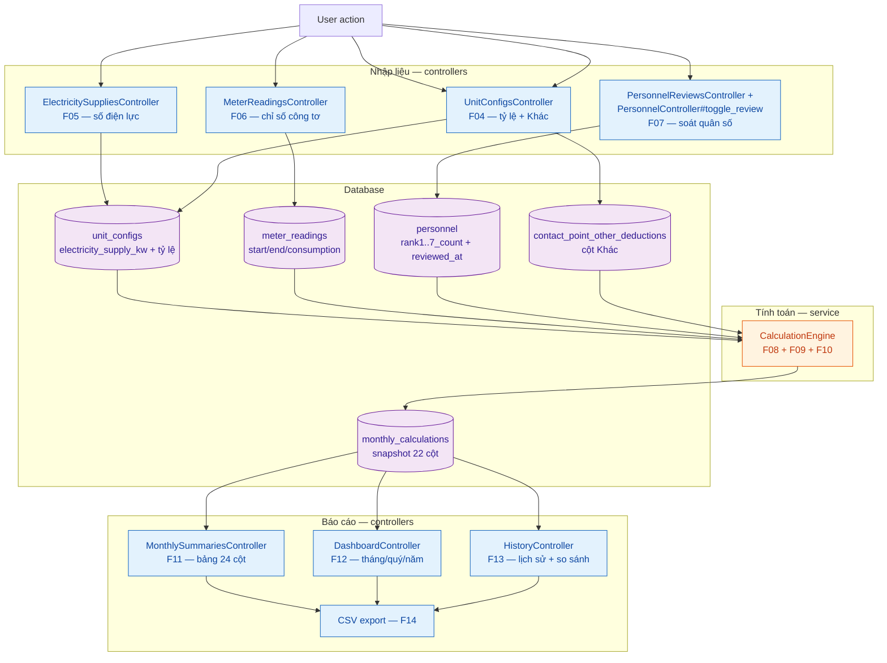
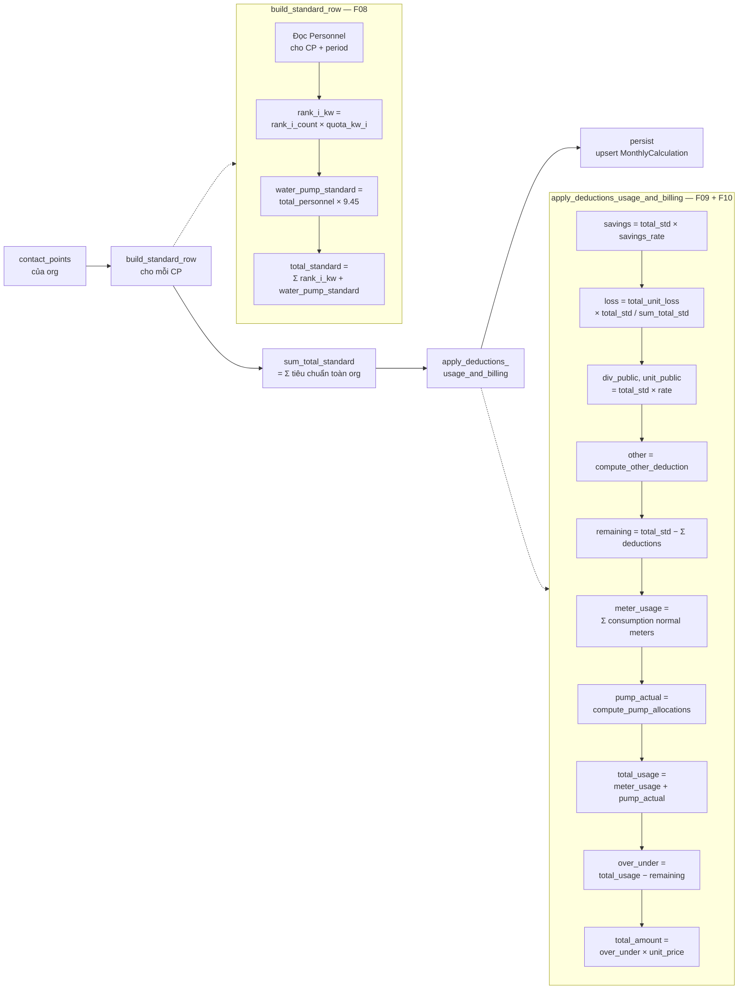

# 05. Business Logic — v1.0.0

> **Đọc lần đầu?** Đọc 01_OVERVIEW trước để hiểu dự án là gì. Tra thuật ngữ tại 02_GLOSSARY.
>
> **Mục đích file này:** Tài liệu chi tiết logic nghiệp vụ — CalculationEngine, services, data flow end-to-end.
>
> **Đối tượng đọc:** Developer cần hiểu code xử lý nghiệp vụ, hoặc bất kỳ ai cần trace một tính năng từ UI đến database.
>
> **Schema chi tiết:** Xem 04_DATABASE_MODELS cho cấu trúc bảng và cột.
>
> **Nghiệp vụ chi tiết:** Xem 13_BUSINESS_RULES cho công thức, ví dụ số, edge cases.

---

## Mục lục

1. [Tổng quan services](#1-tổng-quan-services)
2. [CalculationEngine — chi tiết](#2-calculationengine--chi-tiết)
3. [PeriodInheritanceService](#3-periodinheritanceservice)
4. [ImportFeb2026Service](#4-importfeb2026service)
5. [BackupService](#5-backupservice)
6. [End-to-end data flow](#6-end-to-end-data-flow)
7. [Rake tasks liên quan](#7-rake-tasks-liên-quan)
8. [TODO — sai lệch giữa code và docs](#todo--sai-lệch-giữa-code-và-docs)

---

## 1. Tổng quan services

Toàn bộ logic nghiệp vụ "nặng" được tách khỏi controller và đặt trong `app/services/`. Mỗi service là một class POJO (Plain Old Ruby Object), khởi tạo bằng `new(...)` và gọi qua method `.call` (hoặc tên cụ thể như `.backup!`).

### 1.1 Bốn service objects

| File | Class | Mục đích | F# liên quan |
|---|---|---|---|
| `app/services/calculation_engine.rb` | `CalculationEngine` | Tính toán bảng 24 cột cho một đơn vị trong một kỳ tháng. Snapshot kết quả vào `monthly_calculations`. | F08 (tiêu chuẩn), F09 (sử dụng + so sánh), F10 (phân bổ bơm nước), F11 (bảng tổng hợp), F12 (dashboard), F13 (lịch sử) |
| `app/services/period_inheritance_service.rb` | `PeriodInheritanceService` | Khi mở kỳ mới, copy quân số (`Personnel`) từ kỳ trước sang kỳ mới. | Hỗ trợ F07 (soát lại quân số) — kế thừa data để admin_unit chỉ phải sửa chỗ thay đổi |
| `app/services/import_feb_2026_service.rb` | `ImportFeb2026Service` | Import data thật tháng 02/2026 từ file Excel khách (chỉ Sư đoàn bộ). One-shot loader, idempotent. | Khởi tạo data demo + production seed; gián tiếp hỗ trợ F08–F11 |
| `app/services/backup_service.rb` | `BackupService` | Sao lưu / phục hồi PostgreSQL bằng `pg_dump` / `pg_restore`. | Tính năng hạ tầng (không có F-number) — UI tại `/backups` |

Ngoài 4 service này, các tính toán phụ (tách Thừa/Thiếu, build chart data, tổng hợp dashboard) nằm trực tiếp trong controllers (`monthly_summaries_controller.rb`, `dashboard_controller.rb`, `history_controller.rb`). Lý do: không tái sử dụng nên không cần extract.

### 1.2 Sơ đồ tổng quan: từ user action đến output



**Đặc điểm chính:**

- `CalculationEngine` là điểm hội tụ: đọc từ 4 bảng input, ghi vào 1 bảng output (`monthly_calculations`). Mọi báo cáo đều đọc từ snapshot này, không re-tính từ source.
- Engine chạy lazy: tự động chạy lần đầu khi mở `MonthlySummariesController#show` mà chưa có `MonthlyCalculation`. Sau đó admin có thể bấm "Tính lại" (`recalculate` action) để force re-run.
- `PeriodInheritanceService` chạy duy nhất 1 chỗ: trong `MonthlyPeriodsController#create` (xem mục 3.1).
- `ImportFeb2026Service` không gọi từ UI — chỉ qua rake task `data:import_feb_2026` (xem mục 7).
- `BackupService` gọi từ `BackupsController` (UI tech) hoặc rake task `db:backup` / `db:restore`.

---

## 2. CalculationEngine — chi tiết

File: `app/services/calculation_engine.rb` (342 dòng).

### 2.1 Public API

```ruby
engine = CalculationEngine.new(organization: org, monthly_period: period)

# Tính nhưng KHÔNG ghi DB. Trả về Array<Hash> với BigDecimal full-precision.
results = engine.compute

# Tính + upsert vào monthly_calculations. Toàn bộ trong 1 transaction.
engine.call
```

**Input:**

- `organization`: `Organization` (cấp 2 — đơn vị trực thuộc). Engine không hỗ trợ tính cho cả Sư đoàn cùng lúc; Sư đoàn = sum of units ở view layer (xem `dashboard_controller.rb`).
- `monthly_period`: `MonthlyPeriod` (kỳ tính toán cụ thể).

**Output:**

- `compute`: `Array<Hash>`, mỗi phần tử là một đầu mối với 21 keys (tất cả cột của `MonthlyCalculation` trừ `id`/`notes`/timestamps).
- `call`: trả về cùng `Array<Hash>`, đồng thời upsert vào `monthly_calculations` (`find_or_initialize_by(contact_point_id, monthly_period_id)` + `assign_attributes` + `save!`).

**Caller chính:**

- `MonthlySummariesController#show` (auto-run nếu chưa có data).
- `MonthlySummariesController#recalculate` (force re-run).

**One-shot pattern:** Mỗi instance cache nội bộ (xem `personnel_by_cp`, `meter_usage_by_cp`...). Nếu data thay đổi giữa hai lần tính, phải tạo instance mới — không reuse.

### 2.2 Flow nội bộ — step-by-step



### 2.3 Map từng bước với 24 cột

Code không hề tính cột 21–24 (Thừa/Thiếu kW + đồng) — đây là **derived ở view layer** (xem `MonthlySummariesController#build_totals` dòng 111–114 và view `show.html.erb` dòng 213–226). Engine chỉ tính `over_under_kw` (signed) và `total_amount` (signed); controller/view tách thành 4 cột khi render.

| Cột | Tên (vi) | Code field | Nguồn / Cách tính (engine) |
|---|---|---|---|
| 1 | TT | — | View layer: `idx + 1` trong `each_with_index` |
| 2 | Đơn vị (đầu mối) | `contact_point.name` | `MonthlyCalculation#contact_point` |
| 3 | Tổng quân số | `total_personnel` | `Personnel#total_count` (sum 7 cột rankN_count) |
| 4 | (cột phân cách) | — | View layer: cột trống giữ layout |
| 5–11 | 7 nhóm cấp bậc | `rank1_kw` ... `rank7_kw` | `rank_i_count × RankQuota.effective_at(period_start).quota_kw` |
| 12 | Điện bơm nước (tiêu chuẩn) | `water_pump_standard_kw` | `total_personnel × 9.45` (`Personnel::WATER_PUMP_RATE`) |
| 13 | Quân số (lặp) | `total_personnel` | Cột 3 lặp lại — view layer hiển thị 2 lần |
| 14 | Cộng được hưởng theo NĐ 02 | `total_standard_kw` | `Σ rank_i_kw + water_pump_standard_kw` |
| 15 | Tiết kiệm của Bộ | `savings_deduction_kw` | `total_standard_kw × UnitConfig#savings_rate` |
| 16 | Tổn hao | `loss_deduction_kw` | Phân bổ — xem mục 2.4 |
| 17 | Công cộng | `division_public_deduction_kw + unit_public_deduction_kw` (DB lưu tách 2 cột; view gộp 1) | `total_standard × division_public_rate` + `total_standard × unit_public_rate` |
| 18 | Khác + Cộng | `other_deduction_kw` | Xem mục 2.5. Cho phép âm. |
| — | Tổng các khoản trừ | `total_deduction_kw` | `savings + loss + div_public + unit_public + other` (lưu DB tiện cho UI, không có cột tương ứng trong bảng 24 cột) |
| 19 | Tiêu chuẩn còn lại | `remaining_standard_kw` | `total_standard_kw − total_deduction_kw` |
| — | Sử dụng công tơ (chưa cộng bơm) | `meter_usage_kw` | `Σ consumption` của meters loại `normal` thuộc CP |
| — | Bơm nước thực tế | `water_pump_actual_kw` | Xem mục 2.6 |
| 20 | Sử dụng (kW) | `total_usage_kw` | `meter_usage_kw + water_pump_actual_kw`. **KHÔNG** cộng tổn hao. |
| — | Đơn giá (snapshot) | `unit_price` | `MonthlyPeriod#unit_price` tại thời điểm tính (snapshot, không live) |
| — | Chênh lệch (signed) | `over_under_kw` | `total_usage_kw − remaining_standard_kw` (xem cảnh báo về convention bên dưới) |
| — | Thành tiền (signed) | `total_amount` | `over_under_kw × unit_price` |
| 21 | Thừa (kW) | (view layer) | `over_under_kw < 0 ? -over_under_kw : 0` *(đúng convention engine)*. **Xem TODO #1 — sign-inversion bug.** |
| 22 | Thiếu (kW) | (view layer) | `over_under_kw > 0 ? over_under_kw : 0` *(đúng convention engine)*. **Xem TODO #1.** |
| 23 | Thừa (đồng) | (view layer) | Thừa kW × `unit_price` |
| 24 | Thiếu (đồng) | (view layer) | Thiếu kW × `unit_price` |

**Note quan trọng về `over_under_kw`:** Code tính `over_under = total_usage − remaining_standard`. RSpec test (`spec/services/calculation_engine_spec.rb:233`) ghi rõ: `positive = thâm, negative = tiết kiệm`. Tức **dương = THIẾU (deficit), âm = THỪA (surplus)** — khớp với convention Excel (`docs/BANG_22_COT_ANALYSIS.md` dòng 37: "Âm = thừa, Dương = thâm"). Tuy nhiên view + controller hiện đang xử lý ngược (xem TODO #1).

### 2.4 Tổn hao — chi tiết code thực tế

Tổn hao là khoản trừ duy nhất engine tự tính (3 khoản còn lại lấy từ config hoặc input). Logic chia 2 bước:

**Bước A — Tính tổng tổn hao toàn đơn vị** (`total_unit_loss` method, dòng 132–143):

```ruby
supply = unit_config&.electricity_supply_kw    # số điện lực F05
diff = supply - total_meter_consumption_in_unit
total_unit_loss = diff.negative? ? ZERO : diff
```

`total_meter_consumption_in_unit` (dòng 121–130) = `Σ consumption` của tất cả `meter_readings` thuộc đơn vị, **loại trừ** meters có `meter_type: pump_station`. Tức:

- **Bao gồm:** `normal` + `public_meter`
- **Loại trừ:** `pump_station`
- **Không xử lý:** `no_loss` (chưa có trong enum — xem TODO #2)

Nếu `electricity_supply_kw` chưa nhập (NULL) → `total_unit_loss = 0`. Nếu sum công tơ > số điện lực (data lỗi) → `total_unit_loss = 0` (không cho âm).

**Bước B — Phân bổ tổn hao cho từng đầu mối** (`apply_deductions_usage_and_billing`, dòng 258–263):

```ruby
loss = if sum_total_standard.positive? && total_unit_loss.positive?
  total_unit_loss * total_standard / sum_total_standard
else
  ZERO
end
```

**Quan trọng:** code phân bổ tổn hao theo tỷ lệ **`total_standard_kw`** (tiêu chuẩn được hưởng), **không** theo tỷ lệ kW công tơ như `13_BUSINESS_RULES` mục 6 mô tả. Đây là sai lệch nghiệp vụ — xem TODO #3.

**Edge case `no_loss`:**

`13_BUSINESS_RULES` mục 6.2 và 9.2 mô tả công tơ "vị trí không tổn hao" (`meter_type: no_loss`) phải bị loại khỏi cả tử số lẫn mẫu số khi phân bổ. Hiện `Meter.meter_type` chỉ có 3 giá trị (`normal`, `public_meter`, `pump_station`); `no_loss` chưa implement. Xem TODO #2.

Workaround tạm thời (`ImportFeb2026Service` dòng 30): Tiểu đoàn 18 (`no_loss`, 4.020 kW) bị trừ thủ công từ `electricity_supply_kw` khi nhập. Tức `electricity_supply_kw = 41.940` thay vì `45.960`. Cách này đúng kết quả tổn hao tổng nhưng không scale — mỗi tháng admin_unit phải nhớ trừ tay.

### 2.5 Cột "Khác" — cho phép âm

```ruby
def compute_other_deduction(contact_point, personnel_count)
  record = other_deductions_by_cp[contact_point.id]
  return ZERO unless record

  value = to_bd(record.other_value)
  case record.other_type
  when "fixed_kw" then value
  when "factor_per_person" then value * personnel_count
  else ZERO
  end
end
```

- `fixed_kw`: lấy đúng `other_value` (có thể âm).
- `factor_per_person`: `other_value × total_personnel`.
- Không có CP nào trong `contact_point_other_deductions` → `other_deduction = 0`.

`ContactPointOtherDeduction#other_value` không có constraint `>= 0` — cho phép âm. Khi `total_deduction = savings + loss + div_public + unit_public + other` mà `other < 0`, `total_deduction` giảm → `remaining_standard` tăng. Đây là cách "Bảo đảm" được nhận thêm tiêu chuẩn (xem `13_BUSINESS_RULES` mục 9.1 và 10.2).

### 2.6 Phân bổ bơm nước thực tế (F10)

Hàm `compute_pump_allocations` (dòng 162–185):

```ruby
allocations = Hash.new(ZERO)
pump_stations = pump_stations_serving_unit  # đọc từ pump_station_assignments

pump_stations.each do |ps|
  consumption = pump_station_consumption(ps)  # MeterReading của ps.meter_id
  next unless consumption.positive?

  served_personnel = served_personnel_map_for(ps)  # quân số TẤT CẢ org được phục vụ
  total_served = served_personnel.values.sum(0)
  next unless total_served.positive?

  contact_point_ids.each do |cp_id|
    people = served_personnel[cp_id]
    next if people.nil? || people.zero?
    allocations[cp_id] += consumption * to_bd(people) / to_bd(total_served)
  end
end
```

**Logic:** Với mỗi trạm bơm phục vụ đơn vị này:
1. Đọc consumption của công tơ trạm bơm (`pump_station.meter`).
2. Lấy quân số của **tất cả** đầu mối thuộc **tất cả** đơn vị mà trạm bơm phục vụ.
3. Phân bổ consumption cho từng đầu mối thuộc đơn vị đang tính theo tỷ lệ `quân_số_đầu_mối / tổng_quân_số_phục_vụ`.

**Trường hợp 1 trạm phục vụ 1 đơn vị:** đơn vị nhận 100% consumption (chia đều theo quân số trong đơn vị).

**Trường hợp 1 trạm phục vụ nhiều đơn vị:** chia theo tỷ lệ quân số tổng cộng. Ví dụ trạm phục vụ đơn vị A (3 người) + B (7 người), consumption 100 kW → A nhận 30 kW, B nhận 70 kW.

**Thiếu hỗ trợ 30/70 split (`13_BUSINESS_RULES` mục 7.2 và 7.3):**

`13_BUSINESS_RULES` mô tả nghiệp vụ "30% riêng cho Chỉ huy Sư đoàn + nhà khách, 70% chia đều theo quân số". Bảng `pump_station_assignments` chỉ có 2 cột: `pump_station_id` + `organization_id`. Không có cột tỷ lệ %. Engine cũng không có logic xử lý 30/70.

→ Hiện chỉ chia 100% theo quân số. Workaround tháng 02 (`ImportFeb2026Service` dòng 405–406): chỉ demo SDB nên gán 100% bơm nước cho SDB, không cần tách 30%. Xem TODO #4 (cũng đã ghi trong `04_DATABASE_MODELS` mục TODO #5 và `13_BUSINESS_RULES` mục TODO #2).

### 2.7 Snapshot mechanism

`CalculationEngine#persist` ghi 22 cột vào `monthly_calculations` (xem 04_DATABASE_MODELS mục 2.12 cho schema chi tiết):

```ruby
calc = MonthlyCalculation.find_or_initialize_by(
  contact_point_id: row[:contact_point_id],
  monthly_period_id: row[:monthly_period_id]
)
calc.assign_attributes(row.except(:contact_point_id, :monthly_period_id))
calc.save!
```

**Snapshot toàn bộ state**, không live-join:

- `total_personnel` — copy từ `Personnel#total_count`.
- `unit_price` — copy từ `MonthlyPeriod#unit_price` tại thời điểm tính.
- 7 `rank_i_kw` — đã nhân với quota tại thời điểm tính.

→ Nếu admin_level1 sửa đơn giá tháng cũ qua F20 sau khi engine đã chạy, kết quả `monthly_calculations` cũ vẫn giữ giá cũ. Để cập nhật, admin phải bấm "Tính lại" (`monthly_summaries#recalculate`).

`MonthlyCalculation` có `has_paper_trail`, nên mỗi lần recalc tạo một version mới trong `versions` — cho phép trace lịch sử thay đổi kết quả qua F19.

### 2.8 Edge cases

**Đã handle:**

- **CP không có `Personnel` record:** `total_personnel = 0`, mọi `rank_i_kw = 0`, `water_pump_standard = 0`, `total_standard = 0`. Tổn hao phân bổ = 0 (vì `total_standard = 0` ở tử số). Cột "Khác" vẫn áp dụng nếu có record. (Xem 13_BUSINESS_RULES mục 9.4 — Nhà xe dân sự, Cây ATM...)
- **`UnitConfig` chưa tồn tại:** `unit_config = nil` → `savings_rate`, `division_public_rate`, `unit_public_rate`, `electricity_supply_kw` = `nil` → `to_bd(nil) = ZERO`. Toàn bộ deductions = 0, tổn hao = 0. Engine vẫn chạy được, không crash.
- **`MonthlyPeriod#unit_price` chưa nhập:** `unit_price = nil` → `to_bd(nil) = ZERO` → `total_amount = 0` cho mọi CP. Không crash.
- **`electricity_supply_kw` < tổng công tơ (data lỗi):** `total_unit_loss = 0` (không cho âm).
- **`sum_total_standard = 0` (toàn bộ đơn vị không có quân số):** loss = 0 cho mọi CP (tránh chia cho 0).
- **Trạm bơm không có công tơ (`meter_id IS NULL`):** filter bằng `where.not(meter_id: nil)` (dòng 193) — bỏ qua.
- **Trạm bơm có công tơ nhưng chưa có `MeterReading` cho period:** `pump_station_consumption = 0` → bỏ qua trạm đó (`next unless consumption.positive?`).
- **Trạm bơm phục vụ đơn vị có tổng quân số = 0:** `total_served = 0` → bỏ qua (`next unless total_served.positive?`).
- **`RankQuota` chưa có bản ghi cho period start:** `quota = nil` → `to_bd(nil) = ZERO` → toàn bộ `rank_i_kw = 0`. Không crash, nhưng kết quả vô nghĩa. (Xem 04_DATABASE_MODELS mục 2.5 — seed phải chạy trước.)
- **Idempotent persist:** chạy `engine.call` lần 2 cùng data → upsert (cùng `(contact_point_id, monthly_period_id)`), không tạo duplicate.
- **Toàn bộ tính trong `ActiveRecord::Base.transaction`:** validation fail ở 1 row → rollback toàn bộ.

**Chưa handle (cần verify nghiệp vụ):**

- **`no_loss` meter type:** chưa có trong enum. Tổn hao tổng đếm cả các công tơ vị trí không tổn hao. Workaround: trừ tay từ `electricity_supply_kw`. (Xem TODO #2.)
- **PumpStation 30/70 split:** không hỗ trợ. (Xem TODO #4.)
- **Đầu mối bị xoá giữa kỳ:** `MonthlyCalculation` có `dependent: :destroy` từ `ContactPoint` — sẽ xoá theo. Không có "soft delete" hoặc archive trước khi xoá.

---

## 3. PeriodInheritanceService

File: `app/services/period_inheritance_service.rb` (39 dòng).

### 3.1 Khi nào được gọi

**Duy nhất 1 chỗ:** `MonthlyPeriodsController#create` (dòng 34):

```ruby
if @period.save
  previous_period = find_previous_period(@period)
  previous_period&.lock!(current_user)             # auto-lock kỳ trước

  PeriodInheritanceService.new(@period).call       # kế thừa quân số

  redirect_to personnel_review_path(period_id: @period.id), ...
end
```

Tức khi admin_level1 tạo kỳ mới (form ở `monthly_periods#index`), 3 bước xảy ra:

1. Tạo `MonthlyPeriod` mới (`year`, `month`, `unit_price`, `locked: false`).
2. **Auto-lock kỳ liền trước** (nếu có) bằng `MonthlyPeriod#lock!(current_user)` — tránh sửa data đã chốt.
3. Gọi `PeriodInheritanceService.new(@period).call` để copy quân số.
4. Redirect tới `personnel_review_path` (F07) để admin_unit soát quân số kế thừa.

### 3.2 Copy những gì

**Chỉ copy `Personnel`** (quân số), không copy gì khác. Code:

```ruby
def call
  previous = previous_period
  return 0 unless previous

  inherited = 0

  Personnel.for_period(previous.id).find_each do |prev|
    Personnel.find_or_create_by!(
      contact_point_id: prev.contact_point_id,
      monthly_period_id: new_period.id
    ) do |p|
      Personnel::RANK_COLUMNS.each { |col| p[col] = prev.public_send(col) }
      # reviewed_at intentionally left nil — inherited records start as unreviewed
    end
    inherited += 1
  end

  inherited
end
```

- Iterate qua **toàn bộ Personnel** của kỳ trước (mọi tổ chức, mọi CP).
- `find_or_create_by!` với key `(contact_point_id, monthly_period_id)` — idempotent: chạy lại không duplicate.
- 7 cột `rank1_count..rank7_count` copy nguyên vẹn.
- `reviewed_at` cố ý **set NULL** để bản ghi mới ở trạng thái "chưa soát" — buộc admin_unit phải mở F07 và bấm "Đã soát" sau khi xác nhận.

**KHÔNG copy:**

- ❌ `ContactPoint` (đầu mối) — không phụ thuộc kỳ, dùng chung tất cả các kỳ.
- ❌ `Meter` (công tơ) — không phụ thuộc kỳ, dùng chung.
- ❌ `UnitConfig` (tỷ lệ + số điện lực) — admin nhập lại mỗi tháng.
- ❌ `ContactPointOtherDeduction` (cột Khác) — admin nhập lại mỗi tháng.
- ❌ `MeterReading` — KHÔNG được service copy. Tuy nhiên `MeterReadingsController#set_grouped_readings` (dòng 103) tự động gán `reading_start = previous_period.reading_end` khi user mở form F06 lần đầu (xem mục 3.4).

→ Phạm vi kế thừa thực tế **hẹp hơn nhiều** so với mô tả trong `02_GLOSSARY` mục 6 và `13_BUSINESS_RULES` mục 8.1 (cả 2 nói "đầu mối, công tơ, quân số, cấu hình"). Đầu mối + công tơ không cần kế thừa vì đã không phụ thuộc kỳ. Cấu hình + Khác **không** kế thừa — admin nhập lại. Xem TODO #5.

### 3.3 Xử lý khi tháng trước chưa có data

```ruby
def call
  previous = previous_period
  return 0 unless previous
  ...
end

def previous_period
  MonthlyPeriod
    .where("year * 12 + month < ?", new_period.year * 12 + new_period.month)
    .order(year: :desc, month: :desc)
    .first
end
```

- `previous_period` = kỳ tháng có `(year × 12 + month) < (kỳ_mới × 12 + month)` lớn nhất. Tức **kỳ liền trước theo lịch**, không phụ thuộc thứ tự tạo.
- Nếu không có kỳ trước (kỳ đầu tiên trong hệ thống), `previous = nil` → return 0 ngay, không lỗi.

→ Khi tạo kỳ đầu tiên, không có quân số kế thừa. Admin_unit phải vào F03 (`PersonnelController`) hoặc F07 nhập tay.

### 3.4 `reading_start` kỳ mới = `reading_end` kỳ trước

**Không nằm trong service.** Nằm ở `MeterReadingsController#set_grouped_readings` (dòng 75–109):

```ruby
prev_period = previous_period
prev_readings = if prev_period
  MeterReading.for_period(prev_period.id)
              .where(meter_id: meter_ids)
              .index_by(&:meter_id)
else
  {}
end

@grouped_readings = meters.group_by(&:contact_point).transform_values do |group_meters|
  group_meters.map do |meter|
    reading = if @readings_by_meter_id&.key?(meter.id)
      @readings_by_meter_id[meter.id]
    elsif existing[meter.id]
      existing[meter.id]
    else
      r = MeterReading.new(meter: meter, monthly_period: @period)
      r.reading_start = prev_readings[meter.id]&.reading_end   # ← kế thừa
      r
    end
    [meter, reading]
  end
end
```

**Logic:** Khi admin_unit mở F06 (`/meter_readings`) cho kỳ mới:

1. Nếu `MeterReading` cho `(meter, period)` đã tồn tại → dùng nó.
2. Nếu chưa tồn tại (lần đầu mở) → tạo `MeterReading.new`, gán `reading_start = previous_period.reading_end`. **Đây là object trong memory, chưa save.**
3. Khi user submit form (POST `/meter_readings`), `batch_save_readings` save tất cả.

→ `reading_start` được "kế thừa" theo nghĩa **đã pre-fill** trên form, nhưng **chưa lưu DB** cho tới khi user save. Nếu user không động vào form, không bao giờ có `MeterReading` row cho kỳ mới — hợp lý vì engine F09 sẽ đọc consumption = 0 nếu không có row, đúng với kỳ chưa nhập liệu.

### 3.5 Verification

`spec/services/period_inheritance_service_spec.rb` (xem code) test các case:

- Copy đúng 7 cột rank.
- `reviewed_at` luôn nil sau khi kế thừa.
- Idempotent (chạy lần 2 không tạo duplicate).
- Không có kỳ trước → return 0.
- CP đã có Personnel cho kỳ mới → bỏ qua, không overwrite.

---

## 4. ImportFeb2026Service

File: `app/services/import_feb_2026_service.rb` (518 dòng — service phức tạp nhất).

### 4.1 Mục đích

One-shot loader để import data thật tháng 02/2026 của Sư đoàn bộ (SDB) vào hệ thống. Mục đích kép:

- **Demo cho khách hàng** (19–20/04/2026) với data thật, không phải data giả.
- **Seed staging trên Railway** (sau đó production trên Mini PC).
- **Cung cấp data làm baseline test** cho engine: `bang_tinh_thang_02.xlsx` chính là nguồn "ground truth" cho calculation_engine_spec.

**Phạm vi:**

- Chỉ tổ chức `code: SDB` (Sư đoàn bộ — 1 trong 13 đơn vị cấp 2).
- Chỉ kỳ `2026/02`.
- 79 đầu mối từ "Sheet1 (2)" sections I–IV.
- Meter readings từ "Sheet1".
- 3 trạm bơm từ "Sheet1" rows 145–147.

**Không nằm trong scope:**

- Các đơn vị cấp 2 khác (Trung đoàn 101, 18, 95, các Tiểu đoàn, Đại đội 26/29).
- Đầu mối thuộc cấp Sư đoàn (Chỉ huy f, Quân y f bộ).
- Bảng II 30/70 split (xem mục 2.6 — workaround: gán 100% bơm nước cho SDB).

### 4.2 Input file

`test/fixtures/files/bang_tinh_thang_02.xlsx` (= bản clone của `bang tính điện thảo tháng 02 làm lại — THU CƠ QUAN.xlsx` khách gửi). Path constant `PATH_DEFAULT`. Có thể override khi test.

**2 sheet được đọc:**

- `"Sheet1 (2)"` — bảng 22 cột gốc (tiêu chuẩn + sử dụng + Khác). Rows 9–91 (sections I–IV).
- `"Sheet1"` — bảng chi tiết công tơ với 2 phân chia "Nhà ở" + "NLV" (Nhà làm việc). Rows 15–152.

Workbook đọc qua gem `Roo::Excelx`. Validation: 2 sheet bắt buộc tồn tại (raise `ArgumentError` nếu thiếu).

### 4.3 Những gì được import

| Bảng | Số bản ghi | Nguồn / Logic |
|---|---|---|
| `MonthlyPeriod` | 1 | year=2026, month=2, unit_price=2.336,4. Skip nếu đã `locked`. |
| `Organization` | 0 (chỉ lookup) | Tìm theo `code: SDB` — phải đã được seed trước. |
| `UnitConfig` | 1 | `electricity_supply_kw = 41.940` (= 45.960 − 4.020 TĐ18 no_loss workaround), `savings_rate = 0.05`, `division_public_rate = 0.10`, `unit_public_rate = 0`, `other_deduction_value = 0`. |
| `ContactPoint` | 79 | Parse từ "Sheet1 (2)" rows 9–91. Phân tách section + group + name từ cột B/C/D. Có `assert_unique_contact_point_names!` để tránh trùng tên. |
| `Personnel` | 79 | Cho mỗi CP: `rank1_count` từ cột E, `rank5_count = cột F + cột G` (gộp 2 nhóm "Cơ quan SĐ" và "Cơ quan TĐ"), `rank7_count` từ cột H. Các nhóm 2/3/4/6 = 0 (file Excel của SDB không có data 4 nhóm này — dùng định mức cũ chỉ có nhóm 1, 3//4//, 5, 6, 7). |
| `ContactPointOtherDeduction` | 0–N | Đọc từ cột M ("Khác"). Nếu = 0 hoặc nil → xoá row cũ (`ded&.destroy!`). Nếu khác 0 → upsert với `other_type: fixed_kw`. |
| `Meter` | 79 (1/CP) | Mỗi CP có 1 meter `meter_type: normal`, name = "{cp_name} — Tổng (Nhà ở + NLV)". |
| `MeterReading` | 79 | Match row "Sheet1 (2)" với rows trong "Sheet1" qua `MANUAL_METER_MATCH` (cấu hình cứng) hoặc fuzzy match (`normalize_substring_match?`). Nhiều rows được aggregate thành 1 reading: `reading_start = Σ Sheet1.col(C+E)`, `reading_end = Σ Sheet1.col(D+F)`. |
| `Meter` (pump) | 3 | 3 trạm bơm với `meter_type: pump_station`, `contact_point_id: nil`. |
| `PumpStation` | 3 | Liên kết với Meter của trạm bơm. |
| `PumpStationAssignment` | 3 (3 trạm × 1 SDB) | Tất cả trạm phục vụ SDB. |
| `MeterReading` (pump) | 3 | `reading_start` từ Sheet1 col C, `reading_end = reading_start + Sheet1 col G` (col G là "đã trừ nhà ở trạm nước" — pre-adjusted consumption). |

Tổng cộng đếm được trong `Result` struct: `contact_points_count: 79`, `meters_count: 82` (79 normal + 3 pump), `readings_count: 82`, etc.

### 4.4 Workarounds & limitations

`@warnings` array tích luỹ các vấn đề trong quá trình import — UI không hiển thị, nhưng rake task in ra console.

**Hard-coded warnings (luôn xuất hiện):**

- `"no_loss_position chưa support — Tiểu đoàn 18 tại trạm biến áp (Sheet1 row 7, 4,020 kW) bỏ qua, ngoài phạm vi SDB"` — note rằng meter `no_loss` của TĐ18 không được import (TĐ18 không phải SDB anyway), và `electricity_supply_kw = 41.940` đã trừ tay 4.020 kW. Đây là workaround cho TODO #2.
- `"Bảng II bỏ qua — demo chỉ có SDB, engine gán 100% bơm nước (≈ 6,420 kW) cho SDB"` — note rằng nghiệp vụ 30/70 không được import. Workaround cho TODO #4.

**Dynamic warnings (tuỳ data):**

- Tên đầu mối trùng → raise `ArgumentError` (chặn import — vi phạm unique index).
- Sheet1 row có một bên start/end nil mà bên còn lại có giá trị → raise `ArgumentError` (validate đôi).
- Sheet1 row không match được CP nào và không trong `SKIPPED_METER_ROWS` → log warning, không lỗi.
- `EXPECTED_CP_COUNT = 79` — sau import nếu count khác 79 → log warning (báo Excel structure đã thay đổi).
- Decimal value bị truncate khi parse `to_int` → log warning.

### 4.5 Idempotent behavior

Toàn bộ logic dùng `find_or_initialize_by` + `save! if new_record? || changed?`. Chạy lần 2 trên cùng file → không tạo duplicate, không tạo PaperTrail version.

**`PaperTrail.request(enabled: false)`** wrap toàn bộ transaction (dòng 120) — lý do: import là bulk loader, không phải user edit. Audit trail của lần import nằm trong git commit + log của rake task, không cần per-row version trong bảng `versions`.

**Transaction:** toàn bộ trong 1 `ActiveRecord::Base.transaction`. Nếu validation fail ở giữa → rollback hoàn toàn, DB không bị nửa vời.

### 4.6 Sau khi import

Sau khi service chạy xong, vẫn cần một bước nữa để có `monthly_calculations`:

1. Mở `/monthly_summary?period_id=...&org_id=SDB_ID` → engine auto-run, snapshot 79 rows vào `monthly_calculations`.
2. Hoặc gọi trực tiếp `CalculationEngine.new(...).call` từ console.

Service KHÔNG tự chạy engine — đây là tách biệt rõ ràng giữa "import data thô" và "tính toán".

---

## 5. BackupService

File: `app/services/backup_service.rb` (65 dòng).

Khác với 3 service trên (instance method qua `.call`), `BackupService` dùng **class methods** vì không có state cần lưu giữa các call.

### 5.1 `BackupService.backup!`

```ruby
def self.backup!
  FileUtils.mkdir_p(BACKUP_DIR)
  filename = "backup_#{Time.current.strftime('%Y%m%d_%H%M%S')}.dump"
  filepath = File.join(BACKUP_DIR, filename)
  cfg = db_config
  env = { "PGPASSWORD" => cfg[:password].to_s }
  cmd = ["pg_dump", "-h", cfg[:host], "-p", cfg[:port].to_s,
         "-U", cfg[:username], "-Fc", "-f", filepath, cfg[:database]]
  _stdout, stderr, status = Open3.capture3(env, *cmd)
  unless status.success?
    Rails.logger.error("pg_dump failed: #{stderr}")
    raise "pg_dump failed: #{stderr.truncate(200)}"
  end
  filename
end
```

- `BACKUP_DIR` từ ENV `BACKUP_DIR`, default `db/backups/`. Trong Docker production: bind mount.
- Filename pattern: `backup_YYYYMMDD_HHMMSS.dump` (giây phân giải để tránh trùng).
- `pg_dump -Fc`: format custom (binary, có nén, compatible với `pg_restore`).
- Mật khẩu DB truyền qua `PGPASSWORD` env var (an toàn hơn `-W` prompt hoặc `--password` flag).
- `Open3.capture3` thay vì `system`/`backtick` để tránh shell injection — `cmd` là Array, không phải String.
- Trả về filename (caller dùng để hiển thị trong flash message).
- Lỗi: log full stderr vào Rails.logger.error, raise message truncate 200 ký tự (hiển thị flash).

### 5.2 `BackupService.restore!(filename)`

```ruby
def self.restore!(filename)
  filepath = safe_filepath!(filename)
  cfg = db_config
  env = { "PGPASSWORD" => cfg[:password].to_s }
  cmd = ["pg_restore", "-h", cfg[:host], "-p", cfg[:port].to_s,
         "-U", cfg[:username], "-d", cfg[:database],
         "--clean", "--no-owner", "--no-acl", "-1", filepath]
  _stdout, stderr, status = Open3.capture3(env, *cmd)
  unless status.success?
    Rails.logger.error("pg_restore failed: #{stderr}")
    raise "pg_restore failed: #{stderr.truncate(200)}"
  end
end
```

- `safe_filepath!`: validate filename (xem mục 5.5). Path traversal protection.
- `pg_restore --clean`: drop existing tables before restore. Tức db hiện tại bị **xoá trắng** rồi mới restore.
- `--no-owner --no-acl`: bỏ qua owner và ACL — restore vào DB khác user vẫn được.
- `-1` (= `--single-transaction`): toàn bộ restore trong 1 transaction. Lỗi → rollback toàn bộ, DB giữ nguyên trạng thái trước.

**Sign-out behavior:** `BackupsController#restore` (dòng 17) gọi `sign_out current_user` ngay sau khi `BackupService.restore!`, rồi redirect tới `new_user_session_path`. Lý do: session cookie của user hiện tại có thể trỏ tới `User#id` không còn match (nếu data restore khác state hiện tại). **Note: code chỉ sign-out user gọi restore, không sign-out tất cả user khác** — sessions của user khác vẫn còn cookie nhưng query DB sẽ thấy state mới (có thể stale).

### 5.3 `BackupService.list`

```ruby
def self.list
  Dir.glob(File.join(BACKUP_DIR, "*.dump"))
     .map { |f| { name: File.basename(f), size: File.size(f), created_at: File.mtime(f) } }
     .sort_by { |f| f[:created_at] }.reverse
end
```

- Glob tất cả `.dump` files trong `BACKUP_DIR`.
- Trả về Array of Hash với metadata cơ bản.
- Sort theo `mtime` giảm dần (mới nhất trước).
- UI ở `BackupsController#index` render danh sách này.

### 5.4 `BackupService.delete!(filename)`

```ruby
def self.delete!(filename)
  File.delete(safe_filepath!(filename))
end
```

Đơn giản: validate filename, `File.delete`. Không có recycle bin — mất file là mất luôn.

### 5.5 Path traversal protection — `safe_filepath!`

```ruby
def self.safe_filepath!(filename)
  raise ArgumentError, "invalid filename" if filename.include?("/") || filename.include?("..")
  filepath = File.join(BACKUP_DIR, filename)
  raise "File not found" unless File.exist?(filepath)
  filepath
end
private_class_method :safe_filepath!
```

- Filename không được chứa `/` hoặc `..` → chặn `../../../etc/passwd` style attacks.
- `private_class_method :safe_filepath!` — chỉ class methods khác trong service được gọi.

Đây là defense-in-depth — `BackupsController#restore` và `#destroy_file` đã require `:filename` qua `params.require`, nhưng service vẫn validate lại.

### 5.6 Security — chỉ `tech` access

`BackupsController#authorize_backup`:

```ruby
def authorize_backup
  authorize! :manage, :backup
end
```

Trong `app/models/ability.rb`, rule cho `tech`:

```ruby
can :manage, :backup
```

`admin_level1` được explicit **cannot**:

```ruby
cannot :manage, :backup
```

→ Chỉ user role `tech` (Đội kỹ thuật) thao tác được sao lưu/phục hồi qua UI. `admin_level1` (Ban Doanh trại) **không** được — phân tách rõ trách nhiệm IT vs nghiệp vụ. Xem 06_AUTH_SECURITY (khi có) cho chi tiết Ability.

---

## 6. End-to-end data flow

Hai user story trace qua code thực tế từ UI tới database. File path tương ứng được note ở mỗi bước.

### 6.1 Story 1: Admin_unit đơn vị SDB nhập liệu tháng 03/2026 lần đầu

**Bối cảnh:** Tháng 02/2026 đã được import qua `data:import_feb_2026`. Admin_level1 vừa tạo kỳ mới 03/2026 (kỳ 02 tự động bị lock). Admin_unit của SDB cần nhập liệu cho 03/2026.

**Bước 1 — Đăng nhập (F16)**

```
POST /users/sign_in (Devise)
→ SessionsController (Devise) verify password
→ session cookie set, redirect to root (= dashboard#show)
```

File: `config/routes.rb` dòng 1 (`devise_for :users`), `app/controllers/sessions_controller.rb` (custom for vi.yml).

Nếu `force_password_change = true` → ApplicationController redirect tới `/password_change/edit` (F18). Bỏ qua bước này nếu đã đổi password.

**Bước 2 — `MonthlyPeriodsController#create` đã chạy trước đó (do admin_level1)**

Khi admin_level1 tạo kỳ 03/2026 qua form ở `monthly_periods#index`:

```ruby
# app/controllers/monthly_periods_controller.rb dòng 24–42
@period = MonthlyPeriod.new(year: 2026, month: 3, unit_price: ..., locked: false)
if @period.save
  previous_period = find_previous_period(@period)
  previous_period&.lock!(current_user)            # khoá kỳ 02
  PeriodInheritanceService.new(@period).call      # copy quân số 02 → 03
end
```

→ Bảng `personnel` lúc này có **79 rows mới** cho kỳ 03 (1 row/CP của SDB), `reviewed_at = nil`. Quân số copy nguyên từ kỳ 02.

→ Bảng `meter_readings` chưa có row nào cho kỳ 03 (service không copy). 

→ Bảng `unit_configs` chưa có row cho kỳ 03 (service không copy).

→ Bảng `contact_point_other_deductions` chưa có row cho kỳ 03 (service không copy).

**Bước 3 — Admin_unit nhập số điện lực (F05)**

UI: `/electricity_supply?period_id=<kỳ_03_id>`.

```
GET /electricity_supply
→ ElectricitySuppliesController#show
→ set_config: UnitConfig.find_or_initialize_by(org: SDB, period: kỳ_03)
→ render show.html.erb với form + history các kỳ trước
```

User nhập số điện lực (ví dụ 42.500 kW), submit:

```
PATCH /electricity_supply
→ ElectricitySuppliesController#update
→ authorize! :update_electricity_supply, UnitConfig (CanCanCan)
→ @config.update(electricity_supply_kw: BigDecimal("42500"))
→ PaperTrail tự ghi version
→ redirect with flash notice
```

Sau bước này: `unit_configs` có 1 row cho `(SDB, kỳ_03)` với `electricity_supply_kw = 42500`, các tỷ lệ chưa có (NULL).

File: `app/controllers/electricity_supplies_controller.rb`, `app/models/unit_config.rb`.

**Bước 4 — Admin_unit cấu hình tỷ lệ + Khác (F04)**

UI: `/unit_config?period_id=<kỳ_03_id>`. `UnitConfigsController#show` + `#update`. User nhập `unit_public_rate` (tỷ lệ công cộng đơn vị) và (nếu cần) cột "Khác" cho từng đầu mối qua form bulk.

→ Update `unit_configs` (rate columns) + tạo/xoá rows trong `contact_point_other_deductions`.

**Bước 5 — Admin_unit nhập chỉ số công tơ (F06)**

UI: `/meter_readings?period_id=<kỳ_03_id>`.

```
GET /meter_readings
→ MeterReadingsController#show → set_grouped_readings (dòng 75–109)
```

Trong `set_grouped_readings`:

1. Lấy tất cả `meters` của SDB.
2. Lấy `meter_readings` đã tồn tại cho kỳ 03 (lần đầu — empty).
3. Lấy `meter_readings` của kỳ 02 (kỳ_trước) — index by meter_id.
4. Với mỗi meter, nếu chưa có reading kỳ 03 → tạo `MeterReading.new`, set `reading_start = prev_readings[meter.id]&.reading_end`. **Object trong memory, chưa save.**

User thấy form đã pre-fill `reading_start` (= cuối kỳ tháng 02), trống `reading_end`. Nhập số mới, submit:

```
PATCH /meter_readings
→ MeterReadingsController#update
→ batch_save_readings (dòng 114–151) trong ActiveRecord::Base.transaction
  • Skip rows trống cả start/end
  • find_or_initialize_by(meter, period), set start/end, save!
  • before_save :calculate_consumption tự tính consumption = end - start
  • Validation: end >= start, both required if either present
→ Nếu tất cả pass → commit. Nếu lỗi 1 row → rollback toàn bộ.
```

File: `app/controllers/meter_readings_controller.rb`, `app/models/meter_reading.rb`.

**Bước 6 — Admin_unit soát quân số (F07)**

UI: `/personnel_review?period_id=<kỳ_03_id>`.

```
GET /personnel_review
→ PersonnelReviewsController#show → set_personnel_rows
  • Lấy contact_points của SDB (ordered)
  • Lấy personnel kỳ 03 (đã kế thừa) + kỳ 02 (so sánh)
  • Build @personnel_rows: { cp:, personnel: kỳ_03, prev_personnel: kỳ_02, changed: bool }
```

User thấy bảng so sánh quân số kỳ 03 vs kỳ 02. Với CP nào quân số đã thay đổi (mới chuyển/về), user vào `ContactPoints#edit` → `PersonnelController#update` để sửa. Với CP nào vẫn đúng, bấm "Đã soát":

```
PATCH /contact_points/:cp_id/personnel/toggle_review
→ PersonnelController#toggle_review (dòng 32–62)
→ record.mark_reviewed!  # touch :reviewed_at = Time.current
→ PaperTrail ghi version
→ redirect_back with notice
```

File: `app/controllers/personnel_reviews_controller.rb`, `app/controllers/personnel_controller.rb`, `app/models/personnel.rb`.

**Bước 7 — Xem bảng 24 cột (F11)**

UI: `/monthly_summary?period_id=<kỳ_03_id>`.

```
GET /monthly_summary
→ MonthlySummariesController#show → load_or_calculate (dòng 76–89)
  • fetch_calculations: SELECT FROM monthly_calculations WHERE period = 03
  • Empty → CalculationEngine.new(org: SDB, period: kỳ_03).call
    → tính 79 rows, snapshot vào monthly_calculations (mỗi row 1 PaperTrail version)
  • fetch_calculations lại
  • build_totals (tách Thừa/Thiếu trong controller, không phải engine)
→ render show.html.erb với 24 cột
```

Engine flow (xem mục 2.2 và 2.3 cho chi tiết):

1. Load 79 ContactPoints của SDB.
2. Cho mỗi CP: build_standard_row → 7 rank_i_kw + water_pump_standard_kw + total_standard_kw.
3. Tính sum_total_standard_kw toàn org (= Σ total_standard 79 CPs).
4. Cho mỗi CP: apply_deductions_usage_and_billing → savings, loss (theo total_standard ratio), public, other, remaining, meter_usage, pump_actual, total_usage, over_under, total_amount.
5. persist: upsert monthly_calculations × 79 rows, all in 1 transaction.

File: `app/controllers/monthly_summaries_controller.rb`, `app/services/calculation_engine.rb`, `app/models/monthly_calculation.rb`, `app/views/monthly_summaries/show.html.erb`.

**Bước 8 — Xuất CSV (F14)**

UI: nút "Xuất CSV" trên `/monthly_summary` → `GET /monthly_summary.csv?period_id=...`.

```
→ MonthlySummariesController#show với format.csv
→ monthly_summary_csv (dòng 125–198)
  • Header: TT, đầu mối, 7 rank kW, ..., 4 cột split (surplus/deficit)
  • Rows: 79 CP với BOM UTF-8 + i18n labels
  • Total row
→ send_data with filename "bao_cao_tong_hop_3_2026.csv"
```

CSV cũng tách Thừa/Thiếu thành 4 cột tách (xem dòng 162–167).

### 6.2 Story 2: Admin_level1 xem báo cáo tổng hợp tháng 02/2026

**Bước 1 — Đăng nhập, redirect tới Dashboard**

```
POST /users/sign_in → root → DashboardController#show (dòng 4)
→ tech? check (admin_level1 không phải tech, không bị redirect tới /users)
→ authorize! :read, MonthlyCalculation (admin_level1 có quyền)
```

**Bước 2 — Chọn view (mặc định: tháng)**

```ruby
# dashboard_controller.rb dòng 9
@view_type = params[:view_type].presence_in(%w[month quarter year]) || "month"
```

Default `month`. Setup_month_view chạy:

```ruby
# dòng 50–63
@periods = MonthlyPeriod.ordered
@period = if params[:period_id].present?
  @periods.find_by(id: params[:period_id])
else
  recent_id = MonthlyCalculation
    .joins(:monthly_period)
    .order("monthly_periods.year DESC, monthly_periods.month DESC")
    .pick(:monthly_period_id)
  recent_id ? @periods.find_by(id: recent_id) : @periods.first
end

load_month_data if @period
```

Tức tự động chọn kỳ mới nhất có `monthly_calculations`. Lần đầu mở: kỳ 02/2026.

**Bước 3 — Chọn đơn vị (admin_level1 only)**

```ruby
# dòng 36–44
def set_target_org
  if current_user.admin_level1?
    @all_orgs = Organization.units.ordered                 # 13 đơn vị cấp 2
    @selected_org_id = params[:org_id].presence || "all"
    @target_org = (@selected_org_id != "all") ? @all_orgs.find_by(id: @selected_org_id) : nil
  else
    @target_org = current_user.organization                # admin_unit/commander: org của mình
  end
end
```

Default `all` → `@target_org = nil` → load data từ tất cả 13 đơn vị (gộp).

**Bước 4 — Load data + build chart + table**

```ruby
# dòng 65–70
def load_month_data
  @calculations = fetch_calculations_for_period(@period.id)
  build_month_metrics            # @total_standard, @total_usage, @difference, @over_count
  build_month_chart_data         # @chart_data (Chartkick), @usage_colors
  build_month_table_data         # @table_rows
end
```

```ruby
# dòng 72–84
def fetch_calculations_for_period(period_id)
  scope = MonthlyCalculation.for_period(period_id).ordered.preload(:contact_point)
  apply_org_scope(scope)
end

def apply_org_scope(scope)
  if @target_org
    scope.by_organization(@target_org.id)
  else
    unit_ids = Organization.where(parent_id: current_user.organization.id).pluck(:id)
    scope.where(contact_points: { organization_id: unit_ids })
  end
end
```

→ Khi `@target_org = nil`, query lấy tất cả CP của 13 đơn vị cấp 2 thuộc Sư đoàn của user. Đây cách "Tổng Sư đoàn" được hiện thực hoá: gộp data 13 đơn vị, không có cấu trúc cấp Sư đoàn riêng.

**Bước 5 — View render biểu đồ + bảng**

`app/views/dashboard/show.html.erb` render:

- Tab month/quarter/year (param `view_type`).
- Chartkick bar chart từ `@chart_data` (tiêu chuẩn vs sử dụng).
- Metrics card: `@total_standard`, `@total_usage`, `@difference`, `@over_count`.
- `@table_rows` table với cột name/standard/usage/diff, sort theo diff.

**Bước 6 — So sánh cùng kỳ (F13)**

User click link "Lịch sử" trong nav → `/history?period_id=<kỳ_02>&contact_point_id=<cp_id>`:

```ruby
# history_controller.rb
def show
  @current_calc = MonthlyCalculation.for_period(@period.id).for_contact_point(@contact_point.id).first

  prior_period = MonthlyPeriod.find_by(year: @selected_year - 1, month: @selected_month)
  @prior_calc = prior_period &&
    MonthlyCalculation.for_period(prior_period.id).for_contact_point(@contact_point.id).first
end
```

→ Lấy `@current_calc` (kỳ 02/2026) và `@prior_calc` (kỳ 02/2025 — cùng kỳ năm trước).

View `app/views/history/show.html.erb` render bảng so sánh từng cột với delta `▲` (tăng), `▼` (giảm), `=` (bằng), tô màu theo `LOWER_IS_BETTER_COLUMNS`.

CSV export tương tự: `format.csv` → `history_csv` method dòng 89–122.

File: `app/controllers/history_controller.rb`, `app/views/history/show.html.erb`.

---

## 7. Rake tasks liên quan

3 file rake task trong `lib/tasks/`. Task không thuộc scope F-number nào — đây là utility cho dev/ops.

### 7.1 `data:import_feb_2026`

File: `lib/tasks/data.rake` (22 dòng).

```ruby
namespace :data do
  desc "Import February 2026 real data for demo (Sư đoàn bộ). Requires `db:seed` first."
  task import_feb_2026: :environment do
    unless Organization.exists?(code: "SDB")
      abort "SDB organization missing — run `bin/rails db:seed` first."
    end

    result = ImportFeb2026Service.new.call

    puts "=" * 60
    puts "Import completed — period: #{result.period.label}, org: #{result.organization.name}"
    puts "Contact points:    #{result.contact_points_count}"
    puts "Meters:            #{result.meters_count}"
    ...
    result.warnings.each { |w| puts "  - #{w}" }
    puts "=" * 60
  end
end
```

**Sử dụng:**

```bash
bin/rails db:seed              # tạo organizations + admin user
bin/rails data:import_feb_2026 # import 79 đầu mối + meters + pump
```

**Output:** danh sách counts + warnings (luôn có 2 warning hard-coded — xem mục 4.4).

**Hậu xử lý:** sau import, mở `/monthly_summary?org_id=<SDB>` để engine snapshot 79 rows vào `monthly_calculations`.

**Tại sao không tự chạy engine:** import là load data thô, calculation là bước riêng. Tách biệt giúp test engine với data đã ổn định, không phụ thuộc thứ tự bước.

### 7.2 `admin:reset_password`

File: `lib/tasks/admin.rake` (26 dòng).

```ruby
namespace :admin do
  desc "Reset password and unlock account — escape hatch for last-admin lockout scenarios."
  task :reset_password, [:email] => :environment do |_t, args|
    email = args[:email]
    abort 'Usage: rails "admin:reset_password[email@example.com]"' if email.blank?

    user = User.find_by(email: email)
    abort "User not found: #{email}" if user.nil?

    new_password = SecureRandom.alphanumeric(12)
    user.password              = new_password
    user.password_confirmation = new_password
    user.locked_at             = nil
    user.failed_attempts       = 0
    user.force_password_change = true
    user.save!(validate: false)

    puts "Password reset for #{email}"
    puts "New password: #{new_password}"
  end
end
```

**Sử dụng:**

```bash
bin/rails 'admin:reset_password[admin@example.com]'
```

(Chú ý dấu nháy đơn — tránh shell glob expansion với `[`.)

**Mục đích:** escape hatch khi `admin_level1` cuối cùng bị khoá (Devise lockable sau 5 lần sai mật khẩu) và không có ai khác có thể mở khoá. Khi đó:

- `User#prevent_locking_last_admin_level1` không cho phép manual lock (trong app validation).
- Nhưng auto-lock từ Devise không bị chặn (xem User model `lock_access!` override) — lý do: có thể là tấn công thật sự.

→ Khi tình huống này xảy ra trong production, dev SSH vào server, chạy task này, gửi password mới qua kênh an toàn cho user.

`save!(validate: false)` — bỏ qua validation Devise password complexity (đã đảm bảo bằng `SecureRandom.alphanumeric(12)`).

`force_password_change = true` — buộc user đổi password lần đầu sau khi nhận password generated.

### 7.3 `db:backup` / `db:restore`

File: `lib/tasks/db_backup.rake` (15 dòng).

```ruby
namespace :db do
  desc "Backup database to BACKUP_DIR (default: db/backups/)"
  task backup: :environment do
    filename = BackupService.backup!
    puts "Backup created: #{filename}"
  end

  desc "Restore database from backup file. Usage: rails 'db:restore[filename.dump]'"
  task :restore, [:filename] => :environment do |_, args|
    raise "Usage: rails 'db:restore[filename.dump]'" if args[:filename].blank?
    BackupService.restore!(args[:filename])
    puts "Restore complete: #{args[:filename]}"
  end
end
```

**Sử dụng:**

```bash
# Backup
bin/rails db:backup
# → Backup created: backup_20260430_143022.dump

# Restore
bin/rails 'db:restore[backup_20260430_143022.dump]'
```

**Production cron:** trên Mini PC, một cron job chạy `db:backup` định kỳ (autorestic + 2 SSD setup, xem 08_INFRASTRUCTURE).

**Thin wrapper:** task chỉ là wrapper quanh `BackupService` (xem mục 5). Logic chính (`pg_dump`/`pg_restore`, path traversal protection) ở service.

**Khác biệt với UI tại `/backups`:**

- Rake không cần authentication (chạy trực tiếp trên server).
- UI tại `/backups` yêu cầu user role `tech` (xem mục 5.6).
- UI có chức năng `delete!` (xoá file backup), rake task không có (dùng `rm` shell).

---

## TODO — sai lệch giữa code và docs

Các sai lệch phát hiện giữa code thực tế và `02_GLOSSARY` / `13_BUSINESS_RULES` / `04_DATABASE_MODELS`. Cần quyết định: cập nhật code hay docs.

### TODO #1 — Sign-inversion bug giữa engine và view layer (Thừa/Thiếu)

**Engine convention** (`calculation_engine.rb` dòng 276 + `calculation_engine_spec.rb` dòng 233):

```ruby
over_under = total_usage - remaining_standard
# Test description: "positive = thâm, negative = tiết kiệm"
```

→ **Dương = THÂM (thiếu / deficit)**, **Âm = TIẾT KIỆM (thừa / surplus)**. Khớp với convention Excel (`docs/BANG_22_COT_ANALYSIS.md` dòng 37: "Âm = thừa, Dương = thâm") và `13_BUSINESS_RULES` mục 4.1 (Thừa = max(remaining − usage, 0); Thiếu = max(usage − remaining, 0)).

**View + controller convention NGƯỢC LẠI** (`monthly_summaries_controller.rb` dòng 111–112, `show.html.erb` dòng 213–226):

```ruby
totals[:surplus_kw] = calculations.sum { |c| c.over_under_kw > 0 ? c.over_under_kw : 0 }
totals[:deficit_kw] = calculations.sum { |c| c.over_under_kw < 0 ? -c.over_under_kw : 0 }
```

```erb
<% ou = calc.over_under_kw %>
<td class="...text-green-600">
  <%= number_with_precision(ou, precision: 2, ...) if ou > 0 %>  <!-- header: surplus_kw -->
</td>
<td class="...text-red-600">
  <%= number_with_precision(ou.abs, precision: 2, ...) if ou < 0 %>  <!-- header: deficit_kw -->
</td>
```

→ Controller + view assign `over_under > 0` vào cột "Thừa" (surplus_kw) tô xanh, `over_under < 0` vào cột "Thiếu" (deficit_kw) tô đỏ. **Ngược với engine convention.**

**Kết quả:** với data thật tháng 02/2026, đầu mối "TMP Trường" có usage=109,548 > remaining=98,789 → over_under = +10,759 (deficit per engine). Nhưng UI hiển thị 10,759 trong cột "Thừa (kW)" tô xanh — sai nghĩa.

**`history_controller.rb` dòng 15** comment cũng SAI: `# over_under_kw = standard - usage: positive means under quota (good)` — formula ngược, intent mâu thuẫn engine.

**Nguyên nhân khả dĩ:** PR#62 (split 22→24 cột) viết theo giả định `positive = surplus`, không khớp engine code đã có sẵn. Test request spec (`monthly_summary_spec.rb`) chỉ check `text-green-600` / `text-red-600` xuất hiện trong body — class này luôn tồn tại trên TD bất kể value, nên test không catch được inversion.

**Cần quyết định:**
- (a) Fix view + controller (đảo điều kiện `> 0` ↔ `< 0`) — đúng engine, đúng nghiệp vụ Excel.
- (b) Fix engine (đổi `over_under = remaining - total_usage`) — phải update cả test, glossary `over_under_kw` mục 14, BANG_22_COT_ANALYSIS.

→ Đề xuất (a): engine + spec + Excel convention đã ổn định, sửa view rẻ hơn.

### TODO #2 — `no_loss` meter type chưa implement

`13_BUSINESS_RULES` mục 6.2 và 9.2 mô tả công tơ vị trí không tổn hao (`meter_type: no_loss`) phải bị loại khỏi cả tử số lẫn mẫu số khi phân bổ tổn hao, nhưng vẫn trừ khỏi `electricity_supply_kw`.

**Code thực tế:**

- `app/models/meter.rb:11` — enum chỉ có 3 giá trị (`normal: 0, public_meter: 1, pump_station: 2`). Không có `no_loss`.
- `app/services/calculation_engine.rb:121–130` — `total_meter_consumption_in_unit` chỉ exclude `pump_station`, không có cách handle `no_loss`.
- `app/services/import_feb_2026_service.rb:30, 403–404` — workaround: trừ tay 4.020 kW (TĐ18) từ `electricity_supply_kw`, log warning.

**Đã ghi nhận trong:** `04_DATABASE_MODELS` mục TODO #1, `02_GLOSSARY` mục 2 đã đánh dấu "chưa implement".

**Cần quyết định:** có support trước nghiệm thu 25/05 không? Nếu cần:
- Add migration thêm `no_loss: 3` vào enum.
- Sửa `total_meter_consumption_in_unit` để include `no_loss` (vẫn trừ khỏi supply).
- Sửa loss allocation để exclude `no_loss` khỏi tử số (= không nhận tổn hao).
- Update UI `meters/_form` để chọn loại `no_loss`.

### TODO #3 — Công thức phân bổ tổn hao không khớp `13_BUSINESS_RULES` mục 6.2

**`13_BUSINESS_RULES` mục 6.2** ghi:

```
Tổn hao đầu mối X = Tổng tổn hao × (kW công tơ X ÷ Tổng kW các công tơ tham gia tính tổn hao)
```

→ Phân bổ theo **tỷ lệ kW công tơ thực tế**.

**Code thực tế** (`calculation_engine.rb:258–263` + spec line 187):

```ruby
loss = total_unit_loss * total_standard / sum_total_standard
```

→ Phân bổ theo **tỷ lệ tiêu chuẩn** (`total_standard_kw` của CP / Σ `total_standard_kw` toàn org).

**Khác biệt:**

- BUSINESS_RULES: đầu mối nào dùng nhiều kW công tơ thì chịu tổn hao nhiều.
- Code: đầu mối nào có tiêu chuẩn cao (= quân số cao + cấp bậc cao) thì chịu tổn hao nhiều.

Hai cách này cho kết quả **khác nhau** trong nhiều trường hợp. Ví dụ ở mục 6.3 BUSINESS_RULES (TMP Trường): tổn hao theo sheet1 ≈ 4,32 kW (tỷ lệ kW công tơ). Code có thể ra số khác.

**Kết quả tổng cuối cùng (over_under) có thể giống nhau** chỉ trong trường hợp `total_standard` tỷ lệ thuận `meter_consumption` — nhưng đó là điều kiện đặc biệt, không phải general.

**Cần quyết định:**
- (a) Sửa engine theo BUSINESS_RULES (phân bổ theo kW công tơ).
- (b) Sửa BUSINESS_RULES + glossary theo engine (phân bổ theo tiêu chuẩn).

→ Cần xác nhận với khách Anh Thảo qua Zalo. Cho data tháng 02 thật, hai cách có thể cho kết quả khác nhau ~10% trên các đầu mối lớn.

### TODO #4 — `PumpStationAssignment` không hỗ trợ 30/70 split

**Đã verify như yêu cầu.** Kết quả:

- Bảng `pump_station_assignments` chỉ có 2 cột nghiệp vụ: `pump_station_id` + `organization_id`. Không có cột tỷ lệ %.
- Engine (`calculation_engine.rb` dòng 162–185) phân bổ 100% theo quân số cho tất cả CP của đơn vị được phục vụ.
- Không có hardcode logic 30% Chỉ huy + 70% phần còn lại.

**Đã ghi nhận trong:** `04_DATABASE_MODELS` mục TODO #5, `13_BUSINESS_RULES` mục TODO #2.

**Workaround tháng 02:** demo chỉ có SDB → gán toàn bộ 6.420 kW bơm nước cho SDB (`ImportFeb2026Service` warning hard-coded).

**Cần quyết định:**

- (a) Bỏ qua nghiệp vụ 30/70 cho M6 nghiệm thu (tất cả phục vụ chia theo quân số).
- (b) Add cột `serving_percentage` (decimal 5,4) vào `pump_station_assignments`. Engine update để: nếu có `serving_percentage` ≠ NULL → áp dụng riêng phần đó; phần còn lại chia theo quân số. Cần thêm UI cấu hình.

### TODO #5 — Phạm vi kế thừa tháng hẹp hơn mô tả trong glossary

**`02_GLOSSARY` mục 6** ghi:

> Khi mở kỳ mới, data tự sao chép từ tháng trước: **đầu mối, công tơ, quân số, cấu hình**. Admin_unit chỉ cần sửa chỗ thay đổi.

**`13_BUSINESS_RULES` mục 8.1** tương tự.

**Code thực tế** (`PeriodInheritanceService` + controller behaviors):

- ✅ **Quân số (`Personnel`):** Có copy. `reviewed_at` set NULL.
- ❌ **Đầu mối (`ContactPoint`):** KHÔNG copy — không cần, vì không phụ thuộc kỳ (1 row dùng chung mọi kỳ).
- ❌ **Công tơ (`Meter`):** KHÔNG copy — không cần, vì không phụ thuộc kỳ.
- ❌ **Cấu hình (`UnitConfig`):** KHÔNG copy — admin_unit nhập lại tỷ lệ + số điện lực mỗi tháng qua F04 + F05.
- ❌ **Khoản "Khác" (`ContactPointOtherDeduction`):** KHÔNG copy.
- ⚠️ **Chỉ số đầu kỳ (`MeterReading.reading_start`):** Pre-fill trong UI controller (`MeterReadingsController#set_grouped_readings` dòng 103) bằng `prev.reading_end` — nhưng **chưa save vào DB** cho đến khi user submit form F06. Hành vi đúng nghiệp vụ.

**Cần làm:**

- Cập nhật `02_GLOSSARY` mục 6 và `13_BUSINESS_RULES` mục 8.1 để chính xác hơn:
  - Đầu mối + công tơ: không phụ thuộc kỳ (không cần "kế thừa").
  - Quân số: tự copy (qua service), `reviewed_at` set NULL.
  - Cấu hình + Khác: KHÔNG copy, admin_unit nhập lại.
  - Chỉ số đầu kỳ: pre-fill trên form F06 (controller), save khi user submit.

### TODO #6 — `BackupService.restore!` không sign-out tất cả user

**Code** (`backups_controller.rb:17`):

```ruby
def restore
  BackupService.restore!(params.require(:filename))
  sign_out current_user
  redirect_to new_user_session_path, notice: t("flash.backups.restored")
end
```

→ Chỉ sign-out user gọi restore. Các user khác đang đăng nhập (session active) **không bị sign-out**.

**Hậu quả thực tế:** sau restore:

- User hiện tại bị sign-out (bắt buộc đăng nhập lại) — OK.
- Các user khác giữ session cookie, vẫn truy cập được. Nhưng query DB sẽ trả về data của trạng thái đã restore (có thể stale, có thể inconsistent với UI họ đang xem).
- Nếu restore xoá user nào đó (giả sử backup cũ chưa có user đó) → cookie của user đó vẫn còn nhưng user_id không tồn tại → next request sẽ bị Devise đẩy về login page.

**Đánh giá:** đây không phải bug nghiệm trọng cho M6 (production có 1 admin_level1 + vài admin_unit, ít user concurrent). Nhưng nên note trong UX: khuyến cáo tech làm backup vào lúc ít người dùng.

**Cần quyết định:**

- (a) Chấp nhận behavior hiện tại, document trong 11_USER_GUIDE.
- (b) Sửa restore để invalidate tất cả session (ví dụ rotate `secret_key_base` hoặc clear sessions table — Rails default dùng cookie store nên không có sessions table, phải đổi sang DB store nếu muốn invalidate được).

### TODO #7 — Rake `data:import_feb_2026` không tự chạy `CalculationEngine`

Sau khi rake task xong, `monthly_calculations` vẫn empty cho kỳ 02/2026. Phải mở `/monthly_summary` để engine auto-run, hoặc gọi `engine.call` từ console.

**Cân nhắc:** thêm vào cuối rake task:

```ruby
result.organization # = SDB
CalculationEngine.new(organization: result.organization, monthly_period: result.period).call
```

→ Sau import, monthly_calculations đã sẵn sàng cho 79 đầu mối.

**Trade-off:** import + tính là 2 concern khác nhau. Tách ra giúp test riêng, nhưng workflow demo cần 1 lệnh thay vì 2. Có thể thêm task wrapper `data:seed_demo` chạy cả 2.

---

## Changelog

| Version | Ngày | Thay đổi |
|---|---|---|
| v1.0.0 | 30/04/2026 | Khởi tạo. CalculationEngine, 4 services, end-to-end data flow, rake tasks. Phát hiện 7 sai lệch giữa code và docs (sign-inversion, no_loss, công thức tổn hao, PumpStation 30/70, phạm vi kế thừa, restore signout, rake import + calc). |
