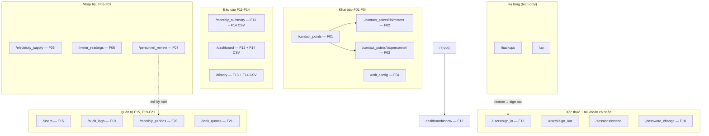

# 07. UI, Controllers, Views — v1.0.0

> **Đọc lần đầu?** Đọc 01_OVERVIEW trước để hiểu dự án là gì. Tra thuật ngữ tại 02_GLOSSARY.
>
> **Mục đích file này:** Tài liệu chi tiết UI layer — routes, controllers, views, Stimulus, Turbo, i18n.
>
> **Đối tượng đọc:** Developer cần hiểu request flow từ URL đến HTML rendered, hoặc cần sửa/thêm UI.
>
> **Auth patterns:** Xem 06_AUTH_SECURITY mục 4.
>
> **Business logic (services):** Xem 05_BUSINESS_LOGIC.

---

## Mục lục

1. [Routes](#1-routes)
2. [Controllers — data flow](#2-controllers--data-flow)
3. [Views — layout và cấu trúc](#3-views--layout-và-cấu-trúc)
4. [Stimulus controllers](#4-stimulus-controllers)
5. [Turbo](#5-turbo)
6. [i18n structure](#6-i18n-structure)
7. [Helpers](#7-helpers)
8. [TODO — sai lệch giữa code và docs](#todo--sai-lệch-giữa-code-và-docs)

---

## 1. Routes

File: `config/routes.rb` (58 dòng). Áp dụng convention Rails resources kết hợp custom member/collection routes cho các action không nằm trong CRUD chuẩn.

### 1.1 Bảng route đầy đủ

Thứ tự đọc theo nhóm chức năng (xem 02_GLOSSARY mục 8 cho mô tả F#).

#### A. Devise + Session (xác thực)

| Method | Path | Controller#action | F# | Ghi chú |
|---|---|---|---|---|
| GET | `/users/sign_in` | `devise/sessions#new` | F16 | Form đăng nhập (custom view tiếng Việt — xem 06 mục 2.2) |
| POST | `/users/sign_in` | `devise/sessions#create` | F16 | Submit đăng nhập, Rack::Attack throttle 5/phút/IP |
| DELETE | `/users/sign_out` | `devise/sessions#destroy` | — | Đăng xuất (config `sign_out_via = :delete`) |
| POST | `/sessions/extend` | `sessions#extend_session` | — | Stimulus `session-timeout` gọi để gia hạn phiên (xem 06 mục 2.5) — hỗ trợ F18 |

#### B. Khai báo (F01–F04)

| Method | Path | Controller#action | F# |
|---|---|---|---|
| GET | `/contact_points` | `contact_points#index` | F01 |
| GET | `/contact_points/new` | `contact_points#new` | F01 |
| POST | `/contact_points` | `contact_points#create` | F01 |
| GET | `/contact_points/:id` | `contact_points#show` | F01 |
| GET | `/contact_points/:id/edit` | `contact_points#edit` | F01 |
| PATCH/PUT | `/contact_points/:id` | `contact_points#update` | F01 |
| DELETE | `/contact_points/:id` | `contact_points#destroy` | F01 |
| GET | `/contact_points/:contact_point_id/meters` | `meters#index` | F02 |
| GET | `/contact_points/:contact_point_id/meters/new` | `meters#new` | F02 |
| POST | `/contact_points/:contact_point_id/meters` | `meters#create` | F02 |
| GET | `/contact_points/:contact_point_id/meters/:id/edit` | `meters#edit` | F02 |
| PATCH | `/contact_points/:contact_point_id/meters/:id` | `meters#update` | F02 |
| DELETE | `/contact_points/:contact_point_id/meters/:id` | `meters#destroy` | F02 |
| GET | `/contact_points/:contact_point_id/personnel` | `personnel#show` | F03 |
| PATCH | `/contact_points/:contact_point_id/personnel` | `personnel#update` | F03 |
| PATCH | `/contact_points/:contact_point_id/personnel/toggle_review` | `personnel#toggle_review` | F07 |
| GET | `/unit_config` | `unit_configs#show` | F04 |
| PATCH | `/unit_config` | `unit_configs#update` | F04 |

**Routes đặc biệt cho `meters`:** dùng `except: [:show]` — không có view show riêng (chi tiết công tơ hiển thị trong list/edit là đủ).

**Routes đặc biệt cho `personnel`:** dùng `resource :personnel` (singular) lồng trong `resources :contact_points` — mỗi đầu mối chỉ có 1 bản ghi quân số mỗi kỳ. Custom action `toggle_review` đánh dấu/bỏ đánh dấu soát lại (F07).

#### C. Nhập liệu hàng tháng (F05–F07)

| Method | Path | Controller#action | F# |
|---|---|---|---|
| GET | `/electricity_supply` | `electricity_supplies#show` | F05 |
| PATCH | `/electricity_supply` | `electricity_supplies#update` | F05 |
| GET | `/meter_readings` | `meter_readings#show` | F06 |
| PATCH | `/meter_readings` | `meter_readings#update` | F06 |
| GET | `/personnel_review` | `personnel_reviews#show` | F07 |

**Tất cả là singular `resource`** (không phải `resources`) — chỉ một entry point, dữ liệu được chọn qua dropdown kỳ + đơn vị (query params `period_id`, `org_id`).

**Khác biệt giữa `personnel#update` và `personnel_reviews#show`:** `personnel#update` (nested dưới contact_point) là form nhập số người cho 1 đầu mối. `personnel_reviews#show` là dashboard tổng hợp soát lại quân số toàn đơn vị (F07).

#### D. Tính toán + báo cáo (F08–F14)

| Method | Path | Controller#action | F# |
|---|---|---|---|
| GET | `/monthly_summary` | `monthly_summaries#show` | F11 |
| GET | `/monthly_summary.csv` | `monthly_summaries#show` (format csv) | F14 |
| POST | `/monthly_summary/recalculate` | `monthly_summaries#recalculate` | F09 |
| GET | `/dashboard` | `dashboard#show` | F12 |
| GET | `/dashboard.csv` | `dashboard#show` (format csv) | F14 |
| GET | `/history` | `history#show` | F13 |
| GET | `/history.csv` | `history#show` (format csv) | F14 |
| GET | `/` (root) | `dashboard#show` | F12 |

**F08 + F10 không có route riêng** — đó là logic của `CalculationEngine` chạy ngầm khi gọi `monthly_summaries#show` hoặc `monthly_summaries#recalculate` (xem 05_BUSINESS_LOGIC).

**CSV export** dùng cùng route với HTML, phân biệt qua `format` param (`format: :csv`). 3 controller hỗ trợ: `dashboard`, `history`, `monthly_summaries`.

#### E. Quản trị hệ thống (F15, F18–F21)

| Method | Path | Controller#action | F# |
|---|---|---|---|
| GET | `/users` | `users#index` | F15 |
| GET | `/users/new` | `users#new` | F15 |
| POST | `/users` | `users#create` | F15 |
| GET | `/users/:id/edit` | `users#edit` | F15 |
| PATCH | `/users/:id` | `users#update` | F15 |
| PATCH | `/users/:id/lock` | `users#lock` | F15 |
| PATCH | `/users/:id/unlock` | `users#unlock` | F15 |
| GET | `/password_change/edit` | `password_changes#edit` | F16 |
| PATCH | `/password_change` | `password_changes#update` | F16 |
| GET | `/audit_logs` | `audit_logs#index` | F19 |
| GET | `/monthly_periods` | `monthly_periods#index` | F20 |
| POST | `/monthly_periods` | `monthly_periods#create` | F20 (mở kỳ mới) |
| GET | `/monthly_periods/:id/edit` | `monthly_periods#edit` | F20 |
| PATCH | `/monthly_periods/:id` | `monthly_periods#update` | F20 |
| PATCH | `/monthly_periods/:id/unlock` | `monthly_periods#unlock` | F20 |
| GET | `/rank_quotas` | `rank_quotas#index` | F21 |
| GET | `/rank_quotas/:id/edit` | `rank_quotas#edit` | F21 |
| PATCH | `/rank_quotas/:id` | `rank_quotas#update` | F21 |

**`monthly_periods#create` không có view `new`:** form mở kỳ mới được nhúng trong `personnel_reviews/show.html.erb` (mục `<details>` đầu trang) — admin_level1 mở kỳ mới khi đang ở F07. Sau khi tạo, redirect về `personnel_review_path(period_id: ...)` để soát lại quân số.

**`monthly_periods#unlock`:** mở khóa kỳ đã khóa (chỉ admin_level1). Khóa tự động khi mở kỳ mới (xem 05_BUSINESS_LOGIC `PeriodInheritanceService`).

#### F. Hạ tầng

| Method | Path | Controller#action | Mục đích |
|---|---|---|---|
| GET | `/backups` | `backups#index` | List file backup |
| POST | `/backups` | `backups#create` | Tạo backup mới (`pg_dump`) |
| POST | `/backups/restore` | `backups#restore` | Phục hồi từ file (`pg_restore`) → sign out tất cả user |
| DELETE | `/backups/destroy_file` | `backups#destroy_file` | Xóa file backup |
| GET | `/up` | `rails/health#show` | Rails health check (Docker liveness probe) |

**Backup: collection routes** (`collection do ... end`) — `restore` và `destroy_file` không thao tác trên ID record mà nhận `params[:filename]` là tên file vật lý.

### 1.2 Sitemap (Mermaid)



**Lưu ý:**
- Mỗi nhóm tương ứng với một section trong sidebar (xem mục 3.2).
- Tech user chỉ thấy `Users`, `AuditLogs`, `Backups` — không truy cập được nhóm Declarations / DataInput / Reports.

---

## 2. Controllers — data flow

Tổng cộng **17 controllers** trong `app/controllers/` (không tính `concerns/` rỗng):

| Nhóm | Controllers |
|---|---|
| Base | `ApplicationController` |
| Khai báo | `ContactPointsController`, `MetersController`, `PersonnelController` |
| Nhập liệu | `ElectricitySuppliesController`, `MeterReadingsController`, `PersonnelReviewsController`, `UnitConfigsController` |
| Tính toán + báo cáo | `MonthlySummariesController`, `DashboardController`, `HistoryController` |
| Quản trị | `UsersController`, `MonthlyPeriodsController`, `RankQuotasController`, `AuditLogsController` |
| Hạ tầng | `BackupsController`, `SessionsController`, `PasswordChangesController` |

> **Authorization patterns:** không lặp lại trong file này. Xem 06_AUTH_SECURITY mục 4 cho chi tiết:
> - 4.1 `authorize!` inline
> - 4.2 `before_action :authorize_xxx`
> - 4.3 `set_target_org` (3 biến thể không thống nhất — tham chiếu khi đọc các controller `MonthlySummariesController`, `MeterReadingsController`, `ElectricitySuppliesController`, `PersonnelReviewsController`, `DashboardController`, `HistoryController`)
> - 4.4 `accessible_by(current_ability)` + `find_by` (existence enumeration fix)
> - 4.5 Nested resource authorization (`load_and_authorize_contact_point`)
> - 4.6 `accessible_by` cho index pages

### 2.1 ApplicationController (base)

**File:** `app/controllers/application_controller.rb` (56 dòng).

**Before_actions toàn cục (chạy cho mọi controller):**
1. `authenticate_user!` (Devise) — ép sign in.
2. `set_paper_trail_whodunnit` — gán `whodunnit = current_user.id` cho mọi version.
3. `check_force_password_change!` — bounce user có `force_password_change = true` về `/password_change/edit`.

**Rescue:** `CanCan::AccessDenied` → tech bounce về `/users`, các role khác bounce về `root_path` với flash `t("flash.access_denied")`.

**Helper exposed:** `session_expires_at` (dùng trong layout cho Stimulus session-timeout).

**Override Devise hooks:** `after_sign_in_path_for` → `post_sign_in_destination_for(user)`:
- `force_password_change?` → `edit_password_change_path` (F18 trước tiên)
- `tech?` → `users_path` (F15)
- Khác → `stored_location_for(user) || root_path` (Dashboard F12)

### 2.2 Khai báo

#### ContactPointsController — F01

**File:** `app/controllers/contact_points_controller.rb` (90 dòng).

| Action | HTTP + path | Authorize | Data flow |
|---|---|---|---|
| `index` | GET `/contact_points` | `:read, ContactPoint` | `ContactPoint.accessible_by(current_ability).ransack(params[:q])` → pagy 25 row → render bảng |
| `show` | GET `/contact_points/:id` | `:read, @contact_point` | `set_contact_point` (accessible_by + find_by) → render detail |
| `new` | GET `/contact_points/new` | `:create, ContactPoint` | `ContactPoint.new`; admin_level1 còn load `@organizations` để chọn |
| `create` | POST `/contact_points` | `:create, @contact_point` | `build_contact_point` (admin_level1 chọn org tự do; admin_unit force về `current_user.organization`) → save → redirect index |
| `edit` | GET `/contact_points/:id/edit` | `:update, @contact_point` | `set_contact_point` → render form |
| `update` | PATCH `/contact_points/:id` | `:update, @contact_point` | `@contact_point.update(contact_point_params)` → redirect index |
| `destroy` | DELETE `/contact_points/:id` | `:destroy, @contact_point` | `destroy` → redirect index hoặc render alert lỗi |

**Đặc điểm:** Dùng `ransack` (search) + `pagy` (phân trang). Form có search field + organization filter (admin_level1). Strong params khác nhau theo role (admin_unit không được pass `organization_id` vì sẽ bị force về org của mình).

#### MetersController — F02

**File:** `app/controllers/meters_controller.rb` (69 dòng).

**Routes nested:** `/contact_points/:contact_point_id/meters/...`. Trước mọi action chạy `load_and_authorize_contact_point` (xem 06 mục 4.5) — load parent qua `accessible_by` + raise `CanCan::AccessDenied` nếu không truy cập được.

| Action | HTTP + path | Authorize | Data flow |
|---|---|---|---|
| `index` | GET `.../meters` | (qua parent) | `@contact_point.meters.ordered` |
| `new` | GET `.../meters/new` | `:create, Meter` | `@contact_point.meters.new` |
| `create` | POST `.../meters` | `:create, @meter` | `@meter.organization = @contact_point.organization` (denormalize) → save → redirect index |
| `edit` | GET `.../meters/:id/edit` | `:update, @meter` | `set_meter` (qua `@contact_point.meters.find`) |
| `update` | PATCH `.../meters/:id` | `:update, @meter` | `update(meter_params)` |
| `destroy` | DELETE `.../meters/:id` | `:destroy, @meter` | `destroy` |

**Strong params:** `:name, :meter_type, :serial_number, :notes, :position`.

#### PersonnelController — F03 + F07 (toggle_review)

**File:** `app/controllers/personnel_controller.rb` (101 dòng). Singular nested: `/contact_points/:contact_point_id/personnel`.

**Before_actions:** `load_and_authorize_contact_point` → `set_period` (đọc `params[:period_id]` hoặc lấy kỳ mới nhất) → `set_personnel_and_quotas` (find_or_initialize_by + load `RankQuota.current_quotas_for(date)`).

| Action | HTTP + path | Authorize | Data flow |
|---|---|---|---|
| `show` | GET `.../personnel` | (qua parent) | Render form 7 ô nhập + panel kết quả realtime (Stimulus) |
| `update` | PATCH `.../personnel` | `:update, @contact_point` | Check `@period.locked?` → `@personnel.update(personnel_params)` → redirect |
| `toggle_review` | PATCH `.../personnel/toggle_review` | `:update, @contact_point` | `record.mark_reviewed!` / `unmark_reviewed!` → redirect_back_or_to `personnel_review_path` |

**Edge cases handled:** `@period.nil?` → flash `t("flash.personnel.no_period")`. `@period.locked?` → từ chối update. Record không tồn tại trong toggle_review → flash `t("flash.personnel.no_record")`.

**Strong params:** `:rank1_count` đến `:rank7_count`.

### 2.3 Nhập liệu

#### ElectricitySuppliesController — F05

**File:** `app/controllers/electricity_supplies_controller.rb` (91 dòng). Singular `resource :electricity_supply` — chỉ 1 entry, lựa chọn qua `period_id` + `org_id`.

**Before_actions:** `set_period` → `set_target_org` (biến thể 2 — xem 06 mục 4.3, default về `@all_orgs.first` cho admin_level1).

| Action | HTTP + path | Authorize | Data flow |
|---|---|---|---|
| `show` | GET `/electricity_supply` | `:read, UnitConfig` | `set_config` (find_or_initialize_by org + period) → `load_history` (tất cả kỳ khác có giá trị) |
| `update` | PATCH `/electricity_supply` | `:update_electricity_supply, UnitConfig` | `BigDecimal(raw)` parse → `@config.update(electricity_supply_kw: ...)` → redirect (giữ nguyên `period_id`, `org_id` đã chọn) |

**Đặc biệt:** Permission `:update_electricity_supply` (custom action) tách rõ với `:update_unit_config` để admin_unit nhập số điện lực mà không cần quyền sửa tỷ lệ.

**`supply_kw_param`:** parse `BigDecimal` an toàn — `rescue ArgumentError, FloatDomainError → nil` để model validation báo lỗi.

#### MeterReadingsController — F06

**File:** `app/controllers/meter_readings_controller.rb` (152 dòng). Singular resource. Form bulk submit nhiều công tơ trong 1 request.

**Before_actions:** `set_period` + `set_target_org` (biến thể 2).

| Action | HTTP + path | Authorize | Data flow |
|---|---|---|---|
| `show` | GET `/meter_readings` | `:read, MeterReading` | `set_grouped_readings` — group meter theo `contact_point`, merge với existing readings + pre-fill `reading_start` từ kỳ trước |
| `update` | PATCH `/meter_readings` | `:update, MeterReading` | Check locked → `batch_save_readings` (transaction, save tất cả readings; rollback nếu 1 cái fail) → redirect hoặc re-render với errors |

**Logic phức tạp ở `set_grouped_readings`:**
- Lấy tất cả meter của `@target_org` (qua `meters.includes(:contact_point).ordered`).
- Index existing `MeterReading.for_period(...)` theo `meter_id`.
- Index `MeterReading.for_period(prev_period.id)` để pre-fill `reading_start` cho meter chưa nhập.
- Group meters theo contact_point.

**`batch_save_readings`:**
- Iterate `params[:readings]` (hash `{ meter_id => { reading_start, reading_end } }`).
- **Skip nếu cả `reading_start` lẫn `reading_end` blank** — tránh tạo row rỗng (PR#24, xem 06 mục 5).
- `find_or_initialize_by(meter_id, monthly_period_id)` → set values → save.
- `ActiveRecord::Rollback` nếu bất kỳ reading nào fail → toàn bộ transaction rollback.
- Trả về `@readings_by_meter_id` + `@errors_by_meter_id` để view re-render với errors.

#### PersonnelReviewsController — F07

**File:** `app/controllers/personnel_reviews_controller.rb` (75 dòng). Singular resource.

**Before_actions:** `set_period` + `set_target_org` (biến thể 2).

| Action | HTTP + path | Authorize | Data flow |
|---|---|---|---|
| `show` | GET `/personnel_review` | `:read, Personnel` | `set_personnel_rows` — tổng hợp Personnel kỳ hiện tại + kỳ trước → đánh dấu `changed` (so sánh `RANK_COLUMNS`) |

**`set_personnel_rows`** trả về array of `{ contact_point:, personnel:, prev_personnel:, changed: boolean }`. View hiển thị badge "thay đổi" cho row có quân số khác kỳ trước (PR đã ghi nhận trong codebase).

**View còn nhúng form mở kỳ mới** (admin_level1) — submit về `monthly_periods#create` — xem mục 1.1.E.

#### UnitConfigsController — F04

**File:** `app/controllers/unit_configs_controller.rb` (147 dòng). Singular resource. Form 2 section (Sư đoàn / đơn vị) + bảng cột "Khác" theo từng đầu mối.

**Before_actions:** `set_period` → `set_division` (load Sư đoàn) → `set_configs` (load `@division_config` + `@unit_config`/`@all_unit_configs` + cột "Khác").

| Action | HTTP + path | Authorize | Data flow |
|---|---|---|---|
| `show` | GET `/unit_config` | `:read, UnitConfig` | Render form 2 section + bảng cột Khác (admin_unit) hoặc bảng overview (admin_level1) |
| `update` | PATCH `/unit_config` | dispatch theo `params[:section]` | `"division"` → `:update, UnitConfig` (admin_level1 sửa savings_rate + division_public_rate); `"unit"` → `:update_unit_config, UnitConfig` (admin_unit sửa unit_public_rate + cột "Khác") |

**Permission tách rõ:**
- `:update, UnitConfig` — admin_level1 mặc định có (qua `:manage, :all`).
- `:update_unit_config, UnitConfig` — admin_unit có (custom action, scope theo `organization_id`).

**`upsert_contact_point_deductions`** (cột "Khác"):
- Lặp `params[:khac]` (hash `{ cp_id => { other_type, other_value } }`).
- Filter chỉ những `cp_id` thuộc `current_user.organization` để chống mass-assignment cross-org.
- `find_or_initialize_by` → `update!`.

**Convert tỷ lệ:** UI hiển thị `%` (5.00 = 5%). Controller chia 100 trước khi lưu (`BigDecimal(value.to_s) / 100`).

### 2.4 Tính toán + báo cáo

#### MonthlySummariesController — F11 + F14 CSV + F09 recalculate

**File:** `app/controllers/monthly_summaries_controller.rb` (199 dòng). Singular resource.

**Before_actions:** `set_period` + `set_target_org` (biến thể 2).

| Action | HTTP + path | Authorize | Data flow |
|---|---|---|---|
| `show` (HTML) | GET `/monthly_summary` | `:read, MonthlyCalculation` | `load_or_calculate` → nếu chưa có MonthlyCalculation, chạy `CalculationEngine.new(...).call` → fetch lại → `build_totals` (cộng dồn 22 cột + tách Thừa/Thiếu) → render bảng 24 cột |
| `show` (CSV) | GET `/monthly_summary.csv` | `:read, MonthlyCalculation` | `monthly_summary_csv` — 24 cột với BOM UTF-8, headers từ i18n |
| `recalculate` | POST `/monthly_summary/recalculate` | `:recalculate, MonthlyCalculation` | `CalculationEngine.new(...).call` (force re-run) → redirect |

**`load_or_calculate`:** lazy compute. Nếu `MonthlyCalculation.by_organization(...).for_period(...)` empty → tự gọi engine. Nếu engine raise (data thiếu) → set `@calculation_error` để view hiển thị banner đỏ.

**`build_totals`:** gom dòng tổng. Tính `surplus_kw` / `deficit_kw` / `surplus_amount` / `deficit_amount` riêng (không bù trừ — xem 02_GLOSSARY mục 3.2 "không bù trừ"). DB lưu `over_under_kw` signed, view tách thành 2 cột derived.

**CSV format:** BOM `\xEF\xBB\xBF` + UTF-8 → Excel mở đúng dấu tiếng Việt. Headers từ `t("monthly_summary.columns.*")` + tên 7 nhóm cấp bậc qua `helpers.history_column_label(:rank#{i}_kw)` (đọc từ DB qua `ApplicationHelper#rank_names`).

#### DashboardController — F12 + F14 CSV

**File:** `app/controllers/dashboard_controller.rb` (284 dòng). Singular resource. Dashboard 3 view: month / quarter / year.

**Trang chủ** (`root "dashboard#show"`).

| Action | HTTP + path | Authorize | Data flow |
|---|---|---|---|
| `show` (HTML) | GET `/` hoặc `/dashboard` | tech bounce → `users_path`; `:read, MonthlyCalculation` | `set_target_org` (biến thể 1, hỗ trợ `"all"`) → dispatch `setup_month_view` / `setup_quarter_view` / `setup_year_view` theo `params[:view_type]` |
| `show` (CSV) | GET `/dashboard.csv` | (như trên) | `dashboard_csv` — 4 cột: name, standard, usage, difference. Filename khác nhau theo view_type |

**3 view types:**
- **Month** (default): chọn 1 kỳ → 4 metric cards + bar chart + table.
- **Quarter**: chọn năm + quý → multi-month chart + aggregated table.
- **Year**: chọn năm → line chart by month + aggregated table.

**`set_target_org` biến thể 1:** Hỗ trợ `"all"` (admin_level1 xem aggregate toàn Sư đoàn). `apply_org_scope` fallback sang `Organization.where(parent_id: division.id).pluck(:id)` khi `@target_org.nil?` (tức `"all"`).

**Chart data:** Chartkick → Chart.js. Bar chart cho month + quarter, line chart cho year. Custom JS trong view để override màu cột "usage" (đỏ nếu vượt tiêu chuẩn) — xem `app/views/dashboard/show.html.erb:171–192`.

#### HistoryController — F13 + F14 CSV

**File:** `app/controllers/history_controller.rb` (123 dòng). Singular resource.

**Before_actions:** `check_access` (tech bounce + authorize `:read, MonthlyCalculation`) → `set_orgs_for_admin` (biến thể 3) → `set_contact_points` → `set_year_month`.

| Action | HTTP + path | Data flow |
|---|---|---|
| `show` (HTML) | GET `/history` | Lấy `@current_calc` (kỳ hiện tại) + `@prior_calc` (kỳ cùng tháng năm trước) → render bảng so sánh delta ▲/▼/= |
| `show` (CSV) | GET `/history.csv` | `history_csv` — 4 cột: field label, current_val, prior_val, delta |

**Constants quan trọng:**
- `DETAIL_COLUMNS` (21 cột so sánh): từ `total_personnel` đến `total_amount`.
- `LOWER_IS_BETTER_COLUMNS` (9 cột): cột mà giảm = tốt (ví dụ `total_usage_kw` giảm = đơn vị tiết kiệm điện).

**Delta calculation:** so `current_val.to_d - prior_val.to_d` → ▲ (tăng), ▼ (giảm), = (bằng), "" (không có dữ liệu kỳ trước).

### 2.5 Quản trị

#### UsersController — F15

**File:** `app/controllers/users_controller.rb` (91 dòng).

**Before_actions:** `authorize_user_management` (`authorize! :manage, User`) → `set_user` (cho `edit/update/lock/unlock`).

| Action | HTTP + path | Data flow |
|---|---|---|
| `index` | GET `/users` | `User.ordered.includes(:organization)` |
| `new` | GET `/users/new` | `User.new` + `unit_organizations` (cho dropdown) |
| `create` | POST `/users` | `auto_assign_organization!` (admin_level1/tech force về Sư đoàn) → save |
| `edit` | GET `/users/:id/edit` | `set_user` + `unit_organizations` |
| `update` | PATCH `/users/:id` | Khi đổi password cho người khác → set `force_password_change = true` (PR#33). Khi tự đổi password → `bypass_sign_in` để không bị logout |
| `lock` | PATCH `/users/:id/lock` | Block tự khóa, block khóa admin_level1 cuối cùng → `lock_access!` |
| `unlock` | PATCH `/users/:id/unlock` | `unlock_access!` (clear `locked_at` + `failed_attempts`) |

**Strong params:** `user_create_params` permit cả `password`. `user_update_params` strip password nếu blank (cho phép update profile mà không đổi password).

#### MonthlyPeriodsController — F20

**File:** `app/controllers/monthly_periods_controller.rb` (69 dòng).

| Action | HTTP + path | Authorize | Data flow |
|---|---|---|---|
| `index` | GET `/monthly_periods` | `:read, MonthlyPeriod` | `MonthlyPeriod.ordered` |
| `edit` | GET `/monthly_periods/:id/edit` | `:manage, MonthlyPeriod` | `accessible_by + find_by` → render form đơn giá |
| `update` | PATCH `/monthly_periods/:id` | `:manage, MonthlyPeriod` | `update(unit_price_params)` |
| `create` | POST `/monthly_periods` | `:manage, MonthlyPeriod` | Tạo kỳ mới + auto-lock kỳ liền trước + `PeriodInheritanceService.new(@period).call` → redirect F07 |
| `unlock` | PATCH `/monthly_periods/:id/unlock` | `:manage, MonthlyPeriod` | `@period.unlock!` → redirect F07 |

**Auto-lock kỳ trước:** Khi mở kỳ mới, kỳ liền trước tự khóa (admin_unit không sửa được kỳ cũ nữa). Chỉ admin_level1 mới `unlock` được.

**`PeriodInheritanceService`:** copy quân số từ kỳ trước sang kỳ mới — xem 05_BUSINESS_LOGIC + 02_GLOSSARY mục 6.

#### RankQuotasController — F21

**File:** `app/controllers/rank_quotas_controller.rb` (32 dòng).

| Action | HTTP + path | Authorize | Data flow |
|---|---|---|---|
| `index` | GET `/rank_quotas` | `:read, RankQuota` | `RankQuota.ordered` |
| `edit` | GET `/rank_quotas/:id/edit` | `:manage, RankQuota` | `accessible_by + find_by` |
| `update` | PATCH `/rank_quotas/:id` | `:manage, RankQuota` | `update(:rank_name, :quota_kw)` |

**Strong params:** chỉ permit `:rank_name, :quota_kw` — `effective_from` và `rank_group` không sửa được qua UI.

#### AuditLogsController — F19

**File:** `app/controllers/audit_logs_controller.rb` (24 dòng). Đơn giản: list `PaperTrail::Version` + 4 filter.

| Action | HTTP + path | Authorize | Data flow |
|---|---|---|---|
| `index` | GET `/audit_logs` | `:read, :audit_log` | Filter `whodunnit`, `item_type`, `date_from`, `date_to` → pagy 25 row |

**View hiển thị:** time, user (map qua `@users_map`), item_type label, event badge (create/update/destroy), human-readable diff (qua `humanize_changes` helper — xem mục 7).

### 2.6 Hạ tầng

#### BackupsController

**File:** `app/controllers/backups_controller.rb` (35 dòng).

**Before_action:** `authorize_backup` (`authorize! :manage, :backup`).

| Action | HTTP + path | Data flow |
|---|---|---|
| `index` | GET `/backups` | `BackupService.list` → array of `{ name, size, created_at }` |
| `create` | POST `/backups` | `BackupService.backup!` (`pg_dump`) → flash filename |
| `restore` | POST `/backups/restore` | `BackupService.restore!(filename)` → `sign_out current_user` → redirect login |
| `destroy_file` | DELETE `/backups/destroy_file` | `BackupService.delete!(filename)` → flash |

**Chi tiết `BackupService`:** xem 05_BUSINESS_LOGIC. Có path traversal protection.

#### SessionsController

**File:** `app/controllers/sessions_controller.rb` (14 dòng). Endpoint duy nhất phục vụ Stimulus session-timeout modal.

**`skip_before_action :authenticate_user!`** + `:check_force_password_change!` chỉ trên `extend_session` — vì Stimulus có thể gọi khi session đã hết hạn, không muốn redirect chain.

| Action | HTTP + path | Data flow |
|---|---|---|
| `extend_session` | POST `/sessions/extend` | Nếu chưa sign in → 401. Else update `warden.session(:user)["last_request_at"] = Time.current.utc.to_i` → 204 (No Content) |

#### PasswordChangesController — F18

**File:** `app/controllers/password_changes_controller.rb` (29 dòng). Singular resource.

| Action | HTTP + path | Data flow |
|---|---|---|
| `edit` | GET `/password_change/edit` | `@user = current_user` |
| `update` | PATCH `/password_change` | `@user.update(password, password_confirmation, force_password_change: false)` → `bypass_sign_in(@user)` (Devise rotate authenticatable_salt) → redirect root |

**`bypass_sign_in`** quan trọng: nếu không có, sau khi đổi password Devise tự logout user vì authenticatable_salt thay đổi.

---

## 3. Views — layout và cấu trúc

### 3.1 Tổng quan

**File `.html.erb` đếm được:** 33 file (gồm layouts + Devise custom + 14 nhóm chức năng).

**Cấu trúc thư mục:**

```
app/views/
├── layouts/
│   ├── application.html.erb           # Layout chính
│   ├── _session_timeout_warning.html.erb  # Modal cảnh báo
│   ├── mailer.html.erb                # Mailer (không dùng vì không có recoverable)
│   └── mailer.text.erb
├── devise/
│   ├── sessions/new.html.erb          # F16 — custom tiếng Việt
│   └── shared/_error_messages.html.erb
├── audit_logs/index.html.erb
├── backups/index.html.erb
├── contact_points/{index, show, new, edit, _form}.html.erb
├── dashboard/show.html.erb
├── electricity_supplies/show.html.erb
├── history/show.html.erb
├── meter_readings/show.html.erb
├── meters/{index, new, edit, _form}.html.erb
├── monthly_periods/{index, edit}.html.erb
├── monthly_summaries/show.html.erb    # Bảng 24 cột (~300 dòng)
├── password_changes/edit.html.erb
├── personnel/show.html.erb
├── personnel_reviews/show.html.erb
├── rank_quotas/{index, edit}.html.erb
├── unit_configs/show.html.erb         # Form 2 section + bảng "Khác"
└── users/{index, new, edit, _form}.html.erb
```

### 3.2 Layout chính — `layouts/application.html.erb`

**File:** `app/views/layouts/application.html.erb` (201 dòng).

**Cấu trúc:**
- `<head>` — title từ `content_for(:title)` hoặc `t("app_name")`. CSP meta tag, robots noindex, csrf meta. Stylesheet `tailwind` + `javascript_importmap_tags`.
- `<body>` chia 2 nhánh theo state:
  - **User signed in + KHÔNG `force_password_change?`** → layout sidebar + main.
  - **Else** (login form / password change) → centered single-column.

**Sidebar (`<aside class="w-60 bg-slate-800">`):**
- Header: tên app + tên đơn vị của `current_user`.
- Nav: 13 link với `can?` guards (xem 06 mục 4.6 cho ý nghĩa các permission). Active state qua `controller_name`.
- Footer: tên người dùng + nút sign out (`button_to method: :delete`).

**Menu items + permission guards:**

| Item | Guard | Path |
|---|---|---|
| Trang chủ | `unless current_user.tech?` | `dashboard_path` |
| Đầu mối | `can? :read, ContactPoint` | `contact_points_path` |
| Cấu hình | `can? :read, UnitConfig` | `unit_config_path` |
| Nhập số điện lực | `can? :read, UnitConfig` | `electricity_supply_path` |
| Chỉ số công tơ | `can? :read, MeterReading` | `meter_readings_path` |
| Soát lại quân số | `can? :read, Personnel` | `personnel_review_path` |
| Bảng tổng hợp | `can? :read, MonthlyCalculation` | `monthly_summary_path` |
| Tra cứu lịch sử | `can? :read, MonthlyCalculation` | `history_path` |
| Đơn giá điện | `can? :read, MonthlyPeriod` (trong section "Cấu hình hệ thống") | `monthly_periods_path` |
| Định mức cấp bậc | `can? :read, RankQuota` (cùng section) | `rank_quotas_path` |
| Quản lý tài khoản | `can? :manage, User` | `users_path` |
| Nhật ký hoạt động | `can? :read, :audit_log` | `audit_logs_path` |
| Sao lưu dữ liệu | `can? :manage, :backup` | `backups_path` |

**Section divider "Cấu hình hệ thống":** chỉ hiển thị khi `can?(:read, MonthlyPeriod) || can?(:read, RankQuota)`.

**Main content (`<main>`):**
- Padding `p-6 max-w-7xl mx-auto`.
- Flash `notice` (xanh) / `alert` (đỏ) ở đầu — render TRƯỚC `yield`.
- `<%= yield %>` cho view của controller.

**Session timeout modal:** chỉ render khi `user_signed_in? && expires_at` (xem 06 mục 2.5). Component mount Stimulus controller `session-timeout` với 2 values: `expires-at-value` + `timeout-in-value`.

### 3.3 Devise custom views

#### `devise/sessions/new.html.erb`

Form login tiếng Việt (PR#34):
- Email, password fields.
- Checkbox "Ghi nhớ đăng nhập" (rememberable).
- Submit button.

Bao bọc trong `<div class="bg-white rounded-lg shadow p-8 w-full max-w-md">` — render bởi nhánh "centered" của application layout.

#### `devise/shared/_error_messages.html.erb`

Partial render error messages từ resource (custom format ngắn gọn với Tailwind, không dùng default Devise styling).

### 3.4 Partials

**Form partials (DRY giữa new + edit):**
- `contact_points/_form.html.erb` — render bởi `new.html.erb` + `edit.html.erb`.
- `meters/_form.html.erb` — tương tự.
- `users/_form.html.erb` — tương tự, có `data-controller="user-form"` để show/hide org dropdown.

**Layout partials:**
- `layouts/_session_timeout_warning.html.erb` — modal Stimulus.

**Không có partial chung `_flash`, `_pagination`** — flash inline trong layout, pagination inline mỗi index page (3 dòng `<%== @pagy.series_nav %>`).

### 3.5 View đáng chú ý — `monthly_summaries/show.html.erb`

**File:** `app/views/monthly_summaries/show.html.erb` (~305 dòng).

**Cấu trúc:**
1. **Header + selectors** (period + org + CSV button + recalculate button).
2. **Empty/error states** (no period / no org / calculation error / no data).
3. **Bảng 24 cột** — wrapper `overflow-x-auto` để scroll ngang trên mobile / màn hình hẹp.

**Header 2 hàng:**
- Hàng 1: 4 group header (Quân số / Tiêu chuẩn / Số phải trừ / Còn được hưởng) với `colspan` + `rowspan` cho 2 cột STT + Tên đầu mối.
- Hàng 2: 22 cột con (7 nhóm + total + 3 standard + 6 deductions + 6 result).

**Cột Thừa/Thiếu (cột 21–24):** Render từ `over_under_kw` signed:
- `<% ou = calc.over_under_kw %>`
- Cột Thừa: `if ou < 0` → `ou.abs` (xanh)
- Cột Thiếu: `if ou > 0` → `ou` (đỏ)
- Tương tự `total_amount` → surplus_amount / deficit_amount.

**Total row** (`<tfoot>`): chỉ render nếu `@totals` (tức `@calculations.any?`). Cộng từng cột.

**`number_with_precision`**: format số với delimiter `,` (locale Việt nhưng dùng comma vì khách quân đội đã quen).

**Layout responsive:** không có `lg:` breakpoint cho bảng → user phải scroll ngang trên màn hình nhỏ. Chấp nhận vì bảng quá nhiều cột để wrap.

### 3.6 View patterns chung

**Period + Org selectors:** lặp lại ở 6 view (electricity_supplies, meter_readings, personnel_reviews, monthly_summaries, dashboard, history). Pattern:
- `select_tag` với `options_from_collection_for_select`.
- `data: { base_url: ..., org_id: ... }` + `onchange: "window.location.href = ..."` (vanilla JS string).
- Không dùng Stimulus — straight `onchange` redirect.

**Empty states:** rounded amber alert box `bg-amber-50 border-amber-200 px-4 py-3 text-sm text-amber-800`. Lặp lại ở mọi view có thể empty.

**Action buttons:** màu code semantic:
- Xanh (`bg-blue-600`): primary action (Save, Tạo mới).
- Vàng (`bg-amber-500/600`): edit / warning.
- Đỏ (`bg-red-600`): destroy.
- Xanh lá (`bg-green-600`): export CSV / restore backup / unlock.

**Confirm dialogs:** `data: { turbo_confirm: t("...delete_confirm") }` cho mọi destructive action (delete, lock, unlock, restore backup, delete backup file).

---

## 4. Stimulus controllers

**Thư mục:** `app/javascript/controllers/`. Eager-loaded qua `controllers/index.js`:

```js
eagerLoadControllersFrom("controllers", application)
```

**5 controllers** (không tính `application.js` + `index.js`):

| File | Stimulus name | Mục đích | Mount tại |
|---|---|---|---|
| `session_timeout_controller.js` | `session-timeout` | Modal cảnh báo + extend session | `layouts/application.html.erb` |
| `meter_reading_controller.js` | `meter-reading` | Realtime tính `consumption = end - start` (F06) | `meter_readings/show.html.erb` (mỗi `<tr>`) |
| `personnel_calculator_controller.js` | `personnel-calculator` | Realtime tính tiêu chuẩn theo định mức (F03) | `personnel/show.html.erb` |
| `unit_config_controller.js` | `unit-config` | Realtime tính cột "Khác" (F04 — fixed_kw vs factor_per_person) | `unit_configs/show.html.erb` |
| `user_form_controller.js` | `user-form` | Show/hide org dropdown theo role (F15) | `users/_form.html.erb` |

### 4.1 `session-timeout`

**File:** `app/javascript/controllers/session_timeout_controller.js` (64 dòng).

**Values:**
- `expiresAt: Number` — timestamp Unix khi session hết hạn.
- `timeoutIn: Number` — `Devise.timeout_in.to_i` (giây).

**Targets:**
- `modal` — div modal (initially hidden).
- `countdown` — span hiển thị "X phút YY giây".

**Flow:**
1. `connect`/`expiresAtValueChanged` → `scheduleWarning()`.
2. `scheduleWarning`: `setTimeout(showModal, ...)` chạy 600 giây (10 phút) trước khi hết hạn.
3. `showModal`: hiển thị modal + `startCountdown` (`setInterval` mỗi giây update text).
4. Khi countdown = 0: `window.location.reload()` → Devise redirect login.
5. **Action `keepAlive`**: `fetch("/sessions/extend", { method: "POST", headers: { "X-CSRF-Token": ... } })`. Nếu OK → reset `expiresAtValue = Date.now() + timeoutIn`.

**Cleanup:** `disconnect()` clear timeout + interval (tránh memory leak khi navigate).

**CSRF:** đọc từ `<meta name="csrf-token">` trong `<head>` (Rails default).

### 4.2 `meter-reading`

**File:** `app/javascript/controllers/meter_reading_controller.js` (41 dòng).

**Targets:** `start`, `end`, `consumption`.

**Logic:**
- `connect()` → `calculate()`.
- `calculate()`: parse `start.value` + `end.value` → `consumption = end - start`. Hiển thị `"—"` nếu `end` blank.
- Format `vi-VN` với 2 chữ số thập phân.
- **Highlight đỏ** nếu `diff < 0` (cuối kỳ < đầu kỳ — bất thường).

**Mount:** trên mỗi `<tr>` của bảng F06. Mỗi row có 2 input + 1 `<td>` hiển thị consumption.

### 4.3 `personnel-calculator`

**File:** `app/javascript/controllers/personnel_calculator_controller.js` (51 dòng).

**Values:**
- `quotas: Object` — `{ "1": 570, "2": 440, ..., "7": 24 }` (load từ DB, không hardcode — xem 02_GLOSSARY mục 9).
- `waterRate: Number` — `Personnel::WATER_PUMP_RATE = 9.45`.

**Targets:** `rank1` đến `rank7`, `totalCount`, `livingStandard`, `waterStandard`, `totalStandard`.

**Logic** (real-time khi user gõ):
- `totalCount = sum(rank_i_count)` cho i = 1..7.
- `livingStandard = sum(rank_i_count × quotas[i])`.
- `waterStandard = totalCount × waterRate` (tiêu chuẩn 9,45 kW/người).
- `totalStandard = livingStandard + waterStandard`.

**Mount:** `personnel/show.html.erb:41` `data-controller="personnel-calculator"`. Action: `input->personnel-calculator#calculate` trên mỗi `f.number_field`.

### 4.4 `unit-config`

**File:** `app/javascript/controllers/unit_config_controller.js` (45 dòng).

**Values:** `personnel: Object` — `{ "cp_id_string": total_count }` cho mỗi đầu mối.

**Logic:**
- Mỗi `<tr data-cp-id="...">` chứa: `[data-role='other-type']` (select), `[data-role='other-value']` (input), `[data-role='other-result']` (span).
- `calculateRow`: nếu type = `factor_per_person` → result = `value × personnel[cp_id]`. Else → result = `value`.

**Mount:** `unit_configs/show.html.erb:155` (trong section B "Cấu hình đơn vị").

### 4.5 `user-form`

**File:** `app/javascript/controllers/user_form_controller.js` (28 dòng).

**Targets:** `roleSelect`, `orgField`.

**Logic:**
- `connect`/`roleChanged` → `toggleOrgField`.
- Nếu role = `admin_unit` hoặc `commander` → show `orgField` + set `required`. Else → hide + clear value.

**Mount:** `users/_form.html.erb:1` `data: { controller: "user-form" }`. Action: `change->user-form#roleChanged` trên select role.

### 4.6 Interaction với Turbo

Các Stimulus controller này **không tương tác trực tiếp với Turbo** (không broadcast streams, không listen Turbo events). Chỉ hoạt động trong DOM của trang hiện tại.

**`session-timeout`** dùng `fetch` thuần, không qua Turbo — vì cần response 204 không re-render.

---

## 5. Turbo

### 5.1 Tóm tắt

**Project dùng Turbo Drive (default Rails 8) cho mọi form submission và navigation, KHÔNG dùng Turbo Frames và KHÔNG dùng Turbo Streams.**

Tìm kiếm trong toàn bộ `app/views/` chỉ tìm thấy:
- 1 occurrence của `data-turbo-track` (trên `<link rel="stylesheet">` reload khi importmap thay đổi).
- 14 occurrences của `data: { turbo_confirm: ... }` (trên các `button_to` destructive — confirm dialog).

**Không có:** `<%= turbo_frame_tag ... %>`, `<%= turbo_stream.replace ... %>`, `respond_to format.turbo_stream`, hay `Turbo::StreamsChannel.broadcast_*`.

### 5.2 Form submissions

Mọi form đều dùng `form_with` (Rails 8 default = Turbo form). Không có form nào set `data: { turbo: false }` để disable Turbo.

**Hệ quả:**
- Form submit không reload trang — Turbo Drive intercepts response và replace `<body>`.
- Render lại với `status: :unprocessable_entity` (422) khi có validation error → Turbo render lại form với errors (PR Rails 7+ pattern).
- Redirect 303 sau success → Turbo follow redirect.

### 5.3 Confirm dialogs

Pattern dùng `data: { turbo_confirm: t("...") }`:

```erb
<%= button_to t("contact_points.actions.delete"), contact_point_path(cp),
      method: :delete,
      data: { turbo_confirm: t("contact_points.actions.delete_confirm") },
      class: "..." %>
```

**14 nơi dùng:** delete contact_point (×2), delete meter, restore backup, delete backup, lock user, unlock user, ... (xem grep mục Bash output).

Turbo show native confirm dialog → cancel = no submit; OK = submit.

### 5.4 Lý do không dùng Frames/Streams

- **Phạm vi đơn giản:** không có UI cần update partial (no live notifications, no inline edit, no chat-like flow).
- **Solo developer:** ưu tiên ship feature thay vì học pattern mới.
- **Khách quân đội:** workflow quen với full page reload — không có expectation về real-time UI.
- **Bảng 24 cột:** mỗi lần "Tính lại" cần re-render toàn bảng → full reload đơn giản hơn frame swap.

---

## 6. i18n structure

### 6.1 Cấu hình

**File `config/application.rb:27–28`:**

```ruby
config.i18n.default_locale = :vi
config.i18n.available_locales = [ :vi, :en ]
```

**Có 2 locales** trong cấu hình nhưng thực tế **chỉ vi.yml tồn tại** (kiểm tra `ls config/locales/`). `:en` được khai báo cho future-proofing nhưng chưa có file.

**Time zone:** `Asia/Ho_Chi_Minh` (`config.time_zone`).

### 6.2 File `config/locales/vi.yml`

**Tổng kích thước:** 682 dòng. Số leaf keys (string values): khoảng **498 keys**.

**Top-level structure:**

```yaml
vi:
  app_name: "Phần mềm Quản lý Điện Nước"
  time:
    formats: { default, short, long }
  date:
    formats: { default, short, long }
  activerecord:
    errors:
      messages: { record_invalid, restrict_dependent_destroy }
      models:
        user.attributes: { password.complexity, base.last_admin_lock, base.last_admin_destroy }
    attributes: { user, contact_point, meter, unit_config, contact_point_other_deduction, meter_reading }
  errors:
    messages: { blank, taken, invalid, required, too_long, too_short, ... }
  devise: { failure, sessions, registrations, passwords, confirmations }
  flash: { unauthorized, access_denied, password_changes, users, actions, contact_points, meters, personnel, monthly_periods, rank_quotas, unit_configs, electricity_supplies, meter_readings, monthly_summary, backups }
  contact_points: { index, show, new, edit, form, actions }
  meters: { index, new, edit, form, meter_types, actions }
  personnel: { show, period_select, results, form, table, actions }
  unit_configs: { show, period_select, no_period, errors_header, section_division, section_unit, other_types }
  electricity_supplies: { show, period_select, org_select, ..., section_input, section_history }
  meter_readings: { show, period_select, ..., table }
  personnel_reviews: { show, status, lock_banner, new_period_form, table, actions }
  monthly_periods: { new, index, edit, form, actions }
  monthly_summary: { show, period_select, org_select, ..., groups, columns }
  password_changes: { edit, form }
  nav: { dashboard, contact_points, ..., backups }
  users: { index, new, edit, form, roles, actions }
  dashboard: { show, metrics, chart, table, tabs, quarter_select, year_select, month_label, quarters }
  history: { show, selectors, month_option, detail_table, comparison_table, columns }
  helpers:
    page_entries_info: { more_pages, one_page }   # cho pagy
  rank_quotas: { index, edit, form, actions }
  csv: { export_button }
  audit_log: { index, events, item_types }
  backups: { index }
```

### 6.3 Convention đặt tên

**Pattern chung:** `<resource>.<view_or_section>.<key>`. Ví dụ:
- `contact_points.index.title` — title của trang index.
- `contact_points.form.submit_create` — label nút submit ở form new.
- `monthly_summary.columns.surplus_kw` — header cột Thừa.

**Sub-keys phổ biến:**
- `*.show.title`, `*.index.title`, `*.new.title`, `*.edit.title` — page titles.
- `*.form.<field_name>` — labels của form fields.
- `*.actions.<action_name>` + `*.actions.<action_name>_confirm` — button labels + confirm prompts.
- `*.columns.<column_name>` — table headers.
- `*.empty` — message khi list trống.

**`flash.*`:** thường là `<resource>.<event>` (created, updated, destroyed, saved, ...).

**`activerecord.attributes.<model>.<attr>`:** dùng bởi `humanize_changes` trong `audit_logs_helper.rb` để hiển thị tên cột bằng tiếng Việt trong audit log.

**Ngoại lệ:**
- `app_name` (top-level).
- `csv.export_button` (chia sẻ giữa nhiều controller).
- `nav.*` (sidebar — gom riêng).
- `audit_log.item_types.<ModelName>` (key là CamelCase model name, vì controller pass trực tiếp `version.item_type`).

### 6.4 Sections đáng chú ý

**`devise.failure`** (dòng 91–98):
- Custom messages cho login fail (`invalid`, `not_found_in_database`, `locked`, `last_attempt`, `timeout`, `unauthenticated`).
- Tất cả tiếng Việt — không dùng default Devise English.

**`flash.users.cannot_lock_last_admin`** + **`activerecord.errors.models.user.attributes.base.last_admin_lock`**:
- Hai key cùng nội dung "Không thể khóa quản trị viên cấp 1 cuối cùng đang hoạt động."
- `flash.*` cho UsersController guard (xem 06 mục 2.9 layer 3).
- `activerecord.*` cho model validation (layer 1).

**`monthly_summary.columns`:**
- 22 cột bảng Excel gốc + 4 cột Thừa/Thiếu mới (PR#62) = 26 keys.
- Tất cả ngắn gọn ("Tổng QS", "Tổng TC", "TC còn lại") để fit table header.

**`audit_log.item_types`:**
- Map từ model name (CamelCase) → tên tiếng Việt:
  - `ContactPoint: "Đầu mối"`, `Meter: "Công tơ"`, `User: "Tài khoản"`, ...
- 13 keys (đủ cho 13 model nghiệp vụ + 1 User). PaperTrail::Version polymorphic qua `item_type`, helper dùng key này.

**`audit_log.events`:**
- `create: "Tạo mới"`, `update: "Cập nhật"`, `destroy: "Xóa"`. 3 keys.

### 6.5 Time/Date formats

**`time.formats.default`:** `"%d/%m/%Y %H:%M"` — dùng `l(version.created_at, format: :default)` ở audit log, users index.

**`date.formats.default`:** `"%d/%m/%Y"` — format ngày đơn thuần.

**`time.formats.short`:** `"%H:%M %d/%m/%Y"` — dùng `l(@period.locked_at, format: :short)` ở personnel_reviews lock banner.

---

## 7. Helpers

**Thư mục:** `app/helpers/`. **2 file:**
- `application_helper.rb` (34 dòng).
- `audit_logs_helper.rb` (43 dòng).

### 7.1 ApplicationHelper

| Method | Mục đích | Dùng ở |
|---|---|---|
| `format_history_value(calc, col)` | Format giá trị 1 cột history table. Cột integer (`total_personnel`, `unit_price`, `total_amount`) precision 0; còn lại precision 2 | (chưa thấy gọi trực tiếp — có thể dùng cho future history view) |
| `rank_names` | Memoized hash `{ 1: "Chỉ huy Sư đoàn...", ..., 7: "Hạ sĩ quan, Binh sĩ" }` từ `RankQuota.current_names` | Mọi view hiển thị tên 7 nhóm cấp bậc — `monthly_summaries/show`, `personnel/show`, `personnel_reviews/show` |
| `history_column_label(col)` | Trả về tên cột dạng tiếng Việt. Cột rank kW (`rank1_kw`...`rank7_kw`) → đọc từ `rank_names`. Cột khác → `t("history.columns.#{col}")` | `history#history_csv`, `monthly_summaries#monthly_summary_csv` (nội bộ controller — gọi qua `helpers.history_column_label`) |
| `meter_type_badge_class(type)` | Tailwind class cho badge meter_type: `normal` xanh, `public_meter` xám, `pump_station` cyan | `meters/index.html.erb` (chưa kiểm tra trực tiếp trong scope file này) |

**Constants:**
- `HISTORY_INTEGER_COLS = [:total_personnel, :unit_price, :total_amount]` — quyết định precision khi format.
- `METER_TYPE_BADGE_CLASSES` — mapping 3 meter_type → Tailwind classes (chưa có `no_loss` — model chưa support loại này, xem 04_DATABASE_MODELS TODO #1).

### 7.2 AuditLogsHelper

| Method | Mục đích | Dùng ở |
|---|---|---|
| `humanize_changes(version)` | Convert `version.object_changes` JSON → array of "Field label: old → new" strings tiếng Việt. Dùng `I18n.t("activerecord.attributes.<model>.<field>")` cho field label, fallback `field.humanize` | `audit_logs/index.html.erb` (cột "Thay đổi") |
| `event_badge(event)` | Render `<span>` với màu (xanh = create, vàng = update, đỏ = destroy) + label tiếng Việt từ `audit_log.events.<event>` | `audit_logs/index.html.erb` (cột "Hành động") |
| `item_type_label(item_type)` | Lookup `audit_log.item_types.<ItemType>` → tên tiếng Việt. Fallback `item_type.humanize` | `audit_logs/index.html.erb` (cột "Đối tượng") + filter dropdown |

**Private:**
- `event_badge_classes(event)` — mapping event → Tailwind color classes.
- `format_change_value(val)` — convert `nil → "(trống)"`, boolean → string, truncate string > 60 ký tự.

**Constants:**
- `EXCLUDED_FIELDS = %w[id created_at updated_at]` — không hiển thị 3 cột này trong diff.

---

## TODO — sai lệch giữa code và docs

### TODO #1 — `format_history_value` không có caller rõ ràng

**Vấn đề:** `ApplicationHelper#format_history_value` được định nghĩa nhưng grep không tìm thấy caller trong `app/views/` hoặc `app/controllers/`. Có thể dead code.

**Đề xuất:** xóa method nếu không dùng, hoặc thêm caller trong `history/show.html.erb` nếu cần format consistent với CSV.

### TODO #2 — i18n có khai báo `available_locales = [:vi, :en]` nhưng không có `en.yml`

**Vấn đề:** `config/application.rb:28` khai báo `:en` available, nhưng không có file `config/locales/en.yml`. Nếu code nào fallback sang `:en` (ví dụ qua `I18n.with_locale(:en) { ... }`) sẽ raise `MissingTranslationData`.

**Đánh giá:** Hiện tại không có code nào set locale runtime → không có lỗ hổng thực tế. Nhưng config không match với reality.

**Đề xuất:** xóa `:en` khỏi `available_locales` hoặc thêm `en.yml` (ít nhất stub `en: app_name: ...`).

### TODO #3 — 6 view dùng `select_tag` + `onchange` vanilla JS thay vì Stimulus

**Vấn đề:** Period/org selectors ở 6 view (electricity_supplies, meter_readings, personnel_reviews, monthly_summaries, dashboard, history, personnel/show) dùng inline `onchange="window.location.href = ..."` — JS string nhúng trong HTML, khó đọc, lặp lại nhiều lần với biến tấu nhỏ.

**Đề xuất:** Tạo Stimulus controller `period-selector` hoặc `url-redirector` với data values cho `base_url`, `params`. Chuyển logic build URL vào JS file thay vì inline.

**Ưu tiên:** thấp — không phải bug, chỉ là tech debt. Có thể làm sau M6 nếu thời gian cho phép.

### TODO #4 — Layout không có partial chung cho flash + pagination

**Vấn đề:** Flash messages render inline trong `application.html.erb` (dòng 171–179, 187–195). Pagination render inline trong từng index view (`<%== @pagy.series_nav %>`).

**Đề xuất:** Tách `_flash.html.erb` (đã được mention trong system prompt nhưng chưa tồn tại) + `_pagination.html.erb`. Dùng `<%= render "shared/flash" %>` ở 2 chỗ trong application layout.

**Ưu tiên:** rất thấp — code lặp ít, không gây bug.

### TODO #5 — `meter_type_badge_class` không có case `no_loss`

**Vấn đề:** Constants `METER_TYPE_BADGE_CLASSES` có 3 keys (`normal`, `public_meter`, `pump_station`). Không có `no_loss` vì model chưa hỗ trợ loại này (xem 04_DATABASE_MODELS TODO #1, 02_GLOSSARY mục 2 cho `no_loss` chưa implement).

**Đánh giá:** không phải bug — fallback class `bg-gray-100 text-gray-700` cho key không tồn tại. Nhưng nếu sau này thêm `no_loss`, cần update mapping để badge có màu phân biệt.

### TODO #6 — `audit_log.item_types` thiếu `Meter`, `Personnel`

Tổng số keys trong i18n là 13 (đủ với 13 model nghiệp vụ). Kiểm tra lại:

```yaml
audit_log:
  item_types:
    ContactPoint, Meter, Personnel, MeterReading,
    MonthlyCalculation, UnitConfig, ContactPointOtherDeduction,
    PumpStation, PumpStationAssignment, RankQuota, MonthlyPeriod,
    Organization, User
```

→ Có 13 keys, không thiếu. **TODO này không tồn tại — bỏ qua.**

### TODO #7 — `set_target_org` lặp giữa nhiều controller

**Vấn đề:** Đã được nêu trong 06_AUTH_SECURITY TODO #2. File này chỉ cross-reference, không lặp lại.

---

## Changelog

| Version | Ngày | Thay đổi |
|---|---|---|
| v1.0.0 | 01/05/2026 | Khởi tạo. 17 controllers, 33 views, 5 Stimulus controllers, ~498 i18n keys, 2 helpers, 6 TODO. Project dùng Turbo Drive (default), không dùng Frames/Streams. |
