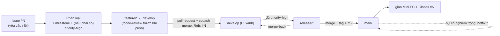

# Hướng dẫn nhanh quy trình làm việc (SDLC)

> **Phiên bản:** 1.3.0
> **Ngày:** 11/06/2026
> **Đối tượng:** Thành viên mới — kể cả người chưa quen Git, CI, hay Docker.
> **Cách dùng:** Đọc một lượt (~15 phút) để hiểu *một thay đổi đi từ lúc nhận việc đến khi giao cho khách như thế nào*. Đây là **bản đồ tổng quan** — thao tác từng bước nằm ở [CONTRIBUTING.md](../CONTRIBUTING.md), quyết định kèm lý do nằm trong [docs/superpowers/specs/](superpowers/specs/). Mỗi mục bên dưới đều có link tới nơi chi tiết.

> **SDLC** (Software Development Life Cycle — vòng đời phát triển phần mềm) = toàn bộ cách đội mình **nhận việc → làm → kiểm → phát hành → giao cho khách**.

> ⚙️ **Lưu ý về công cụ AI:** Hiện đội **chỉ dùng Claude Code**. Một số bước trong tài liệu này là *tính năng riêng của Claude Code* — ví dụ lệnh `/code-review` và các "hook" tự động (tự theo dõi CI, nhắc tăng version tài liệu, chặn push nhánh cũ). [AGENTS.md](../AGENTS.md) viết quy ước cho **mọi** công cụ AI, nhưng các tự động hoá hiện tại gắn với Claude Code. Nếu sau này đội dùng thêm hoặc đổi sang công cụ khác (ví dụ Antigravity, Codex, hay một coding agent khác trên thị trường), hãy xem lại các bước gắn với công cụ và cập nhật tài liệu cho khớp.

## 1. Từ vựng (đọc cái này trước)

Thuật ngữ, từ viết tắt và các gloss ("canonical", "chủ dự án"…) dùng trong dự án nằm tập trung ở **[`THUAT_NGU.md`](THUAT_NGU.md)** — nguồn **duy nhất**, học một lần dùng mọi nơi. Đọc lướt mục đó trước khi đọc tiếp.

(Tên các loại nhánh `develop`, `main`, `feature/*`, `release/*`, `hotfix/*` được giải thích ngay ở mục 2.)

## 2. Mô hình nhánh: Git Flow

> ⚠️ **"Git Flow" không phải là "dùng Git nói chung".** Nó là tên một **mô hình quản lý nhánh cụ thể** (do Vincent Driessen đề xuất). Muốn hiểu sâu, đọc bài gốc: [*A successful Git branching model*](https://nvie.com/posts/a-successful-git-branching-model/). Lý do dự án chọn nó: [ADR-003](superpowers/specs/2026-06-07-quy-trinh-release-design.md).

Dự án có **5 loại nhánh**:

| Nhánh | Vai trò |
|---|---|
| **`main`** | Chỉ chứa bản **đã phát hành**; mỗi commit trên `main` có một tag version. Không bao giờ làm việc trực tiếp ở đây. |
| **`develop`** | Nhánh **chung**, nơi gom mọi việc đang làm dở. |
| **`feature/*`** | Cắt ra **từ `develop`** để làm *một việc* (ví dụ `feature/cot-so-sanh-ky`); xong thì merge lại vào `develop`. |
| **`release/*`** | Cắt ra **từ `develop`** khi đủ nội dung để phát hành; dùng để ổn định trước khi vào `main`. |
| **`hotfix/*`** | Cắt ra **từ `main`** để vá gấp lỗi nghiêm trọng đang chạy thật. |

Thao tác Git cụ thể (lệnh tạo worktree, cắt nhánh, kiểu merge): [CONTRIBUTING.md mục 2](../CONTRIBUTING.md).

## 3. Bức tranh lớn: một thay đổi đi đâu

## 4. Vòng đời một thay đổi (6 bước)

*Ví dụ xuyên suốt: bạn được giao việc "thêm cột so sánh kỳ vào bảng tính tiền".*

1. **Mở Issue.** Mọi việc bắt đầu bằng một Issue trên GitHub (chọn mẫu *Yêu cầu thay đổi* hoặc *Báo lỗi*). Khách báo qua điện thoại/chat thì đội tự mở Issue thay. Số `#N` là mã của việc này, dùng để truy vết về sau. → [CONTRIBUTING.md mục 9](../CONTRIBUTING.md) (và mục 4).
2. **Phân loại.** Chủ dự án gắn nhãn loại, gán **milestone** (việc này dự kiến vào bản phát hành nào) và — nếu là việc *bắt buộc phải có* cho bản đó — thêm nhãn `priority-high`. → [CONTRIBUTING.md mục 11](../CONTRIBUTING.md) (và mục 9 bước 2).
3. **Làm trên nhánh riêng.** Cắt nhánh `feature/<việc>` **từ `develop`** (mục 2), viết code và test, chạy test bằng `bin/docker rspec`. Trước khi push, chạy `/code-review` (lệnh của Claude Code) để soát lỗi sơ bộ. → [CONTRIBUTING.md mục 4](../CONTRIBUTING.md).
4. **Mở pull request vào `develop`.** Trong phần mô tả ghi `Refs #N` để nối với Issue. CI phải **xanh** và chủ dự án **duyệt** thì mới merge; merge bằng **squash** (một pull request thành một commit gọn). → [CONTRIBUTING.md mục 4 và mục 2](../CONTRIBUTING.md).
5. **Cắt bản phát hành.** Khi **mọi** việc `priority-high` của một milestone đã xong (đã merge vào `develop`), cắt nhánh `release/*` từ `develop` rồi đưa vào `main`. Công cụ **release-please** tự tăng số version theo **SemVer**, tạo tag và ghi changelog. → [CONTRIBUTING.md mục 6 và mục 11](../CONTRIBUTING.md).
6. **Giao và đóng.** Giao bản đã tag xuống máy **Mini PC** đặt tại chỗ khách (mạng nội bộ, không Internet); Issue tự đóng khi pull request ghi `Closes #N`. → [CONTRIBUTING.md mục 7 và mục 10](../CONTRIBUTING.md).

## 5. Bảng tra cứu nhanh

Mỗi dòng là một chủ đề → quy tắc cốt lõi → nơi đọc chi tiết (bấm vào link).

| Chủ đề | Quy tắc cốt lõi | Mở chi tiết |
|---|---|---|
| Nhánh & merge | Git Flow (mục 2); `feature/*` merge vào `develop` bằng **squash**; `release/*`·`hotfix/*` vào `main` bằng **merge-commit**; sau đó **merge-back** về `develop` | [CONTRIBUTING §2](../CONTRIBUTING.md) · [ADR-003](superpowers/specs/2026-06-07-quy-trinh-release-design.md) |
| Commit & version | Commit tiếng Anh dạng `type(scope): mô tả`; `feat`→MINOR, `fix`→PATCH, `BREAKING`→MAJOR (theo **SemVer**); release-please tự tăng version + changelog + tag | [CONTRIBUTING §3, §6](../CONTRIBUTING.md) · [ADR-004, ADR-008](superpowers/specs/2026-06-07-quy-trinh-release-design.md) |
| Issue & truy vết | Mọi việc bắt đầu từ Issue `#N`; pull request ghi `Refs #N`/`Closes #N`; yêu cầu nghiệp vụ gắn mốc `NV-...` | [CONTRIBUTING §9](../CONTRIBUTING.md) · [ADR-013, ADR-014](superpowers/specs/2026-06-08-truy-vet-quan-ly-thay-doi-design.md) |
| Xác nhận khách trước build | Cần khách duyệt phương án trước khi code → tài liệu xác nhận versioned ở `docs/xac-nhan-khach/`, Issue-first, fold vào nghiệp vụ khi khách chốt | [CONTRIBUTING §9](../CONTRIBUTING.md) · [ADR-028](superpowers/specs/2026-06-08-truy-vet-quan-ly-thay-doi-design.md) |
| Ưu tiên & "đủ để phát hành" | Thứ tự làm: `severity-critical` → `priority-high` (theo milestone) → còn lại; cắt `release/*` khi mọi `priority-high` của milestone đã xong | [CONTRIBUTING §11](../CONTRIBUTING.md) · [ADR-019, ADR-020](superpowers/specs/2026-06-09-tiep-nhan-uu-tien-cong-viec-design.md) |
| Lỗi & sự cố | Lỗi thường → `feature/*`; lỗi nghiêm trọng → `hotfix/*` (phân biệt rõ ở mục 7) | [CONTRIBUTING §10](../CONTRIBUTING.md) · [ADR-018](superpowers/specs/2026-06-09-van-hanh-bao-tri-design.md) |
| Sao lưu & khôi phục | Sao lưu tự động sang ổ cứng phụ là nguồn chính; **tạo bản sao lưu trước khi restore** | [CONTRIBUTING §10](../CONTRIBUTING.md) · [ADR-016, ADR-017](superpowers/specs/2026-06-09-van-hanh-bao-tri-design.md) |
| CI (kiểm tra tự động) | Kiểm tĩnh luôn chạy; chạy test chỉ khi pull request **có đụng code** (sửa mỗi tài liệu thì bỏ qua cho nhanh) | [CONTRIBUTING §8](../CONTRIBUTING.md) · [ADR-012, ADR-021](superpowers/specs/2026-06-07-ci-spec-design.md) |
| Việc nối tiếp (nhánh xếp chồng) | Việc B cần kết quả việc A mà A **chưa merge** → cắt `feature/B` từ nhánh A; khi A đã merge thì `rebase --onto develop` | [CONTRIBUTING §4](../CONTRIBUTING.md) · [ADR-021](superpowers/specs/2026-06-07-ci-spec-design.md) |
| Môi trường | Xem mục 6 — ba nghĩa của "môi trường" + bốn nơi chạy (máy bạn, 3 môi trường Railway, Mini PC) | [mục 6](#6-ba-nghĩa-của-môi-trường-environment) · [ADR-005](superpowers/specs/2026-06-07-quy-trinh-release-design.md) |
| Cộng tác & review | Chạy `/code-review` (Claude Code) trước khi push; chủ dự án duyệt cuối; xem chung app đang chạy qua VS Code Dev Tunnel | [CONTRIBUTING §4, §5](../CONTRIBUTING.md) · [ADR-009, ADR-010](superpowers/specs/2026-06-07-quy-trinh-release-design.md) |
| Quản trị tài liệu | Mỗi fact một nơi canonical, nơi khác trỏ về; sửa đừng "append mù"; thuật ngữ ở `THUAT_NGU.md`, loại tài liệu ở `BAN_DO_TAI_LIEU.md`; CI tự kiểm link/bản đồ/định nghĩa (ADR-024) | [THUAT_NGU](THUAT_NGU.md) · [BAN_DO_TAI_LIEU](BAN_DO_TAI_LIEU.md) · [ADR-023](superpowers/specs/2026-06-10-quan-tri-tai-lieu-design.md) · [ADR-024](superpowers/specs/2026-06-11-guardrail-quan-tri-tai-lieu-design.md) |
| Tài liệu | File trong `docs/` có dòng *Phiên bản* → khi sửa phải tăng version + ghi "Lịch sử thay đổi"; file gốc (`README`/`AGENTS`/`CONTRIBUTING`/`CLAUDE`) thì không | [AGENTS.md](../AGENTS.md) · [ADR-002](superpowers/specs/2026-06-07-sdlc-overview-design.md) |

## 6. Ba nghĩa của "môi trường" (environment)

Từ "môi trường" (environment) bị dùng cho **ba thứ khác nhau** — rất dễ nhầm:

| Loại | Là gì | Các giá trị |
|---|---|---|
| **Application environment** (môi trường ứng dụng) | Nhãn cho biết bản này đang chạy ở "nơi" nào; hiện ở giao diện, màn hình đăng nhập, log. Đặt qua biến `APPLICATION_ENVIRONMENT_LABEL`. | `Development` / `Acceptance` / `Mirror` / `Production` |
| **Rails environment** (`RAILS_ENV`) | Chế độ chạy của framework Rails. | `development` / `test` / `production` |
| **Railway environment** | Tên môi trường trên nền tảng chạy online Railway. | `development` / `acceptance` / `mirror` |

- **Mặc định:** khi tài liệu hay giao diện nói "môi trường" mà **không kèm bổ nghĩa** thì hiểu là **application environment**. Khi nói tới Rails thì luôn ghi rõ `RAILS_ENV`.
- Ba thứ này có thể **khác giá trị nhau**: ví dụ cả `Acceptance` lẫn `Mirror` đều chạy `RAILS_ENV=production`.
- **Bốn nơi chạy thực tế:** máy bạn (local), 3 môi trường Railway (`development` ← `develop`, `acceptance` ← `main`, `mirror` ← tag đang ở production), và **Production = Mini PC offline** tại chỗ khách (nhãn `Production`, không thuộc Railway).

Chi tiết: [AGENTS.md — mục "Thuật ngữ environment"](../AGENTS.md) · [spec app-version-reporting](superpowers/specs/2026-06-07-app-version-reporting-design.md) · [ADR-005](superpowers/specs/2026-06-07-quy-trinh-release-design.md) · [KIEN_THUC_DOCKER.md](KIEN_THUC_DOCKER.md).

## 7. Lỗi thường và lỗi nghiêm trọng

Khi có lỗi, **việc đầu tiên là phân loại mức độ**, vì hai mức đi theo hai đường khác nhau:

| | Lỗi thường | Lỗi nghiêm trọng |
|---|---|---|
| **Dấu hiệu** | Hệ thống **vẫn dùng được**, chỉ sai hoặc bất tiện ở chỗ nào đó | **Không dùng được** ở chỗ khách, **sai số tiền/điện**, hoặc **mất (hay nguy cơ mất) dữ liệu** |
| **Nhãn Issue** | `bug` | `bug` + `severity-critical` |
| **Đường vá** | Như một thay đổi bình thường: `feature/*` ← `develop`, gồm vào bản phát hành sau | Vá gấp: `hotfix/*` ← `main`, phát hành ngay; cân nhắc tạm quay về bản tag trước để "chữa cháy" |
| **Độ gấp** | Theo thứ tự ưu tiên thông thường | **Ngoài hàng đợi, làm ngay** |

Chi tiết: [CONTRIBUTING.md mục 10](../CONTRIBUTING.md) · [ADR-018](superpowers/specs/2026-06-09-van-hanh-bao-tri-design.md).

## 8. Quy ước sống còn (đừng quên)

- **Ngôn ngữ:** tài liệu và giao diện **tiếng Việt 100%**; commit và tiêu đề pull request **tiếng Anh** (theo Conventional Commits — [CONTRIBUTING.md mục 3](../CONTRIBUTING.md)).
- **Không viết tắt**, trừ các từ trong bảng *"Từ viết tắt được phép"* ở [`THUAT_NGU.md`](THUAT_NGU.md). Cần thêm từ viết tắt mới → thêm vào bảng đó trước.
- **Luôn làm trong một git worktree riêng + Docker** (xem [README.md](../README.md)).
- Sửa file trong `docs/` có dòng *Phiên bản* → nhớ **tăng version + ghi một dòng vào "Lịch sử thay đổi"** trong cùng commit ([ADR-002](superpowers/specs/2026-06-07-sdlc-overview-design.md)).

## Cần chi tiết hơn?

Tài liệu này cố ý ngắn để nắm nhanh. Khi cần làm thật, mở:

- [CONTRIBUTING.md](../CONTRIBUTING.md) — quy trình **thao tác từng bước** cho người (mục 1–11).
- [AGENTS.md](../AGENTS.md) — **quy ước** code + dự án (tài liệu canonical).
- [docs/superpowers/specs/](superpowers/specs/) — **quyết định kèm lý do** (các ADR).
- [README.md](../README.md) — cài đặt, lệnh thường dùng, môi trường.

## Lịch sử thay đổi

- **1.3.0 (11/06/2026):** §5 thêm dòng "Xác nhận khách trước build" (ADR-028) — tài liệu xác nhận versioned ở `docs/xac-nhan-khach/`, Issue-first, fold vào nghiệp vụ khi khách chốt. Issue #320.
- **1.2.0 (11/06/2026):** §5 thêm guardrail tự động (ADR-024) vào dòng "Quản trị tài liệu" — CI kiểm link chết / bản đồ tài liệu / giữ định nghĩa thuật ngữ. Issue #313.
- **1.1.0 (10/06/2026):** §1 "Từ vựng" gom về [`THUAT_NGU.md`](THUAT_NGU.md) (nguồn duy nhất), thay bảng bằng pointer; §8 trỏ từ viết tắt sang `THUAT_NGU.md` (bỏ liệt kê inline cho khỏi lỗi thời); §5 thêm dòng "Quản trị tài liệu"; bỏ dải ADR cứng ("ADR-001..NNN") ở "Cần chi tiết hơn?" cho khỏi phải sửa khi có ADR mới. ADR-023, Issue #310.
- **1.0.0 (09/06/2026):** Bản đầu — lối vào tổng quan, dễ hiểu cho người mới về quy trình SDLC (ADR-022; spec [2026-06-09-huong-dan-sdlc-onboarding-design.md](superpowers/specs/2026-06-09-huong-dan-sdlc-onboarding-design.md); Issue #307).
