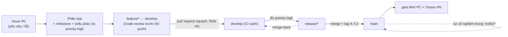

# Hướng dẫn nhanh quy trình làm việc (SDLC)

> **Phiên bản:** 1.0.0
> **Ngày:** 09/06/2026
> **Đối tượng:** Thành viên mới — kể cả người chưa quen Git, CI, hay Docker.
> **Cách dùng:** Đọc ~10–15 phút để hiểu *một thay đổi đi từ lúc nhận việc đến khi giao cho khách như thế nào*, rồi dùng bảng tra cứu để mở đúng mục chi tiết. **Đây là bản đồ — chi tiết và lý do nằm ở `CONTRIBUTING.md` và `docs/superpowers/specs/`.**

> **SDLC** (Software Development Life Cycle) = vòng đời phát triển phần mềm: toàn bộ cách đội mình **nhận việc → làm → kiểm → phát hành → giao cho khách**.

## 1. Từ vựng nhanh (đọc cái này trước)

| Từ | Nghĩa đời thường |
|---|---|
| **Nhánh** (branch) | Một "đường làm việc" riêng để bạn sửa code mà không đụng người khác. |
| **`develop`** | Nhánh chung, nơi gom mọi việc đang làm dở. |
| **`main`** | Nhánh "đã phát hành" — chỉ chứa bản đã chốt; mỗi bản gắn một số version. |
| **`feature/*`** | Nhánh bạn cắt ra từ `develop` để làm một việc cụ thể. |
| **Commit** | Một lần "lưu" thay đổi kèm câu mô tả ngắn. |
| **Pull request** | Lời đề nghị gộp nhánh của bạn vào nhánh khác, để người khác xem trước khi gộp. |
| **Merge** | Gộp một nhánh vào nhánh khác. |
| **Squash** | Khi gộp, dồn mọi commit của pull request thành **một** commit cho gọn. |
| **Tag** | Một cái nhãn ghim vào một bản đã phát hành (ví dụ `v1.1.0`). |
| **CI** | Máy chủ tự chạy kiểm tra (test, rà lỗi) mỗi khi mở pull request — báo **xanh** (đạt) / **đỏ** (lỗi). |
| **SemVer** | Cách đánh số version `MAJOR.MINOR.PATCH` (ví dụ `1.2.0`). |
| **Issue** | Một phiếu trên GitHub ghi một việc hoặc lỗi cần làm; có số `#N`. |
| **Milestone** | Một nhóm Issue dự kiến cho cùng một bản phát hành (= version đích). |
| **Hotfix** | Bản vá gấp cho lỗi nghiêm trọng đang chạy thật ở chỗ khách. |
| **Restore** | Khôi phục dữ liệu từ một bản sao lưu. |

## 2. Bức tranh lớn: một thay đổi đi đâu

## 3. Vòng đời một thay đổi (6 bước)

*Ví dụ xuyên suốt: bạn được giao "thêm cột so sánh kỳ vào bảng tính tiền".*

1. **Mở Issue.** Mọi việc bắt đầu bằng một Issue trên GitHub (dùng template *Yêu cầu thay đổi* hoặc *Báo lỗi*). Khách báo miệng thì đội tự mở Issue thay. Số `#N` là mã của việc này. → *Chi tiết: `CONTRIBUTING.md` mục 9 và mục 4.*
2. **Phân loại.** Chủ dự án gắn nhãn loại, gán **milestone** (việc này vào bản phát hành nào) và — nếu là việc *phải có* — nhãn `priority-high`. → *Mục 11 và mục 9 (bước 2).*
3. **Làm trên nhánh riêng.** Cắt nhánh `feature/<việc>` **từ `develop`**, code và viết test (`bin/docker rspec`), rồi chạy `/code-review` ngay trên máy trước khi đẩy lên. → *Mục 4.*
4. **Mở pull request vào `develop`.** Ghi `Refs #N` trong mô tả. CI phải **xanh** và chủ dự án duyệt thì mới gộp; gộp bằng **squash** (một pull request = một commit). → *Mục 4 và mục 2.*
5. **Cắt bản phát hành.** Khi mọi việc `priority-high` của milestone đã xong, cắt nhánh `release/*` từ `develop`, đưa vào `main`; công cụ release-please tự gắn version `X.Y.Z` + tag. → *Mục 6 và mục 11.*
6. **Giao và đóng.** Giao bản đã tag xuống máy Mini PC ở chỗ khách; Issue được đóng (`Closes #N`). → *Mục 7 và mục 10.*

## 4. Bảng tra cứu nhanh

| Chủ đề | Quy tắc cốt lõi | Mở chi tiết ở |
|---|---|---|
| Nhánh & gộp | Git Flow; `feature/*` cắt từ `develop`, **squash** vào `develop`; `release/*`·`hotfix/*` vào `main` bằng merge-commit; sau đó **merge-back** về `develop` | `CONTRIBUTING.md` §2 · ADR-003 |
| Commit & version | Commit tiếng Anh dạng `type(scope): ...`; `feat`→tăng MINOR, `fix`→tăng PATCH, có `BREAKING`→tăng MAJOR; release-please tự bump version + changelog + tag | §3, §6 · ADR-004, ADR-008 |
| Issue & truy vết | Mọi việc bắt đầu từ Issue `#N`; pull request ghi `Refs/Closes #N`; yêu cầu nghiệp vụ gắn anchor `NV-...` | §4, §9 · ADR-013, ADR-014 |
| Ưu tiên & "đủ để phát hành" | Thứ tự làm: `severity-critical` > `priority-high` (theo milestone) > còn lại; cắt `release/*` khi mọi `priority-high` của milestone đã xong | §11 · ADR-019, ADR-020 |
| Lỗi & sự cố | Lỗi thường → nhánh `feature/*`; lỗi nghiêm trọng (`severity-critical`: sập / sai tiền / mất dữ liệu) → `hotfix/*` cắt từ `main` | §10 · ADR-018 |
| Sao lưu & khôi phục | Sao lưu tự động sang ổ phụ (Lớp 3) là chính; tạo bản sao lưu *trước* khi khôi phục | §10 · ADR-016, ADR-017 |
| CI (kiểm tra tự động) | Kiểm tĩnh luôn chạy; chạy test chỉ khi pull request có đụng code (sửa mỗi tài liệu thì bỏ qua) | §8 · ADR-012, ADR-021 |
| Việc nối tiếp (nhánh xếp chồng) | Việc B cần kết quả việc A mà A chưa gộp → cắt `feature/B` từ nhánh A; sau khi A gộp thì `rebase --onto develop` | §4 · ADR-021 |
| Môi trường | Máy bạn (local) để làm; **3 môi trường Railway**: `development`←`develop`, `acceptance`←`main`, `mirror`←tag đang ở production; **Production = Mini PC offline** ở chỗ khách. Không dùng `-rc.N` | `README.md` · ADR-005 |
| Cộng tác & review | Chạy `/code-review` trên máy trước khi push; chủ dự án duyệt cuối; xem chung app đang chạy qua VS Code Dev Tunnel | §4, §5 · ADR-009, ADR-010 |
| Tài liệu | File trong `docs/` có version → khi sửa phải bump version + ghi changelog; file gốc (`README`/`AGENTS`/`CONTRIBUTING`/`CLAUDE`) thì không | `AGENTS.md` · ADR-002 |

## 5. Quy ước sống còn (đừng quên)

- Tài liệu và giao diện: **tiếng Việt 100%**. Commit và tiêu đề pull request: **tiếng Anh** (Conventional Commits).
- **Không viết tắt** (trừ CI, ADR, CRUD, UI).
- **Luôn làm trong một git worktree riêng + Docker** (xem `README.md`).
- Sửa file trong `docs/` có version → nhớ **bump version + ghi changelog** trong cùng commit.

## 6. Khi gặp lỗi/sự cố

- **Lỗi thường** (vẫn dùng được): xử như một thay đổi bình thường — mở Issue, làm trên `feature/*`.
- **Lỗi nghiêm trọng** (chỗ khách không dùng được / sai số tiền / mất dữ liệu): gắn nhãn `severity-critical`, vá gấp theo nhánh `hotfix/*` cắt từ `main`, cân nhắc quay về bản tag trước. → *`CONTRIBUTING.md` mục 10.*

---

**Cần chi tiết hơn?** `CONTRIBUTING.md` (quy trình từng bước cho người) · `docs/superpowers/specs/` (ADR-001..022 — quyết định kèm lý do) · `AGENTS.md` (quy ước code).

## Lịch sử thay đổi

- **1.0.0 (09/06/2026):** Bản đầu — lối vào distill cho SDLC (ADR-022; spec `docs/superpowers/specs/2026-06-09-huong-dan-sdlc-onboarding-design.md`; Issue #307).
