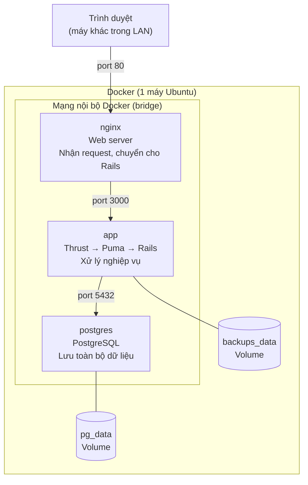
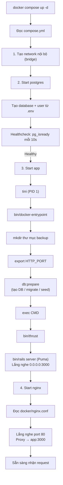
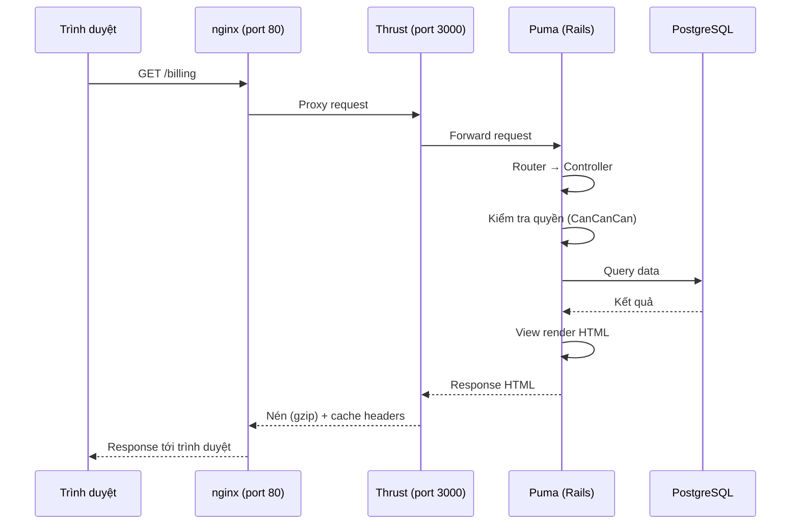
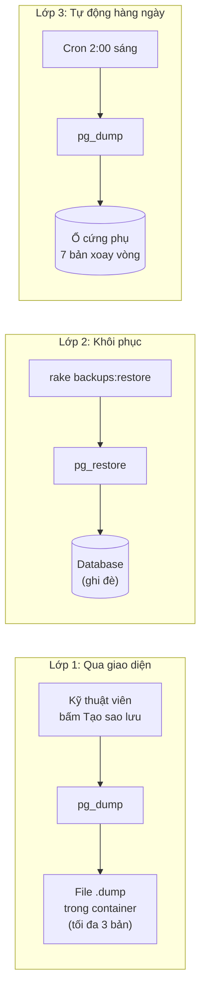
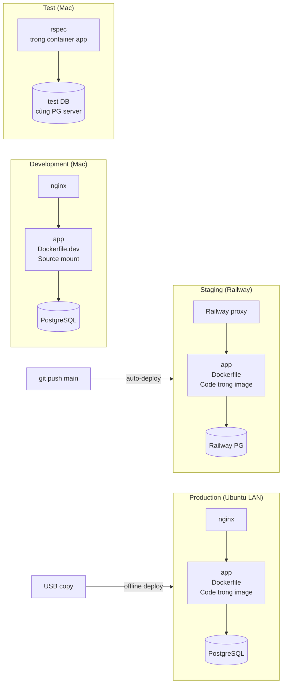
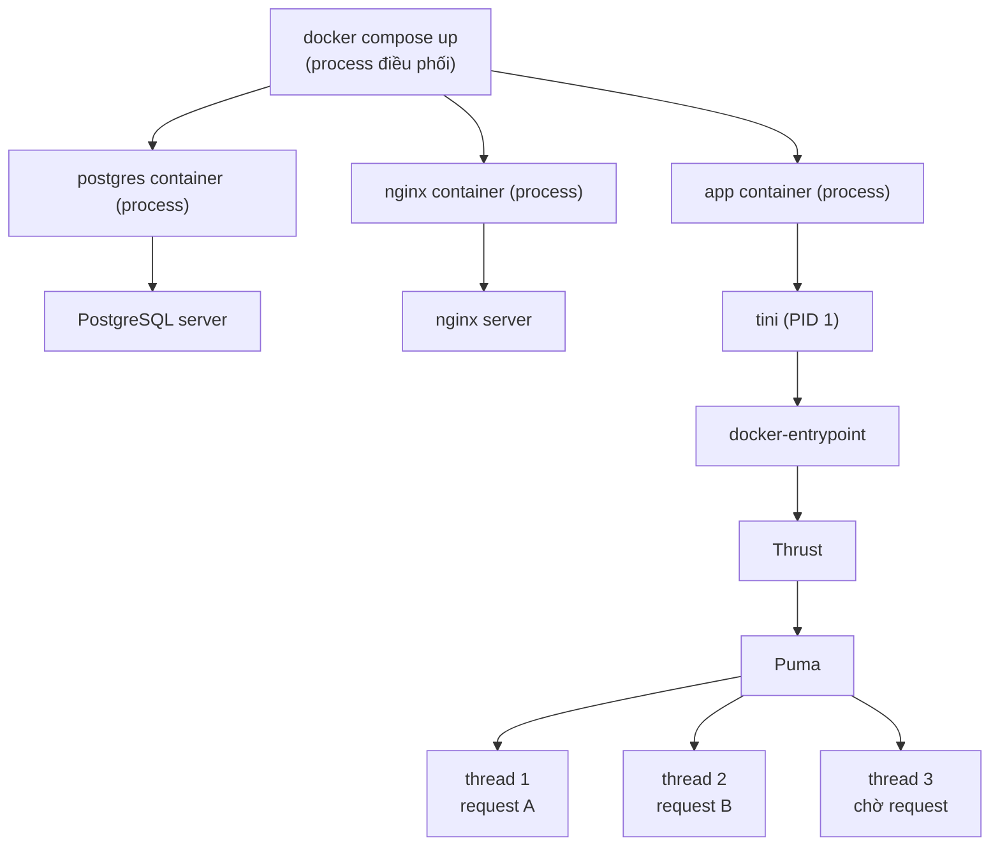

# Kiến thức Docker — Hệ thống quản lý điện nội bộ Sư đoàn

> **Phiên bản:** 1.6.0
> **Ngày:** 31/05/2026
> **Đối tượng:** Developer hoặc người muốn hiểu hệ thống chạy thế nào ở mọi môi trường.
> **Tiền đề:** Bạn biết code Rails nhưng chưa biết Docker và chưa từng deploy.

---

## Mục lục

1. [Bức tranh tổng thể](#1-bức-tranh-tổng-thể)
2. [Docker là gì](#2-docker-là-gì)
3. [3 containers trong hệ thống](#3-3-containers-trong-hệ-thống)
4. [Các file liên quan và vai trò](#4-các-file-liên-quan-và-vai-trò)
5. [Luồng khởi động](#5-luồng-khởi-động)
6. [Luồng xử lý request](#6-luồng-xử-lý-request)
7. [Giải thích từng file](#7-giải-thích-từng-file)
8. [Biến môi trường](#8-biến-môi-trường)
9. [Dữ liệu và volume](#9-dữ-liệu-và-volume)
10. [Sao lưu và khôi phục](#10-sao-lưu-và-khôi-phục)
11. [4 môi trường](#11-4-môi-trường) (Development, Test, Staging, Production)
12. [Các khái niệm cần biết](#12-các-khái-niệm-cần-biết)
13. [Xử lý sự cố](#13-xử-lý-sự-cố)

---

## 1. Bức tranh tổng thể

> Mục 1-10 mô tả kiến trúc **production**. Mục 11 mô tả khác biệt giữa 4 môi trường (development, test, staging, production).

Hệ thống chạy trên 1 máy tính (Ubuntu) trong mạng LAN nội bộ Sư đoàn, không có internet. Người dùng truy cập bằng trình duyệt từ máy tính khác trong LAN.

Trên máy đó, Docker chạy 3 "hộp" (container) song song:



Người dùng chỉ thấy port 80. 2 port còn lại (3000, 5432) nằm trong mạng nội bộ Docker, không ai ngoài truy cập được.

---

## 2. Docker là gì

Khi deploy không dùng Docker, phải cài thủ công: Ruby, PostgreSQL, nginx, các thư viện — trên mỗi máy khác nhau. Dễ sai version, thiếu thư viện, xung đột.

Docker đóng gói tất cả vào 1 "image" (ảnh). Image giống file ISO cài Windows — chứa mọi thứ cần thiết. Từ image tạo ra "container" (hộp chạy thực). Máy nào có Docker đều chạy được, không cần cài thêm gì.

**Thuật ngữ:**

| Thuật ngữ | Nghĩa | Ví dụ đời thực |
|---|---|---|
| Image | Khuôn mẫu, chỉ đọc | File ISO cài Windows |
| Container | Thể hiện đang chạy của image | Máy tính đã cài xong, đang dùng |
| Volume | Nơi lưu dữ liệu bền vững | Ổ cứng ngoài — rút máy ra vẫn còn |
| Network | Mạng nội bộ giữa các containers | Switch mạng nối 3 máy lại |
| Dockerfile | Công thức build image | Hướng dẫn cài đặt từng bước |
| Docker Compose | Điều phối nhiều containers | Quản lý dự án giám sát 3 nhóm |

---

## 3. 3 containers trong hệ thống

### postgres — Database

- Dùng image `postgres:16-alpine` (có sẵn, không cần build)
- Lưu toàn bộ dữ liệu: khu vực, đơn vị, đầu mối, công tơ, chỉ số, kết quả tính toán, tài khoản
- Data lưu trong volume (không mất khi restart container)
- Healthcheck: Docker kiểm tra PostgreSQL sẵn sàng chưa mỗi 10 giây

### app — Application server

- Build từ `Dockerfile` trong repo (chứa Ruby, gems, source code đã compile)
- Bên trong chạy: Thrust (HTTP/2 proxy) → Puma (Rails server)
- Chờ postgres healthy rồi mới start
- Khi start: chạy database migrations, tạo tài khoản mặc định (nếu lần đầu)

### nginx — Web server

- Dùng image `nginx:alpine` (có sẵn, không cần build)
- Nhận request từ trình duyệt (port 80), chuyển cho app (port 3000)
- Nén response (gzip) để gửi nhanh hơn trên mạng
- Chặn request quá 20MB
- Chờ tối đa 5 phút cho request nặng (tính toán, xuất Excel)

---

## 4. Các file liên quan và vai trò

### Files production (staging + production)

| File | Làm gì | Ai đọc |
|---|---|---|
| `Dockerfile` | Công thức build image app (Ruby + gems + source code) | Docker (staging + production) |
| `compose.yml` | Ghép 3 containers production: env vars, volumes, network | Docker Compose (production) |
| `railway.json` | Cấu hình Railway: builder, pre-deploy, healthcheck | Railway (staging) |
| `docker/nginx.conf` | Cấu hình nginx: proxy request, nén, timeout | nginx container |
| `bin/docker-entrypoint` | Chạy khi container app start: tạo thư mục backup, set port, chạy db:prepare | Container app |
| `bin/thrust` | Entry point cho Thrust HTTP/2 proxy (Rails 8 mặc định) | Container app |
| `.env.example` | Template biến môi trường — copy thành `.env` rồi điền giá trị | Người deploy |

### Files development

| File | Làm gì | Ai đọc |
|---|---|---|
| `Dockerfile.dev` | Công thức build image dev (Ruby + build tools, không precompile) | Docker Desktop |
| `compose.dev.yml` | Ghép 3 containers dev: bind mounts, foreman, port mapping | Docker Compose |
| `bin/docker` | Shortcut cho lệnh Docker dev (rspec, console, bash, logs, ...) | Developer |
| `Procfile.dev` | Định nghĩa 2 processes cho foreman: rails server + tailwind watch | foreman trong container |

> Process `css` dùng `tailwindcss:watch[always]` (không phải `tailwindcss:watch`): cờ `[always]` giữ watcher Tailwind chạy kể cả khi stdin đóng/EOF — cần khi `bin/dev` chạy dưới foreman ở môi trường non-TTY (vd AI/CI/pipe trên host), nếu không Tailwind thoát code 0 → foreman dừng luôn cả `web`. Trong Docker không gặp vì `compose.dev.yml` để `tty: true`/`stdin_open: true`. Phải để trong nháy kép vì `[...]` là glob (zsh báo lỗi nếu không quote), và KHÔNG đặt comment trong `Procfile.dev` vì foreman đọc file theo US-ASCII → ký tự non-ASCII gây lỗi parse.

### Files data và vận hành

| File | Làm gì | Ai dùng |
|---|---|---|
| `db/seeds.rb` | Tạo 2 tài khoản mặc định (kyThuat, quanTri) khi database mới | db:prepare |
| `lib/tasks/backups.rake` | Lệnh restore database từ bản sao lưu | Kỹ thuật viên (terminal) |
| `script/setup-auto-backup` | Thiết lập sao lưu tự động sang ổ cứng phụ | Người deploy (1 lần) |

### Files cho delivery

| File | Làm gì | Ai dùng |
|---|---|---|
| `bin/prepare-delivery` | Tạo bản sạch để ship cho khách (xóa dấu vết phát triển) | Developer |
| `docs/HUONG_DAN_DEPLOY.md` | Hướng dẫn deploy chi tiết từng bước | Người thực hiện deploy |
| `docs/KIEN_THUC_DOCKER.md` | Kiến thức Docker, 4 môi trường (tài liệu này) | Developer, người deploy |

---

## 5. Luồng khởi động

Khi chạy `docker compose up -d`:



Sau khi cả 3 container Up, truy cập `http://<IP-server>` từ trình duyệt.

---

## 6. Luồng xử lý request

Khi người dùng mở trình duyệt và truy cập hệ thống:



**Web server vs Application server:**

- **nginx (web server):** Nhận request từ trình duyệt, quyết định chuyển cho ai. Giống lễ tân — tiếp khách, chỉ đường, phát tài liệu có sẵn (CSS, JS, hình ảnh).
- **Puma (application server):** Chạy code Ruby, đọc/ghi database, trả kết quả. Giống nhân viên phòng ban — xử lý công việc thực sự.
- **Thrust:** Đứng giữa nginx và Puma, nén response và cache. Rails 8 thêm mặc định để deploy đơn giản không cần nginx. Project này có cả 2 — chức năng trùng thì Thrust bỏ qua.

---

## 7. Giải thích từng file

### Dockerfile

Công thức build image cho app container. Dùng "multi-stage build" — 3 giai đoạn:

**Giai đoạn 1 (base):** Cài Ruby + các phần mềm cần khi chạy (PostgreSQL client cho backup, tini cho signal handling, locales cho tiếng Việt).

**Giai đoạn 2 (build):** Kế thừa base, thêm build tools (gcc, make). Cài gems, compile assets (CSS/JS). Build tools chỉ cần ở giai đoạn này — không đi vào image cuối.

**Giai đoạn 3 (final):** Kế thừa base (không có build tools), copy gems và code đã compile từ giai đoạn 2. Tạo user `rails` (không chạy bằng root — bảo mật). Image cuối nhẹ hơn nhiều vì không chứa build tools.

```dockerfile
ENTRYPOINT ["/usr/bin/tini", "--", "/rails/bin/docker-entrypoint"]
CMD ["./bin/thrust", "./bin/rails", "server"]
```

ENTRYPOINT luôn chạy khi container start (setup). CMD là lệnh chính giữ container sống. Docker ghép: `tini → docker-entrypoint → thrust → rails server`.

### compose.yml

Ghép 3 containers lại. Định nghĩa:
- **Biến môi trường:** đọc từ file `.env` (mật khẩu database, secret key)
- **Volumes:** nơi lưu dữ liệu bền vững (database, backups)
- **Network:** mạng nội bộ để containers nói chuyện
- **Ports:** chỉ nginx mở port 80 ra ngoài
- **Depends on:** app chờ postgres healthy, nginx chờ app

### docker/nginx.conf

Cấu hình nginx:
- Lắng nghe port 80, nhận mọi request
- Nén response (gzip) cho CSS, JS, JSON — giảm dung lượng truyền trên mạng
- Chặn request > 20MB
- Proxy mọi request cho `app:3000` (Docker DNS tự resolve tên container thành IP)
- Health check `/up` riêng, không ghi log (tránh spam)
- Timeout 5 phút cho request nặng (tính toán bảng tính tiền, xuất Excel)

### bin/docker-entrypoint

Script chạy mỗi khi container app start:
1. Tạo thư mục backup nếu chưa có
2. Set `HTTP_PORT` cho Thrust (đồng bộ với Railway nếu deploy trên đó)
3. Kiểm tra CMD có phải `rails server` không — nếu đúng thì chạy `db:prepare` (tạo database + migrations + seed). Nếu CMD là lệnh khác (bash, console) thì skip
4. `exec` CMD — thay thế bash bằng CMD để signal handling đúng

### bin/thrust

3 dòng, load Thruster gem. Thrust là HTTP/2 proxy của Rails 8:
- Nén response (gzip)
- Cache static files (CSS, JS — set header cache 1 năm)
- HTTP/2 (gửi nhiều file trong 1 kết nối)

Trước Rails 8 cần nginx cho những việc này. Rails 8 thêm Thrust để deploy đơn giản không cần nginx. Project này có cả 2 — nginx lo phần nặng, Thrust bổ sung HTTP/2.

### .env.example

Template cho biến môi trường. Copy thành `.env`, điền giá trị thực:

```
POSTGRES_PASSWORD=<mật khẩu database>
SECRET_KEY_BASE=<khóa mã hóa session/cookie — 128 ký tự hex>
```

File `.env` không bao giờ commit vào git (chứa mật khẩu).

### db/seeds.rb

Tạo 2 tài khoản mặc định khi database mới:
- `kyThuat` / `Abc@1234` (kỹ thuật viên — quản lý tài khoản, sao lưu)
- `quanTri` / `Abc@1234` (quản trị viên hệ thống — quản lý nghiệp vụ)

Cả 2 bắt buộc đổi mật khẩu lần đầu đăng nhập. Không thể xóa.

### lib/tasks/backups.rake

Lệnh restore database từ terminal (không có nút trên giao diện vì quá nguy hiểm — ghi đè toàn bộ dữ liệu):

```bash
docker compose exec app bundle exec rails "backups:restore[tên-file.dump]"
```

Hỏi xác nhận `YES` trước khi chạy.

### script/setup-auto-backup

Thiết lập sao lưu tự động sang ổ cứng phụ. Chạy 1 lần khi deploy:

```bash
sudo ./script/setup-auto-backup /mnt/backup
```

Script tạo cron job chạy mỗi ngày 2:00 sáng:
- pg_dump database ra file
- Giữ tối đa 7 bản, xóa bản cũ nhất tự động
- Log tại `/mnt/backup/ewm-backup/backup.log`

### bin/prepare-delivery

Tạo bản sạch để ship cho khách. Source code gốc chứa file phát triển (CLAUDE.md, .claude/) và dấu vết AI trong git history. Script:
1. Clone repo
2. Xóa dấu vết AI khỏi commit messages
3. Xóa file phát triển
4. Output: thư mục `electric-water-management-delivery/` sẵn sàng ship

### Dockerfile.dev

Công thức build image cho development. Khác Dockerfile production:
- 1 giai đoạn (không multi-stage) — giữ build tools vì cần khi thêm gem mới
- Không precompile assets — Tailwind watch realtime
- Không copy source code — mount từ Mac vào container
- Cài `foreman` để chạy nhiều process (Rails server + Tailwind watch)
- Cài `chromium` + `chromium-driver` (gói Debian) để chạy system test (Capybara + Selenium). Dùng Chromium thay Google Chrome để image dùng được trên **mọi kiến trúc CPU** (cả Intel/amd64 lẫn ARM/arm64 như Apple Silicon): apt repo của Google Chrome chỉ có bản amd64 nên không cài được trên máy arm64, còn gói `chromium` của Debian có cả hai. Hai gói Debian cùng phiên bản nên chromedriver luôn khớp Chromium và không cần tải driver lúc chạy

### compose.dev.yml

Ghép 3 containers cho development. Khác compose.yml production:
- Source code bind mount từ Mac (sửa file → Rails tự reload)
- Database bind mount ra `docker/dev/pgdata/` (nhìn thấy trên Mac)
- Gems cache trong named volume `bundle_cache` (không mất khi restart)
- Env vars hardcoded (không dùng file .env)
- Cổng host của postgres (`5433`) và nginx (`80`) tham số hóa qua `${POSTGRES_HOST_PORT}` / `${NGINX_HOST_PORT}` (mặc định vẫn 5433/80) — để mỗi git worktree chạy được trên cổng riêng, không đụng nhau. `app` chỉ `expose` cổng 3000 trong mạng nội bộ (truy cập qua nginx) nên không bind cổng host, không cần tham số hóa

### bin/docker

Shortcut script cho lệnh Docker development. Bọc `docker compose -f compose.dev.yml exec ...` thành lệnh ngắn:
- Test commands (`rspec`, `prspec`) tự set `RAILS_ENV=test` — không đụng dev database
- Các lệnh khác forward `RAILS_ENV` từ host nếu được set
- Hỗ trợ chọn container: `bin/docker bash postgres`
- Khi chạy trong git worktree: tự gán cổng host riêng & ổn định cho postgres + nginx (suy ra từ đường dẫn worktree) để không đụng project gốc / worktree khác, và in URL khi `bin/docker up`. Project gốc (không phải worktree) giữ cổng mặc định 5433/80 (xem mục 11 Development)

### railway.json

Cấu hình cho Railway staging:
- `builder: DOCKERFILE` — dùng cùng Dockerfile với production
- `preDeployCommand: db:prepare` — chạy migrations trước khi start
- `healthcheckPath: /up` — Railway kiểm tra app sẵn sàng

---

## 8. Biến môi trường

Biến môi trường là cách truyền cấu hình vào container mà không hardcode trong code.

### Production (file .env)

| Biến | Giá trị | Bắt buộc |
|---|---|---|
| `POSTGRES_USER` | `electric_water_management` (mặc định) | Không (có default) |
| `POSTGRES_PASSWORD` | Mật khẩu database | Có |
| `POSTGRES_DB` | `electric_water_management_production` (mặc định) | Không (có default) |
| `SECRET_KEY_BASE` | Chuỗi 128 hex (tạo bằng `rails secret`) | Có |

### Set sẵn trong compose.yml (không cần điền)

| Biến | Giá trị | Tại sao |
|---|---|---|
| `RAILS_ENV` | `production` | Chạy production mode |
| `DATABASE_HOST` | `postgres` | Tên container database |
| `DISABLE_SSL_REDIRECT` | `1` | LAN không có SSL |
| `RAILS_LOG_TO_STDOUT` | `1` | Log hiện trong `docker compose logs` |
| `BACKUP_DIR` | `/rails/storage/backups` | Thư mục lưu backup trong container |
| `TZ` | `Asia/Ho_Chi_Minh` | Timezone Việt Nam |

### Development (hardcoded trong compose.dev.yml)

Development không dùng file `.env` — tất cả giá trị hardcoded trong `compose.dev.yml` vì không cần bảo mật:

| Biến | Giá trị | Ghi chú |
|---|---|---|
| `RAILS_ENV` | `development` | Reload code, log chi tiết |
| `DATABASE_HOST` | `postgres` | Tên container |
| `DATABASE_USERNAME` | `electric_water_management` | Khớp POSTGRES_USER |
| `ELECTRIC_WATER_MANAGEMENT_DATABASE_PASSWORD` | `dev_password` | Mật khẩu dev (không bảo mật) |
| `PORT` | `3000` | Foreman dùng port này thay vì mặc định 5000 |
| `BINDING` | `0.0.0.0` | Rails lắng nghe mọi kết nối (nginx cần) |

Ngoài bảng trên, hai biến điều khiển cổng host publish ra (KHÔNG hardcode, có giá trị mặc định): `POSTGRES_HOST_PORT` (mặc định `5433`) và `NGINX_HOST_PORT` (mặc định `80`). `bin/docker` tự đặt cổng riêng cho mỗi git worktree — xem mục 11 Development.

### Staging (Railway dashboard)

Biến môi trường set trên Railway dashboard, không trong code:

| Biến | Nguồn |
|---|---|
| `DATABASE_URL` | Railway PostgreSQL add-on tự gán |
| `SECRET_KEY_BASE` | Tự generate |
| `PORT` | Railway tự gán (Thrust đọc qua `HTTP_PORT` trong docker-entrypoint) |

---

## 9. Dữ liệu và volume

Container bị xóa → dữ liệu bên trong mất. Volume giữ dữ liệu bên ngoài container.

### 3 volumes trong compose.yml

| Volume | Chứa gì | Mất = hậu quả |
|---|---|---|
| `pg_data` | Toàn bộ database PostgreSQL | Mất hết dữ liệu nghiệp vụ |
| `storage_data` | File Rails (Active Storage) | Mất file upload (nếu có) |
| `backups_data` | File backup (pg_dump) | Mất bản sao lưu trong app |

### Named volume vs Bind mount

| Loại | Ví dụ | Ai quản lý | Nhìn thấy trên máy |
|---|---|---|---|
| Named volume | `pg_data:/var/lib/postgresql/data` | Docker | Không (nằm sâu trong Docker) |
| Bind mount | `./docker/nginx.conf:/etc/nginx/nginx.conf` | Bạn | Có (file trên máy host) |

Production dùng named volumes (Docker quản lý, an toàn). Development dùng bind mounts (nhìn thấy file, dễ debug).

---

## 10. Sao lưu và khôi phục

### 3 lớp bảo vệ dữ liệu



**Lớp 1 — Sao lưu qua giao diện (khi cần):**
- Kỹ thuật viên đăng nhập → trang Sao lưu dữ liệu → bấm Tạo bản sao lưu
- Dùng `pg_dump` tạo file backup trong container
- Tối đa 3 bản. Dùng trước thao tác quan trọng (cập nhật phiên bản, restore)

**Lớp 2 — Khôi phục từ terminal:**
- `docker compose exec app bundle exec rails "backups:restore[tên-file.dump]"`
- Ghi đè toàn bộ database — hỏi xác nhận YES
- Dùng khi cần quay lại trạng thái cũ

**Lớp 3 — Sao lưu tự động sang ổ cứng phụ (bắt buộc):**
- Cron job chạy mỗi ngày 2:00 sáng
- pg_dump database ra ổ cứng phụ
- Giữ 7 bản, xóa cũ nhất tự động
- Bảo vệ khi ổ chính hỏng

---

## 11. 4 môi trường

### Tổng quan

| | Development | Test | Staging | Production |
|---|---|---|---|---|
| Hạ tầng | Docker Desktop (Mac) | Docker Desktop (Mac) | Railway | Ubuntu Mini PC (LAN offline) |
| Dockerfile | Dockerfile.dev | Dockerfile.dev | Dockerfile | Dockerfile |
| Web server | nginx container | Không | Railway edge proxy | nginx container |
| Database | PostgreSQL container | PostgreSQL container (cùng server, DB khác) | Railway PostgreSQL | PostgreSQL container |
| Config | compose.dev.yml | compose.dev.yml | railway.json | compose.yml + .env |
| Deploy | `bin/docker up` | Tự động khi chạy test | Auto-deploy khi push main | `docker compose up -d` |
| URL | http://localhost | Không (headless) | https://electric-water-management.up.railway.app | http://\<IP server\> |

Staging và production dùng cùng Dockerfile (production build). Development và test dùng Dockerfile.dev.



### Development

**Yêu cầu:** Docker Desktop trên Mac (hoặc Linux). Không cần cài Ruby, PostgreSQL, hay bất cứ gì khác.

**Lần đầu:**

```bash
git clone <repo>
cd electric-water-management
bin/docker up          # Tạo containers + cài gems + tạo database + start server
# Mở http://localhost
```

**Hàng ngày:**

```bash
bin/docker start       # Sáng: chạy lại containers đã dừng
# Code bình thường trên Mac, Rails tự reload khi sửa file
bin/docker stop        # Chiều: dừng containers
```

Dùng `up` thay `start` khi: lần đầu, hoặc sau khi sửa `compose.dev.yml` / `Dockerfile.dev`.

**Lệnh thường dùng:**

```bash
bin/docker rspec              # Chạy test
bin/docker rspec spec/models  # Chạy test 1 thư mục
bin/docker prspec             # Chạy test song song (auto-detect số processes)
bin/docker prspec:setup       # Tạo databases cho test song song (1 lần)
bin/docker console            # Rails console
bin/docker bash               # Shell trong container app
bin/docker bash postgres      # Shell trong container postgres
bin/docker logs               # Xem logs container app
bin/docker logs postgres      # Xem logs container postgres
bin/docker ps                 # Trạng thái containers
```

**Khác production:** Source code mount từ Mac vào container (bind mount) — sửa file trên Mac, container thấy ngay. Production copy code vào image 1 lần (đóng gói cố định).

**Tài khoản dev:** `quanTri` / `Abc@1234` (SA), `kyThuat` / `Abc@1234` (TECH). Tạo thêm test accounts qua giao diện hoặc rails runner.

**Dữ liệu dev:** Database lưu trong `docker/dev/pgdata/` trên Mac (bind mount, nhìn thấy được). Backups lưu trong `docker/dev/backups/`. Cả 2 bị gitignore.

**Cấu trúc Docker development:**

```
compose.dev.yml
├── postgres (image: postgres:16-alpine)
│   └── bind mount: ./docker/dev/pgdata → /var/lib/postgresql/data
├── app (build: Dockerfile.dev)
│   ├── bind mount: . → /rails (source code)
│   ├── named volume: bundle_cache → /usr/local/bundle (gems)
│   ├── bind mount: ./docker/dev/backups → /rails/storage/backups
│   └── command: bundle install → db:prepare → foreman (rails server + tailwind watch)
└── nginx (image: nginx:alpine)
    └── bind mount: ./docker/nginx.conf → /etc/nginx/nginx.conf
```

**Dockerfile.dev vs Dockerfile (production):**

| | Dockerfile.dev | Dockerfile |
|---|---|---|
| Giai đoạn | 1 (cài hết) | 3 (base → build → final) |
| Gems | Cài lúc container start | Cài lúc build image |
| Source code | Mount từ Mac | Copy vào image |
| Build tools | Giữ lại (cần cho gem mới) | Vứt ở final stage |
| Assets | Tailwind watch realtime | Precompile lúc build |
| Size | ~800MB | ~500MB |

**Chạy nhiều worktree song song:** Khi làm nhiều việc cùng lúc, mỗi việc nên ở một **git worktree** riêng. Mỗi worktree là một project Docker Compose độc lập (tách theo tên thư mục) nên container/network/volume đã riêng — nhưng **cổng publish ra host** là tài nguyên chung của cả máy: hai môi trường không thể cùng bind `5433`/`80`.

`bin/docker` tự xử lý: khi chạy trong git worktree, nó gán **cổng host riêng và ổn định** cho postgres + nginx (suy ra từ đường dẫn worktree — cùng worktree luôn cùng cổng), nên nhiều worktree (và cả project gốc) chạy song song không đụng nhau. Project gốc (không phải worktree) giữ mặc định `5433`/`80`. Cổng được gán in ra khi `bin/docker up`, và xem lại bằng `bin/docker ps`:

```bash
bin/docker up -d
# → App (nginx): http://localhost:35508       # cổng ví dụ, mỗi worktree một khác
# → PostgreSQL: localhost:25508
```

Muốn ép cổng cụ thể (vd để bookmark cố định): đặt `POSTGRES_HOST_PORT` / `NGINX_HOST_PORT` trên host trước khi chạy.

**Dọn dẹp khi xong một worktree:** Docker KHÔNG tự dọn gì khi đóng session hay xóa worktree → image + container + volume + network ở lại thành rác (mỗi worktree để lại image tự build + volume gems + ~130MB pgdata). Quy tắc:

- **Tạm nghỉ, sẽ quay lại:** `bin/docker stop` — giữ tất cả, bật lại tức thì bằng `bin/docker start`.
- **Xong hẳn worktree:** `bin/docker nuke` (= `docker compose down -v --rmi local`) xóa container + network + volume gems + image tự build. Chạy `nuke` **TRƯỚC** `git worktree remove` — nếu xóa thư mục worktree trước, các artifact Docker (đặt tên theo thư mục đã mất) thành **orphan**: vẫn chiếm đĩa và không `bin/docker` được nữa.
- `nuke` (và cả `down -v`) **KHÔNG xóa dữ liệu DB**: pgdata là bind mount trong `docker/dev/pgdata` của worktree, chỉ mất khi xóa thư mục worktree (`-v` chỉ xóa named volume = gems).

**Chia sẻ một bộ dữ liệu dev giữa các worktree:** mặc định mỗi worktree có DB riêng (sạch + seed). Khi thỉnh thoảng cần chung data:

- **Cách A — snapshot (khuyến nghị, an toàn):** `bin/docker dump-dev [tên]` chạy `pg_dump` DB dev hiện tại ra file `.dump` trong thư mục **dùng chung** (`<repo gốc>/docker/dev/shared-snapshots/`, đổi bằng `EWM_DEV_SNAPSHOT_DIR`); worktree khác `bin/docker load-dev [tên]` để `pg_restore` vào DB dev của nó (ghi đè). Dùng cùng pg_dump/pg_restore như tính năng backup nhưng tách khỏi model `Backup`. Là ảnh chụp một chiều, có kiểm soát.
- **Cách B — DB sống chung (live), opt-in bằng env:** trỏ app của worktree về một postgres chung khi `up` —
  ```bash
  DATABASE_HOST=host.docker.internal DATABASE_PORT=<cổng postgres nguồn> bin/docker up -d app nginx
  ```
  Thay đổi data thấy ngay giữa các worktree. Phức tạp hơn; dùng khi thật sự cần live.
- **Lưu ý chung (cả A lẫn B):** file `.dump` mang theo **cả schema lẫn data**, và DB sống chung cũng vậy → chỉ chia sẻ giữa các worktree **cùng schema** (thường cùng off `main`). Khác schema thì cẩn thận: restore sẽ thay schema của worktree đích; còn migration trên DB sống chung sẽ ảnh hưởng các worktree khác.

### Test

Test chạy bên trong container app, dùng database riêng (`electric_water_management_test`), cùng PostgreSQL server với development.

```
PostgreSQL container
├── electric_water_management_development   ← dev data
├── electric_water_management_test          ← test data (tự xóa/tạo lại mỗi test)
├── electric_water_management_test2         ← parallel test
├── electric_water_management_test3         ← parallel test
└── ...
```

**Quan trọng:** `bin/docker rspec` tự set `RAILS_ENV=test` — không đụng dev database. Trước đây chạy lệnh test thủ công trong Docker mà quên set RAILS_ENV → xóa nhầm dev database. `bin/docker` đã fix bằng cách set cứng `RAILS_ENV=test` cho mọi lệnh test.

**Lệnh RAILS_ENV:** Khi cần chạy lệnh Rails với env khác trong Docker, phải set bên trong container (không phải bên ngoài):

```bash
# Sai — RAILS_ENV set trên host, không vào container
RAILS_ENV=test docker compose -f compose.dev.yml exec app bundle exec rails db:drop

# Đúng — bin/docker forward RAILS_ENV vào container
RAILS_ENV=test bin/docker exec app bundle exec rails db:drop
```

**Parallel test:** `bin/docker prspec` chạy test song song. Auto-detect số processes = nproc / 2. Cần setup 1 lần: `bin/docker prspec:setup` (tạo databases test2, test3, ...).

**System test (trình duyệt thật):** Các spec trong `spec/system` (`type: :system`) mở Chromium thật qua Selenium để kiểm thử hành vi cần JavaScript (auto-submit, cascade filter, modal xác nhận, ...). Image development đã cài sẵn `chromium` + `chromium-driver`, mặc định chạy headless (không cửa sổ).

```bash
bin/docker rspec spec/system                 # Toàn bộ system test
bin/docker rspec spec/system/zones_spec.rb   # Một file
```

Cấu hình driver ở `spec/support/system_test_config.rb`: trong Docker trỏ thẳng tới Chromium + chromedriver cài sẵn (không tải gì lúc chạy); chạy ngoài Docker thì để Selenium Manager tự tìm Chrome và tải chromedriver khớp. Chỉnh được qua biến môi trường — `HEADLESS`, `WINDOW_SIZE`, `CHROMIUM_BINARY`, `CHROMEDRIVER_BINARY` (xem chú thích trong file).

**Chạy headful (hiện cửa sổ trình duyệt thật):** Dùng khi cần quan sát trực tiếp những gì trình duyệt làm — ví dụ debug, xem từng bước, dựng lại flow lỗi, v.v. Container Docker KHÔNG có màn hình nên không hiện cửa sổ được; phải chạy system test **ngoài Docker, ngay trên máy host** (cần đã cài Ruby + gems + một trình duyệt Chrome/Chromium trên máy), với `HEADLESS=false`:

```bash
# Chạy trên máy host, KHÔNG qua Docker.
HEADLESS=false bundle exec rspec spec/system/zones_spec.rb
```

Mặc định (không set `HEADLESS`, hoặc trong Docker) luôn chạy headless. Muốn xem trực tiếp ngay trong Docker thì phải thêm hạ tầng hiển thị (Xvfb + VNC) — hiện chưa cấu hình.

**Lỗi version Chrome ≠ chromedriver khi chạy trên host:** Triệu chứng là lỗi kiểu `session not created: This version of ChromeDriver only supports Chrome version XX (current browser version is YY)`. Nguyên nhân thường gặp: trên máy có một `chromedriver` cài tay (vd qua Homebrew) chen vào `PATH`, trong khi Chrome đã tự cập nhật lên version khác. Config này KHÔNG ghim đường dẫn chromedriver khi chạy ngoài Docker, nên Selenium Manager (cơ chế tự quản driver đi kèm `selenium-webdriver`, bật mặc định từ bản 4.11) sẽ tự tải đúng bản khớp Chrome — chỉ cần dẹp cái chromedriver cài tay đi:

```bash
brew uninstall --force chromedriver   # Gỡ chromedriver cài tay (nếu có) để khỏi chen PATH
rm -rf ~/.cache/selenium              # Xóa cache để Selenium Manager tải lại bản khớp
```

Chạy lại, Selenium Manager sẽ tải đúng chromedriver khớp Chrome hiện tại **vào cache riêng theo user** (`~/.cache/selenium`). Nó KHÔNG sửa Chrome, KHÔNG đụng `PATH` hệ thống, KHÔNG cài đặt gì ở mức global — nên xóa thư mục cache đó hoàn toàn an toàn (lần sau Selenium Manager tự tải lại khi cần). (Trong Docker không gặp lỗi này vì `chromium` + `chromium-driver` cùng version do Debian phát hành.)

### Staging (Railway)

Railway là platform cloud (giống Heroku). Dùng cho:
- Demo cho khách trước khi deploy production
- Test trên môi trường giống production (RAILS_ENV=production)

**Cách hoạt động:** Push code lên branch main → Railway tự build image từ Dockerfile → deploy → URL public.

**Cấu hình:** File `railway.json` trong repo:

```json
{
  "build": { "builder": "DOCKERFILE" },
  "deploy": {
    "preDeployCommand": ["bin/rails db:prepare"],
    "healthcheckPath": "/up"
  }
}
```

- `builder: DOCKERFILE` — Railway dùng cùng Dockerfile với production
- `preDeployCommand` — chạy migrations trước khi start
- `healthcheckPath` — Railway kiểm tra app sẵn sàng trước khi chuyển traffic

**Khác production:**
- Railway tự quản lý database (PostgreSQL add-on) và proxy (edge proxy thay nginx)
- Có internet, có SSL (Railway tự cấp HTTPS)
- Biến môi trường set trên Railway dashboard (không dùng file .env)

### Production

Server Ubuntu trong mạng LAN nội bộ Sư đoàn, không có internet.

**Cách deploy:** Build image trên máy có internet → save file → copy USB → load trên server. Hướng dẫn chi tiết: `docs/HUONG_DAN_DEPLOY.md`.

**Delivery:** Không ship source code gốc. Chạy `bin/prepare-delivery` tạo bản sạch (xóa dấu vết phát triển, dọn git history).

**Cấu trúc Docker production:**

```
compose.yml
├── postgres (image: postgres:16-alpine)
│   └── named volume: pg_data
├── app (image: ewm-app — pre-built)
│   ├── named volume: storage_data
│   ├── named volume: backups_data
│   └── ENTRYPOINT: tini → docker-entrypoint → CMD: thrust → rails server
└── nginx (image: nginx:alpine)
    └── bind mount: docker/nginx.conf (read-only)
```

**Khác development:**

| | Development | Production |
|---|---|---|
| Source code | Mount từ Mac (sửa → reload) | Copy vào image (đóng gói cố định) |
| Database data | Bind mount (nhìn thấy trên Mac) | Named volume (Docker quản lý) |
| RAILS_ENV | development (log chi tiết, reload) | production (cache, nén, tối ưu) |
| Gems | Cài lúc start (mỗi lần) | Cài lúc build image (1 lần) |
| Assets | Tailwind watch realtime | Precompile vào image |
| Thrust | Không dùng | Có (HTTP/2, nén, cache) |

---

## 12. Các khái niệm cần biết

### Process, Thread, Container

**Process** = chương trình đang chạy. Mỗi container chạy 1 process chính. Các process có bộ nhớ riêng, không ảnh hưởng nhau.

**Thread** = luồng xử lý bên trong process. Puma có 3 threads — xử lý 3 request đồng thời. Threads chia sẻ bộ nhớ trong cùng process.

**Container** = process được cách ly. Giống process nhưng có filesystem riêng, network riêng, không thấy process khác.



### ENTRYPOINT vs CMD

| | ENTRYPOINT | CMD |
|---|---|---|
| Vai trò | Setup cố định (chạy mỗi lần start) | Lệnh chính (giữ container sống) |
| Ghi đè được | Không (trừ `--entrypoint`) | Có (bình thường) |
| Ví dụ | `tini → docker-entrypoint` (db:prepare) | `thrust → rails server` |

### docker compose up vs start vs restart vs down

| Lệnh | Làm gì | Khi nào dùng |
|---|---|---|
| `up` | Tạo container + chạy | Lần đầu hoặc sau khi sửa config |
| `start` | Chạy lại container đã dừng | Hàng ngày (nhanh) |
| `stop` | Dừng container (giữ lại) | Hàng ngày |
| `restart` | Dừng rồi chạy lại 1 container | Khi app cần reload |
| `down` | Dừng + xóa container + xóa network | Khi sửa compose.yml |
| `down -v` | down + xóa volumes (mất database) | Khi muốn bắt đầu lại từ đầu |

### exec vs run

| Lệnh | Làm gì | ENTRYPOINT |
|---|---|---|
| `exec` | Nhảy vào container đang chạy | Bỏ qua |
| `run` | Tạo container mới, chạy lệnh | Chạy |

### Signal và tini

Khi `docker stop`, Docker gửi signal SIGTERM bảo app tắt. Nhưng process PID 1 trong container không tự forward signal cho child processes. `tini` là init process nhỏ gọn đứng ở PID 1, forward signal đúng cách:

```
docker stop → SIGTERM → tini → Thrust → Puma → tắt sạch (xử lý xong request đang chạy)
```

Không có tini: Docker chờ 10 giây → kill cưỡng bức → request đang xử lý bị cắt.

---

## 13. Xử lý sự cố

### Container không khởi động

```bash
docker compose logs <tên-container>   # Xem lỗi
docker compose ps                      # Xem trạng thái
```

| Lỗi | Nguyên nhân | Cách xử lý |
|---|---|---|
| `POSTGRES_PASSWORD not set` | Thiếu file .env | Tạo .env từ .env.example |
| `port is already allocated` | Port 80 bị chiếm | Dừng phần mềm khác hoặc đổi port |
| `no space left on device` | Ổ cứng đầy | Dọn: `docker system prune` |
| `fe_sendauth: no password` | Sai mật khẩu database | Kiểm tra POSTGRES_PASSWORD trong .env |

### Quên mật khẩu

Kỹ thuật viên hoặc quản trị viên reset qua giao diện (trang Tài khoản). Nếu quên cả 2 tài khoản mặc định:

```bash
docker compose exec app bundle exec rails runner "
  User.find_by(username: 'kyThuat').update!(
    password: 'Abc@1234', password_confirmation: 'Abc@1234',
    force_password_change: true)
"
```

### Hệ thống chậm

```bash
docker stats   # Xem CPU/RAM mỗi container
```

### Xóa toàn bộ và cài lại

```bash
docker compose down -v    # Xóa containers + database
docker compose up -d      # Tạo lại (database trống, 2 tài khoản mặc định)
```

**Cảnh báo: mất toàn bộ dữ liệu.** Chỉ làm khi thực sự cần thiết.

---

## Lịch sử thay đổi

### v1.6.0 (31/05/2026)

- Mục 11 (Development): thêm "Dọn dẹp khi xong một worktree" (`bin/docker nuke`; quy tắc nuke trước khi `git worktree remove` để tránh orphan; dữ liệu DB an toàn qua down) và "Chia sẻ một bộ dữ liệu dev giữa các worktree" (Cách A `dump-dev`/`load-dev` snapshot tách khỏi model Backup; Cách B DB sống chung opt-in bằng env; lưu ý cùng schema).

### v1.5.0 (31/05/2026)

- Mục 4 (Procfile.dev): ghi chú vì sao process `css` dùng `tailwindcss:watch[always]` (giữ watcher Tailwind chạy dưới foreman ở môi trường non-TTY, vd `bin/dev` trên host khi không có TTY) và vì sao phải quote / không đặt comment trong Procfile.dev.

### v1.4.0 (31/05/2026)

- Mục 7 (compose.dev.yml + bin/docker), Mục 8 (biến môi trường), Mục 11 (Development): tài liệu hóa cơ chế cấp cổng host riêng cho mỗi git worktree — postgres/nginx tham số hóa qua `POSTGRES_HOST_PORT`/`NGINX_HOST_PORT`, `bin/docker` tự gán cổng theo worktree để chạy song song không đụng nhau; project gốc giữ mặc định 5433/80.

### v1.3.0 (31/05/2026)

- Mục 7 (Dockerfile.dev): thêm Chromium + chromium-driver cho system test (dùng Chromium thay Google Chrome để image chạy được trên mọi kiến trúc CPU).
- Mục 11 (Test): thêm phần "System test (trình duyệt thật)" — cách chạy `bin/docker rspec spec/system`, chạy headful để quan sát trình duyệt (`HEADLESS=false`, chạy ngoài Docker), các biến môi trường cấu hình driver, và cách xử lý lỗi version Chrome ≠ chromedriver trên host.

### v1.2.0 (24/05/2026)

- Mục 1: thêm ghi chú "mục 1-10 mô tả production, mục 11 mô tả 4 môi trường".
- Mục 11: sửa staging URL (bỏ "v2" sau khi đổi tên branch).
- Mục 11 Test: sửa ví dụ RAILS_ENV sai.

### v1.1.0 (24/05/2026)

- Mục 4: thêm files development (Dockerfile.dev, compose.dev.yml, bin/docker, Procfile.dev) và staging (railway.json). Tách rõ files production vs development.
- Mục 7: thêm giải thích Dockerfile.dev, compose.dev.yml, bin/docker, railway.json.
- Mục 8: thêm biến môi trường cho development (hardcoded) và staging (Railway dashboard).

### v1.0.0 (24/05/2026)

- Tài liệu ban đầu. Cover: Docker concepts, 3 containers (postgres, app, nginx), 11 files production, luồng khởi động, luồng request, biến môi trường, volumes, 3 lớp backup, 4 môi trường (development, test, staging, production), process/thread/container, ENTRYPOINT/CMD, exec/run, signal/tini, xử lý sự cố.
- 6 mermaid diagrams: kiến trúc hệ thống, luồng khởi động, luồng request (sequence), 4 môi trường, process tree, backup strategy.
