# Hướng dẫn sử dụng — Hệ thống quản lý điện nội bộ Sư đoàn

> **Phiên bản:** 1.6.0
> **Ngày:** 25/05/2026
> **Đối tượng:** Tất cả người dùng hệ thống (kỹ thuật viên, quản trị viên hệ thống, quản trị viên đơn vị, chỉ huy đơn vị)
> **Ghi chú:** Tài liệu sẽ được cập nhật theo phản hồi thực tế.

---

## Mục lục

- [A. Giới thiệu](#a-giới-thiệu)
  - [A1. Hệ thống làm gì](#a1-hệ-thống-làm-gì)
  - [A2. Cấu trúc tổ chức](#a2-cấu-trúc-tổ-chức)
  - [A3. Bốn loại đầu mối](#a3-bốn-loại-đầu-mối)
  - [A4. Công tơ và công tơ tổng](#a4-công-tơ-và-công-tơ-tổng)
  - [A5. Cách hệ thống tính toán](#a5-cách-hệ-thống-tính-toán)
  - [A6. Bốn vai trò người dùng](#a6-bốn-vai-trò-người-dùng)
- [B. Bắt đầu sử dụng](#b-bắt-đầu-sử-dụng)
  - [B1. Đăng nhập](#b1-đăng-nhập)
  - [B2. Đổi mật khẩu lần đầu](#b2-đổi-mật-khẩu-lần-đầu)
  - [B3. Tự đổi mật khẩu](#b3-tự-đổi-mật-khẩu)
  - [B4. Giao diện chung](#b4-giao-diện-chung)
  - [B5. Bắt đầu nhanh theo vai trò](#b5-bắt-đầu-nhanh-theo-vai-trò)
- [C. Thiết lập ban đầu](#c-thiết-lập-ban-đầu)
- [D. Thao tác hàng tháng](#d-thao-tác-hàng-tháng)
  - [D1. Chi tiết trang Chỉ số đầu mối](#d1-chi-tiết-trang-chỉ-số-đầu-mối)
  - [D2. Chi tiết trang Chỉ số bơm nước](#d2-chi-tiết-trang-chỉ-số-bơm-nước)
- [E. Xem kết quả](#e-xem-kết-quả)
  - [E1. Tổng quan](#e1-tổng-quan)
  - [E2. Bảng tính tiền](#e2-bảng-tính-tiền)
  - [E3. Tra cứu lịch sử](#e3-tra-cứu-lịch-sử)
  - [E4. Xuất Excel](#e4-xuất-excel)
- [F. Khai báo và cấu hình](#f-khai-báo-và-cấu-hình)
  - [F1. Đầu mối](#f1-đầu-mối)
  - [F2. Khối và nhóm](#f2-khối-và-nhóm)
  - [F3. Cấu hình đơn vị](#f3-cấu-hình-đơn-vị)
  - [F4. Khu vực](#f4-khu-vực)
  - [F5. Đơn vị](#f5-đơn-vị)
  - [F6. Phân bổ bơm nước](#f6-phân-bổ-bơm-nước)
  - [F7. Đơn giá điện và kỳ tính toán](#f7-đơn-giá-điện-và-kỳ-tính-toán)
  - [F8. Nhóm cấp bậc](#f8-nhóm-cấp-bậc)
- [G. Quản trị hệ thống](#g-quản-trị-hệ-thống)
  - [G1. Quản lý tài khoản](#g1-quản-lý-tài-khoản)
  - [G2. Nhật ký hoạt động](#g2-nhật-ký-hoạt-động)
  - [G3. Sao lưu dữ liệu](#g3-sao-lưu-dữ-liệu)
- [H. Tham khảo](#h-tham-khảo)
  - [H1. Thuật ngữ](#h1-thuật-ngữ)
  - [H2. Quy tắc xóa dữ liệu](#h2-quy-tắc-xóa-dữ-liệu)
  - [H3. Quy tắc sửa dữ liệu](#h3-quy-tắc-sửa-dữ-liệu)
  - [H4. Trường hợp đặc biệt](#h4-trường-hợp-đặc-biệt)
  - [H5. Quy tắc hiển thị số](#h5-quy-tắc-hiển-thị-số)
- [Lịch sử thay đổi](#lịch-sử-thay-đổi)

---

## A. Giới thiệu

### A1. Hệ thống làm gì

Hệ thống quản lý điện nội bộ Sư đoàn thay thế các file Excel tính tiền điện hiện tại. Hệ thống phục vụ:

- Theo dõi sử dụng điện của các đầu mối thông qua công tơ.
- Tính toán tiêu chuẩn điện được hưởng theo cấp bậc và quân số.
- Tính toán tổn hao điện và phân bổ cho từng công tơ.
- Phân bổ điện bơm nước cho các đối tượng sử dụng.
- So sánh sử dụng thực tế với tiêu chuẩn, xác định thâm điện (thừa/thiếu) và tính thành tiền.
- Xuất bảng tính tiền ra Excel để quản trị viên đơn vị đi thu tiền.

Hệ thống chỉ quản lý điện. Nước được bơm từ trạm bơm nên chỉ có "điện bơm nước" (điện dùng để chạy trạm bơm), không quản lý nước riêng.

### A2. Cấu trúc tổ chức

Hệ thống tổ chức theo phân cấp từ trên xuống:

```
Sư đoàn
  └── Khu vực (vùng vật lý chia sẻ hạ tầng điện)
        │
        ├── Công tơ tổng (1 chiếc mỗi khu vực, đo tổng điện lực cấp cho khu vực)
        │
        ├── Đơn vị (các đơn vị trực thuộc)
        │     ├── Khối (nhóm hiển thị, ví dụ: "Phòng Tham mưu")
        │     │     ├── Nhóm (nhóm hiển thị nhỏ hơn, ví dụ: "Ban Tác huấn")
        │     │     │     └── Đầu mối sinh hoạt → Công tơ sinh hoạt
        │     │     └── Đầu mối sinh hoạt (trực tiếp trong khối) → Công tơ sinh hoạt
        │     ├── Nhóm (trực tiếp thuộc đơn vị, không qua khối)
        │     │     └── Đầu mối sinh hoạt → Công tơ sinh hoạt
        │     ├── Đầu mối sinh hoạt (trực tiếp thuộc đơn vị) → Công tơ sinh hoạt
        │     └── Đầu mối công cộng (thuộc đơn vị) → Công tơ công cộng
        │
        ├── Đầu mối sinh hoạt (thuộc khu vực, không thuộc đơn vị nào) → Công tơ sinh hoạt
        ├── Đầu mối công cộng (thuộc khu vực) → Công tơ công cộng
        ├── Đầu mối bơm nước (luôn thuộc khu vực) → Công tơ bơm nước
        └── Đầu mối ngoài biên chế (luôn thuộc khu vực, không có công tơ)
```

Quy tắc:

- Mỗi khu vực có nhiều đơn vị. Mỗi đơn vị chỉ thuộc 1 khu vực.
- Khối và nhóm chỉ phục vụ hiển thị trên bảng tính tiền, không ảnh hưởng tính toán.
- Đầu mối luôn có công tơ (trừ đầu mối ngoài biên chế).
- Trong mỗi khu vực, 1 đơn vị được chỉ định làm **đơn vị quản lý khu vực**. Quản trị viên của đơn vị đó, ngoài việc quản lý đơn vị mình, còn được ủy quyền khai báo và nhập liệu phần chia sẻ của khu vực (đầu mối thuộc khu vực, công tơ tổng, phân bổ bơm nước).

### A3. Bốn loại đầu mối

Đầu mối là đơn vị nhỏ nhất, đại diện cho 1 người hoặc 1 nhóm người:

| Loại | Có người | Có công tơ | Xuất hiện trên bảng tính tiền | Ví dụ |
|---|---|---|---|---|
| Sinh hoạt | Có (quân số theo cấp bậc) | Có | Có | Ban Tác huấn, Tổ xe |
| Công cộng | Không | Có | Không (tham gia tính tổn hao) | Đèn đường, Hội trường |
| Bơm nước | Không | Có | Không (tham gia tính điện bơm nước) | Trạm bơm 1 |
| Ngoài biên chế | Có (1 con số tổng) | Không | Không (tham gia nhận phân bổ bơm nước) | Thợ xây |

Đầu mối sinh hoạt và công cộng có thể thuộc đơn vị hoặc thuộc khu vực trực tiếp. Đầu mối bơm nước và ngoài biên chế luôn thuộc khu vực.

### A4. Công tơ và công tơ tổng

**Công tơ** là thiết bị đo điện gắn với đầu mối. Mỗi đầu mối (trừ ngoài biên chế) có ít nhất 1 công tơ. Hàng tháng, quản trị viên nhập số đầu kỳ và số cuối kỳ cho mỗi công tơ. Số sử dụng = cuối kỳ − đầu kỳ (hệ thống tự tính). Khi mở kỳ mới, số đầu kỳ được hệ thống kế thừa tự động từ số cuối kỳ trước.

Mỗi công tơ có thuộc tính **"không tổn hao"** (mặc định: có tổn hao). Công tơ không tổn hao là công tơ đặt tại vị trí không có tổn hao đường dây (ví dụ: trạm biến áp). Khi tính tổn hao, hệ thống bỏ qua công tơ này.

**Công tơ tổng** là thực thể riêng, không thuộc đầu mối. Mỗi khu vực có đúng 1 công tơ tổng, đo tổng điện lực cấp cho khu vực. Khác các công tơ khác: chỉ nhập số sử dụng (1 con số), không có đầu kỳ và cuối kỳ.

### A5. Cách hệ thống tính toán

Hệ thống tính toán qua 3 bước tuần tự cho mỗi khu vực:

**Bước 1 — Tổn hao:** Tổn hao là phần điện "mất" trên đường truyền. Hệ thống lấy số trên công tơ tổng, trừ đi tổng sử dụng các công tơ con — phần chênh lệch chính là tổn hao. Tổn hao được phân bổ cho từng công tơ theo tỷ lệ sử dụng: công tơ nào dùng nhiều thì chịu tổn hao nhiều.

**Bước 2 — Phân bổ bơm nước:** Tổng điện bơm nước toàn khu vực (sử dụng thô — tức số đo từ công tơ, chưa cộng tổn hao — cộng với tổn hao) được phân bổ cho các đối tượng (đơn vị, đầu mối sinh hoạt thuộc khu vực, đầu mối ngoài biên chế) theo cấu hình do quản trị viên hệ thống hoặc đơn vị quản lý khu vực thiết lập. Có 2 cách phân bổ: phần trăm cố định hoặc hệ số nhân quân số.

**Bước 3 — Tổng hợp từng đầu mối sinh hoạt:**

- **Tiêu chuẩn** = tiêu chuẩn điện sinh hoạt (theo cấp bậc × quân số) + tiêu chuẩn điện bơm nước (9,45 kW/người/tháng × quân số).
- **Các khoản trừ** (cộng lại rồi trừ 1 lần): tiết kiệm của Bộ, tổn hao, công cộng dùng chung Sư đoàn, công cộng dùng chung đơn vị, cột Khác.
- **Tiêu chuẩn còn lại** = tiêu chuẩn − tổng khoản trừ.
- **Tổng sử dụng** = sử dụng điện sinh hoạt (đo từ công tơ) + sử dụng điện bơm nước (phân bổ).
- **Thâm điện** = tổng sử dụng − tiêu chuẩn còn lại. Nếu dương → thiếu (phải trả tiền). Nếu âm → thừa (tham khảo).
- **Thành tiền** = thâm điện × đơn giá.

**Ví dụ:** Đầu mối có 2 người nhóm "Tiểu đoàn, Đại đội" (định mức 110 kW) và 3 người nhóm "Hạ sĩ quan, binh sĩ" (định mức 24 kW):

- Tiêu chuẩn điện sinh hoạt = (2 × 110) + (3 × 24) = 292 kW
- Tiêu chuẩn điện bơm nước = 5 người × 9,45 = 47,25 kW
- Tổng tiêu chuẩn = 292 + 47,25 = 339,25 kW
- Giả sử tổng khoản trừ = 77,85 kW → Tiêu chuẩn còn lại = 339,25 − 77,85 = 261,4 kW
- Giả sử tổng sử dụng = 302,74 kW → Thâm điện = 302,74 − 261,4 = 41,34 kW (thiếu)
- Đơn giá 2.336,4 đồng/kW → Thành tiền thiếu = 41,34 × 2.336,4 = 96.578 đồng

Kết quả hiển thị trên bảng tính tiền gồm 28 cột (xem mục E2).

### A6. Bốn vai trò người dùng

| Vai trò | Mô tả | Phạm vi |
|---|---|---|
| Kỹ thuật viên | Quản lý kỹ thuật, không xem dữ liệu nghiệp vụ | Tài khoản, nhật ký, sao lưu |
| Quản trị viên hệ thống | Quản lý toàn bộ hệ thống | Mọi khu vực, mọi đơn vị, mọi cấu hình |
| Quản trị viên đơn vị | Quản lý đơn vị mình | Đầu mối, công tơ, quân số, nhập liệu, cấu hình đơn vị |
| Chỉ huy đơn vị | Chỉ xem, không thao tác | Xem cùng trang với quản trị viên đơn vị, mọi ô nhập bị vô hiệu hóa |

**Quản trị viên đơn vị quản lý khu vực** không phải vai trò riêng — là quản trị viên đơn vị được ủy quyền thêm phần khu vực. Ngoài quản lý đơn vị mình, quản trị viên đơn vị quản lý khu vực còn được quyền:

- Khai báo đầu mối thuộc khu vực (sinh hoạt, công cộng, bơm nước, ngoài biên chế) bao gồm công tơ và quân số.
- Nhập số sử dụng công tơ tổng.
- Nhập chỉ số công tơ bơm nước và công tơ đầu mối thuộc khu vực.
- Cấu hình phân bổ bơm nước cho khu vực.

Tuy nhiên, quản trị viên đơn vị quản lý khu vực không quản lý được các đơn vị khác trong cùng khu vực — chỉ quản lý phần chia sẻ của khu vực và đơn vị mình. Quản trị viên hệ thống vẫn giữ toàn quyền can thiệp khi cần.

**Chỉ huy đơn vị** thấy cùng các trang với quản trị viên đơn vị (nếu là đơn vị quản lý khu vực thì thấy thêm các trang khu vực), nhưng tất cả ở chế độ chỉ xem: mọi ô nhập bị vô hiệu hóa, các nút tạo/sửa/xóa/lưu bị ẩn.

---

## B. Bắt đầu sử dụng

### B1. Đăng nhập

Mở trình duyệt, truy cập địa chỉ hệ thống. Nhập tên đăng nhập và mật khẩu, bấm **Đăng nhập**.

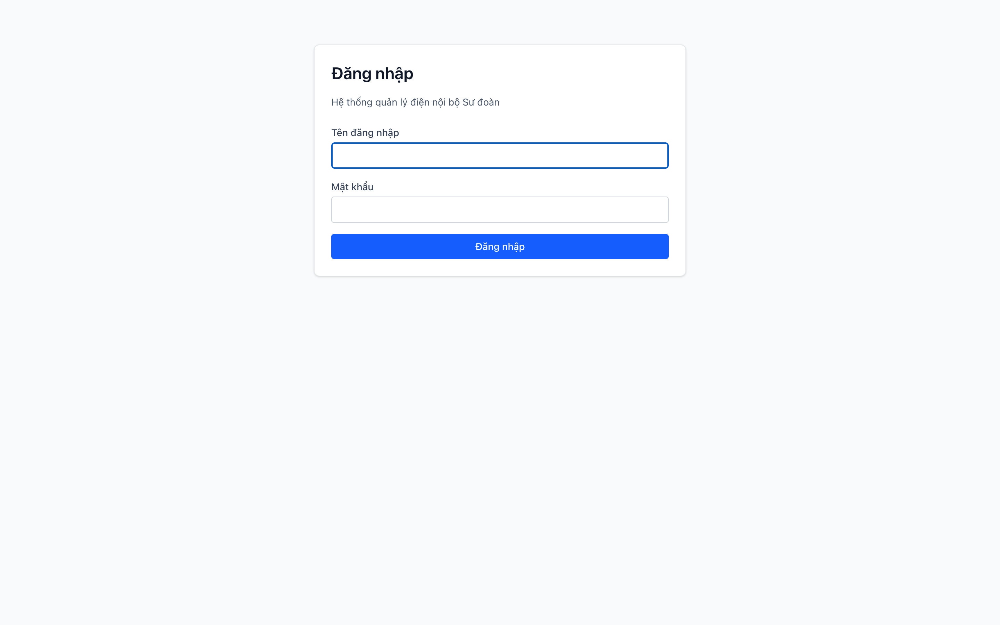

Hệ thống có sẵn 2 tài khoản mặc định:

| Tên đăng nhập | Mật khẩu mặc định | Vai trò |
|---|---|---|
| kyThuat | Abc@1234 | Kỹ thuật viên |
| quanTri | Abc@1234 | Quản trị viên hệ thống |

Lưu ý: hệ thống tự đăng xuất sau 2 giờ không hoạt động. 1 tài khoản có thể đăng nhập trên nhiều thiết bị cùng lúc. Khi đăng nhập, nếu có kỳ đang mở, hệ thống hiển thị thông báo "Kỳ tháng X đã mở, vui lòng nhập liệu".

### B2. Đổi mật khẩu lần đầu

Lần đầu đăng nhập, hệ thống bắt buộc đổi mật khẩu. Nhập mật khẩu mới theo yêu cầu: tối thiểu 8 ký tự, có ít nhất 1 chữ hoa, 1 chữ thường, 1 số, 1 ký tự đặc biệt (ví dụ: @, #, $, !). Sau khi đổi thành công, hệ thống chuyển về trang Tổng quan.

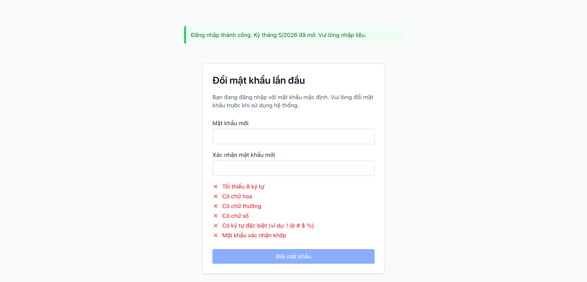

### B3. Tự đổi mật khẩu

Bấm tên tài khoản ở góc trên bên phải, chọn **Đổi mật khẩu**. Nhập mật khẩu hiện tại, nhập mật khẩu mới (theo yêu cầu như trên), bấm **Lưu**.

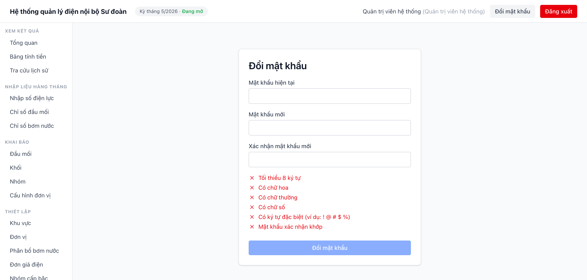
Nếu quên mật khẩu: liên hệ kỹ thuật viên hoặc quản trị viên hệ thống để được đặt lại mật khẩu. Hệ thống không có tính năng quên mật khẩu qua thư điện tử.

### B4. Giao diện chung

Giao diện gồm thanh điều hướng bên trái và vùng nội dung chính bên phải. Thanh điều hướng chia thành 5 nhóm theo tần suất sử dụng:

**Nhóm 1 — Xem kết quả** (xem hàng ngày):

| Mục | Chức năng |
|---|---|
| Tổng quan | Trang tổng hợp tình hình, là trang đầu tiên khi đăng nhập |
| Bảng tính tiền | Bảng chi tiết từng đầu mối, kết quả thừa/thiếu, thành tiền |
| Tra cứu lịch sử | Xem kỳ cũ, so sánh 2 kỳ |

**Nhóm 2 — Nhập liệu hàng tháng:**

| Mục | Chức năng |
|---|---|
| Nhập số điện lực | Nhập số sử dụng công tơ tổng (đơn vị quản lý khu vực hoặc quản trị viên hệ thống) |
| Chỉ số đầu mối | Nhập chỉ số cuối kỳ công tơ đầu mối sinh hoạt và công cộng |
| Chỉ số bơm nước | Nhập chỉ số cuối kỳ công tơ bơm nước (đơn vị quản lý khu vực hoặc quản trị viên hệ thống) |

**Nhóm 3 — Khai báo** (khi cần thêm/sửa/xóa):

| Mục | Chức năng |
|---|---|
| Đầu mối | Khai báo 4 loại đầu mối + công tơ + quân số |
| Khối | Quản lý khối (nhóm hiển thị lớn) |
| Nhóm | Quản lý nhóm (nhóm hiển thị nhỏ) |
| Cấu hình đơn vị | Tỷ lệ công cộng đơn vị, cột Khác từng đầu mối |

**Nhóm 4 — Thiết lập** (làm 1 lần hoặc khi thay đổi):

| Mục | Chức năng |
|---|---|
| Khu vực | Quản lý khu vực + công tơ tổng |
| Đơn vị | Quản lý đơn vị |
| Phân bổ bơm nước | Cấu hình phân bổ bơm nước mỗi khu vực |
| Đơn giá điện | Đơn giá theo kỳ + mở/đóng kỳ tính toán |
| Nhóm cấp bậc | Quản lý 7 nhóm cấp bậc + định mức |

**Nhóm 5 — Hệ thống:**

| Mục | Chức năng |
|---|---|
| Tài khoản | Quản lý tài khoản người dùng |
| Nhật ký hoạt động | Xem lịch sử thao tác trên hệ thống |
| Sao lưu dữ liệu | Tạo bản sao lưu |

Không phải vai trò nào cũng thấy tất cả các mục:

- **Quản trị viên hệ thống:** thấy tất cả 5 nhóm.
- **Quản trị viên đơn vị:** thấy nhóm Xem kết quả, Nhập liệu, Khai báo. Nếu là đơn vị quản lý khu vực: thêm 4 mục (Nhập số điện lực, Chỉ số bơm nước, Khu vực, Phân bổ bơm nước).
- **Chỉ huy đơn vị:** thấy cùng các mục với quản trị viên đơn vị cùng loại (đơn vị thường hoặc đơn vị quản lý khu vực), tất cả ở chế độ chỉ xem.
- **Kỹ thuật viên:** chỉ thấy nhóm Hệ thống.

Mọi trang danh sách đều có: tìm kiếm, sắp xếp theo cột, phân trang, chọn số dòng mỗi trang, hiển thị tổng số bản ghi, di chuột vào dòng nào thì dòng đó được tô sáng. Mọi số liệu hiển thị theo phân cách số tiếng Việt (dấu chấm hàng nghìn, dấu phẩy thập phân, ví dụ: 96.578,38).

**Khi gặp vấn đề:** Liên hệ kỹ thuật viên (vấn đề kỹ thuật, quên mật khẩu, sao lưu/phục hồi) hoặc quản trị viên hệ thống (vấn đề nghiệp vụ, cấu hình, mở/đóng kỳ).

### B5. Bắt đầu nhanh theo vai trò

Tùy vai trò, bạn chỉ cần đọc một số mục. Dưới đây là hướng dẫn nhanh cho từng vai trò.

**Nếu bạn là chỉ huy đơn vị:**

Bạn chỉ xem, không thao tác. Mọi ô nhập trên hệ thống đều bị khóa, các nút tạo/sửa/xóa/lưu bị ẩn. Bạn cần đọc:

- Mục B (đăng nhập, đổi mật khẩu).
- Mục E1 (tổng quan đơn vị mình — xem tình hình chung: ai thiếu, ai thừa, tổng tiền).
- Mục E2 (bảng tính tiền — xem chi tiết từng đầu mối trong đơn vị).
- Mục E3 (tra cứu lịch sử — so sánh tháng này với tháng trước).

Nếu đơn vị bạn là đơn vị quản lý khu vực, bạn thấy thêm một số trang về khu vực (nhập số điện lực, chỉ số bơm nước, khu vực, phân bổ bơm nước) — tất cả ở chế độ chỉ xem.

**Nếu bạn là quản trị viên đơn vị:**

Bạn quản lý đơn vị mình. Việc chính hàng tháng:

1. Nhập chỉ số công tơ cho đơn vị mình (mục D bước 2, chi tiết tại D1).
2. Cập nhật quân số nếu có thay đổi (mục F1).
3. Xem bảng tính tiền, đi thu tiền (mục E2).

Lần đầu tiên, đọc thêm mục C bước 9 (khai báo đầu mối, công tơ, khối, nhóm, cấu hình đơn vị). Nếu đơn vị bạn là đơn vị quản lý khu vực, đọc thêm mục C bước 8, D bước 3, D2, F4, F6.

**Nếu bạn là quản trị viên hệ thống:**

Bạn quản lý toàn hệ thống. Đọc toàn bộ tài liệu, đặc biệt:

- Mục C (thiết lập ban đầu — 9 bước).
- Mục D (quy trình hàng tháng — mở kỳ, đóng kỳ).
- Mục F7 (đơn giá điện, mở/đóng/mở lại kỳ).
- Mục G1 (tạo tài khoản cho mọi người).

**Nếu bạn là kỹ thuật viên:**

Bạn chỉ làm việc kỹ thuật, không xem dữ liệu nghiệp vụ. Đọc:

- Mục B (đăng nhập, đổi mật khẩu).
- Mục G1 (quản lý tài khoản — tạo, xóa, đặt lại mật khẩu).
- Mục G2 (nhật ký hoạt động).
- Mục G3 (sao lưu dữ liệu — tạo, xóa bản sao lưu, phục hồi qua dòng lệnh).

---

## C. Thiết lập ban đầu

Thiết lập ban đầu gồm 9 bước tuần tự, mỗi bước do vai trò tương ứng thực hiện. Lưu ý: mọi thay đổi dữ liệu nghiệp vụ (tạo khu vực, đơn vị, đầu mối, ...) đều cần có kỳ đang mở, nên phải mở kỳ đầu tiên sớm (bước 3).

**Bước 1 — Kỹ thuật viên: Cài đặt hệ thống.**
Hệ thống được cài đặt với 2 tài khoản mặc định (kỹ thuật viên và quản trị viên hệ thống) và 7 nhóm cấp bậc với giá trị mặc định.

**Bước 2 — Quản trị viên hệ thống: Đăng nhập, thiết lập cơ bản.**
Đăng nhập bằng tài khoản quanTri, đổi mật khẩu mặc định.

**Bước 3 — Quản trị viên hệ thống: Mở kỳ đầu tiên.**
Vào trang **Đơn giá điện**, nhập đơn giá điện, chọn tháng/năm, bấm **Mở kỳ mới**. Từ bước này trở đi mọi thay đổi dữ liệu nghiệp vụ đều cần kỳ đang mở.

**Bước 4 — Quản trị viên hệ thống: Tạo khu vực.**
Vào trang **Khu vực**, bấm **Tạo mới**. Nhập tên khu vực và tên công tơ tổng. Lặp lại cho tất cả khu vực cần thiết.

**Bước 5 — Quản trị viên hệ thống: Tạo đơn vị.**
Vào trang **Đơn vị**, bấm **Tạo mới**. Nhập tên đơn vị, chọn khu vực thuộc về (không đổi được sau khi tạo). Lặp lại cho tất cả đơn vị. Lưu ý: khi tạo đơn vị đầu tiên trong khu vực, hệ thống tự gán đơn vị đó làm đơn vị quản lý khu vực.

**Bước 6 — Quản trị viên hệ thống: Chỉ định đơn vị quản lý khu vực.**
Nếu cần đổi đơn vị quản lý khu vực (khác đơn vị được gán tự động ở bước 5): vào trang **Khu vực**, bấm sửa khu vực, chọn đơn vị quản lý mới từ ô chọn (chỉ hiện đơn vị thuộc khu vực đó).

**Bước 7 — Quản trị viên hệ thống: Tạo tài khoản.**
Vào trang **Tài khoản**, tạo tài khoản cho quản trị viên đơn vị và chỉ huy đơn vị. Mỗi tài khoản cần: tên đăng nhập, mật khẩu, tên hiển thị, vai trò, đơn vị (bắt buộc cho quản trị viên đơn vị và chỉ huy đơn vị).

**Bước 8 — Đơn vị quản lý khu vực: Khai báo phần khu vực.**
Quản trị viên đơn vị quản lý khu vực đăng nhập (đổi mật khẩu lần đầu), sau đó khai báo phần khu vực (quản trị viên hệ thống vẫn có thể thực hiện thay):

- Tạo đầu mối bơm nước (thuộc khu vực) + công tơ.
- Tạo đầu mối sinh hoạt thuộc khu vực (nếu có) + công tơ + quân số.
- Tạo đầu mối công cộng thuộc khu vực (nếu có) + công tơ.
- Tạo đầu mối ngoài biên chế (nếu có) + quân số.
- Vào trang **Phân bổ bơm nước**, cấu hình phân bổ cho từng đối tượng trong khu vực.

**Bước 9 — Quản trị viên đơn vị: Khai báo đơn vị.**
Mỗi quản trị viên đơn vị đăng nhập (đổi mật khẩu lần đầu), sau đó khai báo cho đơn vị mình:

- Vào trang **Đầu mối**, tạo đầu mối sinh hoạt: nhập tên, nhập quân số theo 7 nhóm cấp bậc (tổng quân số phải ≥ 1), thêm ít nhất 1 công tơ (tên, có thể đánh dấu "không tổn hao").
- Tạo đầu mối công cộng: nhập tên, thêm ít nhất 1 công tơ.
- Vào trang **Khối** và **Nhóm** nếu cần gộp đầu mối để hiển thị trên bảng tính tiền.
- Vào trang **Cấu hình đơn vị** để thiết lập tỷ lệ công cộng dùng chung đơn vị và giá trị cột Khác cho từng đầu mối.
- Nhập thủ công cả số đầu kỳ lẫn số cuối kỳ cho mọi công tơ (kỳ đầu tiên không có kỳ trước để kế thừa).

Ngoài ra, quản trị viên hệ thống có thể điều chỉnh cấu hình chung nếu cần (nhóm cấp bậc, tỷ lệ tiết kiệm, tỷ lệ công cộng Sư đoàn) trên trang **Đơn giá điện** và **Nhóm cấp bậc**.

---

## D. Thao tác hàng tháng

Sau khi thiết lập ban đầu, hàng tháng lặp lại 6 bước. Bước 2 và bước 3 có thể làm song song.

**Bước 1 — Quản trị viên hệ thống: Mở kỳ mới.**
Vào trang **Đơn giá điện**, bấm **Mở kỳ mới**. Hệ thống tự tính tháng/năm (kỳ trước + 1 tháng). Số đầu kỳ công tơ, quân số, cấu hình đơn vị, phân bổ bơm nước, v.v. được kế thừa tự động từ kỳ trước. Cập nhật đơn giá nếu có thay đổi.

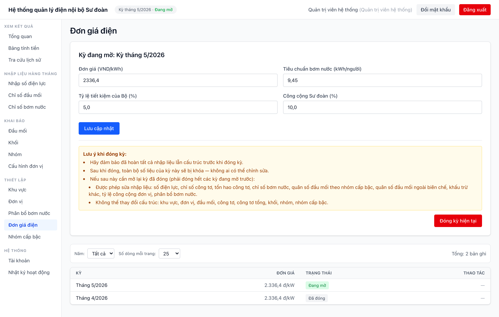

**Bước 2 — Quản trị viên đơn vị: Nhập liệu đơn vị.**

- Vào trang **Chỉ số đầu mối**. Trang hiển thị tất cả công tơ sinh hoạt và công cộng của đơn vị mình dưới dạng bảng. Số đầu kỳ đã có sẵn (kế thừa từ kỳ trước, có thể sửa nếu cần). Nhập số cuối kỳ cho từng công tơ. Bấm **Lưu** để lưu toàn bộ trang 1 lần.

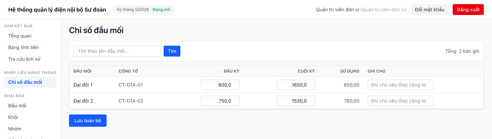
- Nếu quân số có thay đổi: vào trang **Đầu mối**, bấm sửa đầu mối sinh hoạt cần cập nhật, sửa quân số theo nhóm cấp bậc.
- Nếu cấu hình đơn vị cần cập nhật: vào trang **Cấu hình đơn vị**, sửa tỷ lệ hoặc giá trị cột Khác.

**Bước 3 — Đơn vị quản lý khu vực (hoặc quản trị viên hệ thống): Nhập liệu phần khu vực.**

- Vào trang **Nhập số điện lực**, nhập số sử dụng công tơ tổng.

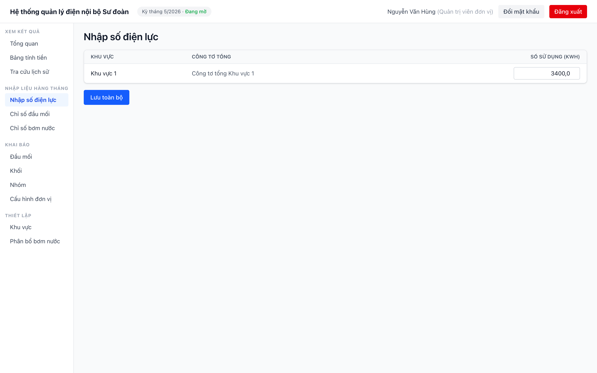

- Vào trang **Chỉ số bơm nước**, nhập số cuối kỳ công tơ bơm nước.

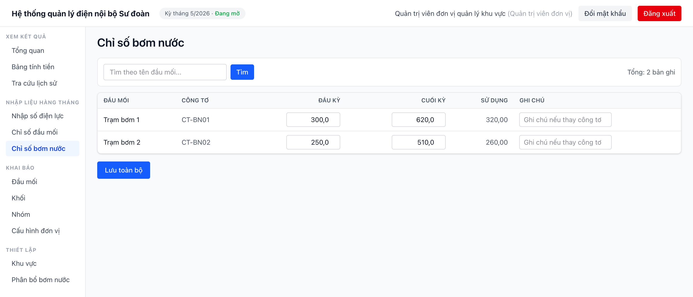

- Vào trang **Chỉ số đầu mối**, nhập số cuối kỳ công tơ đầu mối thuộc khu vực (nếu có).

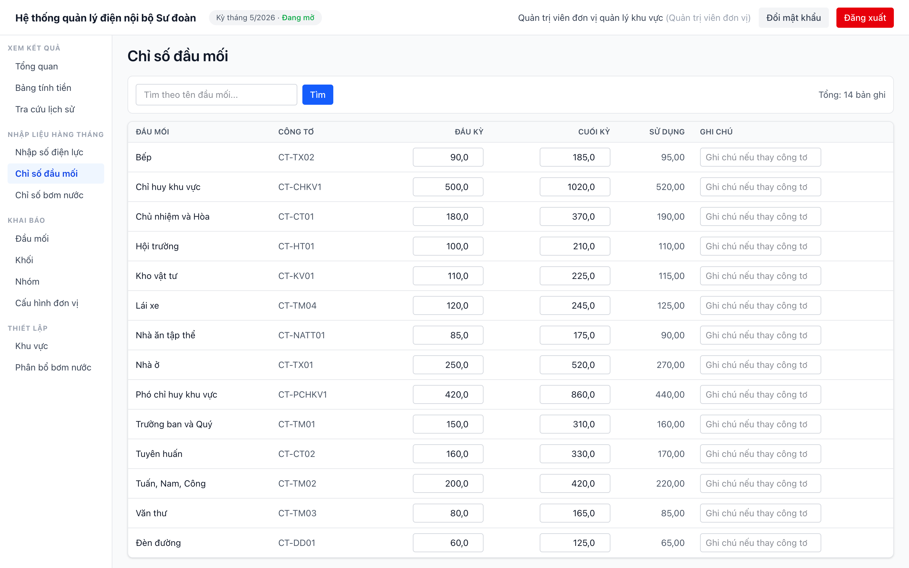

- Cập nhật quân số đầu mối thuộc khu vực nếu có thay đổi (xem mục F1).
- Cập nhật phân bổ bơm nước nếu cần (xem mục F6).
- Khai báo thêm đầu mối thuộc khu vực nếu cần (xem mục F1).

**Bước 4 — Hệ thống: Tính toán.**
Vào trang **Bảng tính tiền** hoặc **Tổng quan**. Lần đầu mở trang, hệ thống tự tính toán. Bấm nút **Tính toán lại** khi có thay đổi dữ liệu (sửa chỉ số, cập nhật quân số, thay đổi cấu hình). Nếu chưa có đủ dữ liệu, hệ thống vẫn tính với dữ liệu hiện có và hiển thị cảnh báo (đơn vị nào chưa nhập, khu vực nào thiếu công tơ tổng, trạm bơm chưa có số liệu). Kết quả chỉ chính xác khi tất cả đơn vị đã nhập xong.

**Bước 5 — Kiểm tra kết quả.**

- Quản trị viên đơn vị: xem bảng tính tiền đơn vị mình, đi thu tiền.
- Chỉ huy đơn vị: xem theo dõi.
- Quản trị viên hệ thống: xem bảng gộp tất cả đơn vị, tổng quan, so sánh kỳ.

**Bước 6 — Quản trị viên hệ thống: Đóng kỳ.**
Vào trang **Đơn giá điện**, bấm **Đóng kỳ hiện tại**. Sau khi đóng, không ai sửa được số liệu kỳ đó nữa.

### D1. Chi tiết trang Chỉ số đầu mối

Trang **Chỉ số đầu mối** dùng để nhập chỉ số công tơ đầu mối sinh hoạt và công cộng. Trang hiển thị dưới dạng bảng — mỗi dòng là 1 công tơ, mỗi cột là 1 ô nhập.


Quản trị viên hệ thống thấy thêm ô lọc khu vực/đơn vị và cột Khu vực, Đơn vị:


**Cách nhập:**

- **Số đầu kỳ:** Hệ thống tự điền sẵn từ số cuối kỳ tháng trước. Có thể sửa nếu cần (ví dụ: phát hiện sai sót tháng trước).
- **Số cuối kỳ:** Nhập số mới đọc được trên công tơ.
- **Sử dụng:** Hệ thống tự tính = cuối kỳ − đầu kỳ. Không cần nhập.
- Bấm **Lưu** để lưu toàn bộ trang 1 lần (không cần lưu từng dòng).

**Tìm kiếm:** Gõ tên đầu mối vào ô tìm kiếm để tìm nhanh.

**Ai thấy gì:**

| Vai trò | Thấy công tơ nào | Sửa được không |
|---|---|---|
| Quản trị viên hệ thống | Tất cả (có ô lọc khu vực và đơn vị, có cột Khu vực và Đơn vị) | Có |
| Quản trị viên đơn vị | Công tơ đơn vị mình | Có |
| Quản trị viên đơn vị quản lý khu vực | Công tơ đơn vị mình + đầu mối thuộc khu vực | Có |
| Chỉ huy đơn vị | Như quản trị viên đơn vị cùng loại | Không (chỉ xem) |
| Kỹ thuật viên | Không thấy trang này | — |

### D2. Chi tiết trang Chỉ số bơm nước

Trang **Chỉ số bơm nước** dùng để nhập chỉ số công tơ bơm nước (trạm bơm). Giao diện giống trang Chỉ số đầu mối — bảng, tìm kiếm, lưu toàn bộ 1 lần.


**Ai thấy gì:**

| Vai trò | Thấy công tơ nào | Sửa được không |
|---|---|---|
| Quản trị viên hệ thống | Tất cả (có ô lọc khu vực, có cột Khu vực) | Có |
| Quản trị viên đơn vị quản lý khu vực | Công tơ bơm nước khu vực mình | Có |
| Chỉ huy đơn vị quản lý khu vực | Công tơ bơm nước khu vực mình | Không (chỉ xem) |
| Quản trị viên đơn vị (không quản lý khu vực) | Không có công tơ bơm nước | — |
| Chỉ huy đơn vị (không quản lý khu vực) | Không có công tơ bơm nước | — |
| Kỹ thuật viên | Không thấy trang này | — |

---

## E. Xem kết quả

### E1. Tổng quan

Trang **Tổng quan** là trang đầu tiên khi đăng nhập, hiển thị khác nhau theo vai trò:

**Quản trị viên hệ thống** thấy tổng quan hệ thống: tổng thâm điện và thành tiền theo từng đơn vị (sắp xếp thâm điện từ nhiều đến ít), tổng sử dụng điện công cộng và điện bơm nước toàn khu vực, trạng thái nhập liệu từng đơn vị ("chưa nhập" hoặc "đã nhập"), cảnh báo dữ liệu thiếu và cảnh báo tổn hao bất thường.

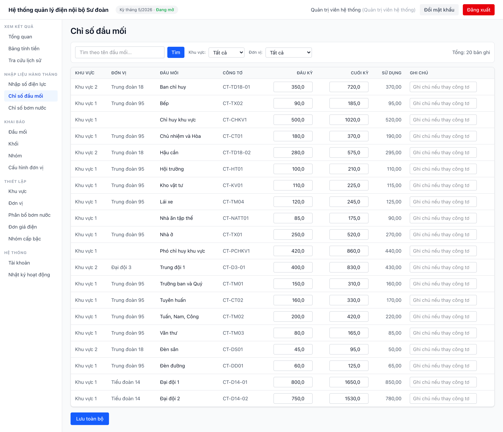

**Quản trị viên đơn vị** và **chỉ huy đơn vị** thấy tổng quan đơn vị mình: tổng thâm điện (kW) và tổng thành tiền, số đầu mối thiếu và thừa, trạng thái nhập liệu kỳ hiện tại, cảnh báo nếu có. Nếu là đơn vị quản lý khu vực, tổng quan bao gồm thêm thông tin khu vực.

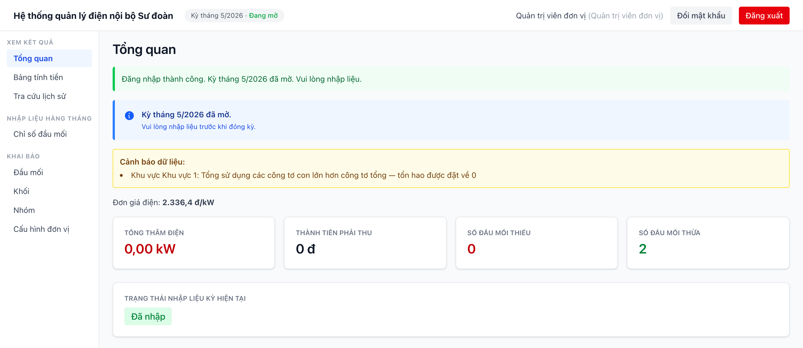

### E2. Bảng tính tiền

Trang **Bảng tính tiền** hiển thị bảng chi tiết từng đầu mối sinh hoạt. Đầu mối công cộng, bơm nước, ngoài biên chế không xuất hiện trên bảng — chúng chỉ tham gia tính toán (tổn hao, phân bổ bơm nước) rồi kết quả được phân bổ vào đầu mối sinh hoạt.

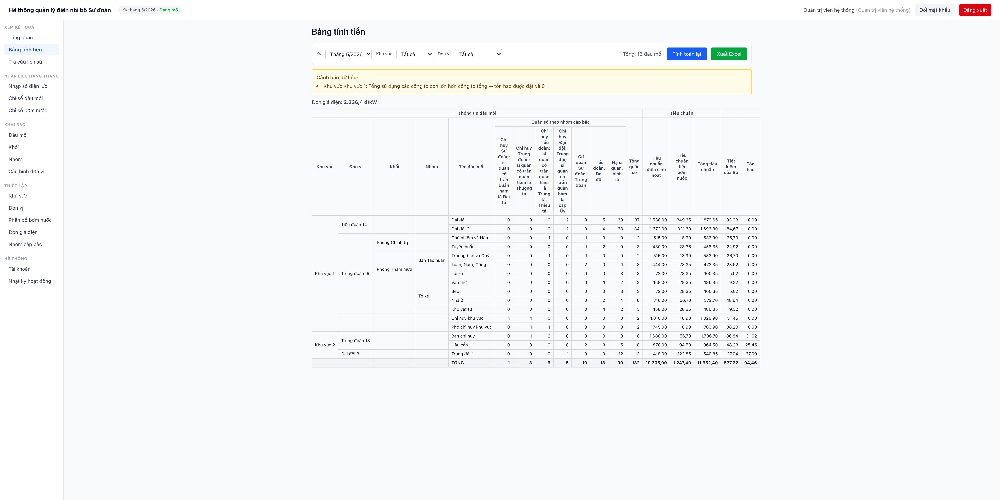

Chỉ huy đơn vị thấy bảng tính tiền ở chế độ chỉ xem (không có nút Tính toán lại):

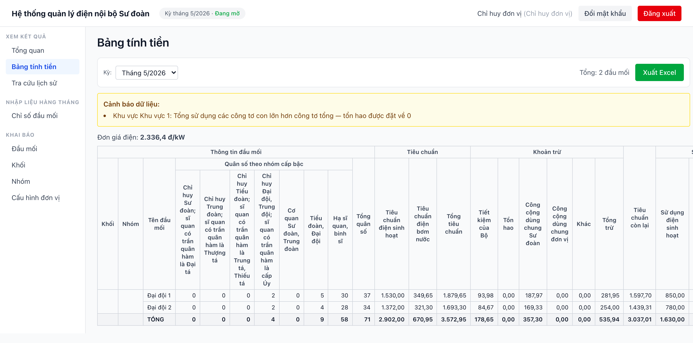

**Đơn giá** hiển thị phía trên bảng (cùng 1 giá trị cho tất cả dòng).

**28 cột** (khi xem 1 đơn vị):

| Nhóm cột | Các cột |
|---|---|
| Thông tin đầu mối | Khối, Nhóm, Tên đầu mối, 7 cột quân số theo nhóm cấp bậc, Tổng quân số |
| Tiêu chuẩn | Tiêu chuẩn điện sinh hoạt, Tiêu chuẩn điện bơm nước, Tổng tiêu chuẩn |
| Khoản trừ | Tiết kiệm của Bộ, Tổn hao, Công cộng dùng chung Sư đoàn, Công cộng dùng chung đơn vị, Khác, Tổng trừ |
| Tiêu chuẩn còn lại | (1 cột) |
| Sử dụng | Sử dụng điện sinh hoạt, Sử dụng điện bơm nước, Tổng sử dụng |
| Kết quả | Thừa (kW), Thiếu (kW), Thành tiền thừa, Thành tiền thiếu |

Khi xem gộp (tất cả khu vực hoặc nhiều đơn vị), bảng thêm 2 cột ở đầu: Khu vực và Đơn vị (thành 30 cột).

**Ô chọn lọc** phía trên bảng: chọn khu vực và đơn vị để lọc dữ liệu. Quản trị viên hệ thống chọn tự do. Quản trị viên đơn vị và chỉ huy đơn vị chỉ xem đơn vị mình (nếu là đơn vị quản lý khu vực thì thêm đầu mối sinh hoạt thuộc khu vực).

**Gộp dọc:** Các dòng cùng khu vực/đơn vị/khối/nhóm liên tiếp được gộp thành 1 ô kéo dài nhiều dòng. Ví dụ: 3 đầu mối cùng khối "Phòng Tham mưu" thì cột Khối chỉ hiện "Phòng Tham mưu" 1 lần, ô đó kéo dài 3 dòng.

**Hàng tổng:** Cuối bảng có 1 hàng tổng duy nhất. Muốn xem tổng riêng theo đơn vị thì dùng ô chọn lọc.

**Tìm kiếm:** Tìm theo tên đầu mối.

**Nút "Tính toán lại":** Bấm khi có thay đổi dữ liệu (sửa chỉ số, cập nhật quân số, thay đổi cấu hình). Hệ thống tính lại toàn bộ và cập nhật bảng. Nút này vẫn hoạt động khi xem kỳ đã đóng (tính toán lại dùng dữ liệu của kỳ đó, không dùng dữ liệu hiện tại).

**Cảnh báo:** Khi thiếu dữ liệu (đơn vị chưa nhập, khu vực thiếu công tơ tổng, trạm bơm chưa có số liệu), hệ thống hiển thị cảnh báo phía trên bảng.

**Kéo thay đổi độ rộng cột:** Người dùng có thể kéo thay đổi độ rộng từng cột.

### E3. Tra cứu lịch sử

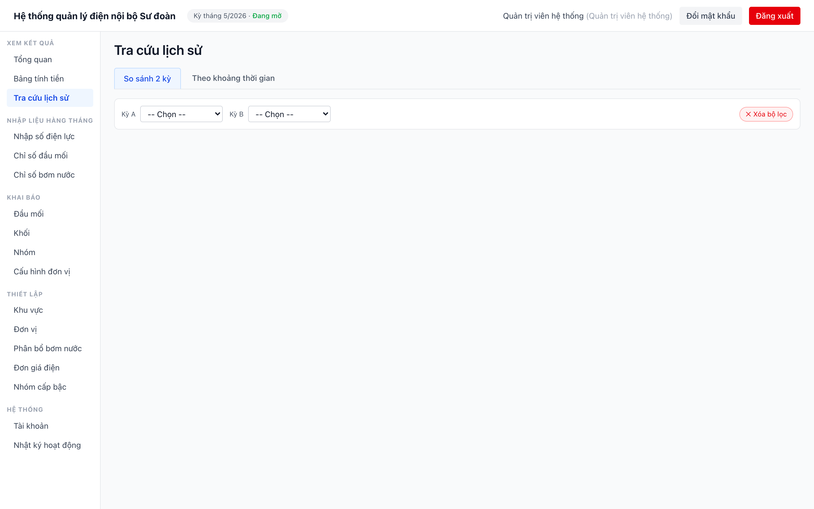

Trang **Tra cứu lịch sử** cho phép:

- **Xem kỳ cũ:** Chọn 1 kỳ bất kỳ để xem bảng tính tiền hoặc tổng quan của kỳ đó.
- **So sánh 2 kỳ:** Chọn kỳ A và kỳ B, hệ thống hiển thị cạnh nhau cùng đầu mối với 2 cột số liệu và cột chênh lệch. Nếu đầu mối chỉ có ở 1 kỳ (đã xóa hoặc mới tạo), dòng vẫn hiển thị với cột kỳ thiếu để trống, kèm ghi chú.
- **Xem theo khoảng thời gian:** Chọn tháng, quý, năm, hoặc tùy chọn ngày bắt đầu đến ngày kết thúc.

Quản trị viên đơn vị và chỉ huy đơn vị chỉ xem lịch sử đơn vị mình. Quản trị viên hệ thống xem tất cả.

### E4. Xuất Excel
Trên trang Bảng tính tiền, bấm nút **Xuất Excel**. File Excel tải về máy, nội dung giống hệt bảng trên hệ thống. File có đầy đủ công thức tính toán (không chỉ giá trị tĩnh) — ví dụ: ô tổng tiêu chuẩn chứa công thức = tiêu chuẩn điện sinh hoạt + tiêu chuẩn điện bơm nước. Người dùng có thể mở file Excel để xử lý thêm nếu cần.

---

## F. Khai báo và cấu hình

### F1. Đầu mối

Trang **Đầu mối** quản lý cả 4 loại đầu mối. Danh sách có lọc theo loại (sinh hoạt, công cộng, bơm nước, ngoài biên chế). Mặc định hiển thị tất cả.

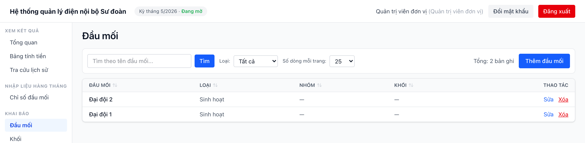

**Tạo đầu mối:**

Bấm **Tạo mới**, chọn loại đầu mối. Biểu mẫu hiển thị các trường phù hợp theo loại:

- **Sinh hoạt:** Tên, thuộc đơn vị hoặc khu vực, quân số theo 7 nhóm cấp bậc (tổng ≥ 1), ít nhất 1 công tơ (tên, tùy chọn đánh dấu "không tổn hao"), tùy chọn gán vào khối/nhóm.
- **Công cộng:** Tên, thuộc đơn vị hoặc khu vực, ít nhất 1 công tơ.
- **Bơm nước:** Tên, khu vực, ít nhất 1 công tơ.
- **Ngoài biên chế:** Tên, khu vực, quân số (≥ 1, 1 con số tổng).

Đầu mối sinh hoạt và công cộng có thể thuộc đơn vị hoặc khu vực. Quản trị viên hệ thống và quản trị viên đơn vị quản lý khu vực thấy ô chọn "Thuộc đơn vị" hoặc "Thuộc khu vực" trên biểu mẫu (xem hình dưới). Quản trị viên đơn vị (không quản lý khu vực) tạo đầu mối thì mặc định thuộc đơn vị mình, không cần chọn.

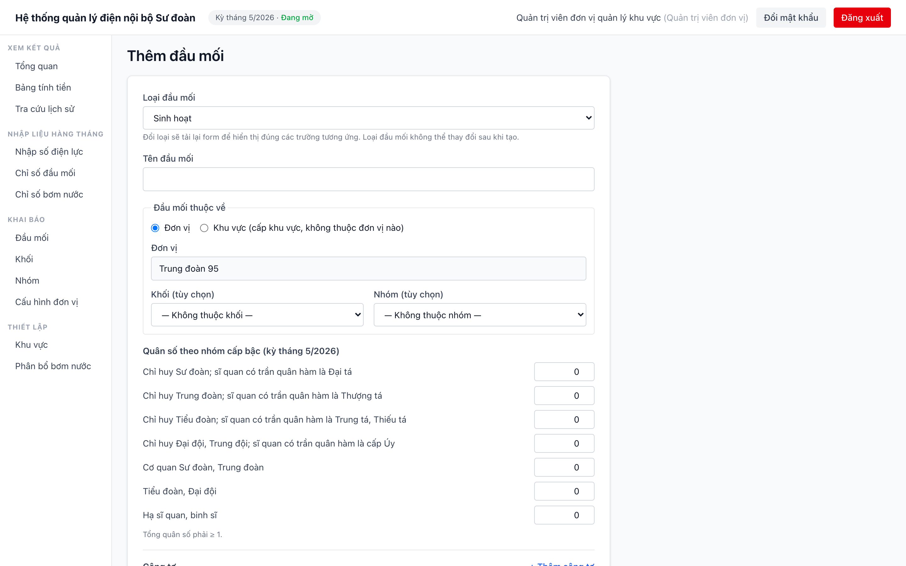

**Sửa đầu mối:**

Bấm vào tên đầu mối hoặc bấm **Sửa**. Có thể sửa tên, quân số, thêm/xóa công tơ, đổi khối/nhóm. Không thể đổi loại đầu mối (phải xóa rồi tạo lại).
**Lưu ý quan trọng:** Cập nhật quân số theo nhóm cấp bậc khi có thay đổi nhân sự. Quân số ảnh hưởng trực tiếp đến tiêu chuẩn điện và kết quả tính toán.

### F2. Khối và nhóm

Trang **Khối** và **Nhóm** quản lý cấu trúc hiển thị trên bảng tính tiền. Khối và nhóm chỉ áp dụng cho đầu mối sinh hoạt.

- **Khối:** Thuộc 1 đơn vị. Ví dụ: "Phòng Tham mưu", "Phòng Chính trị".
- **Nhóm:** Thuộc 1 khối (nhóm trong khối) hoặc thuộc đơn vị trực tiếp (nhóm không gộp vào khối). Ví dụ: "Ban Tác huấn".

Khối và nhóm không ảnh hưởng tính toán. Xóa khối hoặc nhóm không mất dữ liệu — đầu mối bên trong chuyển thành trực tiếp thuộc đơn vị.

### F3. Cấu hình đơn vị

Trang **Cấu hình đơn vị** cho phép thiết lập cấu hình công cộng và khoản trừ của đơn vị. Quản trị viên hệ thống sửa được mọi đơn vị. Quản trị viên đơn vị sửa đơn vị mình (nếu là đơn vị quản lý khu vực thì thêm cột Khác cho đầu mối sinh hoạt thuộc khu vực). Chỉ huy đơn vị xem ở chế độ chỉ đọc. Các thông tin thiết lập:

- **Tỷ lệ công cộng dùng chung đơn vị** (phần trăm, mặc định 0%): phần trăm tiêu chuẩn bị trừ cho điện công cộng dùng chung trong đơn vị.
- **Cột Khác** từng đầu mối sinh hoạt: giá trị bổ sung trừ hoặc cộng vào tiêu chuẩn. Có 2 dạng nhập:
  - **Số cụ thể:** Nhập trực tiếp giá trị kW. Cho phép âm (âm = cộng ngược vào tiêu chuẩn).
  - **Hệ số:** Nhập hệ số, hệ thống tự tính = hệ số × quân số đầu mối. Ví dụ: nhập hệ số 5, đầu mối có 10 người → khoản trừ = 5 × 10 = 50 kW.

Cấu hình đơn vị được kế thừa tự động khi mở kỳ mới. Chỉ cần sửa chỗ có thay đổi.

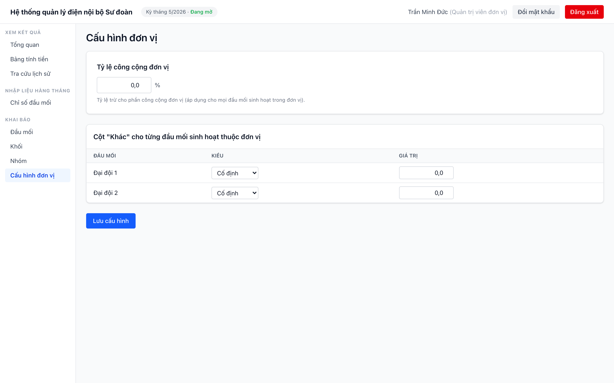

### F4. Khu vực

Trang **Khu vực** quản lý khu vực và công tơ tổng. Chỉ quản trị viên hệ thống được thao tác (tạo, sửa, xóa khu vực). Quản trị viên đơn vị quản lý khu vực và chỉ huy đơn vị quản lý khu vực có thể xem trang này ở chế độ chỉ đọc.

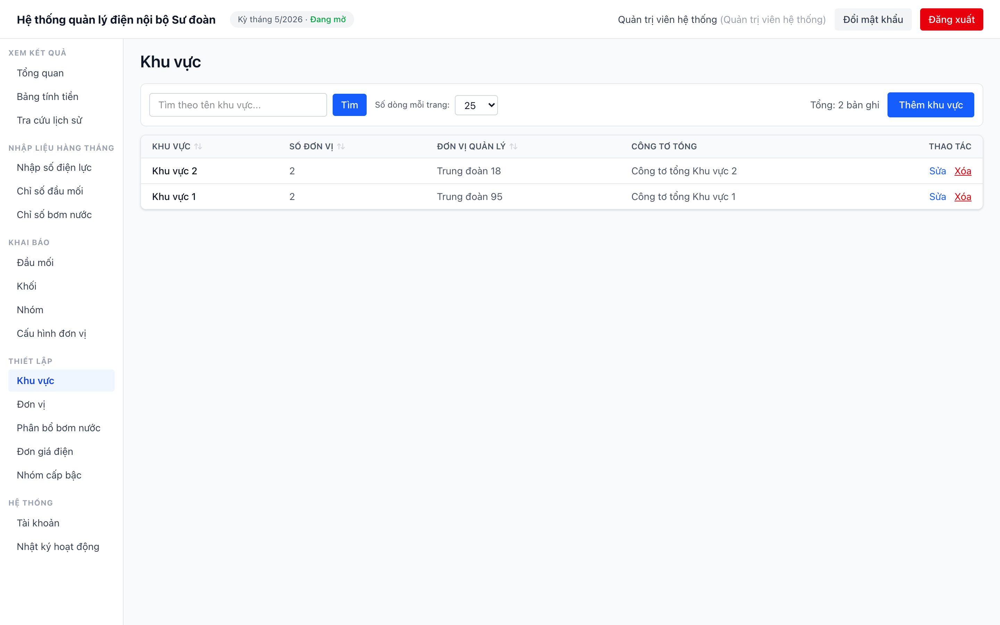

**Tạo khu vực:** Nhập tên khu vực + tên công tơ tổng. Khu vực mới chưa có đơn vị nào.
**Sửa khu vực:** Đổi tên, đổi đơn vị quản lý khu vực (ô chọn chỉ hiện đơn vị thuộc khu vực đó).
**Xóa khu vực:** Phải xóa hết đơn vị trong khu vực trước. Xóa khu vực là xóa mềm — dữ liệu kỳ cũ giữ nguyên.

### F5. Đơn vị

Trang **Đơn vị** (chỉ quản trị viên hệ thống) quản lý đơn vị.

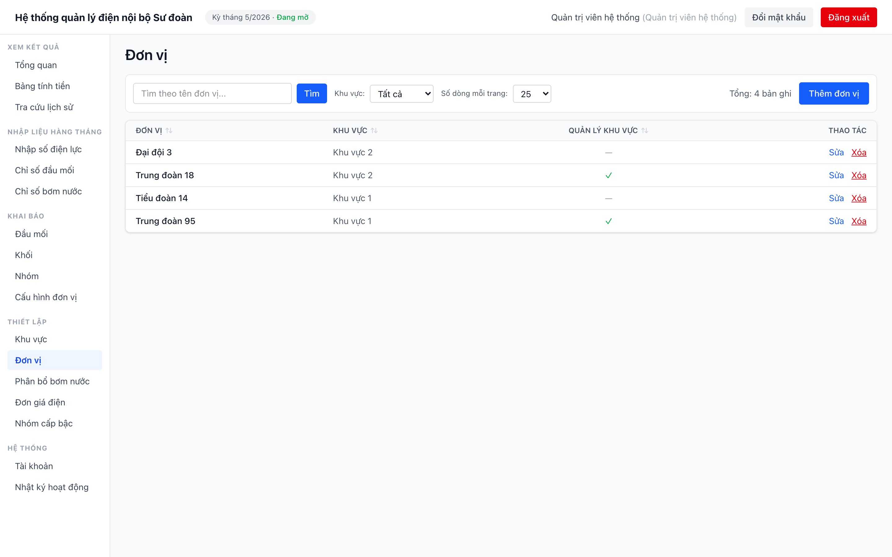

**Tạo đơn vị:** Nhập tên, chọn khu vực thuộc về. Lưu ý: không đổi được khu vực sau khi tạo.

**Xóa đơn vị:** Phải xóa hết đầu mối và tài khoản thuộc đơn vị trước. Nếu đơn vị là đơn vị quản lý khu vực, hệ thống hiển thị cảnh báo — nếu vẫn xóa, quản trị viên hệ thống tự quản lý khu vực cho đến khi chỉ định đơn vị khác.

### F6. Phân bổ bơm nước

Trang **Phân bổ bơm nước** cấu hình cách phân bổ điện bơm nước cho các đối tượng trong khu vực. Quản trị viên hệ thống thao tác trên tất cả khu vực. Quản trị viên đơn vị quản lý khu vực thao tác trên khu vực mình. Chỉ huy đơn vị quản lý khu vực xem ở chế độ chỉ đọc.

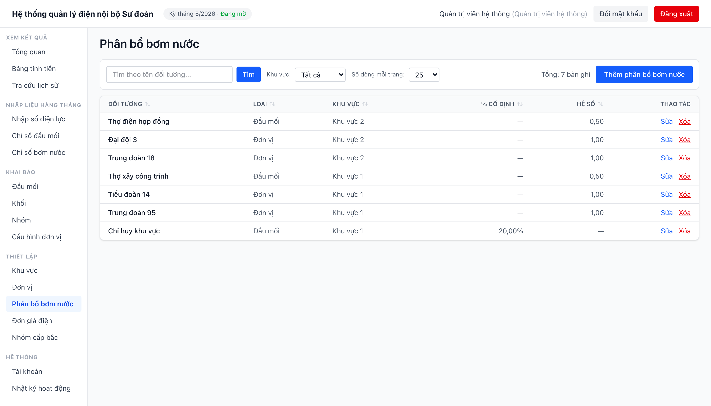

Mỗi đối tượng (đơn vị, đầu mối sinh hoạt thuộc khu vực, đầu mối ngoài biên chế) nhận phân bổ theo 1 trong 2 cách:

- **Phần trăm cố định:** Đối tượng nhận = tổng điện bơm nước × phần trăm. Tổng phần trăm cố định không được vượt 100%.
- **Hệ số nhân quân số:** Phần còn lại (sau khi trừ phần trăm cố định) chia theo trọng số = quân số × hệ số. Hệ số mặc định = 1.

Nếu tổng phần trăm cố định chưa đạt 100%, phải có ít nhất 1 đối tượng nhận theo hệ số.

**Ví dụ:** Tổng điện bơm nước toàn khu vực = 6.000 kW. Cấu hình: đầu mối "Chỉ huy" nhận 30% cố định, Đơn vị A (200 người, hệ số 1) và Đơn vị B (150 người, hệ số 1) nhận phần còn lại.

- Chỉ huy nhận: 6.000 × 30% = 1.800 kW
- Phần còn lại: 6.000 − 1.800 = 4.200 kW
- Đơn vị A nhận: 4.200 × 200 ÷ (200 + 150) = 2.400 kW
- Đơn vị B nhận: 4.200 × 150 ÷ (200 + 150) = 1.800 kW

Phân bổ bơm nước được kế thừa tự động khi mở kỳ mới.

### F7. Đơn giá điện và kỳ tính toán

Trang **Đơn giá điện** (chỉ quản trị viên hệ thống) quản lý đơn giá, cấu hình chung, và kỳ tính toán.


**Cấu hình kỳ đang mở** (phần trên trang):

Khi có kỳ đang mở, trang hiển thị 4 ô nhập có thể sửa được:

| Tham số | Mặc định | Ý nghĩa |
|---|---|---|
| Đơn giá (VND/kWh) | Bắt buộc nhập | Đơn giá điện cho kỳ hiện tại |
| Tiêu chuẩn bơm nước (kWh/người) | 9,45 | Tiêu chuẩn điện bơm nước mỗi người mỗi tháng |
| Tỷ lệ tiết kiệm của Bộ (%) | 5,0 | Phần trăm tiêu chuẩn bị trừ để tiết kiệm |
| Công cộng Sư đoàn (%) | 10,0 | Phần trăm tiêu chuẩn bị trừ cho điện công cộng chung Sư đoàn |

Sửa xong bấm **Lưu cập nhật**. Các giá trị này được kế thừa tự động khi mở kỳ mới — chỉ cần sửa chỗ có thay đổi.

**Quản lý kỳ tính toán** (phần dưới trang):

- **Mở kỳ mới:** Bấm **Mở kỳ mới**. Chỉ mở được khi không có kỳ nào đang mở. Hệ thống tự tính tháng/năm. Kỳ đầu tiên phải chọn tháng/năm. Đơn giá, quân số, cấu hình, phân bổ bơm nước, v.v. được kế thừa tự động. Lưu ý: mọi thay đổi dữ liệu nghiệp vụ (tạo khu vực, đơn vị, đầu mối, nhập liệu) đều cần có kỳ đang mở — khi không có kỳ mở, hệ thống chỉ cho xem dữ liệu.
- **Đóng kỳ:** Bấm **Đóng kỳ hiện tại** (nút đỏ). Sau khi đóng, không ai sửa được số liệu kỳ đó.
- **Mở lại kỳ cũ:** Khi phát hiện sai sót nhập liệu ở kỳ đã đóng, quản trị viên hệ thống có thể mở lại kỳ cũ. Nếu đang có kỳ mở, phải đóng kỳ đó trước. Khi đóng kỳ cũ sau khi sửa, nếu số cuối kỳ khác số đầu kỳ của kỳ kế tiếp, hệ thống hiển thị cảnh báo (chỉ cảnh báo, không tự sửa — đúng nguyên tắc kỳ này không ảnh hưởng kỳ khác).
- **Hạn chế khi mở kỳ cũ:** Khi kỳ đang mở không phải kỳ mới nhất, hệ thống chỉ cho phép sửa số liệu (chỉ số công tơ, quân số, cấu hình). Không cho phép thay đổi cấu trúc (tạo/xóa/sửa khu vực, đơn vị, đầu mối, công tơ, khối, nhóm, nhóm cấp bậc).

**Danh sách các kỳ** hiển thị phía dưới: tên kỳ, đơn giá, trạng thái (đang mở / đã đóng), và thao tác (mở lại kỳ cũ).

### F8. Nhóm cấp bậc

Trang **Nhóm cấp bậc** (chỉ quản trị viên hệ thống) quản lý các nhóm cấp bậc và định mức tương ứng.

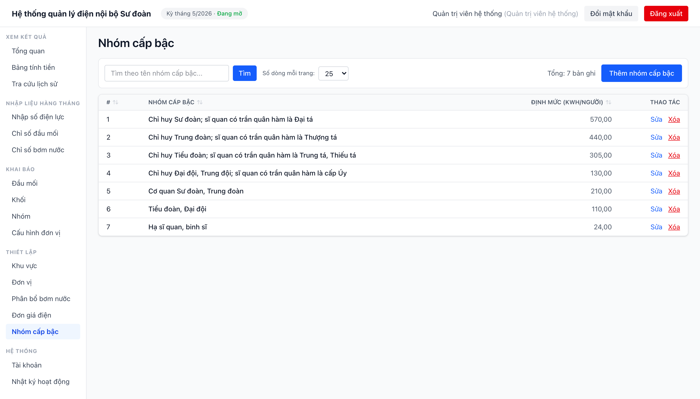

Hệ thống mặc định có 7 nhóm cấp bậc:

| Nhóm cấp bậc | Định mức mặc định |
|---|---|
| Chỉ huy Sư đoàn; sĩ quan có trần quân hàm là Đại tá | 570 kW/người/tháng |
| Chỉ huy Trung đoàn; sĩ quan có trần quân hàm là Thượng tá | 440 kW/người/tháng |
| Chỉ huy Tiểu đoàn; sĩ quan có trần quân hàm là Trung tá, Thiếu tá | 305 kW/người/tháng |
| Chỉ huy Đại đội, Trung đội; sĩ quan có trần quân hàm là cấp Úy | 130 kW/người/tháng |
| Cơ quan Sư đoàn, Trung đoàn | 210 kW/người/tháng |
| Tiểu đoàn, Đại đội | 110 kW/người/tháng |
| Hạ sĩ quan, binh sĩ | 24 kW/người/tháng |

Có thể thêm/sửa/xóa nhóm cấp bậc. Xóa nhóm cấp bậc chỉ được phép khi không có đầu mối nào đang sử dụng (phải chuyển hết quân số sang nhóm khác trước).

---

## G. Quản trị hệ thống

### G1. Quản lý tài khoản

Trang **Tài khoản** quản lý người dùng hệ thống.

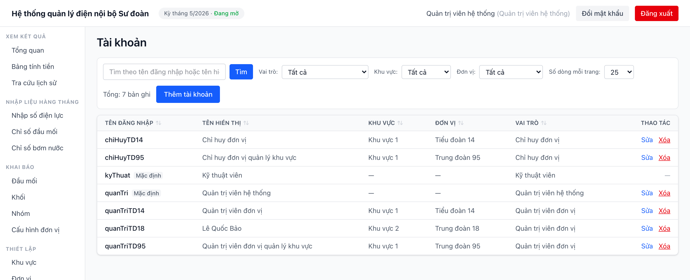

- **Kỹ thuật viên** quản lý tài khoản mọi vai trò.
- **Quản trị viên hệ thống** quản lý tài khoản quản trị viên hệ thống, quản trị viên đơn vị, và chỉ huy đơn vị (không quản lý tài khoản kỹ thuật viên).

**Tạo tài khoản:** Nhập tên đăng nhập, mật khẩu, tên hiển thị, vai trò. Nếu vai trò là quản trị viên đơn vị hoặc chỉ huy đơn vị: bắt buộc chọn đơn vị.

**Xóa tài khoản:** Không cho phép xóa 2 tài khoản mặc định (kyThuat và quanTri) và không cho phép tự xóa chính mình.
**Đặt lại mật khẩu:** Khi đặt lại mật khẩu cho người dùng khác, người đó phải đổi mật khẩu lần tiếp theo đăng nhập.

### G2. Nhật ký hoạt động

Trang **Nhật ký hoạt động** (quản trị viên hệ thống và kỹ thuật viên) hiển thị lịch sử mọi thao tác trên hệ thống: ai thay đổi, thay đổi gì, lúc nào. Có thể lọc theo loại thao tác (tạo/sửa/xóa), đối tượng, người thao tác, và khoảng thời gian.

### G3. Sao lưu dữ liệu
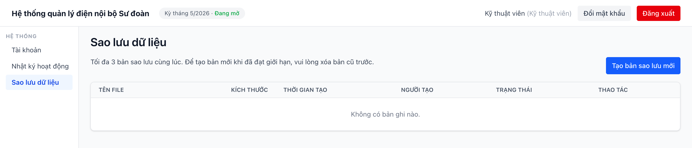

Trang **Sao lưu dữ liệu** (chỉ kỹ thuật viên) cho phép:

- **Tạo bản sao lưu:** Sao lưu toàn bộ dữ liệu hệ thống. Tối đa lưu 3 bản — phải xóa bản cũ trước khi tạo bản mới.
- **Xóa bản sao lưu:** Xóa bản sao lưu không cần thiết.

**Phục hồi dữ liệu** thực hiện qua dòng lệnh trên máy chủ (không qua giao diện) vì phục hồi ghi đè toàn bộ dữ liệu hiện tại — quá rủi ro để đặt nút trên giao diện.

Khi cần phục hồi, kỹ thuật viên đăng nhập vào máy chủ và chạy lệnh (thay tên file bản sao lưu vào chỗ ngoặc vuông):

```
docker compose exec app bin/rails "backups:restore[tên_file_bản_sao_lưu.dump]"
```

Ví dụ: nếu bản sao lưu tên `backup_20260525_143000.dump`, chạy:

```
docker compose exec app bin/rails "backups:restore[backup_20260525_143000.dump]"
```

Hệ thống hiện thông tin bản sao lưu (tên, kích thước, ngày tạo, người tạo) và yêu cầu gõ `YES` (chữ hoa) để xác nhận. Gõ khác thì hủy.

**Lưu ý:** phục hồi sẽ ghi đè toàn bộ dữ liệu hiện tại — không thể hoàn tác. Nên tạo 1 bản sao lưu mới trước khi phục hồi để phòng trường hợp cần quay lại. Tên file bản sao lưu xem trên trang Sao lưu dữ liệu trong hệ thống.

---

## H. Tham khảo

### H1. Thuật ngữ

| Thuật ngữ | Giải thích |
|---|---|
| Kỳ tính toán | Tháng tính tiền điện. Chỉ 1 kỳ được mở tại 1 thời điểm |
| Khu vực | Vùng vật lý chia sẻ hạ tầng điện, có 1 công tơ tổng |
| Đơn vị | Đơn vị trực thuộc Sư đoàn, thuộc 1 khu vực |
| Đơn vị quản lý khu vực | 1 đơn vị trong khu vực được ủy quyền khai báo và nhập liệu phần chia sẻ |
| Đầu mối | Đơn vị nhỏ nhất (người/nhóm người), có 4 loại |
| Công tơ | Thiết bị đo điện gắn với đầu mối |
| Công tơ tổng | Đo tổng điện lực cấp cho khu vực, chỉ nhập số sử dụng |
| Không tổn hao | Công tơ đặt tại vị trí không có tổn hao đường dây |
| Tổn hao | Điện "mất" trên đường truyền, phân bổ cho từng công tơ |
| Tiêu chuẩn | Lượng điện được hưởng theo cấp bậc và quân số |
| Khoản trừ | Các khoản trừ khỏi tiêu chuẩn (tiết kiệm, tổn hao, công cộng, khác) |
| Tiêu chuẩn còn lại | Tiêu chuẩn − tổng khoản trừ |
| Thâm điện | Tổng sử dụng − tiêu chuẩn còn lại |
| Thừa | Sử dụng ít hơn tiêu chuẩn còn lại (tham khảo, không phải trả tiền) |
| Thiếu | Sử dụng vượt tiêu chuẩn còn lại (phải trả tiền) |
| Khối | Nhóm hiển thị lớn trên bảng tính tiền (ví dụ: "Phòng Tham mưu") |
| Nhóm | Nhóm hiển thị nhỏ trên bảng tính tiền (ví dụ: "Ban Tác huấn") |
| Nhóm cấp bậc | 7 nhóm phân loại quân nhân theo cấp bậc, mỗi nhóm có định mức điện riêng |
| Phân bổ bơm nước | Cách chia điện bơm nước cho các đối tượng (theo % cố định hoặc hệ số × quân số) |

### H2. Quy tắc xóa dữ liệu

| Thao tác | Cho phép | Ghi chú |
|---|---|---|
| Xóa công tơ cuối cùng của đầu mối | Không | Đầu mối (trừ ngoài biên chế) luôn phải có ít nhất 1 công tơ |
| Xóa đơn vị đang có đầu mối | Không | Phải xóa hết đầu mối trước |
| Xóa đơn vị đang có tài khoản | Không | Phải xóa hết tài khoản thuộc đơn vị trước |
| Xóa khu vực đang có đơn vị | Không | Phải xóa hết đơn vị trước |
| Xóa đơn vị quản lý khu vực | Có (cảnh báo) | Quản trị viên hệ thống tự quản lý khu vực cho đến khi chỉ định đơn vị khác |
| Xóa khối đang có nhóm/đầu mối | Có | Nhóm/đầu mối chuyển thành trực tiếp thuộc đơn vị |
| Xóa nhóm đang có đầu mối | Có | Đầu mối chuyển lên cấp trên (khối hoặc đơn vị) |
| Xóa đầu mối/công tơ có dữ liệu kỳ cũ | Có | Dữ liệu kỳ cũ giữ nguyên |
| Xóa nhóm cấp bậc đang có đầu mối sử dụng | Không | Phải chuyển hết quân số sang nhóm khác trước |
| Xóa tài khoản | Có | Trừ 2 tài khoản mặc định. Không cho tự xóa chính mình. Phiên đăng nhập của tài khoản bị xóa tự hết hạn sau 2 giờ |

### H3. Quy tắc sửa dữ liệu

| Thao tác | Cho phép | Ghi chú |
|---|---|---|
| Sửa tên (khu vực, đơn vị, đầu mối, công tơ, khối, nhóm) | Có | Tên chỉ là nhãn hiển thị |
| Sửa loại đầu mối (ví dụ sinh hoạt → công cộng) | Không | Xóa tạo lại |
| Sửa thuộc tính "không tổn hao" của công tơ | Có | Chỉ ảnh hưởng kỳ đang mở |
| Đổi đơn vị quản lý khu vực | Có | Đơn vị mới phải thuộc cùng khu vực |
| Di chuyển đầu mối giữa khối/nhóm | Có | Chỉ thay đổi hiển thị |
| Chuyển đơn vị sang khu vực khác | Không | — |

### H4. Trường hợp đặc biệt

**Công tơ cuối kỳ nhỏ hơn đầu kỳ:** Xảy ra khi công tơ bị thay mới hoặc đặt lại về 0. Hệ thống cho phép nhập thủ công số sử dụng thay vì tính tự động (cuối kỳ − đầu kỳ).

**Tổn hao âm:** Tổng công tơ con lớn hơn công tơ tổng. Hệ thống tự xử lý tổn hao về 0 và hiển thị cảnh báo.

**Tiêu chuẩn còn lại ra âm:** Khi tổng khoản trừ lớn hơn tiêu chuẩn. Hệ thống vẫn tính bình thường — đầu mối chắc chắn thiếu.

**Cột "Khác" giá trị âm:** Cho phép. Âm nghĩa là cộng ngược vào tiêu chuẩn (ví dụ: đầu mối nhận thêm từ đầu mối khác).

**Khu vực không có trạm bơm:** Bơm nước = 0, bỏ qua phân bổ.

**2 người nhập liệu cùng lúc:** Người lưu trước thành công. Người lưu sau nhận cảnh báo "dữ liệu đã bị thay đổi bởi người khác", hệ thống hiển thị dữ liệu mới nhất để xem lại rồi quyết định.

### H5. Quy tắc hiển thị số

- Không làm tròn trong quá trình tính toán.
- Chỉ làm tròn khi hiển thị và xuất Excel: 2 chữ số thập phân cho kW, 0 chữ số thập phân cho tiền (đồng).
- Phân cách số tiếng Việt: dấu chấm hàng nghìn, dấu phẩy thập phân. Ví dụ: 96.578,38 kW; 96.578 đồng.
- Đơn giá điện hiển thị đầy đủ không làm tròn, không cắt thập phân (ví dụ: 2.336,4 đồng/kW).

---

## Lịch sử thay đổi

### v1.6.0 (25/05/2026)

- Viết lại cách chèn ảnh: giảm từ 73 xuống 22 ảnh, mỗi ảnh phục vụ 1 mục đích cụ thể.
- Đổi tên hiển thị tài khoản mẫu để phân biệt vai trò trên header ảnh: "Quản trị viên đơn vị quản lý khu vực", "Quản trị viên đơn vị", "Chỉ huy đơn vị quản lý khu vực", "Chỉ huy đơn vị".
- Mỗi ảnh match đúng vai trò đang được nói đến trong text (UA cho trang nhập liệu, UA-ZM cho trang khu vực, SA cho trang chỉ SA thao tác, CMD cho chế độ chỉ xem).
- Bổ sung ảnh đổi mật khẩu lần đầu (B2) — trước đó thiếu dù đã được nhắc.

### v1.5.0 (25/05/2026)

- Chụp bổ sung 25 ảnh (49-73), tổng 73 ảnh, đủ mọi vai trò × mọi trang.
- Chèn toàn bộ 73 ảnh vào văn bản. Mỗi trang có ảnh cho mọi vai trò được phép truy cập.
- Bổ sung ảnh chức năng đặc biệt: đổi mật khẩu (B3), tra cứu lịch sử so sánh 2 kỳ (E3), nút xuất Excel (E4), form tạo đầu mối khi đăng nhập quản trị viên đơn vị quản lý khu vực (F1 — có ô chọn Đơn vị/Khu vực).
- Bổ sung ảnh thiếu cho chỉ huy đơn vị quản lý khu vực (8 trang), chỉ huy đơn vị (6 trang), quản trị viên đơn vị (4 trang), quản trị viên đơn vị quản lý khu vực (3 trang).

### v1.4.0 (25/05/2026)

- Thêm 48 ảnh chụp màn hình từ ứng dụng thật (đủ 6 vai trò, tất cả trang) vào thư mục `docs/images/`.
- Chèn toàn bộ 48 ảnh vào các mục tương ứng. Mỗi trang có ảnh theo từng vai trò để người đọc thấy sự khác biệt giữa các vai trò (ô lọc, cột hiển thị, ô nhập bị vô hiệu hóa, nút bị ẩn).

### v1.3.0 (25/05/2026)

- Thêm mục B5 "Bắt đầu nhanh theo vai trò": hướng dẫn riêng cho từng vai trò (chỉ huy đơn vị, quản trị viên đơn vị, quản trị viên hệ thống, kỹ thuật viên) — đọc mục nào, bỏ qua mục nào, quy trình hàng tháng.
- Thêm mục D1 "Chi tiết trang Chỉ số đầu mối": cách nhập, tìm kiếm, bảng quyền theo vai trò (ai thấy gì, sửa được không).
- Thêm mục D2 "Chi tiết trang Chỉ số bơm nước": tương tự D1, bảng quyền theo vai trò.
- Mục G3: bổ sung lệnh phục hồi cụ thể trên máy chủ (kèm ví dụ), mô tả quy trình xác nhận, lưu ý nên tạo bản sao lưu mới trước khi phục hồi.

### v1.2.0 (25/05/2026)

- Mục A5: thêm ví dụ tính toán hoàn chỉnh (tiêu chuẩn → khoản trừ → sử dụng → thâm điện → thành tiền). Giải thích "sử dụng thô" trong bước 2.
- Mục B2: thêm ví dụ ký tự đặc biệt (@, #, $, !).
- Mục B4: thêm ghi chú liên hệ hỗ trợ khi gặp vấn đề.
- Mục E2: thêm mô tả trực quan cho gộp dọc.
- Mục F3: thêm ví dụ cho cột Khác dạng hệ số.
- Mục F6: thêm ví dụ phân bổ bơm nước (phần trăm cố định kết hợp hệ số nhân quân số).

### v1.1.0 (25/05/2026)

- Mục A2: sửa mô tả đơn vị quản lý khu vực — "khai báo và nhập liệu" thay vì chỉ "nhập liệu".
- Mục A5: sửa attribution phân bổ bơm nước — thêm đơn vị quản lý khu vực.
- Mục A6: bổ sung chi tiết quyền khai báo của đơn vị quản lý khu vực (không chỉ nhập liệu). Bổ sung mô tả chỉ huy đơn vị thấy cùng trang với quản trị viên đơn vị (chế độ chỉ đọc).
- Mục B1: bổ sung thông báo khi đăng nhập có kỳ đang mở.
- Mục B4: cập nhật mô tả sidebar theo vai trò — chỉ huy đơn vị thấy cùng các mục với quản trị viên đơn vị.
- Mục B4: sửa bảng Nhóm 5 — bỏ "phục hồi" khỏi mô tả chức năng sao lưu.
- Mục C: viết lại luồng thiết lập ban đầu — mở kỳ đầu tiên ở bước 3 (trước khi tạo cấu trúc), đơn vị quản lý khu vực khai báo phần khu vực ở bước 8. Tách ghi chú cấu hình chung ra khỏi bước 9.
- Mục D: bổ sung số đầu kỳ có thể sửa được, bổ sung thao tác khu vực (cập nhật quân số, phân bổ bơm nước, khai báo thêm đầu mối).
- Mục E2: bổ sung tìm kiếm trên bảng tính tiền, ghi rõ nút tính toán lại vẫn hoạt động khi kỳ đã đóng.
- Mục E1: bổ sung tổng quan bao gồm thông tin khu vực cho đơn vị quản lý khu vực.
- Mục F1: bổ sung ô chọn "Thuộc đơn vị/Thuộc khu vực" cho quản trị viên hệ thống và quản trị viên đơn vị quản lý khu vực.
- Mục F3: bổ sung quyền theo vai trò — quản trị viên hệ thống sửa mọi đơn vị, chỉ huy đơn vị xem chỉ đọc, đơn vị quản lý khu vực thấy thêm cột Khác đầu mối khu vực.
- Mục F4: ghi rõ quản trị viên đơn vị quản lý khu vực và chỉ huy đơn vị quản lý khu vực xem trang này ở chế độ chỉ đọc.
- Mục F6: cập nhật quyền — quản trị viên đơn vị quản lý khu vực thao tác trên khu vực mình, chỉ huy đơn vị quản lý khu vực xem chỉ đọc.
- Mục F7: ghi rõ mọi thay đổi dữ liệu nghiệp vụ cần có kỳ đang mở.
- Mục G1: bỏ mô tả buộc thoát ngay khi xóa tài khoản (không cần thiết, session tự hết hạn sau 2 giờ).
- Mục G3: sửa sao lưu — phục hồi thực hiện qua dòng lệnh trên máy chủ, không qua giao diện.
- Mục H1: sửa thuật ngữ đơn vị quản lý khu vực — thêm "khai báo".
- Mục H2: cập nhật ghi chú xóa tài khoản.
- Mục H5: bổ sung quy tắc hiển thị đơn giá điện không làm tròn.

### v1.0.0 (20/05/2026)

- Tài liệu ban đầu.
