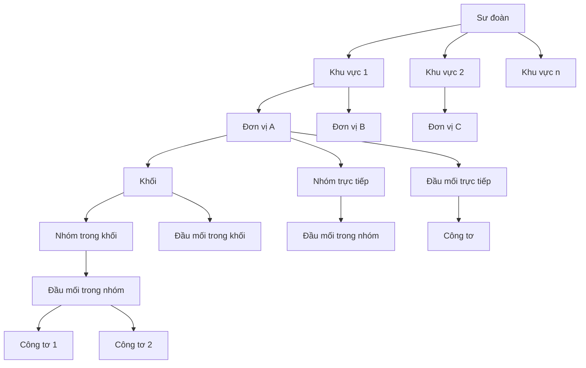
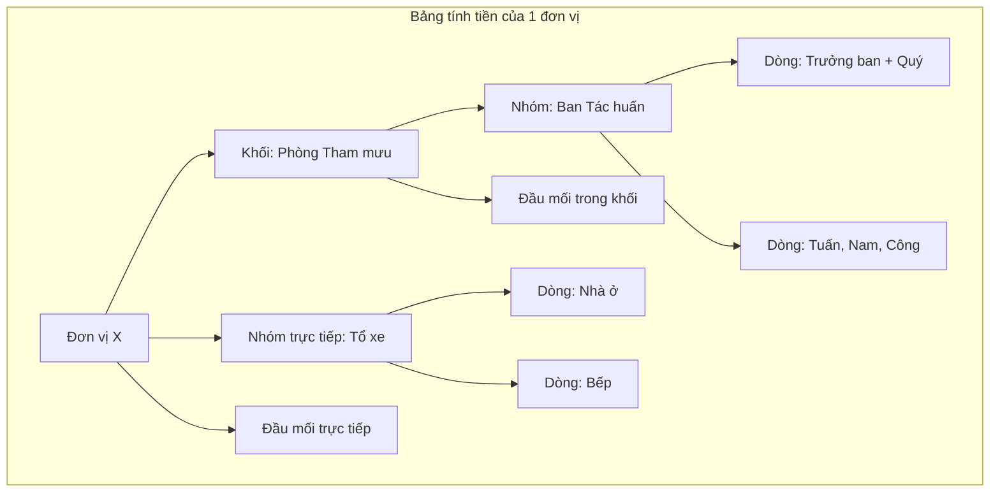
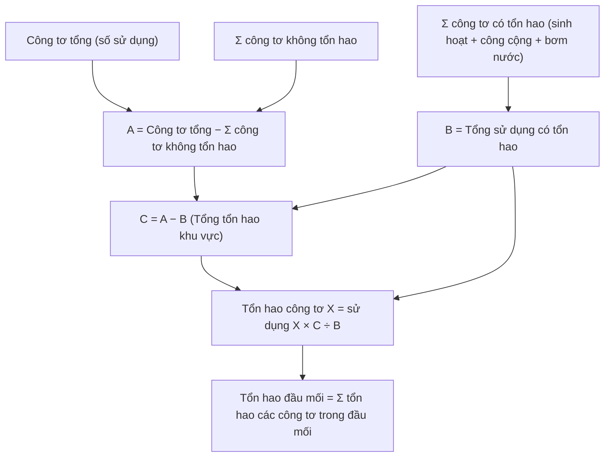
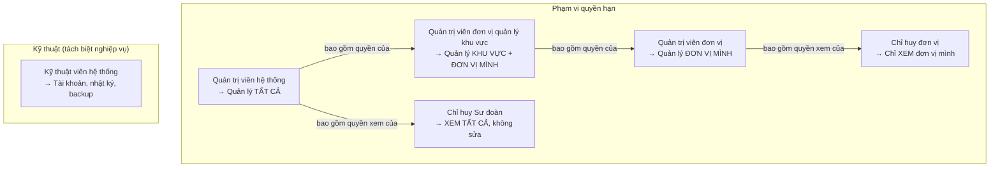
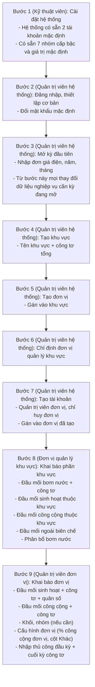
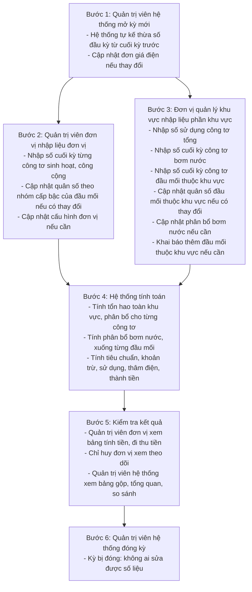

# Xác nhận nghiệp vụ — Hệ thống quản lý điện nước nội bộ (Hệ thống v2)

> **Phiên bản:** 2.19.1
> **Ngày:** 24/06/2026
> **Tính chất:** Tài liệu nội bộ giữa chủ dự án và đội phát triển. Là nguồn sự thật duy nhất cho thiết kế và triển khai.
> **Ngôn ngữ hệ thống:** Toàn bộ hệ thống phải được Việt hóa 100% (giao diện, thông báo, cảnh báo, xuất file) vì hệ thống dùng trong Sư đoàn Quân đội nhân dân Việt Nam.

### Nguyên tắc viết

Tuyệt đối không viết tắt, không rút gọn — áp dụng mọi nơi: tài liệu, code (tên biến, method, cột, i18n, commit message), giao diện, giao tiếp. Ngoại trừ thuật ngữ phổ biến ai cũng hiểu ngay: CRUD, UI.

---

## Mục lục

1. [Tổng quan hệ thống](#1-tổng-quan-hệ-thống)
2. [Cấu trúc tổ chức](#2-cấu-trúc-tổ-chức)
3. [Khu vực](#3-khu-vực)
4. [Đầu mối](#4-đầu-mối)
5. [Công tơ](#5-công-tơ)
6. [Cấu trúc hiển thị bảng tính tiền](#6-cấu-trúc-hiển-thị-bảng-tính-tiền)
7. [Tính toán tiêu chuẩn](#7-tính-toán-tiêu-chuẩn)
8. [Tính toán tổn hao](#8-tính-toán-tổn-hao)
9. [Phân bổ điện bơm nước](#9-phân-bổ-điện-bơm-nước)
10. [Tính toán sử dụng và thu tiền](#10-tính-toán-sử-dụng-và-thu-tiền)
11. [Vai trò và phân quyền](#11-vai-trò-và-phân-quyền)
12. [Kỳ tính toán](#12-kỳ-tính-toán)
13. [Luồng thiết lập ban đầu](#13-luồng-thiết-lập-ban-đầu)
14. [Luồng thao tác hàng tháng](#14-luồng-thao-tác-hàng-tháng)
15. [Bảng tính tiền](#15-bảng-tính-tiền)
16. [Trang tổng quan](#16-trang-tổng-quan)
17. [Xem lịch sử và so sánh](#17-xem-lịch-sử-và-so-sánh)
18. [Xuất báo cáo](#18-xuất-báo-cáo)
19. [Yêu cầu giao diện chung](#19-yêu-cầu-giao-diện-chung)
20. [Nhật ký hệ thống](#20-nhật-ký-hệ-thống)
21. [Sao lưu và phục hồi](#21-sao-lưu-và-phục-hồi)
22. [Yêu cầu khi tạo dữ liệu](#22-yêu-cầu-khi-tạo-dữ-liệu)
23. [Xóa và sửa dữ liệu](#23-xóa-và-sửa-dữ-liệu)
24. [Validation và ràng buộc dữ liệu](#24-validation-và-ràng-buộc-dữ-liệu)
25. [Kế thừa dữ liệu giữa các kỳ](#25-kế-thừa-dữ-liệu-giữa-các-kỳ)
26. [Quy tắc hiển thị số và làm tròn](#26-quy-tắc-hiển-thị-số-và-làm-tròn)
27. [Các trường hợp đặc biệt](#27-các-trường-hợp-đặc-biệt)
28. [Yêu cầu kỹ thuật](#28-yêu-cầu-kỹ-thuật)
29. [Truy vết xác nhận nghiệp vụ](#29-truy-vết-xác-nhận-nghiệp-vụ)
30. [Lịch sử thay đổi](#30-lịch-sử-thay-đổi)

---

## 1. Tổng quan hệ thống

Tên chính thức: **Hệ thống quản lý điện nước nội bộ**. Tên hiển thị xuyên suốt: trang đăng nhập, tiêu đề trình duyệt.

Hệ thống thay thế các file Excel tính tiền điện hiện tại, phục vụ việc:

- Theo dõi sử dụng điện của các đầu mối trong Sư đoàn thông qua công tơ.
- Tính toán tiêu chuẩn điện được hưởng theo cấp bậc và quân số.
- Tính toán tổn hao điện và phân bổ cho từng công tơ.
- Phân bổ điện bơm nước cho các đối tượng sử dụng.
- So sánh sử dụng thực tế với tiêu chuẩn, xác định thâm điện và tính thành tiền.
- Xuất bảng tính tiền để quản trị viên đơn vị đi thu tiền.

Hệ thống chỉ quản lý điện. Nước được bơm từ trạm bơm nên chỉ có điện bơm nước, không quản lý nước riêng.

---

## 2. Cấu trúc tổ chức



Cấu trúc phân cấp từ trên xuống: Sư đoàn → khu vực → đơn vị → khối → nhóm → đầu mối → công tơ.

Quy tắc:

- Sư đoàn luôn có các khu vực.
- Khu vực luôn có các đơn vị. Mỗi đơn vị chỉ thuộc 1 khu vực.
- Đơn vị có thể có các khối và các nhóm trực tiếp (không gộp vào khối).
- Khối có thể có các nhóm và các đầu mối trực tiếp (không gộp vào nhóm).
- Đầu mối luôn có các công tơ (trừ đầu mối ngoài biên chế — không có công tơ).
- Khối và nhóm phục vụ hiển thị đầu mối sinh hoạt trên bảng tính tiền, không ảnh hưởng tính toán tiêu chuẩn, khoản trừ, và sử dụng điện sinh hoạt. Ngoại lệ: khi phân bổ bơm nước theo từng trạm (mục 9.6), khối và nhóm có thể là đối tượng nhận phân bổ — lúc này xóa khối/nhóm hoặc di chuyển đầu mối giữa khối/nhóm ảnh hưởng phân bổ bơm nước (xem mục 23). Đầu mối công cộng không nằm trong khối/nhóm.

---

## 3. Khu vực

Khu vực là vùng vật lý mà các đơn vị chia sẻ hạ tầng điện. Không có chia sẻ giữa các khu vực, chỉ chia sẻ bên trong khu vực.

Mỗi khu vực bao gồm:

- **1 công tơ tổng** — đo tổng điện lực cấp cho khu vực. Là thực thể riêng, không thuộc đầu mối nào.
- **Các đơn vị** — nhiều đơn vị cùng thuộc khu vực.
- **Đầu mối thuộc khu vực** — đầu mối sinh hoạt, công cộng, bơm nước, ngoài biên chế thuộc khu vực (chi tiết ở mục 4).
- **Tổn hao** — tính chung toàn khu vực rồi phân bổ cho từng công tơ (chi tiết ở mục 8).

**Đơn vị quản lý khu vực:** Trong mỗi khu vực, 1 đơn vị trong khu vực đó được chỉ định làm đơn vị quản lý khu vực. Quản trị viên của đơn vị đó, ngoài việc quản lý đơn vị mình, còn được ủy quyền khai báo và nhập liệu phần chia sẻ của khu vực: đầu mối thuộc khu vực (sinh hoạt, công cộng, bơm nước, ngoài biên chế) bao gồm công tơ và quân số, nhập liệu chỉ số công tơ tổng, cấu hình phân bổ bơm nước. Quản trị viên đơn vị quản lý khu vực không quản lý được các đơn vị khác trong cùng khu vực — chỉ quản lý phần chia sẻ của khu vực và đơn vị mình. Quản trị viên hệ thống vẫn giữ toàn quyền can thiệp khi cần.

---

## 4. Đầu mối

Đầu mối là đơn vị nhỏ nhất trong cấu trúc tổ chức, đại diện cho 1 người hoặc 1 nhóm người, dùng để gộp các công tơ. Có 4 loại đầu mối:

| Loại | Có người | Có công tơ | Loại công tơ | Có trong bảng tính tiền | Có thể thuộc |
|---|---|---|---|---|---|
| Sinh hoạt | Có (trong biên chế) | Có | Công tơ sinh hoạt | Có | Đơn vị hoặc khu vực |
| Công cộng | Không | Có | Công tơ công cộng | Không | Đơn vị hoặc khu vực |
| Bơm nước (trạm bơm) | Không | Có | Công tơ bơm nước | Không | Khu vực |
| Ngoài biên chế | Có | Không | — | Không | Khu vực |

Chi tiết từng loại:

- **Đầu mối sinh hoạt:** Có người trong biên chế, có công tơ sinh hoạt, có tiêu chuẩn điện, có sử dụng điện sinh hoạt, có dòng trong bảng tính tiền. Thuộc đơn vị hoặc khu vực. Đầu mối sinh hoạt thuộc đơn vị do quản trị viên đơn vị khai báo. Đầu mối sinh hoạt thuộc khu vực do đơn vị quản lý khu vực khai báo (quản trị viên hệ thống vẫn toàn quyền).
- **Đầu mối công cộng:** Không có người, có công tơ công cộng, không có tiêu chuẩn, không có dòng trong bảng tính tiền. Sử dụng điện công cộng tham gia vào tính tổn hao toàn khu vực. Thuộc đơn vị hoặc khu vực. Đầu mối công cộng thuộc đơn vị do quản trị viên đơn vị khai báo. Đầu mối công cộng thuộc khu vực do đơn vị quản lý khu vực khai báo (quản trị viên hệ thống vẫn toàn quyền).
- **Đầu mối bơm nước (trạm bơm):** Không có người, có công tơ bơm nước, không có dòng trong bảng tính tiền. Điện bơm nước được phân bổ cho các đối tượng sử dụng (chi tiết ở mục 9). Luôn thuộc khu vực. Do đơn vị quản lý khu vực khai báo (quản trị viên hệ thống vẫn toàn quyền).
- **Đầu mối ngoài biên chế:** Có người nhưng không nằm trong biên chế, không có công tơ, không có dòng trong bảng tính tiền. Người ngoài biên chế khi dùng điện thì dùng theo công tơ sinh hoạt hoặc công cộng hiện có. Tuy nhiên, đầu mối ngoài biên chế được phân bổ điện bơm nước. Luôn thuộc khu vực. Do đơn vị quản lý khu vực khai báo (quản trị viên hệ thống vẫn toàn quyền).

---

## 5. Công tơ

Công tơ là thiết bị đo điện. Mỗi đầu mối (trừ ngoài biên chế) có 1 hoặc nhiều công tơ. Mỗi đầu mối chỉ có 1 loại công tơ, đo 1 loại điện.

| Loại công tơ | Thuộc loại đầu mối | Đo loại điện |
|---|---|---|
| Công tơ sinh hoạt | Đầu mối sinh hoạt | Điện sinh hoạt |
| Công tơ công cộng | Đầu mối công cộng | Điện công cộng |
| Công tơ bơm nước | Đầu mối bơm nước | Điện bơm nước |

**Thuộc tính "không tổn hao":** Mỗi công tơ có thuộc tính "không tổn hao" (mặc định: có tổn hao). Công tơ không tổn hao là công tơ đặt tại vị trí không có tổn hao (ví dụ: trạm biến áp). Khi tính tổn hao khu vực, sử dụng điện của công tơ không tổn hao được trừ khỏi tổng điện lực và không tham gia vào tổng sử dụng có tổn hao (chi tiết ở mục 8).

**Chỉ số công tơ:**

- Quản trị viên nhập số đầu kỳ và số cuối kỳ cho mỗi công tơ hàng tháng.
- Số sử dụng điện = số cuối kỳ − số đầu kỳ (hệ thống tự tính).
- Số đầu kỳ của kỳ sau được hệ thống kế thừa tự động từ số cuối kỳ trước.

**Công tơ tổng:**

- Là thực thể riêng, không thuộc đầu mối. Mỗi khu vực có đúng 1 công tơ tổng.
- Đo tổng điện lực cấp cho khu vực.
- Khác các công tơ khác: chỉ nhập số sử dụng (1 con số), không có đầu kỳ và cuối kỳ.

---

## 6. Cấu trúc hiển thị bảng tính tiền

Bảng tính tiền hiển thị theo cấu trúc phân cấp: đơn vị → khối → nhóm → đầu mối.



Quy tắc hiển thị:

- Mỗi dòng không gộp là 1 đầu mối sinh hoạt.
- Các dòng có thể được gộp trong nhóm. Nhóm hiển thị dưới dạng nhóm dòng (grouped rows) với ô đầu tiên merge dọc.
- Các nhóm có thể được gộp trong khối. Khối hiển thị tương tự.
- Khối và nhóm chỉ phục vụ hiển thị, không ảnh hưởng tính toán.

Quyền xem:

- Quản trị viên đơn vị chỉ xem bảng tính tiền của đơn vị mình.
- Quản trị viên đơn vị quản lý khu vực xem bảng tính tiền của đơn vị mình, bao gồm cả các đầu mối sinh hoạt thuộc khu vực (vì đơn vị quản lý khu vực được ủy quyền quản lý phần khu vực).
- Chỉ huy đơn vị quản lý khu vực xem bảng tính tiền tương tự quản trị viên đơn vị quản lý khu vực (bao gồm đầu mối sinh hoạt thuộc khu vực).
- Chỉ huy đơn vị chỉ xem bảng tính tiền của đơn vị mình.
- Quản trị viên hệ thống có thể chọn đơn vị để xem bảng của đơn vị đó, hoặc xem bảng gộp tất cả đơn vị. Bảng gộp là tất cả bảng đơn vị nối lại thành 1 bảng lớn, vẫn hiển thị từng đầu mối. Đầu mối sinh hoạt thuộc khu vực nằm trong bảng gộp.

---

## 7. Tính toán tiêu chuẩn

Tiêu chuẩn điện áp dụng cho đầu mối sinh hoạt (có người trong biên chế).

### 7.1. Tiêu chuẩn điện sinh hoạt

Mỗi nhóm cấp bậc có tiêu chuẩn điện sinh hoạt riêng (đơn vị: kW/người/tháng). Hiện tại có 7 nhóm, tương lai có thể thay đổi. Chỉ quản trị viên hệ thống có quyền quản lý các nhóm cấp bậc và tiêu chuẩn tương ứng.

7 nhóm cấp bậc hiện tại:

| Nhóm cấp bậc | Tiêu chuẩn |
|---|---|
| Chỉ huy Sư đoàn; sĩ quan có trần quân hàm là Đại tá | 570 kW/người/tháng |
| Chỉ huy Trung đoàn; sĩ quan có trần quân hàm là Thượng tá | 440 kW/người/tháng |
| Chỉ huy Tiểu đoàn; sĩ quan có trần quân hàm là Trung tá, Thiếu tá | 305 kW/người/tháng |
| Chỉ huy Đại đội, Trung đội; sĩ quan có trần quân hàm là cấp Úy | 130 kW/người/tháng |
| Cơ quan Sư đoàn, Trung đoàn | 210 kW/người/tháng |
| Tiểu đoàn, Đại đội | 110 kW/người/tháng |
| Hạ sĩ quan, binh sĩ | 24 kW/người/tháng |

Tiêu chuẩn điện sinh hoạt của đầu mối = tổng (quân số trong từng nhóm cấp bậc × tiêu chuẩn nhóm đó).

### 7.2. Tiêu chuẩn điện bơm nước

Mỗi người, không phân biệt nhóm cấp bậc, có tiêu chuẩn điện bơm nước là 9,45 kW/người/tháng. Giá trị này có thể thay đổi trong tương lai, do quản trị viên hệ thống quản lý.

Tiêu chuẩn điện bơm nước của đầu mối = tổng quân số đầu mối × 9,45.

### 7.3. Tổng tiêu chuẩn

Tiêu chuẩn điện = tiêu chuẩn điện sinh hoạt + tiêu chuẩn điện bơm nước.

### 7.4. Ví dụ

Đầu mối có 2 người thuộc nhóm "Tiểu đoàn, Đại đội" và 3 người thuộc nhóm "Hạ sĩ quan, binh sĩ":

- Tiêu chuẩn điện sinh hoạt = (2 × 110) + (3 × 24) = 292 kW
- Tiêu chuẩn điện bơm nước = 5 × 9,45 = 47,25 kW
- Tiêu chuẩn điện = 292 + 47,25 = **339,25 kW**

---

## 8. Tính toán tổn hao

Tổn hao tính chung toàn khu vực rồi phân bổ cho từng công tơ.

### 8.1. Thứ tự tính toán

Tổn hao phải tính trước phân bổ bơm nước. Tổn hao dùng sử dụng thô từ công tơ (cuối kỳ − đầu kỳ). Sau khi có tổn hao, mới tính điện bơm nước toàn khu vực (sử dụng thô + tổn hao).

### 8.2. Công thức

```
A = số trên công tơ tổng − tổng sử dụng các công tơ không tổn hao
B = tổng sử dụng các công tơ có tổn hao (sinh hoạt + công cộng + bơm nước)
C = A − B (tổng tổn hao toàn khu vực)
```

Tổn hao phân bổ cho từng **công tơ**: tổn hao công tơ X = sử dụng công tơ X × C ÷ B.

Tổn hao của 1 **đầu mối** = tổng tổn hao các công tơ trong đầu mối đó.

"Sử dụng" ở đây là sử dụng thô (cuối kỳ − đầu kỳ), chưa cộng tổn hao.

**Các trường hợp đặc biệt:**

- C < 0 (tổng sử dụng công tơ con lớn hơn công tơ tổng): đặt C = 0, hiển thị cảnh báo. Không có tổn hao.
- B = 0 (chưa có công tơ nào có sử dụng): đặt tổn hao = 0, hiển thị cảnh báo. Không thể chia theo tỷ lệ.
- Khu vực chưa có đầu mối nào: bỏ qua, không tính.



### 8.3. Ý nghĩa

- A đại diện cho tổng điện lực cấp cho khu vực sau khi trừ phần không có tổn hao.
- B đại diện cho tổng điện thực tế đo được trên các công tơ có tổn hao.
- C = A − B là phần điện "mất" trên đường truyền — tổn hao.
- Tổn hao được phân bổ cho từng công tơ theo tỷ lệ sử dụng: công tơ nào dùng nhiều thì chịu tổn hao nhiều.

### 8.4. Tổn hao là khoản trừ

Tổn hao được hệ thống tự tính, là 1 trong các giá trị phải trừ khỏi tiêu chuẩn (chi tiết ở mục 10).

<a id="NV-hien-thi-chi-tiet-ton-hao"></a>

### 8.5. Hiển thị chi tiết tổn hao

Để quản trị viên kiểm tra và đối chiếu cách tính tổn hao, hệ thống hiển thị chi tiết trên các trang sẵn có (không tạo trang mới). Đây là hiển thị **kết quả từ lần tính toán gần nhất** — không đổi cách tính tiền.

- **Trang Chỉ số đầu mối và Chỉ số bơm nước:** thêm hai cột **chỉ đọc** sau cột "Sử dụng":
  - **Tổn hao** = phần tổn hao phân bổ cho công tơ đó.
  - **Sử dụng thực tế** = Sử dụng + Tổn hao.
  - Áp dụng cho tất cả công tơ trên trang. Nếu chưa bấm "Tính toán lại" (chưa có kết quả) → hai cột để trống. Nếu đã tính rồi sửa chỉ số (chưa tính lại) → giữ giá trị lần tính gần nhất.
- **Trang Bảng tính tiền:** thêm **bảng đối chiếu tổn hao/sử dụng theo loại đầu mối** theo khu vực đang chọn. Khái niệm A/B/C (hiển thị ở dòng "Cộng (công tơ có tổn hao)" của bảng — không còn khối riêng):
  - **Công tơ tổng (A)** = số sử dụng công tơ tổng − tổng công tơ không tổn hao.
  - **Tổng sử dụng (B)** = tổng sử dụng tất cả công tơ có tổn hao.
  - **Tổng tổn hao (C = A − B)** = phần điện "mất" trên đường truyền toàn khu vực.
- **Bảng đối chiếu theo loại đầu mối:** tách tổn hao/sử dụng theo loại đầu mối để đối chiếu được từng phần. Ba cột **Sử dụng · Tổn hao · Sử dụng thực tế** (= Sử dụng + Tổn hao); các dòng theo loại (Sinh hoạt / Công cộng / Bơm nước), một dòng **"Không tổn hao"** riêng, và hai dòng tổng:
  - **Cộng (công tơ có tổn hao)** chính là A/B/C: Sử dụng = B, Tổn hao = C, Sử dụng thực tế = A.
  - **Tổng cộng** = Cộng + Không tổn hao; Sử dụng thực tế của dòng này = số trên công tơ tổng (toàn bộ điện cấp = đo được + hao).
  - Số làm tròn 2 chữ số khi hiển thị nên tổng các dòng có thể lệch ±0,01 — số chuẩn để đối chiếu là A/B/C và số công tơ tổng. Bảng chỉ hiện sau khi đã tính. Bảng này đối chiếu trục tổn hao/sử dụng thô, **không** đối chiếu điện bơm nước đã phân bổ (mục 9).

> Thiết kế hệ thống & quyết định: [`docs/superpowers/specs/2026-06-11-hien-thi-chi-tiet-ton-hao-design.md`](superpowers/specs/2026-06-11-hien-thi-chi-tiet-ton-hao-design.md) (ADR-027); bảng đối chiếu theo loại: [`docs/superpowers/specs/2026-06-14-doi-chieu-ton-hao-theo-loai-dau-moi-design.md`](superpowers/specs/2026-06-14-doi-chieu-ton-hao-theo-loai-dau-moi-design.md) (ADR-054).

---

## 9. Phân bổ điện bơm nước

Điện bơm nước từ các trạm bơm trong khu vực được phân bổ cho các đối tượng sử dụng. Phân bổ bơm nước do đơn vị quản lý khu vực cấu hình (quản trị viên hệ thống vẫn toàn quyền).

### 9.1. Tổng điện bơm nước toàn khu vực

Tổng điện bơm nước toàn khu vực = tổng sử dụng thô điện bơm nước tất cả trạm trong khu vực + tổn hao của các công tơ bơm nước (tổn hao tính theo công thức chung ở mục 8, dùng sử dụng thô).

### 9.2. Đối tượng nhận phân bổ

Các loại đối tượng có thể nhận phân bổ bơm nước:

- Đơn vị
- Đầu mối sinh hoạt thuộc khu vực
- Đầu mối ngoài biên chế thuộc khu vực
- Khối (kỳ phân bổ theo trạm — xem mục 9.6)
- Nhóm (kỳ phân bổ theo trạm — xem mục 9.6)
- Đầu mối sinh hoạt thuộc đơn vị (kỳ phân bổ theo trạm — xem mục 9.6)

Khi nhận qua đơn vị, khối, hoặc nhóm: đối tượng nhận X kW → mỗi đầu mối sinh hoạt bên trong nhận `X ÷ tổng quân số × quân số đầu mối đó`.

### 9.3. Cách phân bổ

Quản trị viên hệ thống hoặc đơn vị quản lý khu vực quyết định đối tượng nào nhận phân bổ và cách nhận, bằng cách nhập số phần trăm hoặc hệ số (hệ thống tự nhân với quân số) cho từng đối tượng.

2 cách phân bổ:

- **Phân bổ theo phần trăm cố định:** đối tượng nhận = tổng điện bơm nước toàn khu vực × phần trăm.
- **Phân bổ theo hệ số nhân quân số:** phần còn lại (100% − tổng phần trăm cố định) chia theo quân số có trọng số. Mỗi đối tượng có hệ số, kết quả = quân số × hệ số. Đối tượng nhận = phần còn lại × (quân số đối tượng × hệ số đối tượng) ÷ tổng (quân số × hệ số) của tất cả đối tượng theo cách này. Ví dụ: đối tượng có quân số 10 và hệ số 0,5 thì tính như 5 người.

Mỗi đối tượng chỉ nhận theo 1 cách: phần trăm cố định hoặc hệ số nhân quân số, không kết hợp cả 2.

**Ràng buộc cấu hình:**

- Tổng phần trăm cố định không được vượt quá 100%.
- Nếu tổng phần trăm cố định = 100%: toàn bộ phân bổ theo phần trăm, bỏ qua hệ số.
- Nếu tổng phần trăm cố định < 100% nhưng không có đối tượng nào nhận theo hệ số: không cho phép (phần còn lại không có ai nhận).
- Tất cả đối tượng nhận theo hệ số đều có quân số × hệ số = 0: không cho phép (tránh chia cho 0).

### 9.4. Từ đơn vị xuống đầu mối

Khi đơn vị nhận phần phân bổ bơm nước, đơn vị chia đều xuống từng đầu mối sinh hoạt theo quân số, không phân biệt cấp bậc.

Sử dụng điện bơm nước của đầu mối = tổng phân bổ bơm nước cho đơn vị ÷ tổng quân số đơn vị × quân số đầu mối. Tổng quân số đơn vị là tổng quân số tất cả đầu mối sinh hoạt thuộc đơn vị đó (không bao gồm đầu mối ngoài biên chế).

### 9.5. Ví dụ phân bổ bơm nước hoàn chỉnh

Khu vực có 2 trạm bơm. Tổng điện bơm nước toàn khu vực (sử dụng thô + tổn hao) = 6.000 kW.

**Cấu hình phân bổ:**

| Đối tượng | Cách phân bổ | Giá trị | Quân số |
|---|---|---|---|
| Đầu mối sinh hoạt "Chỉ huy" (thuộc khu vực) | Phần trăm cố định | 30% | 8 |
| Đơn vị A | Hệ số | 1 | 200 |
| Đơn vị B | Hệ số | 1 | 150 |
| Đầu mối ngoài biên chế "Thợ xây" (thuộc khu vực) | Hệ số | 0,5 | 30 |

**Bước 1 — Phân bổ phần trăm cố định:**

- Chỉ huy nhận: 6.000 × 30% = 1.800 kW

**Bước 2 — Phân bổ phần còn lại theo hệ số nhân quân số:**

- Phần còn lại: 6.000 × (100% − 30%) = 4.200 kW
- Quân số có trọng số: Đơn vị A = 200 × 1 = 200; Đơn vị B = 150 × 1 = 150; Thợ xây = 30 × 0,5 = 15. Tổng = 365.
- Đơn vị A nhận: 4.200 × 200 ÷ 365 = 2.301,37 kW
- Đơn vị B nhận: 4.200 × 150 ÷ 365 = 1.726,03 kW
- Thợ xây nhận: 4.200 × 15 ÷ 365 = 172,60 kW

**Bước 3 — Từ đơn vị xuống đầu mối (ví dụ Đơn vị A):**

Đơn vị A nhận 2.301,37 kW, tổng quân số 200 người (tổng quân số tất cả đầu mối sinh hoạt thuộc đơn vị).

- Mỗi người nhận: 2.301,37 ÷ 200 = 11,507 kW
- Đầu mối có 5 người nhận: 11,507 × 5 = 57,53 kW

**Kiểm tra:** 1.800 + 2.301,37 + 1.726,03 + 172,60 = 6.000 kW ✓

<a id="NV-phan-bo-bom-theo-tram"></a>

### 9.6. Phân bổ theo từng trạm bơm

Trong một khu vực có nhiều trạm bơm, mỗi trạm phục vụ một vùng. Thay vì gộp điện tất cả trạm thành một tổng rồi chia cho cả khu vực, **mỗi trạm bơm có danh sách đối tượng nhận riêng**.

- **Trạm bơm** = một đầu mối bơm nước (loại `water_pump`). Một trạm bơm tương ứng đúng một đầu mối bơm nước, và đầu mối đó có thể gồm **một hoặc nhiều công tơ** (xem mục 5). Điện của trạm = tổng (sử dụng thô + tổn hao) của **tất cả công tơ thuộc đầu mối đó**. **Tổng điện các trạm = tổng điện bơm nước toàn khu vực** (không đổi so với cách gộp).
- Mỗi trạm phân bổ cho đối tượng của trạm đó, dùng đúng hai cách phân bổ ở mục 9.3 (phần trăm cố định hoặc hệ số nhân quân số), tính **trong phạm vi từng trạm**.
- Đối tượng nhận mở rộng thêm: **khối**, **nhóm**, **đầu mối sinh hoạt thuộc đơn vị** (ngoài ba loại ở mục 9.2). Khối/nhóm chia đều xuống đầu mối sinh hoạt bên trong theo quân số; đầu mối nhận trực tiếp.
- Tổn hao vẫn tính chung toàn khu vực (mục 8 không đổi); tổn hao của từng công tơ bơm nước được gán về trạm tương ứng.

**Ràng buộc per-trạm:** mỗi trạm phải có ít nhất một đối tượng nhận (trạm chưa cấu hình → cảnh báo); tổng phần trăm cố định ≤ 100% theo từng trạm; phải có đối tượng nhận hệ số nếu chưa đạt 100%; tổng (quân số × hệ số) > 0. Đối tượng nhận kiểu đơn vị, khối, hoặc nhóm phải có ít nhất 1 đầu mối sinh hoạt bên trong (không cho phép đối tượng rỗng — tránh chia cho 0 khi phân phối).

**Ràng buộc phân cấp (toàn khu vực, xuyên tất cả trạm):**

- **Không chồng chéo:** tập đầu mối sinh hoạt mà mỗi đối tượng nhận "phân giải" tới phải không giao nhau — cả trong cùng trạm lẫn giữa các trạm. Ví dụ: nếu đơn vị đã nhận từ một trạm, khối hoặc đầu mối bên trong đơn vị đó không được nhận từ bất kỳ trạm nào (kể cả cùng trạm). Và ngược lại.
- **Không chia cấp:** đầu mối thuộc trạm nào thì nhóm, khối, đơn vị chứa nó cũng thuộc trạm đó. Toàn bộ đơn vị luôn thuộc một trạm duy nhất — không bao giờ chia bất cứ cấp nào ra nhiều trạm. Khớp với nghiệp vụ cũ: mỗi đơn vị nhận từ một pool duy nhất.

Lưu ý: đầu mối sinh hoạt thuộc khu vực (zone-level) không nằm trong đơn vị nào. Khi phân bổ cho đơn vị, đầu mối sinh hoạt thuộc khu vực **không** tự động được phân bổ theo — phải thêm riêng làm đối tượng nhận.

**Ví dụ phân bổ theo từng trạm:** khu vực có 2 trạm bơm.

- Trạm 1: sử dụng thô 500 kWh + tổn hao 200 kWh = **700 kWh** → chỉ chia cho các đối tượng nhận của trạm 1.
- Trạm 2: sử dụng thô 300 kWh + tổn hao 120 kWh = **420 kWh** → chỉ chia cho các đối tượng nhận của trạm 2.
- Tổng điện bơm nước toàn khu vực vẫn = 700 + 420 = **1.120 kWh** (bằng cách gộp ở mục 9.5), nhưng 700 kWh không "lẫn" sang đối tượng của trạm 2 và ngược lại — mỗi trạm tự phân bổ trong phạm vi của mình theo đúng hai cách ở mục 9.3.

**Kỳ cũ và kỳ mới:**

- Kỳ mở **trước** khi có tính năng này: giữ nguyên cơ chế gộp toàn khu vực (mục 9.2–9.5).
- Kỳ mở **sau**: dùng cơ chế phân bổ theo từng trạm. Kỳ phân bổ-theo-trạm kế thừa cấu hình từng trạm từ kỳ phân bổ-theo-trạm trước đó.
- **Kỳ phân bổ-theo-trạm đầu tiên** (ngay sau khi cập nhật hệ thống): bắt đầu **trống**; quản trị viên cấu hình lại từng trạm. Lý do không kế thừa: (1) cấu hình gộp cũ không gắn được vào trạm cụ thể; (2) phần trăm cố định đổi ngữ nghĩa — kỳ gộp là phần trăm của **toàn khu vực**, kỳ per-trạm là phần trăm của **trạm đó** — kế thừa con số cũ sẽ sai ý nghĩa.

> Thiết kế hệ thống & quyết định: [`docs/superpowers/specs/2026-06-11-phan-bo-bom-theo-tram-design.md`](superpowers/specs/2026-06-11-phan-bo-bom-theo-tram-design.md) (ADR-026).

---

## 10. Tính toán sử dụng và thu tiền

### 10.1. Tổng sử dụng điện

Tổng sử dụng điện của đầu mối sinh hoạt = sử dụng điện sinh hoạt + sử dụng điện bơm nước.

- Sử dụng điện sinh hoạt = tổng (số cuối kỳ − số đầu kỳ) của các công tơ sinh hoạt trong đầu mối. Đây là số thô, không cộng tổn hao (tổn hao đã trừ ở phía tiêu chuẩn, không cộng vào sử dụng để tránh trừ 2 lần).
- Sử dụng điện bơm nước = phần bơm nước được phân bổ cho đầu mối (xem mục 9.4).

### 10.2. Các khoản trừ

Tiêu chuẩn còn lại = tiêu chuẩn điện − tổng các khoản trừ. Cộng 5 khoản trừ lại rồi trừ 1 lần (không trừ tuần tự).

"Tiêu chuẩn điện" trong các công thức dưới đây là tiêu chuẩn điện của đầu mối đó (mục 7.3), không phải tiêu chuẩn toàn đơn vị.

5 khoản trừ:

| Khoản trừ | Công thức | Ai quản lý |
|---|---|---|
| Tiết kiệm của Bộ | Phần trăm × tiêu chuẩn điện của đầu mối | Quản trị viên hệ thống |
| Tổn hao | Tổn hao đầu mối = tổng tổn hao các công tơ trong đầu mối đó (xem mục 8) | Hệ thống |
| Công cộng dùng chung Sư đoàn | Phần trăm × tiêu chuẩn điện của đầu mối | Quản trị viên hệ thống |
| Công cộng dùng chung đơn vị | Phần trăm × tiêu chuẩn điện của đầu mối | Quản trị viên đơn vị |
| Khác | Một trong ba dạng nhập (quản trị viên chọn cho từng đầu mối): (1) **số cụ thể** cho đầu mối đó; (2) **hệ số** × quân số đầu mối đó; (3) **hệ số (đơn vị)** — xem mục 10.2.1. Dạng hệ số: hệ thống tự tính lại theo quân số | Quản trị viên đơn vị |

Các giá trị phần trăm, số cụ thể, hệ số đều có thể được quản trị viên tương ứng thay đổi.

<a id="NV-cot-khac-he-so-don-vi"></a>

#### 10.2.1. Cột "Khác" dạng hệ số (đơn vị)

Dạng nhập thứ ba của cột "Khác", dùng cho trường hợp bếp ăn chung phục vụ cả đơn vị: mỗi người trong đơn vị góp một phần tiêu chuẩn cho bếp, bếp nhận lại tổng số đó.

- Khoản trừ = **hệ số × (tổng quân số đơn vị − quân số đầu mối đó)**.
- "Tổng quân số đơn vị" = tổng quân số tất cả đầu mối **sinh hoạt** trong đơn vị, **không** bao gồm quân số của chính đầu mối đang nhập.
- Hệ số âm: cho phép (âm = cộng ngược vào tiêu chuẩn — đầu mối được hưởng thêm, ví dụ bếp). Hệ số dương: cho phép (trừ khỏi tiêu chuẩn).
- Chỉ áp dụng cho đầu mối **thuộc đơn vị**. Đầu mối thuộc khu vực trực tiếp không dùng dạng này.
- Kế thừa kỳ mới: kế thừa cả dạng nhập lẫn hệ số; hệ thống tự tính lại theo quân số kỳ mới (không cần sửa tay khi quân số đổi).

Ví dụ: đơn vị 74 người, bếp 8 người, hệ số bếp = −2 → khoản trừ bếp = −2 × (74 − 8) = **−132 kW** (cộng ngược 132 vào tiêu chuẩn bếp). Năm đầu mối còn lại mỗi người góp 2 kW (dạng hệ số thường) → tổng góp 132 kW. Tháng sau thêm 5 người (79 người): bếp tự thành −2 × (79 − 8) = −142 kW.

> Thiết kế hệ thống & quyết định: [`docs/superpowers/specs/2026-06-11-cot-khac-he-so-don-vi-design.md`](superpowers/specs/2026-06-11-cot-khac-he-so-don-vi-design.md) (ADR-025).

### 10.3. Thâm điện và thành tiền

Thâm điện = tổng sử dụng điện − tiêu chuẩn còn lại.

- Nếu thâm điện dương (sử dụng vượt tiêu chuẩn): hiển thị ở cột **thiếu**. Thành tiền thiếu = thâm điện × đơn giá. Người đại diện đầu mối phải trả tiền cho quản trị viên đơn vị.
- Nếu thâm điện âm (sử dụng ít hơn tiêu chuẩn): hiển thị ở cột **thừa**. Thành tiền thừa = phần thừa × đơn giá (giá trị tham khảo, không phải trả tiền).

Đơn giá do quản trị viên hệ thống quản lý, có thể thay đổi theo kỳ. Cùng 1 đơn giá cho cả thừa và thiếu.

Trên bảng tính tiền, thâm điện và thành tiền được tách thành 2 cặp cột: thừa (kW, tiền) và thiếu (kW, tiền). Không hiển thị dấu âm hay dương.

### 10.4. Ví dụ tổng hợp

Đầu mối có 2 người nhóm "Tiểu đoàn, Đại đội" và 3 người nhóm "Hạ sĩ quan, binh sĩ":

**Tiêu chuẩn:**

- Tiêu chuẩn điện sinh hoạt = (2 × 110) + (3 × 24) = 292 kW
- Tiêu chuẩn điện bơm nước = 5 × 9,45 = 47,25 kW
- Tiêu chuẩn điện = 339,25 kW

**Khoản trừ (giả sử):**

- Tiết kiệm của Bộ 5% = 339,25 × 5% = 16,9625 kW
- Tổn hao = 10 kW (hệ thống tính)
- Công cộng dùng chung Sư đoàn 10% = 339,25 × 10% = 33,925 kW
- Công cộng dùng chung đơn vị 5% = 339,25 × 5% = 16,9625 kW
- Khác = 0 kW
- Tổng trừ = 77,85 kW

**Tiêu chuẩn còn lại:** 339,25 − 77,85 = 261,4 kW

**Sử dụng:**

- Sử dụng điện sinh hoạt = 250 kW (đo từ công tơ)
- Sử dụng điện bơm nước = 52,74 kW (phân bổ)
- Tổng sử dụng = 302,74 kW

**Kết quả:** Thâm điện = 302,74 − 261,4 = 41,34 kW → cột thiếu: 41,34 kW. Giả sử đơn giá 2.336,4 đồng/kW → thành tiền thiếu = 41,34 × 2.336,4 = **96.578,38 đồng**.

---

## 11. Vai trò và phân quyền

5 vai trò trong hệ thống (quản trị viên đơn vị quản lý khu vực không phải vai trò riêng mà là quản trị viên đơn vị được ủy quyền thêm). Nguyên tắc chính: quản trị viên hệ thống quản lý tất cả, chỉ huy Sư đoàn xem tất cả nhưng không sửa, quản trị viên đơn vị quản lý khu vực quản lý khu vực và đơn vị mình, quản trị viên đơn vị quản lý đơn vị mình, chỉ huy đơn vị chỉ xem đơn vị mình.



### 11.1. Kỹ thuật viên hệ thống

- Chỉ làm việc kỹ thuật, không xem được dữ liệu nghiệp vụ.
- Quản lý mọi tài khoản trong hệ thống.
- Ngoại lệ của quy tắc không xem dữ liệu nghiệp vụ: ở form tạo tài khoản, kỹ thuật viên hệ thống thấy danh sách đơn vị (chỉ đọc) để gán đơn vị cho tài khoản quản trị viên đơn vị hoặc chỉ huy đơn vị.
- Xem nhật ký hệ thống.
- Tạo backup toàn bộ data (tối đa 3 bản backup). ~~Restore qua giao diện~~ (restore thực hiện qua dòng lệnh trên server — ghi đè toàn bộ database nên quá rủi ro để đặt nút trên giao diện).

### 11.2. Quản trị viên hệ thống

- Quản lý tất cả. Mọi thứ quản trị viên đơn vị làm được, quản trị viên hệ thống đều làm được, trên tất cả các đơn vị và khu vực. Bao gồm cả phần khu vực đã ủy quyền cho đơn vị quản lý khu vực (đầu mối thuộc khu vực, phân bổ bơm nước, nhập liệu công tơ tổng).
- Thiết lập ban đầu: tạo khu vực (bao gồm công tơ tổng), tạo đơn vị, chỉ định đơn vị quản lý khu vực.
- Quản lý cấu hình chung: đơn giá điện, tỷ lệ tiết kiệm của Bộ, tỷ lệ công cộng dùng chung Sư đoàn, bảng định mức cấp bậc, tiêu chuẩn điện bơm nước.
- Mở/đóng kỳ tính toán, mở lại kỳ cũ khi có sai sót.
- Quản lý tài khoản: quản trị viên hệ thống, chỉ huy Sư đoàn, quản trị viên đơn vị, chỉ huy đơn vị (không quản lý tài khoản kỹ thuật viên).
- Xem nhật ký hệ thống.
- Xem bảng tính tiền từng đơn vị hoặc bảng gộp tất cả.
- Xem tổng quan hệ thống, so sánh các kỳ.

### 11.3. Quản trị viên đơn vị

- Quản lý nghiệp vụ đơn vị mình: khai báo đầu mối, công tơ, quân số.
- Nhập liệu hàng tháng: chỉ số công tơ, cập nhật quân số theo nhóm cấp bậc của đầu mối nếu có thay đổi.
- Cấu hình đơn vị: tỷ lệ công cộng dùng chung đơn vị, cột "Khác".
- Nếu là đơn vị quản lý khu vực: thêm quyền khai báo và nhập liệu phần khu vực — khai báo đầu mối thuộc khu vực (sinh hoạt, công cộng, bơm nước, ngoài biên chế) bao gồm công tơ và quân số, nhập liệu chỉ số công tơ tổng, cấu hình phân bổ bơm nước. Không quản lý được công tơ tổng (do quản trị viên hệ thống thiết lập khi tạo khu vực) và không quản lý được các đơn vị khác trong cùng khu vực.
- Xem bảng tính tiền đơn vị mình, đi thu tiền.
- Xem tổng quan đơn vị, so sánh các kỳ.

### 11.4. Chỉ huy đơn vị

- Chỉ xem, không thao tác.
- Xem được tất cả những gì quản trị viên đơn vị quản lý: bảng tính tiền, tổng quan, lịch sử.

### 11.5. Chỉ huy Sư đoàn

Xem tất cả như quản trị viên hệ thống, không sửa được gì — giống chỉ huy đơn vị nhưng phạm vi toàn hệ thống thay vì 1 đơn vị. Không thuộc đơn vị nào.

| Trang | Chỉ huy Sư đoàn thấy | Sửa được |
|---|---|---|
| Tổng quan | Tổng quan toàn hệ thống (như quản trị viên hệ thống) | Không |
| Bảng tính tiền | Tất cả đơn vị, có ô lọc khu vực/đơn vị | Không (có nút Tính toán lại — giống quản trị viên hệ thống và quản trị viên đơn vị) |
| Tra cứu lịch sử | Tất cả | Không |
| Chỉ số đầu mối | Tất cả, có ô lọc khu vực/đơn vị | Không (tất cả ô nhập vô hiệu hóa) |
| Chỉ số bơm nước | Tất cả, có ô lọc khu vực | Không |
| Nhập số điện lực | Tất cả | Không |
| Đầu mối | Tất cả, có ô lọc khu vực/đơn vị | Không (không có nút tạo/sửa/xóa) |
| Khối, Nhóm | Tất cả | Không |
| Cấu hình đơn vị | Tất cả, có ô lọc khu vực/đơn vị | Không |
| Khu vực | Tất cả | Không |
| Đơn vị | Tất cả | Không |
| Phân bổ bơm nước | Tất cả, có ô lọc khu vực | Không |
| Đơn giá điện | Xem đơn giá và danh sách kỳ | Không (không có nút mở/đóng kỳ) |
| Nhóm cấp bậc | Tất cả | Không |
| Nhật ký hoạt động | Xem | — |
| Tài khoản | Không thấy | — |
| Sao lưu dữ liệu | Không thấy | — |

Quy tắc:
- Không thuộc đơn vị nào — trang tạo tài khoản không yêu cầu chọn đơn vị cho vai trò này.
- Kỹ thuật viên hoặc quản trị viên hệ thống tạo tài khoản chỉ huy Sư đoàn.
- Giao diện giống quản trị viên hệ thống nhưng tất cả ô nhập vô hiệu hóa, các nút tạo/sửa/xóa/lưu/mở kỳ/đóng kỳ ẩn đi. Nút Tính toán lại hiện (giống quản trị viên hệ thống và quản trị viên đơn vị; chỉ huy đơn vị không có quyền này).
- Sidebar hiển thị cùng các mục với quản trị viên hệ thống, trừ Tài khoản và Sao lưu dữ liệu.
- Xuất Excel: cho phép (chỉ đọc, không ảnh hưởng dữ liệu).

---

## 12. Kỳ tính toán

- Kỳ luôn là tháng.
- Quản trị viên hệ thống mở/đóng kỳ. Kỳ bị đóng thì không ai sửa được số liệu.
- Mở kỳ mới: hệ thống tự xác định năm/tháng = kỳ trước + 1 tháng (tháng 12 → tháng 1 năm sau). Quản trị viên hệ thống không nhập năm/tháng — chỉ bấm "Mở kỳ mới". Kỳ đầu tiên (chưa có kỳ nào): quản trị viên hệ thống chọn năm/tháng.
- Chỉ mở được 1 kỳ tại 1 thời điểm.
- Mọi thay đổi dữ liệu nghiệp vụ đều cần kỳ đang mở. Khi không có kỳ mở, chỉ xem dữ liệu và quản trị hệ thống (tài khoản, sao lưu).
- Quản trị viên hệ thống có thể mở lại kỳ cũ khi có sai sót nhập liệu. Nếu có kỳ đang mở thì phải đóng kỳ đó trước (hiển thị cảnh báo). Nếu không có kỳ nào đang mở thì mở trực tiếp. Khi mở lại kỳ cũ, chỉ cho phép sửa số liệu nhập liệu (chỉ số công tơ, quân số, cấu hình đơn vị, phân bổ bơm nước...), không cho phép thay đổi cấu trúc (tạo/xóa/sửa khu vực, đơn vị, đầu mối, công tơ, khối, nhóm, nhóm cấp bậc). Lý do: thay đổi cấu trúc ảnh hưởng mọi kỳ vì các thực thể cấu trúc không có bản sao riêng per kỳ.
- Khi đóng kỳ cũ sau khi sửa, nếu số cuối kỳ của kỳ đó khác số đầu kỳ của kỳ kế tiếp, hệ thống hiển thị cảnh báo (chỉ cảnh báo, không tự động sửa kỳ kế tiếp — đúng nguyên tắc kỳ này không ảnh hưởng kỳ khác).
- Chỉnh sửa trong 1 kỳ tuyệt đối không ảnh hưởng đến các kỳ khác.
- Mọi thứ trong hệ thống phải được kiểm soát theo kỳ. Mỗi kỳ có bản sao cấu hình riêng (đơn giá, tỷ lệ tiết kiệm, tỷ lệ công cộng, quân số, phân bổ bơm nước...). Sửa cấu hình ở kỳ này không ảnh hưởng kỳ khác.

---

## 13. Luồng thiết lập ban đầu



---

## 14. Luồng thao tác hàng tháng



Bước 2 và bước 3 có thể làm song song, không cần theo thứ tự.

Bước 4 — tính toán: hệ thống tính lần đầu khi mở bảng tính tiền hoặc tổng quan, cache kết quả. Bấm nút "Tính toán lại" mới tính lại (khi có thay đổi dữ liệu). Nếu chưa có đủ dữ liệu, hệ thống vẫn tính với dữ liệu hiện có, hiển thị cảnh báo thiếu dữ liệu rõ ràng (đơn vị nào chưa nhập, khu vực nào thiếu công tơ tổng). Kết quả chỉ chính xác khi tất cả đơn vị đã nhập xong.

---

## 15. Bảng tính tiền

Bảng tính tiền là kết quả chính của hệ thống. Hiển thị chi tiết từng đầu mối sinh hoạt, được gộp theo nhóm và khối (xem mục 6).

Các nhóm cột trong bảng:

- **Thông tin đầu mối:** khối, nhóm, tên đầu mối, quân số theo từng nhóm cấp bậc, tổng quân số.
- **Tiêu chuẩn:** tiêu chuẩn điện sinh hoạt, tiêu chuẩn điện bơm nước, tổng tiêu chuẩn.
- **Khoản trừ:** tiết kiệm của Bộ, tổn hao, công cộng dùng chung Sư đoàn, công cộng dùng chung đơn vị, khác, tổng trừ.
- **Tiêu chuẩn còn lại.**
- **Sử dụng:** sử dụng điện sinh hoạt, sử dụng điện bơm nước, tổng sử dụng.
- **Kết quả:** thừa kW, thiếu kW, thành tiền thừa, thành tiền thiếu.

Dưới cùng bảng phải có hàng tổng. Đơn giá hiển thị ở đầu bảng tính tiền (cùng 1 giá trị cho tất cả dòng), không phải cột riêng.

Bảng tính tiền phải có cảnh báo khi thiếu dữ liệu (đơn vị chưa nhập, khu vực thiếu công tơ tổng, trạm bơm chưa có số liệu) để quản trị viên hệ thống biết vấn đề ở đâu mà xử lý.

Bảng tính tiền có nút "Tính toán lại" (xem mục 14).

---

## 16. Trang tổng quan

Trang tổng quan tách riêng với bảng tính tiền, là trang đầu tiên khi đăng nhập.

### 16.1. Tổng quan hệ thống (quản trị viên hệ thống)

- Nhìn nhanh tình hình chung toàn Sư đoàn.
- Tổng thâm điện, thành tiền theo từng đơn vị, sắp xếp theo thứ tự thâm điện từ nhiều đến ít.
- Thấy ngay đơn vị nào dùng nhiều, đơn vị nào tiết kiệm, tổng tiền mỗi đơn vị phải đóng.
- Tổng sử dụng điện công cộng, điện bơm nước trên toàn khu vực.
- Trạng thái nhập liệu từng đơn vị: "chưa nhập" hoặc "đã nhập" (dựa vào có dữ liệu công tơ kỳ hiện tại hay chưa).
- Cảnh báo dữ liệu thiếu, cảnh báo tổn hao bất thường.

### 16.2. Tổng quan đơn vị (quản trị viên đơn vị, chỉ huy đơn vị)

- Nhìn nhanh tình hình đơn vị mình.
- Tổng thâm điện đơn vị (kW), tổng thành tiền phải thu.
- Số đầu mối thiếu, số đầu mối thừa.
- Trạng thái nhập liệu kỳ hiện tại: đã nhập chỉ số công tơ hay chưa.
- Cảnh báo nếu có.

---

## 17. Xem lịch sử và so sánh

- Xem dữ liệu của kỳ bất kỳ: bảng tính tiền, tổng quan đều có thể xem lại tháng cũ.
- So sánh 2 kỳ bất kỳ: chọn kỳ A và kỳ B, hiển thị cạnh nhau cùng đầu mối với 2 cột số liệu và cột chênh lệch. Áp dụng cho cả bảng tính tiền và tổng quan. Nếu đầu mối chỉ có ở 1 kỳ (đã xóa hoặc mới tạo): vẫn hiển thị dòng, cột kỳ thiếu để trống, cột chênh lệch để trống, kèm ghi chú "chỉ có ở kỳ A" hoặc "mới ở kỳ B".
- Xem tổng quan theo khoảng thời gian: mặc định có thể chọn tháng, quý, năm, hoặc tùy chọn ngày bắt đầu đến ngày kết thúc (dữ liệu hiển thị theo các kỳ tương ứng của 2 ngày đó).
- Quản trị viên đơn vị xem lịch sử đơn vị mình. Chỉ huy đơn vị xem lịch sử đơn vị mình. Quản trị viên hệ thống xem tất cả.

---

## 18. Xuất báo cáo

- Bảng tính tiền có thể xuất ra Excel. File Excel và hiển thị trên hệ thống phải giống hệt nhau.
- File Excel phải có đầy đủ công thức tính toán (không chỉ giá trị tĩnh). Ví dụ: ô tổng tiêu chuẩn phải chứa công thức = tiêu chuẩn điện sinh hoạt + tiêu chuẩn điện bơm nước, không phải chỉ ghi giá trị kết quả. Mục đích: trong trường hợp hệ thống có vấn đề hoặc không đáp ứng nhu cầu phát sinh, người dùng có thể xuất Excel rồi xử lý thêm rất nhanh chóng.

---

## 19. Yêu cầu giao diện chung

- Toàn bộ hệ thống phải được Việt hóa 100%: giao diện, thông báo, cảnh báo, nút bấm, nhãn, xuất file.
- Tất cả mọi nơi liên quan đến số (nhập, xuất, hiển thị) đều phải theo phân cách số tiếng Việt: dấu chấm phân cách hàng nghìn, dấu phẩy phân cách hàng thập phân (ví dụ: 96.578,38).
- Mọi trang danh sách phải có: tìm kiếm, sắp xếp, lọc, phân trang, hiển thị tổng số bản ghi, chọn số dòng mỗi trang.
- Hover vào dòng nào thì highlight dòng đó.
- Các dòng có thể được nhóm lại theo 1 ô (grouped rows, ô đầu tiên merge dọc).
- Các trang có hiển thị danh sách số liệu phải có hàng tổng ở cuối để dễ dàng tra soát.
- Hệ thống dùng trên máy tính bàn, không yêu cầu giao diện responsive cho điện thoại hay máy tính bảng.

---

<a id="NV-nhat-ky-he-thong"></a>
## 20. Nhật ký hệ thống

- Mọi thao tác trên hệ thống đều được ghi lại phòng trừ mọi trường hợp xấu.
- Quản trị viên hệ thống và kỹ thuật viên hệ thống có thể xem nhật ký.

---

<a id="NV-sao-luu-phuc-hoi"></a>
## 21. Sao lưu và phục hồi

- Kỹ thuật viên hệ thống có thể tạo backup toàn bộ data.
- ~~Kỹ thuật viên hệ thống có thể restore qua giao diện~~ (restore thực hiện qua dòng lệnh trên server — ghi đè toàn bộ database nên quá rủi ro để đặt nút trên giao diện).
- Tối đa lưu được 3 bản backup.

---

## 22. Yêu cầu khi tạo dữ liệu

Khi tạo mỗi thực thể, hệ thống phải yêu cầu đủ thông tin bắt buộc (required) trước khi cho phép lưu. Một số thông tin tùy chọn (optional) có thể điền khi tạo hoặc bổ sung sau.

| Thực thể | Required | Optional |
|---|---|---|
| Khu vực | Tên khu vực, công tơ tổng (tên) | — |
| Đơn vị | Tên đơn vị, khu vực thuộc về (không đổi được sau khi tạo) | Đánh dấu là đơn vị quản lý khu vực (chỉ định sau cũng được) |
| Đầu mối sinh hoạt | Tên, thuộc đơn vị hoặc khu vực cụ thể, quân số theo nhóm cấp bậc (tổng ≥ 1), ít nhất 1 công tơ (tên) | Chọn khối hoặc nhóm để gộp vào, đánh dấu không tổn hao cho công tơ (mặc định: có tổn hao) |
| Đầu mối công cộng | Tên, thuộc đơn vị hoặc khu vực cụ thể, ít nhất 1 công tơ (tên) | Đánh dấu không tổn hao cho công tơ (mặc định: có tổn hao) |
| Đầu mối bơm nước | Tên, khu vực, ít nhất 1 công tơ (tên) | Đánh dấu không tổn hao cho công tơ (mặc định: có tổn hao) |
| Đầu mối ngoài biên chế | Tên, khu vực, quân số (≥ 1, 1 con số tổng, không phân theo nhóm cấp bậc) | — |
| Công tơ | Tên | Đánh dấu không tổn hao (mặc định: có tổn hao) |
| Khối | Tên, đơn vị (nếu quản trị viên hệ thống tạo) | — |
| Nhóm | Tên, thuộc khối hoặc thuộc đơn vị trực tiếp, đơn vị (nếu quản trị viên hệ thống tạo) | — |
| Tài khoản người dùng | Tên đăng nhập, mật khẩu, tên hiển thị, vai trò. Nếu vai trò là quản trị viên đơn vị hoặc chỉ huy đơn vị: đơn vị thuộc về (required). Chỉ huy Sư đoàn không thuộc đơn vị nào | — |

Lưu ý:

- Khi tạo khu vực chưa có đơn vị nào. Phải tạo đơn vị gán vào khu vực sau. Khu vực chưa có đơn vị sẽ hiển thị cảnh báo.
- Đơn vị quản lý khu vực chỉ chỉ định được sau khi khu vực đã có đơn vị.
- Quản trị viên đơn vị tạo đầu mối, khối, nhóm thì mặc định thuộc đơn vị mình, không cần chọn.
- Hệ thống khi cài đặt có sẵn 2 tài khoản mặc định: kỹ thuật viên hệ thống và quản trị viên hệ thống.

---

## 23. Xóa và sửa dữ liệu

### 23.1. Xóa

| Thao tác | Cho phép | Ghi chú |
|---|---|---|
| Xóa công tơ cuối cùng của đầu mối | Không | Đầu mối (trừ ngoài biên chế) luôn phải có ít nhất 1 công tơ. |
| Xóa đơn vị đang có đầu mối | Không | Phải xóa hết đầu mối trong đơn vị trước. |
| Xóa đơn vị đang có tài khoản | Không | Phải xóa hết tài khoản thuộc đơn vị trước. |
| Xóa khu vực đang có đơn vị | Không | Phải xóa hết đơn vị trong khu vực trước. |
| Xóa đơn vị quản lý khu vực | Có (cảnh báo) | Hiển thị cảnh báo. Nếu vẫn xóa, quản trị viên hệ thống tự quản lý phần khu vực cho đến khi chỉ định đơn vị khác. |
| Xóa khối đang có nhóm/đầu mối | Có (cảnh báo nếu đang là đối tượng nhận phân bổ bơm nước) | Nhóm/đầu mối bên trong chuyển thành trực tiếp thuộc đơn vị. Nếu khối đang là đối tượng nhận phân bổ bơm nước: hiển thị cảnh báo, nếu vẫn xóa thì phân bổ bơm nước của khối đó bị xóa (kỳ đang mở), đầu mối bên trong mất nguồn phân bổ bơm nước — quản trị viên cần cấu hình lại. Kỳ cũ đã đóng giữ nguyên. |
| Xóa nhóm đang có đầu mối | Có (cảnh báo nếu đang là đối tượng nhận phân bổ bơm nước) | Đầu mối chuyển lên cấp trên: nếu nhóm thuộc khối thì đầu mối lên khối, nếu nhóm thuộc đơn vị trực tiếp thì đầu mối lên đơn vị. Nếu nhóm đang là đối tượng nhận phân bổ bơm nước: hiển thị cảnh báo, nếu vẫn xóa thì phân bổ bơm nước của nhóm đó bị xóa (kỳ đang mở), đầu mối bên trong mất nguồn phân bổ bơm nước — quản trị viên cần cấu hình lại. Kỳ cũ đã đóng giữ nguyên. |
| Xóa đầu mối, công tơ có dữ liệu kỳ cũ | Có | Dữ liệu kỳ cũ giữ nguyên. Dữ liệu kỳ đang mở (chỉ số công tơ, quân số, khoản trừ, phân bổ bơm nước, kết quả tính toán) bị xóa thật để tính toán không bị ảnh hưởng bởi đầu mối đã xóa. |
| Xóa nhóm cấp bậc đang có đầu mối sử dụng | Không | Phải chuyển hết quân số sang nhóm cấp bậc khác trước. |
| Xóa tài khoản | Có | Trừ 2 tài khoản mặc định (kỹ thuật viên và quản trị viên hệ thống ban đầu). Không cho tự xóa chính mình. ~~Tài khoản đang đăng nhập bị xóa thì buộc thoát ngay~~ (nhu cầu thực tế không cần — hệ thống ít người dùng, xóa tài khoản hiếm khi xảy ra, session tự hết hạn sau 2 giờ). |

### 23.2. Sửa

| Thao tác | Cho phép | Ghi chú |
|---|---|---|
| Sửa tên khu vực, đơn vị, đầu mối, công tơ, khối, nhóm | Có | Tên chỉ là nhãn hiển thị. |
| Sửa loại đầu mối (ví dụ sinh hoạt → công cộng) | Không | Xóa tạo lại. Mỗi loại có cấu trúc khác nhau. |
| Sửa thuộc tính không tổn hao của công tơ | Có | Chỉ ảnh hưởng kỳ đang mở. |
| Đổi đơn vị quản lý khu vực sang đơn vị khác | Có | Chuyển quyền khai báo và nhập liệu khu vực sang đơn vị khác trong cùng khu vực. |
| Di chuyển đầu mối giữa các khối/nhóm | Có | Thay đổi hiển thị trên bảng tính tiền. Khi phân bổ bơm nước theo từng trạm (mục 9.6): di chuyển đầu mối giữa khối/nhóm có thể thay đổi nguồn phân bổ bơm nước của đầu mối đó (nếu khối/nhóm đích là đối tượng nhận của trạm khác, hoặc không là đối tượng nhận). Hệ thống validate ràng buộc phân cấp (mục 9.6) khi di chuyển. |
| Chuyển đơn vị sang khu vực khác | Không | — |

---

## 24. Validation và ràng buộc dữ liệu

| Trường dữ liệu | Kiểu | Ràng buộc |
|---|---|---|
| Chỉ số công tơ (đầu kỳ, cuối kỳ) | Số thập phân | ≥ 0 |
| Số sử dụng công tơ tổng | Số thập phân | ≥ 0 |
| Quân số (từng nhóm cấp bậc) | Số nguyên | ≥ 0. Tổng quân số đầu mối sinh hoạt ≥ 1. |
| Đơn giá | Số thập phân | > 0 |
| Định mức cấp bậc | Số thập phân | > 0 |
| Tiêu chuẩn bơm nước | Số thập phân | > 0 |
| Tỷ lệ % (tiết kiệm, công cộng) | Số thập phân | ≥ 0 và ≤ 100 |
| Tổng % cố định bơm nước | Số thập phân | ≤ 100 |
| Hệ số bơm nước | Số thập phân | ≥ 0 |
| Cột Khác — dạng nhập | Lựa chọn | Số cụ thể hoặc hệ số (mặc định: số cụ thể) |
| Cột Khác — số cụ thể | Số thập phân | Cho phép âm (âm = cộng ngược vào tiêu chuẩn) |
| Cột Khác — hệ số | Số thập phân | Cho phép âm |
| Tên (khu vực, đơn vị, đầu mối, công tơ, khối, nhóm) | Chuỗi | Không trùng trong cùng phạm vi |

---

## 25. Kế thừa dữ liệu giữa các kỳ

Khi mở kỳ mới, hệ thống tự động kế thừa từ kỳ trước:

- Số đầu kỳ công tơ = số cuối kỳ trước.
- Thuộc tính không tổn hao của công tơ (lấy giá trị hiện tại tại thời điểm mở kỳ).
- Đơn giá điện.
- Quân số theo nhóm cấp bậc của từng đầu mối sinh hoạt.
- Quân số đầu mối ngoài biên chế.
- Cấu hình đơn vị: tỷ lệ công cộng đơn vị, cột Khác (kế thừa cả dạng nhập lẫn giá trị — nếu dạng số cụ thể thì kế thừa số, nếu dạng hệ số thì kế thừa hệ số và hệ thống tự tính lại theo quân số mới).
- Cấu hình phân bổ bơm nước (bao gồm hệ số, mặc định hệ số = 1 nếu chưa nhập).
- Cấu hình chung: tỷ lệ tiết kiệm của Bộ, tỷ lệ công cộng Sư đoàn, tiêu chuẩn bơm nước, định mức cấp bậc.

Người dùng chỉ cần sửa chỗ có thay đổi. Mọi thao tác ở kỳ mới không ảnh hưởng kỳ cũ.

**Giá trị mặc định ban đầu** (kỳ đầu tiên, chưa có kỳ trước):

- 7 nhóm cấp bậc với định mức theo nghị định: 570, 440, 305, 130, 210, 110, 24 kW/người/tháng.
- Tiêu chuẩn bơm nước: 9,45 kW/người/tháng.
- Tỷ lệ tiết kiệm của Bộ: 5%.
- Tỷ lệ công cộng Sư đoàn: 10%.
- Công cộng đơn vị: 0%.
- Cột Khác: 0.
- Đơn giá: bắt buộc nhập trước khi mở kỳ đầu tiên (không có giá trị mặc định).
- Chỉ số đầu kỳ công tơ: phải nhập thủ công cả đầu kỳ lẫn cuối kỳ.

**Giá trị mặc định cho đầu mối hoặc công tơ mới** (tạo giữa kỳ đang mở):

- Chỉ số đầu kỳ công tơ: mặc định = 0 (công tơ mới lắp bắt đầu từ 0). Quản trị viên có thể sửa nếu cần.
- Cột Khác: 0 (dạng số cụ thể).

**Giá trị mặc định cho đơn vị mới** (tạo ở kỳ giữa chừng, không có kỳ trước):

- Công cộng đơn vị: 0%.
- Cột Khác: 0.

---

## 26. Quy tắc hiển thị số và làm tròn

- Không làm tròn trong quá trình tính toán. Giữ toàn bộ độ chính xác.
- Lưu trữ dạng số thập phân chính xác (không dùng số thực dấu phẩy động).
- Chỉ làm tròn khi hiển thị và xuất Excel: 2 chữ số thập phân cho kW, 0 chữ số thập phân cho tiền (đồng).
- Phân cách số tiếng Việt: dấu chấm hàng nghìn, dấu phẩy thập phân (ví dụ: 96.578,38 kW; 96.578 đồng).

---

## 27. Các trường hợp đặc biệt

### 27.1. Tổn hao

- **Tổn hao âm (C < 0):** tổng công tơ con lớn hơn công tơ tổng. Hệ thống clamp tổn hao về 0 và hiển thị cảnh báo trên bảng tính tiền lẫn trang tổng quan.
- **Tất cả công tơ trong khu vực đều là "không tổn hao" (B = 0):** không chia tổn hao được. Hệ thống clamp tổn hao về 0 và hiển thị cảnh báo trên bảng tính tiền lẫn trang tổng quan.
- **Khu vực chưa có đầu mối nào (B = 0):** không tính tổn hao. Hiển thị cảnh báo "khu vực chưa có đầu mối".

### 27.2. Công tơ

- **Công tơ cuối kỳ nhỏ hơn đầu kỳ:** công tơ bị thay mới hoặc reset. Hệ thống cho phép nhập thủ công số sử dụng thay vì tính tự động.
- **Kỳ đầu tiên (chưa có kỳ trước để kế thừa):** phải nhập thủ công cả đầu kỳ lẫn cuối kỳ.
- **Xóa công tơ cuối cùng của đầu mối (trừ ngoài biên chế):** không cho phép. Đầu mối luôn phải có ít nhất 1 công tơ.

### 27.3. Đầu mối và đơn vị

- **Đầu mối sinh hoạt phải có ít nhất 1 người.** Không cho phép quân số = 0.
- **Trùng tên:** không cho phép trùng tên đầu mối, công tơ, đơn vị, khu vực trong cùng phạm vi. Riêng đầu mối: hai đầu mối khác loại (ví dụ sinh hoạt và công cộng) trong cùng đơn vị hoặc khu vực được phép trùng tên — chỉ cấm trùng tên giữa các đầu mối cùng loại trong cùng phạm vi.
- **Xóa đầu mối, công tơ đang có dữ liệu kỳ cũ:** cho phép xóa, dữ liệu kỳ cũ giữ nguyên.
- **Không cho phép chuyển đơn vị sang khu vực khác.**

### 27.4. Khu vực

- **Khu vực chỉ có 1 đơn vị:** hoạt động bình thường, đơn vị đó tự động là đơn vị quản lý khu vực. Cụ thể: khi tạo đơn vị đầu tiên trong khu vực chưa có đơn vị quản lý, hệ thống tự gán đơn vị đó làm đơn vị quản lý khu vực.
- **Không có trạm bơm trong khu vực:** bơm nước = 0, bỏ qua phân bổ.
- **Không có đầu mối công cộng trong khu vực:** bình thường. Tổn hao chỉ tính trên công tơ sinh hoạt và bơm nước.
- **Xóa khu vực đang có đơn vị:** không cho phép. Phải xóa hết đơn vị trong khu vực trước.
- **Xóa đơn vị quản lý khu vực:** hiển thị cảnh báo. Nếu vẫn xóa, quản trị viên hệ thống tự quản lý phần khu vực cho đến khi chỉ định đơn vị khác.

### 27.5. Phân bổ bơm nước

- **Tổng phần trăm cố định vượt quá 100%:** không cho phép, hiển thị cảnh báo khi nhập.
- **Tổng phần trăm cố định = 100%:** cho phép. Toàn bộ điện bơm nước phân bổ theo phần trăm, bỏ qua phân bổ theo hệ số.
- **Tổng phần trăm cố định < 100% nhưng không có đối tượng nào nhận theo hệ số:** không cho phép. Hệ thống yêu cầu phải có ít nhất 1 đối tượng nhận theo hệ số khi tổng phần trăm cố định chưa đạt 100%, để tránh phần điện bơm nước bị mất.
- **Tất cả đối tượng nhận theo hệ số đều có hệ số = 0:** không cho phép. Tổng (quân số × hệ số) phải > 0 để tránh chia cho 0. Hệ số = 0 cho từng đối tượng riêng lẻ thì hợp lệ (đối tượng đó tạm không nhận bơm nước).
- **Đối tượng nhận kiểu đơn vị, khối, hoặc nhóm có 0 đầu mối sinh hoạt bên trong:** không cho phép khi cấu hình (tránh chia cho 0 khi phân phối). Nếu đầu mối bên trong bị xóa sau khi đã cấu hình: khi tính toán, bỏ qua phân phối cho đối tượng đó (phần phân bổ không chia được) và hiển thị cảnh báo.

### 27.6. Kỳ tính toán

- **Chỉ mở được 1 kỳ tại 1 thời điểm.**
- **Đơn giá phải lớn hơn 0.** Đơn giá được kế thừa tự động từ kỳ trước khi mở kỳ mới.
- **Mọi thao tác ở kỳ mới không ảnh hưởng kỳ cũ. Mọi thao tác ở kỳ đang mở không ảnh hưởng kỳ đã đóng.**

### 27.7. Tính toán

- **Tỷ lệ tiết kiệm, công cộng = 0%:** cho phép. Khoản trừ tương ứng = 0.
- **Cột "Khác" có giá trị âm:** cho phép. Âm nghĩa là cộng ngược vào tiêu chuẩn (lấy từ đầu mối khác sang).
- **Tiêu chuẩn còn lại ra âm (tổng trừ lớn hơn tiêu chuẩn):** vẫn tính bình thường. Đầu mối chắc chắn thiếu.

---

## 28. Yêu cầu kỹ thuật

- Hệ thống hoạt động offline trên mạng nội bộ Sư đoàn, không cần internet.
- Quên mật khẩu: kỹ thuật viên hệ thống hoặc quản trị viên hệ thống reset cho. Không có tính năng quên mật khẩu qua email.
- Người dùng tự đổi mật khẩu của mình được.
- Mật khẩu tối thiểu 8 ký tự, phải có ít nhất 1 chữ hoa, 1 chữ thường, 1 số, 1 ký tự đặc biệt.
- Khi 2 người nhập liệu cùng lúc cho cùng 1 đơn vị: người lưu trước thành công bình thường. Người lưu sau nhận cảnh báo "dữ liệu đã bị thay đổi bởi người khác", hệ thống hiển thị dữ liệu mới nhất để người đó xem lại rồi quyết định lưu lại hay không.
- Tự thoát sau 2 giờ không hoạt động.
- 1 tài khoản cho phép đăng nhập nhiều thiết bị cùng lúc.
- ~~Xóa tài khoản đang đăng nhập (của người khác): session bị buộc thoát ngay~~ (nhu cầu thực tế không cần).
- Thông báo khi đăng nhập: hiển thị "Kỳ tháng X đã mở, vui lòng nhập liệu" khi có kỳ mới.
- Khi nhập thủ công số sử dụng công tơ (trường hợp cuối kỳ < đầu kỳ): có trường ghi chú optional kèm theo (ví dụ: "thay công tơ mới").

---

## 29. Truy vết xác nhận nghiệp vụ

Bảng dưới liên kết từng đợt xác nhận nghiệp vụ với khách tới phiên bản phát hành đã triển khai nội dung đó.

| Đợt | Ngày xác nhận | Bối cảnh | Nội dung đã xác nhận | Fold vào | Phiên bản phát hành | Truy vết |
|---|---|---|---|---|---|---|
| Đợt 1 | 31/05/2026 | Kiểm thử Acceptance kỳ 4/2026, khách đưa ra 3 mong muốn mới | Cột Khác hệ số đơn vị (mục 10.2.1, `NV-cot-khac-he-so-don-vi`); phân bổ bơm theo trạm (mục 9.6, `NV-phan-bo-bom-theo-tram`); hiển thị chi tiết tổn hao (mục 8.5, `NV-hien-thi-chi-tiet-ton-hao`) | v2.15.0 | 1.2.0 | Issue #319, PR #264 |
| Đợt 2 | 21/06/2026 | Kiểm thử Acceptance, khách đưa ra 2 mong muốn mới | Tên hệ thống (mục 1); vai trò Chỉ huy Sư đoàn (mục 11.5) | v2.18.0 | 1.2.0 | Issue #418, #419, PR #315 |

Trước v2.19.0, mỗi đợt có file riêng (`V2_XAC_NHAN_NGHIEP_VU_BO_SUNG.md`, `V2_XAC_NHAN_NGHIEP_VU_BO_SUNG_2.md`). Nội dung đã fold vào tài liệu này; bảng trên thay thế hai file đó. Nội dung gốc xem qua git history.

---

## 30. Lịch sử thay đổi

### v2.19.1 (24/06/2026)

- Mục 11.5 bảng quyền Chỉ huy Sư đoàn: sửa "giống chỉ huy đơn vị" → "giống quản trị viên hệ thống và quản trị viên đơn vị" cho nút Tính toán lại. Quy tắc: sửa "giống các loại chỉ huy khác" → "giống quản trị viên hệ thống và quản trị viên đơn vị; chỉ huy đơn vị không có quyền này". Chỉ huy đơn vị (CMD/CMD-ZM) không có quyền tính toán lại (`ability.rb`; khớp V2_HANH_VI_HE_THONG v1.5.4, V2_CHIEU_TEST v1.5.2, hướng dẫn sử dụng v1.9.4). Issue #456.

### v2.19.0 (24/06/2026)

- Thêm mục 29 "Truy vết xác nhận nghiệp vụ": bảng liên kết từng đợt xác nhận với khách tới phiên bản phát hành đã triển khai (đợt 1 → 1.2.0, đợt 2 → 1.2.0). Thay thế hai file bổ sung riêng (`V2_XAC_NHAN_NGHIEP_VU_BO_SUNG.md`, `V2_XAC_NHAN_NGHIEP_VU_BO_SUNG_2.md`) — nội dung đã fold vào canonical, nay dấu vết lịch sử cũng nằm tại đây.
- Lịch sử thay đổi đổi số mục 29 → 30.

### v2.18.1 (21/06/2026)

- Mục 11.5: Chỉ huy Sư đoàn có nút Tính toán lại trên bảng tính tiền (giống các loại chỉ huy khác). Sửa bảng quyền + quy tắc.

### v2.18.0 (21/06/2026)

- Fold nghiệp vụ bổ sung đợt 2 (`V2_XAC_NHAN_NGHIEP_VU_BO_SUNG_2.md`, PR #315, Issue #418 + #419):
  - Mục 1: tên chính thức hệ thống = "Hệ thống quản lý điện nước nội bộ", hiển thị xuyên suốt trang đăng nhập và tiêu đề trình duyệt. Cập nhật tiêu đề tài liệu.
  - Mục 11: thêm vai trò thứ 5 — Chỉ huy Sư đoàn (mục 11.5): xem tất cả như quản trị viên hệ thống, không sửa, không thuộc đơn vị nào. Cập nhật sơ đồ, đếm vai trò (4→5), mục 11.2 (SA quản lý thêm tài khoản vai trò mới), bảng tài khoản người dùng.

### v2.17.2 (20/06/2026)

- Merge nội dung v2.16.1 (PR #396, TN2 multi-meter clarification) vào sau v2.17.1 (PR #407, non-overlap/no-split constraints). Không thay đổi nội dung nghiệp vụ — chỉ tích hợp hai nhánh song song.

### v2.17.1 (18/06/2026)

- Mục 9.6 kỳ chuyển tiếp: làm rõ lý do không kế thừa — thêm (2) phần trăm cố định đổi ngữ nghĩa (kỳ gộp = % khu vực, kỳ per-trạm = % trạm).

### v2.17.0 (18/06/2026)

- Mục 2: cập nhật khối/nhóm — không còn thuần hiển thị khi phân bổ bơm nước theo từng trạm (mục 9.6). Xóa hoặc di chuyển đầu mối giữa khối/nhóm ảnh hưởng phân bổ bơm nước.
- Mục 9.6: thêm ràng buộc phân cấp (toàn khu vực, xuyên trạm): không chồng chéo (tập đầu mối sinh hoạt phân giải từ mỗi đối tượng nhận phải không giao nhau) và không chia cấp (toàn bộ đơn vị thuộc một trạm duy nhất). Thêm ràng buộc đối tượng nhận kiểu đơn vị/khối/nhóm phải có ít nhất 1 đầu mối sinh hoạt. Thêm lưu ý đầu mối sinh hoạt thuộc khu vực phải thêm riêng.
- Mục 23.1: xóa khối/nhóm đang là đối tượng nhận phân bổ bơm nước — thêm cảnh báo, cleanup allocation kỳ đang mở, kỳ cũ giữ nguyên.
- Mục 23.2: di chuyển đầu mối giữa khối/nhóm — cập nhật: có thể ảnh hưởng phân bổ bơm nước, validate ràng buộc phân cấp.
- Mục 27.5: thêm edge case đối tượng nhận có 0 đầu mối sinh hoạt bên trong (không cho phép khi cấu hình; xử lý graceful khi tính toán nếu xảy ra sau).

### v2.16.1 (17/06/2026)

- Mục 10.2.1: bỏ vế thừa "và không tính đầu mối ngoài biên chế / công cộng" trong định nghĩa tổng quân số đơn vị. "Đầu mối sinh hoạt" đã là loại cụ thể (mục 4), tự loại trừ 3 loại còn lại. Vế thừa gây hiểu nhầm rằng đầu mối công cộng có thể có quân số (thực tế: "Không có người" — mục 4). Khớp lại đúng nguồn gốc `V2_XAC_NHAN_NGHIEP_VU_BO_SUNG.md` mục 2 quy tắc. Không sửa mục 9.4 vì ở đó vế "(không bao gồm đầu mối ngoài biên chế)" có ý nghĩa trong ngữ cảnh phân bổ bơm nước — đầu mối ngoài biên chế là đối tượng nhận phân bổ (mục 9.2) nên người đọc có thể thắc mắc.

### v2.16.1 (16/06/2026)

- Đính chính câu chữ mục 9.6 (anchor `NV-phan-bo-bom-theo-tram`): làm rõ **một trạm bơm = một đầu mối `water_pump`, đầu mối này có thể gồm một hoặc nhiều công tơ** (gỡ mâu thuẫn "có công tơ riêng" số ít vs "các công tơ" số nhiều); điện của trạm = tổng (sử dụng thô + tổn hao) của tất cả công tơ thuộc đầu mối đó.
- Khôi phục ví dụ phân bổ theo từng trạm trong mục 9.6 (trạm 1 = 500 + 200 = 700 kWh; trạm 2 = 300 + 120 = 420 kWh; tổng 1.120 kWh nhưng mỗi trạm chỉ chia cho đối tượng của trạm mình) để minh họa bất biến Σ điện các trạm = điện bơm nước toàn khu vực.

### v2.16.0 (14/06/2026)

- Mở rộng mục 8.5 (anchor `NV-hien-thi-chi-tiet-ton-hao`): mô tả **bảng đối chiếu tổn hao/sử dụng theo loại đầu mối** trên Bảng tính tiền (Sinh hoạt / Công cộng / Bơm nước; cột Sử dụng/Tổn hao/Sử dụng thực tế; dòng "Không tổn hao" + 2 dòng tổng; làm tròn ±0,01; không bắc cầu điện bơm nước đã phân bổ). A/B/C hiển thị ở dòng "Cộng" của bảng (ADR-054 gộp, bỏ chip riêng ở HTML; Excel giữ khối A/B/C). Issue #332, spec ADR-054.

### v2.15.0 (11/06/2026)

- Fold 3 tính năng đã chốt với khách (milestone 1.2.0, Issue #319) từ `V2_XAC_NHAN_NGHIEP_VU_BO_SUNG.md` vào canonical, gắn anchor truy vết (ADR-013..015):
  - Cột "Khác" dạng hệ số (đơn vị) — mục 10.2 + mục mới 10.2.1, anchor `NV-cot-khac-he-so-don-vi` (spec ADR-025).
  - Phân bổ bơm nước theo từng trạm bơm + mở rộng đối tượng nhận (khối, nhóm, đầu mối thuộc đơn vị) — mục 9.2 + mục mới 9.6, anchor `NV-phan-bo-bom-theo-tram` (spec ADR-026).
  - Hiển thị chi tiết tổn hao (cột Tổn hao / Sử dụng thực tế + tóm tắt A/B/C) — mục mới 8.5, anchor `NV-hien-thi-chi-tiet-ton-hao` (spec ADR-027).

### v2.14.0 (09/06/2026)

- Nhật ký hệ thống (mục 20) và Sao lưu và phục hồi (mục 21): thêm anchor truy vết `NV-nhat-ky-he-thong` / `NV-sao-luu-phuc-hoi` (ADR-014) để spec vận hành & bảo trì (ADR-016..018) link tới. Không đổi nội dung nghiệp vụ.

### v2.13.0 (24/05/2026)

- Sao lưu và phục hồi (mục 11.1, 21): đánh dấu restore qua giao diện không cần — restore thực hiện qua dòng lệnh trên server vì ghi đè toàn bộ database quá rủi ro để đặt nút trên giao diện.

### v2.12.0 (24/05/2026)

- Xóa tài khoản đang đăng nhập buộc thoát ngay (mục 23.1, 28): đánh dấu nhu cầu thực tế không cần — hệ thống ít người dùng, xóa tài khoản hiếm khi xảy ra, session tự hết hạn sau 2 giờ.

### v2.11.0 (21/05/2026)

- Tính toán tổn hao (mục 8.2): bổ sung 3 trường hợp đặc biệt — C < 0 (đặt C = 0, cảnh báo), B = 0 (đặt tổn hao = 0, cảnh báo), khu vực trống (bỏ qua).
- Phân bổ bơm nước (mục 9.3): sửa "quản trị viên hệ thống" → "quản trị viên hệ thống hoặc đơn vị quản lý khu vực" cho khớp với quyền thực tế. Bổ sung 4 ràng buộc cấu hình: tổng phần trăm cố định ≤ 100%, xử lý khi tổng = 100%, không có đối tượng nhận hệ số, tổng quân số × hệ số = 0.
- Kỳ tính toán (mục 12): bổ sung tự động xác định năm/tháng cho kỳ kế tiếp (chỉ kỳ đầu tiên nhập tay). Bổ sung quy tắc mọi thay đổi dữ liệu nghiệp vụ cần kỳ đang mở. Bổ sung chặn thay đổi cấu trúc khi mở lại kỳ cũ (chỉ cho sửa số liệu nhập liệu).
- Luồng thiết lập ban đầu (mục 13): sắp xếp lại thứ tự — mở kỳ trước (bước 3), tạo khu vực và đơn vị sau (bước 4-6), tạo tài khoản sau khi có đơn vị và đơn vị quản lý khu vực (bước 7), đơn vị quản lý khu vực khai báo trước (bước 8), quản trị viên đơn vị khai báo sau (bước 9).
- Xóa dữ liệu (mục 23): ghi rõ xóa đầu mối/công tơ kỳ đang mở → dữ liệu kỳ đang mở bị xóa thật, kỳ cũ giữ nguyên.
- Kế thừa dữ liệu (mục 25): bổ sung thuộc tính không tổn hao của công tơ và quân số đầu mối ngoài biên chế vào danh sách kế thừa.

### v2.10.0 (20/05/2026)

- Yêu cầu kỹ thuật (mục 28): thêm quy định độ phức tạp mật khẩu — tối thiểu 8 ký tự, phải có ít nhất 1 chữ hoa, 1 chữ thường, 1 số, 1 ký tự đặc biệt.
- Kỹ thuật viên hệ thống (mục 11.1): ghi rõ ngoại lệ — ở form tạo tài khoản được thấy danh sách đơn vị (chỉ đọc) để gán cho tài khoản quản trị viên đơn vị / chỉ huy đơn vị.
- Yêu cầu giao diện chung (mục 19): ghi rõ hệ thống dùng trên máy tính bàn, không yêu cầu giao diện responsive.
- Trùng tên đầu mối (mục 27.3): làm rõ — hai đầu mối khác loại trong cùng đơn vị/khu vực được phép trùng tên, chỉ cấm trùng tên giữa các đầu mối cùng loại.

### v2.9.0 (20/05/2026)

- Mở rộng quyền đơn vị quản lý khu vực: từ chỉ nhập liệu sang khai báo và nhập liệu phần khu vực (mục 3, 4, 11.3).
- Đơn vị quản lý khu vực khai báo đầu mối thuộc khu vực (sinh hoạt, công cộng, bơm nước, ngoài biên chế) bao gồm công tơ và quân số (mục 4).
- Đơn vị quản lý khu vực quản lý phân bổ bơm nước cho khu vực mình (mục 11.3).
- Quản trị viên hệ thống vẫn toàn quyền quản lý tất cả, bao gồm đầu mối thuộc khu vực và phân bổ bơm nước. Ủy quyền là thêm quyền cho đơn vị quản lý khu vực, không bỏ quyền quản trị viên hệ thống (mục 11.2).
- Công tơ tổng vẫn do quản trị viên hệ thống thiết lập khi tạo khu vực, đơn vị quản lý khu vực chỉ nhập liệu chỉ số (mục 11.3).
- Luồng thiết lập ban đầu: bước 8 thêm đơn vị quản lý khu vực làm chủ thể chính khai báo phần khu vực, quản trị viên hệ thống vẫn có thể thực hiện (mục 13).
- Luồng hàng tháng: bước 3 mở rộng bao gồm cập nhật quân số, phân bổ bơm nước, khai báo thêm đầu mối nếu cần (mục 14).

### v2.8.0 (18/05/2026)

- Đầu mối/công tơ mới tạo giữa kỳ đang mở: ghi rõ chỉ số đầu kỳ mặc định = 0 (mục 25).
- Thiếu dữ liệu khi tính toán: sửa thành "vẫn tính với dữ liệu hiện có + cảnh báo thiếu dữ liệu rõ ràng" thay vì "không hiển thị số liệu sai" (mục 14).
- Xung đột nhập liệu: sửa flow rõ ràng — người lưu sau nhận cảnh báo, xem dữ liệu mới nhất, quyết định lưu lại hay không (mục 28).
- Xóa đơn vị: thêm validation không cho xóa đơn vị đang có tài khoản (mục 23).
- Khu vực 1 đơn vị: ghi rõ hệ thống tự gán đơn vị quản lý khu vực khi tạo đơn vị đầu tiên (mục 27.4).

### v2.6.0 (17/05/2026)

- Vai trò: ghi rõ 4 vai trò + quản trị viên đơn vị quản lý khu vực là flag ủy quyền, không phải vai trò riêng.
- Đầu mối ngoài biên chế: quân số là 1 con số tổng, không phân theo nhóm cấp bậc.

### v2.5.0 (17/05/2026)

- Validation cột Khác: tách thành 3 dòng — dạng nhập (enum), số cụ thể, hệ số. Cả 2 dạng đều cho phép âm.
- Edge case tổn hao: thêm trường hợp khu vực chưa có đầu mối (B = 0, cảnh báo riêng).
- Phân bổ bơm nước: ghi rõ mỗi đối tượng chỉ nhận theo 1 cách (% cố định hoặc hệ số), không kết hợp.
- Bảng tính tiền: đơn giá hiển thị ở đầu bảng, không phải cột riêng.
- Ủy quyền đơn vị quản lý khu vực: ghi rõ bơm nước = nhập liệu chỉ số công tơ, không bao gồm cấu hình phân bổ.

### v2.4.0 (17/05/2026)

- Sửa lỗi lặp từ "toàn khu vực" ở mục 9.1.
- Sửa tham chiếu sai mục 15: "xem mục 13" → "xem mục 14".
- Bảng tính tiền quyền xem: thêm chỉ huy đơn vị quản lý khu vực thấy đầu mối thuộc khu vực.
- Khoản trừ tổn hao: ghi rõ = tổng tổn hao các công tơ trong đầu mối.
- Edge case bơm nước: thêm trường hợp tất cả hệ số = 0 (không cho phép, tổng quân số × hệ số phải > 0).
- Tổng quan đơn vị: liệt kê nội dung cụ thể (tổng thâm điện, thành tiền, số đầu mối thiếu/thừa, trạng thái nhập liệu).
- So sánh kỳ: quy định hành vi khi đầu mối thay đổi giữa 2 kỳ (vẫn hiển thị, cột kỳ thiếu để trống, kèm ghi chú).
- Cột Khác: làm rõ 2 dạng nhập (số cụ thể / hệ số), kế thừa cả dạng lẫn giá trị, dạng hệ số tự tính lại theo quân số mới.
- Mở kỳ cũ: khi đóng lại, cảnh báo nếu số cuối kỳ không khớp số đầu kỳ của kỳ kế tiếp (chỉ cảnh báo, không tự sửa).

### v2.3.0 (17/05/2026)

- Phân bổ bơm nước: thay ví dụ đơn giản bằng ví dụ hoàn chỉnh end-to-end thể hiện cả 2 cách phân bổ phối hợp (phần trăm cố định + hệ số nhân quân số), bao gồm bước từ đơn vị xuống đầu mối.
- Edge case bơm nước: thêm 2 trường hợp — tổng % cố định = 100% (cho phép, bỏ qua hệ số); tổng % cố định < 100% nhưng không có đối tượng nhận hệ số (không cho phép).
- Bảng tính tiền quyền xem: làm rõ quản trị viên đơn vị quản lý khu vực xem bảng đơn vị mình bao gồm cả đầu mối sinh hoạt thuộc khu vực.

### v2.2.0 (17/05/2026)

- Dịch "pool" thành "tổng điện bơm nước toàn khu vực".
- Sửa đánh số mục 14 (Luồng thao tác hàng tháng).
- Luồng thiết lập ban đầu: ghi rõ role cho từng bước, chi tiết hóa bước 6-8.

### v2.1.0 (17/05/2026)

- Sửa mâu thuẫn mặc định công tơ: có tổn hao (mục 5 và 21 nhất quán).
- Tổng điện bơm nước toàn khu vực: làm rõ dùng sử dụng thô.
- Hệ số bơm nước mặc định = 1.
- Tính toán: cache kết quả, bấm "Tính toán lại" mới tính lại.
- Mở kỳ cũ: cảnh báo chỉ khi có kỳ đang mở.
- Xóa nhóm: làm rõ đầu mối chuyển lên cấp trên cụ thể.

### v2.0.0 (17/05/2026)

- Tổn hao: làm rõ phân bổ theo công tơ rồi cộng thành đầu mối, thứ tự tính tổn hao trước bơm nước, sử dụng thô không cộng tổn hao.
- Phân bổ bơm nước: làm rõ hệ số là trọng số nhân quân số.
- Khoản trừ: làm rõ cộng 5 khoản rồi trừ 1 lần, scope là tiêu chuẩn đầu mối, cột Khác áp dụng cho từng đầu mối.
- Đơn giá: cùng 1 đơn giá cho thừa và thiếu.
- Kỳ: mỗi kỳ có bản sao cấu hình riêng, phải đóng kỳ hiện tại trước khi mở kỳ cũ.
- Thêm mục 13: luồng thiết lập ban đầu.
- Thêm mục 26: quy tắc hiển thị số và làm tròn.
- Tổng quan: thêm tiến độ nhập liệu, sử dụng điện công cộng/bơm nước, cảnh báo tổn hao bất thường.
- So sánh 2 kỳ: hiển thị cạnh nhau + cột chênh lệch.
- Kỹ thuật: đổi mật khẩu, session 2 giờ, đăng nhập nhiều thiết bị, thông báo kỳ mới, ghi chú công tơ bất thường.
- Khối/nhóm chỉ dùng cho đầu mối sinh hoạt.
- Ủy quyền đơn vị quản lý khu vực: liệt kê cụ thể bao gồm cả bơm nước và ngoài biên chế.
- Giá trị mặc định cho đơn vị mới tạo giữa chừng.

### v1.5.0 (17/05/2026)

- Bổ sung chi tiết required/optional: khu vực cụ thể cho đầu mối bơm nước/ngoài biên chế, đơn vị cho khối/nhóm, tên hiển thị cho tài khoản.
- Thêm mục 22: quy tắc xóa và sửa dữ liệu.
- Thêm mục 23: validation và ràng buộc dữ liệu (kiểu, giới hạn cho từng trường).
- Thêm mục 24: kế thừa dữ liệu giữa các kỳ và giá trị mặc định ban đầu.
- Thêm mục 26: yêu cầu kỹ thuật (offline, reset mật khẩu, xung đột nhập liệu).
- Hệ thống có sẵn 2 tài khoản mặc định khi cài đặt.

### v1.4.0 (17/05/2026)

- Thêm mục 21: yêu cầu khi tạo dữ liệu (required/optional cho từng thực thể).
- Khi tạo khu vực phải tạo kèm công tơ tổng.
- Khi tạo đầu mối có công tơ phải tạo kèm ít nhất 1 công tơ.
- Tài khoản người dùng: required tên đăng nhập, mật khẩu, vai trò, đơn vị (nếu cần).
- Khu vực chưa có đơn vị hiển thị cảnh báo.

### v1.3.0 (17/05/2026)

- Thêm mục 21: các trường hợp đặc biệt (edge cases).
- Đầu mối sinh hoạt phải có ít nhất 1 người.
- Đơn giá phải lớn hơn 0, kế thừa tự động từ kỳ trước.
- Chỉ mở được 1 kỳ tại 1 thời điểm.

### v1.2.0 (16/05/2026)

- Bảng tính tiền: bỏ cột số thứ tự, chỉ cần hàng tổng cuối bảng (không cần tổng theo nhóm/khối).
- Sửa "soát quân số" thành "cập nhật quân số theo nhóm cấp bậc của đầu mối nếu có thay đổi".
- Hàng tổng cuối bảng áp dụng cho tất cả các trang có danh sách số liệu, không chỉ bảng tính tiền.
- Rút gọn changelog.

### v1.1.0 (16/05/2026)

- Thừa cũng tính thành tiền (tham khảo).
- Bổ sung khối/nhóm trong bảng tính tiền.
- Phân quyền viết lại rõ ràng.
- Excel xuất ra phải có công thức.
- Việt hóa 100%.
- Đơn vị quản lý khu vực phải nằm trong khu vực.
- Thêm phần changelog.
