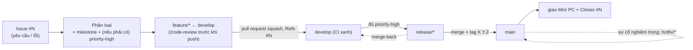
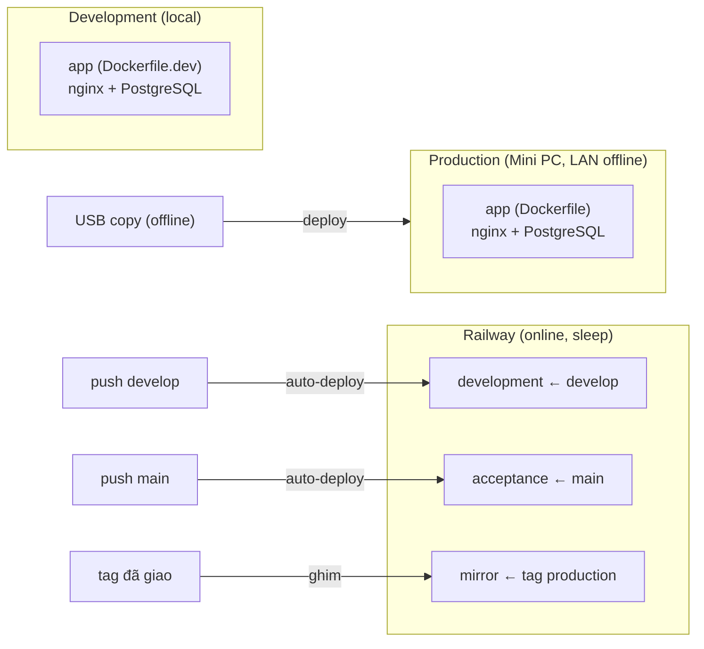

# Hướng dẫn onboarding SDLC + rà soát mạch lạc tài liệu — Implementation Plan

> **For agentic workers:** REQUIRED SUB-SKILL: Use superpowers:subagent-driven-development (recommended) or superpowers:executing-plans to implement this plan task-by-task. Steps use checkbox (`- [ ]`) syntax for tracking.

**Goal:** Tạo lối vào distill SDLC dễ hiểu cho người rất non (`docs/HUONG_DAN_SDLC.md`) + pointer, và rà soát mạch lạc các tài liệu canonical bị lệch ADR — giao làm hai pull request.

**Architecture:** Thay đổi *docs-only*, không đụng code/test. Một file guide mới (versioned) làm lối vào; pointer mỏng ở `AGENTS.md` + checklist ở `CONTRIBUTING.md §1`; sửa drift mô hình `-rc.N`/env/nhánh ở các doc current-state cho khớp ADR-003/004/005/008/016/017. Tách *doc current-state* (sửa) khỏi *bản ghi versioned/lịch sử* (giữ nguyên). Hai giai đoạn = hai pull request, cùng Issue #307.

**Tech Stack:** Markdown; Mermaid; GitHub (`gh`); Git Flow.

**Spec nguồn:** [`docs/superpowers/specs/2026-06-09-huong-dan-sdlc-onboarding-design.md`](../specs/2026-06-09-huong-dan-sdlc-onboarding-design.md) (ADR-022). Issue: [`#307`](https://github.com/manhcuongdtbk/electric-water-management/issues/307).

---

## Quy ước chung khi thực thi (đọc trước)

- **Đây là thay đổi docs-only** → không có unit test. "Verify" = đọc lại + lệnh `grep` kiểm nội dung cũ đã hết / nội dung mới có mặt. CI sẽ tự bỏ qua job test (path filter, ADR-021).
- **Mỗi sửa đổi: đọc lại TOÀN BỘ file trước khi sửa** (tích hợp, không append); giữ nguyên ý; mỗi sửa drift phải khớp ADR được trích.
- **File `docs/` có version** (guide mới, release spec, KIEN_THUC_DOCKER, HUONG_DAN_DEPLOY) → **bump version + thêm entry changelog trong CÙNG commit** (ADR-002). **File meta gốc** (`AGENTS.md`/`CONTRIBUTING.md`/`README.md`) **KHÔNG** versioned.
- **Commit:** Conventional Commits, tiếng Anh; kết bằng dòng `Co-Authored-By: Claude Opus 4.8 <noreply@anthropic.com>`.
- **KHÔNG push/merge khi chưa được chủ dự án duyệt.** Mở pull request rồi trình; theo dõi CI và báo pass/fail.
- **Nhánh:** worktree hiện tại (đã ở trên đỉnh `develop`, chứa 3 commit spec) là nhánh của **pull request 1**. **Pull request 2** cắt nhánh mới từ `develop` *sau khi pull request 1 đã merge*.
- **Ngôn ngữ:** tài liệu/giao diện tiếng Việt; không viết tắt (trừ CI/ADR/CRUD/UI); viết đủ "pull request".

---

# GIAI ĐOẠN 1 — pull request 1 (onboarding + rà soát meta)

## Task 1: Tạo lối vào `docs/HUONG_DAN_SDLC.md`

**Files:**
- Create: `docs/HUONG_DAN_SDLC.md`

- [ ] **Step 1: Tạo file với nội dung sau (viết cho người rất non — giải thích mọi thuật ngữ)**

````markdown
# Hướng dẫn nhanh quy trình làm việc (SDLC)

> **Phiên bản:** 1.0.0
> **Ngày:** 09/06/2026
> **Đối tượng:** Thành viên mới — kể cả người chưa quen Git, CI, hay Docker.
> **Cách dùng:** Đọc ~10–15 phút để hiểu *một thay đổi đi từ lúc nhận việc đến khi giao cho khách như thế nào*, rồi dùng bảng tra cứu để mở đúng mục chi tiết. **Đây là bản đồ — chi tiết và lý do nằm ở `CONTRIBUTING.md` và `docs/superpowers/specs/`.**

> **SDLC** (Software Development Life Cycle) = vòng đời phát triển phần mềm: toàn bộ cách đội mình **nhận việc → làm → kiểm → phát hành → giao cho khách**.

## 1. Từ vựng nhanh (đọc cái này trước)

| Từ | Nghĩa đời thường |
|---|---|
| **Nhánh** (branch) | Một "đường làm việc" riêng để bạn sửa code mà không đụng người khác. |
| **`develop`** | Nhánh chung, nơi gom mọi việc đang làm dở. |
| **`main`** | Nhánh "đã phát hành" — chỉ chứa bản đã chốt; mỗi bản gắn một số version. |
| **`feature/*`** | Nhánh bạn cắt ra từ `develop` để làm một việc cụ thể. |
| **Commit** | Một lần "lưu" thay đổi kèm câu mô tả ngắn. |
| **Pull request** | Lời đề nghị gộp nhánh của bạn vào nhánh khác, để người khác xem trước khi gộp. |
| **Merge** | Gộp một nhánh vào nhánh khác. |
| **Squash** | Khi gộp, dồn mọi commit của pull request thành **một** commit cho gọn. |
| **Tag** | Một cái nhãn ghim vào một bản đã phát hành (ví dụ `v1.1.0`). |
| **CI** | Máy chủ tự chạy kiểm tra (test, rà lỗi) mỗi khi mở pull request — báo **xanh** (đạt) / **đỏ** (lỗi). |
| **SemVer** | Cách đánh số version `MAJOR.MINOR.PATCH` (ví dụ `1.2.0`). |
| **Issue** | Một phiếu trên GitHub ghi một việc hoặc lỗi cần làm; có số `#N`. |
| **Milestone** | Một nhóm Issue dự kiến cho cùng một bản phát hành (= version đích). |
| **Hotfix** | Bản vá gấp cho lỗi nghiêm trọng đang chạy thật ở chỗ khách. |
| **Restore** | Khôi phục dữ liệu từ một bản sao lưu. |

## 2. Bức tranh lớn: một thay đổi đi đâu



## 3. Vòng đời một thay đổi (6 bước)

*Ví dụ xuyên suốt: bạn được giao "thêm cột so sánh kỳ vào bảng tính tiền".*

1. **Mở Issue.** Mọi việc bắt đầu bằng một Issue trên GitHub (dùng template *Yêu cầu thay đổi* hoặc *Báo lỗi*). Khách báo miệng thì đội tự mở Issue thay. Số `#N` là mã của việc này. → *Chi tiết: `CONTRIBUTING.md` mục 9 và mục 4.*
2. **Phân loại.** Chủ dự án gắn nhãn loại, gán **milestone** (việc này vào bản phát hành nào) và — nếu là việc *phải có* — nhãn `priority-high`. → *Mục 11 và mục 9 (bước 2).*
3. **Làm trên nhánh riêng.** Cắt nhánh `feature/<việc>` **từ `develop`**, code và viết test (`bin/docker rspec`), rồi chạy `/code-review` ngay trên máy trước khi đẩy lên. → *Mục 4.*
4. **Mở pull request vào `develop`.** Ghi `Refs #N` trong mô tả. CI phải **xanh** và chủ dự án duyệt thì mới gộp; gộp bằng **squash** (một pull request = một commit). → *Mục 4 và mục 2.*
5. **Cắt bản phát hành.** Khi mọi việc `priority-high` của milestone đã xong, cắt nhánh `release/*` từ `develop`, đưa vào `main`; công cụ release-please tự gắn version `X.Y.Z` + tag. → *Mục 6 và mục 11.*
6. **Giao và đóng.** Giao bản đã tag xuống máy Mini PC ở chỗ khách; Issue được đóng (`Closes #N`). → *Mục 7 và mục 10.*

## 4. Bảng tra cứu nhanh

| Chủ đề | Quy tắc cốt lõi | Mở chi tiết ở |
|---|---|---|
| Nhánh & gộp | Git Flow; `feature/*` cắt từ `develop`, **squash** vào `develop`; `release/*`·`hotfix/*` vào `main` bằng merge-commit; sau đó **merge-back** về `develop` | `CONTRIBUTING.md` §2 · ADR-003 |
| Commit & version | Commit tiếng Anh dạng `type(scope): ...`; `feat`→tăng MINOR, `fix`→tăng PATCH, có `BREAKING`→tăng MAJOR; release-please tự bump version + changelog + tag | §3, §6 · ADR-004, ADR-008 |
| Issue & truy vết | Mọi việc bắt đầu từ Issue `#N`; pull request ghi `Refs/Closes #N`; yêu cầu nghiệp vụ gắn anchor `NV-...` | §4, §9 · ADR-013, ADR-014 |
| Ưu tiên & "đủ để phát hành" | Thứ tự làm: `severity-critical` > `priority-high` (theo milestone) > còn lại; cắt `release/*` khi mọi `priority-high` của milestone đã xong | §11 · ADR-019, ADR-020 |
| Lỗi & sự cố | Lỗi thường → nhánh `feature/*`; lỗi nghiêm trọng (`severity-critical`: sập / sai tiền / mất dữ liệu) → `hotfix/*` cắt từ `main` | §10 · ADR-018 |
| Sao lưu & khôi phục | Sao lưu tự động sang ổ phụ (Lớp 3) là chính; tạo bản sao lưu *trước* khi khôi phục | §10 · ADR-016, ADR-017 |
| CI (kiểm tra tự động) | Kiểm tĩnh luôn chạy; chạy test chỉ khi pull request có đụng code (sửa mỗi tài liệu thì bỏ qua) | §8 · ADR-012, ADR-021 |
| Việc nối tiếp (nhánh xếp chồng) | Việc B cần kết quả việc A mà A chưa gộp → cắt `feature/B` từ nhánh A; sau khi A gộp thì `rebase --onto develop` | §4 · ADR-021 |
| Môi trường | Máy bạn (local) để làm; **3 môi trường Railway**: `development`←`develop`, `acceptance`←`main`, `mirror`←tag đang ở production; **Production = Mini PC offline** ở chỗ khách. Không dùng `-rc.N` | `README.md` · ADR-005 |
| Cộng tác & review | Chạy `/code-review` trên máy trước khi push; chủ dự án duyệt cuối; xem chung app đang chạy qua VS Code Dev Tunnel | §4, §5 · ADR-009, ADR-010 |
| Tài liệu | File trong `docs/` có version → khi sửa phải bump version + ghi changelog; file gốc (`README`/`AGENTS`/`CONTRIBUTING`/`CLAUDE`) thì không | `AGENTS.md` · ADR-002 |

## 5. Quy ước sống còn (đừng quên)

- Tài liệu và giao diện: **tiếng Việt 100%**. Commit và tiêu đề pull request: **tiếng Anh** (Conventional Commits).
- **Không viết tắt** (trừ CI, ADR, CRUD, UI).
- **Luôn làm trong một git worktree riêng + Docker** (xem `README.md`).
- Sửa file trong `docs/` có version → nhớ **bump version + ghi changelog** trong cùng commit.

## 6. Khi gặp lỗi/sự cố

- **Lỗi thường** (vẫn dùng được): xử như một thay đổi bình thường — mở Issue, làm trên `feature/*`.
- **Lỗi nghiêm trọng** (chỗ khách không dùng được / sai số tiền / mất dữ liệu): gắn nhãn `severity-critical`, vá gấp theo nhánh `hotfix/*` cắt từ `main`, cân nhắc quay về bản tag trước. → *`CONTRIBUTING.md` mục 10.*

---

**Cần chi tiết hơn?** `CONTRIBUTING.md` (quy trình từng bước cho người) · `docs/superpowers/specs/` (ADR-001..022 — quyết định kèm lý do) · `AGENTS.md` (quy ước code).

## Lịch sử thay đổi

- **1.0.0 (09/06/2026):** Bản đầu — lối vào distill cho SDLC (ADR-022; spec `docs/superpowers/specs/2026-06-09-huong-dan-sdlc-onboarding-design.md`; Issue #307).
````

- [ ] **Step 2: Verify nội dung khớp spec**

Run: `grep -c "mermaid\|Từ vựng\|Vòng đời một thay đổi\|Bảng tra cứu\|Phiên bản:" docs/HUONG_DAN_SDLC.md`
Expected: ≥5 (có đủ sơ đồ, từ vựng, vòng đời, bảng tra cứu, header version).

- [ ] **Step 3: Commit**

```bash
git add docs/HUONG_DAN_SDLC.md
git commit -m "docs(sdlc): add beginner-friendly SDLC onboarding guide

Refs #307. A one-page distilled entry point for newcomers (incl. people
new to Git/CI/Docker): glossary, change lifecycle, lookup table pointing
to CONTRIBUTING sections and ADRs (ADR-022).

Co-Authored-By: Claude Opus 4.8 <noreply@anthropic.com>"
```

---

## Task 2: `AGENTS.md` — pointer + sửa drift (giữ ngắn)

**Files:**
- Modify: `AGENTS.md` (đọc toàn bộ trước; meta — KHÔNG bump version)

- [ ] **Step 1: Thêm pointer tới guide** (trong blockquote mở đầu)

Tìm dòng:
```
> - **Người mới tham gia:** đọc thêm `CONTRIBUTING.md` (quy trình làm việc) và các spec trong `docs/superpowers/specs/`.
```
Thay bằng:
```
> - **Người mới tham gia:** đọc `docs/HUONG_DAN_SDLC.md` trước (lối vào nhanh, dễ hiểu cho người chưa quen Git/CI), rồi `CONTRIBUTING.md` (quy trình làm việc) và các spec trong `docs/superpowers/specs/`.
```

- [ ] **Step 2: Sửa drift "ba môi trường"** (mục Môi trường)

Tìm dòng:
```
> **Ba môi trường (Development / Nghiệm thu + Mốc trên Railway / Production Mini PC offline) và mô hình phát hành:** xem `README.md` (tổng quan, lệnh, môi trường) và `docs/superpowers/specs/2026-06-07-quy-trinh-release-design.md` (ADR-005 môi trường và promotion). Không lặp lại chi tiết ở đây.
```
Thay bằng:
```
> **Bốn nơi chạy (ba môi trường Railway `development` / `acceptance` / `mirror` + Production trên Mini PC offline) và mô hình phát hành:** xem `README.md` (tổng quan, lệnh, môi trường) và `docs/superpowers/specs/2026-06-07-quy-trinh-release-design.md` (ADR-005 môi trường và promotion). Không lặp lại chi tiết ở đây.
```

- [ ] **Step 3: Sửa ví dụ tên env cũ** (mục environment terminology)

Tìm: `Hai cái CÓ THỂ khác nhau (ví dụ Nghiệm thu và Mốc đều `rails_environment=production` nhưng `application_environment` khác).`
Thay `Nghiệm thu và Mốc` → `Acceptance và Mirror`.

- [ ] **Step 4: Sửa dòng tóm tắt Git Flow** (bỏ `-rc.N`, thêm kiểu merge + nguồn nhánh)

Tìm dòng:
```
> Tóm tắt một dòng (chi tiết và lý do ở các spec trên — đừng lặp lại ở đây): nhánh theo **Git Flow** (`main` / `develop` / `feature/*` / `release/*` / `hotfix/*`); version theo **SemVer** kèm hậu tố `-rc.N` cho bản chờ nghiệm thu; commit theo **Conventional Commits** (tiếng Anh).
```
Thay bằng:
```
> Tóm tắt một dòng (chi tiết và lý do ở các spec trên — đừng lặp lại ở đây): nhánh theo **Git Flow** (`feature/*`·`release/*` ← `develop`; `hotfix/*` ← `main`); **kiểu merge**: squash `feature`/`fix` vào `develop`, merge-commit cho `release/*`/`hotfix/*` + merge-back (xem `CONTRIBUTING.md` mục 2); version theo **SemVer** (KHÔNG dùng `-rc.N` trong luồng deploy — Acceptance chạy thẳng `main`; ADR-004/005/008); commit theo **Conventional Commits** (tiếng Anh).
```

- [ ] **Step 5: Verify**

Run: `grep -n "rc.N\|Nghiệm thu\|Mốc" AGENTS.md`
Expected: không còn dòng nào (0 kết quả).
Run: `grep -n "HUONG_DAN_SDLC" AGENTS.md`
Expected: 1 dòng (pointer).

- [ ] **Step 6: Commit**

```bash
git add AGENTS.md
git commit -m "docs(sdlc): point newcomers to the guide and fix env/release drift in AGENTS.md

Refs #307. Add a pointer to docs/HUONG_DAN_SDLC.md; replace the stale
-rc.N / Nghiệm thu-Mốc model with the current development/acceptance/
mirror + Mini PC model and the squash/merge-commit convention
(ADR-004/005/008). AGENTS.md stays terse.

Co-Authored-By: Claude Opus 4.8 <noreply@anthropic.com>"
```

---

## Task 3: `CONTRIBUTING.md` — checklist onboarding + sửa drift

**Files:**
- Modify: `CONTRIBUTING.md` (đọc toàn bộ trước; meta — KHÔNG bump version)

- [ ] **Step 1: Thêm checklist onboarding vào §1** (sau hai bullet hiện có của mục 1, trước "## 2.")

Thêm khối:
```
**Checklist onboarding (thành viên mới) — làm theo thứ tự:**

- [ ] Đọc `docs/HUONG_DAN_SDLC.md` — lối vào ~10 phút: vòng đời một thay đổi + bản đồ tra cứu trỏ tới các mục bên dưới.
- [ ] Cài Docker + tạo git worktree riêng, chạy `bin/docker up` (xem `README.md`).
- [ ] Đọc `AGENTS.md` (quy ước) và tài liệu nguồn trong `docs/` liên quan việc bạn làm.
- [ ] Việc đầu tiên: theo "Luồng làm một thay đổi" (mục 4); mọi việc bắt đầu từ một GitHub Issue (mục 9).
```

- [ ] **Step 2: Sửa drift `-rc.N` ở §2**

Tìm dòng:
```
- `release/*` — cắt từ `develop` khi đủ nội dung; deploy môi trường Nghiệm thu; gắn tag release candidate `X.Y.Z-rc.N`.
```
Thay bằng:
```
- `release/*` — cắt từ `develop` khi đủ nội dung; dùng để ổn định nội dung trước khi vào `main`. **Không** deploy lên Railway và **không** tag `-rc.N` — môi trường Acceptance chạy thẳng `main` (xem ADR-005/008).
```

- [ ] **Step 3: Thêm trỏ cổng release-readiness vào §4** (sau mục con đánh số, trước "### Việc nối tiếp phụ thuộc")

Thêm dòng:
```
> Khi nào gom `develop` thành `release/*`: xem **mục 11** — cổng "release-readiness": mọi Issue `priority-high` của milestone đã merge vào `develop`.
```

- [ ] **Step 4: Sửa drift `-rc.N` ở §6** (dòng "Tóm tắt:")

Tìm dòng:
```
Tóm tắt: đủ nội dung → `release/*` → deploy Nghiệm thu (`-rc.N`) → khách nghiệm thu → release-please tạo Release pull request → merge `main` + tag `X.Y.Z` → giao bản xuống production Mini PC + cập nhật môi trường Mốc → **merge-back về `develop`**.
```
Thay bằng:
```
Tóm tắt: đủ nội dung → `release/*` ← `develop` → merge vào `main` → release-please tạo Release pull request → bạn merge → tag `X.Y.Z` → môi trường **Acceptance** (chạy `main`) cập nhật cho khách nghiệm thu → giao bản tag xuống production Mini PC + fast-forward nhánh `production` (môi trường **Mirror** cập nhật) → **merge-back về `develop`**. (KHÔNG dùng `-rc.N` / không deploy `release/*` lên Railway — ADR-005/008.)
```

- [ ] **Step 5: Sửa drift "rc/UAT để dành P4" ở §8**

Tìm: `merge thì tự tag + tạo GitHub Release. Phần **rc/UAT để dành P4**.`
Thay `Phần **rc/UAT để dành P4**.` → `Môi trường **Acceptance** chạy thẳng `main` cho khách nghiệm thu nên **không dùng rc/UAT** (ADR-005/008).`

- [ ] **Step 6: Verify**

Run: `grep -n "rc.N\|Nghiệm thu\|môi trường Mốc\|rc/UAT" CONTRIBUTING.md`
Expected: 0 kết quả.
Run: `grep -n "HUONG_DAN_SDLC\|Checklist onboarding" CONTRIBUTING.md`
Expected: có (pointer + checklist).

- [ ] **Step 7: Commit**

```bash
git add CONTRIBUTING.md
git commit -m "docs(sdlc): add onboarding checklist and fix -rc.N drift in CONTRIBUTING.md

Refs #307. §1 gains a short onboarding checklist pointing to
docs/HUONG_DAN_SDLC.md; §2/§6/§8 drop the stale -rc.N / 'deploy to
Nghiệm thu from release/*' model (Acceptance now runs main directly,
ADR-005/008); §4 links the release-readiness gate in §11.

Co-Authored-By: Claude Opus 4.8 <noreply@anthropic.com>"
```

---

## Task 4: `README.md` — sửa nhánh cắt từ `develop`

**Files:**
- Modify: `README.md` (meta — KHÔNG bump version)

- [ ] **Step 1: Sửa lệnh worktree (đang ngầm cắt từ main)**

Tìm dòng (trong khối ví dụ worktree):
```
git worktree add ../ewm-<việc> -b <nhánh>   # tách nhánh mới từ main (thư mục anh em cạnh repo)
```
Thay bằng:
```
git worktree add ../ewm-<việc> -b feature/<việc> develop   # cắt nhánh feature mới từ develop (Git Flow; thư mục anh em cạnh repo)
```

- [ ] **Step 2: Verify**

Run: `grep -n "tách nhánh mới từ main" README.md`
Expected: 0 kết quả.
Run: `grep -n "feature/<việc> develop" README.md`
Expected: 1 dòng.

- [ ] **Step 3: Commit**

```bash
git add README.md
git commit -m "docs(sdlc): branch feature worktrees from develop, not main (Git Flow)

Refs #307. The worktree example told contributors to branch from the
current checkout (main); Git Flow cuts feature/* from develop (ADR-003).

Co-Authored-By: Claude Opus 4.8 <noreply@anthropic.com>"
```

---

## Task 5: Cập nhật bảng "Cải tiến optional" + bump release spec

**Files:**
- Modify: `docs/superpowers/specs/2026-06-07-quy-trinh-release-design.md` (versioned → bump + changelog)

- [ ] **Step 1: Đổi tiêu đề bảng** (bỏ "chưa làm")

Tìm: `**Cải tiến optional (chưa làm — YAGNI tới khi chạm trigger; đã xét từng mục):**`
Thay bằng: `**Cải tiến optional (mỗi mục kèm *verdict* + *trigger* hồi sinh; một số đã làm khi chạm trigger):**`

- [ ] **Step 2: Đổi verdict 2 dòng đầu của bảng → ✅ Đã làm**

Tìm dòng:
```
| Cheat-sheet đầu `AGENTS.md` | Hoãn — AGENTS.md vốn ngắn/canonical, cheat-sheet dễ trùng & lệch (ADR-002) | Có người mới onboard thấy `AGENTS.md` khó nắm nhanh |
```
Thay bằng:
```
| Cheat-sheet đầu `AGENTS.md` | ✅ Đã làm (2026-06-09, [#307](https://github.com/manhcuongdtbk/electric-water-management/issues/307)) — **không** nhồi cheat-sheet vào `AGENTS.md` (giữ ADR-002): tạo lối vào distill `docs/HUONG_DAN_SDLC.md` + pointer ở đầu `AGENTS.md`. Spec: [`2026-06-09-huong-dan-sdlc-onboarding-design.md`](2026-06-09-huong-dan-sdlc-onboarding-design.md) (ADR-022) | (đã chạm) |
```
Tìm dòng:
```
| Checklist onboarding (`CONTRIBUTING.md`) | Hoãn — §1 đã có "trước khi bắt đầu"; đội hiện đã thạo | Có người mới gia nhập đội |
```
Thay bằng:
```
| Checklist onboarding (`CONTRIBUTING.md`) | ✅ Đã làm (2026-06-09, [#307](https://github.com/manhcuongdtbk/electric-water-management/issues/307)) — thêm checklist onboarding ở `CONTRIBUTING.md` §1 trỏ `docs/HUONG_DAN_SDLC.md` | (đã chạm) |
```

- [ ] **Step 3: Bump version (frontmatter)**

Tìm: `version: 0.12.0` → thay `version: 0.13.0`.

- [ ] **Step 4: Thêm entry changelog** (ngay dưới `## Changelog`, trên dòng 0.12.0)

Thêm:
```
- **0.13.0 (2026-06-09):** Hai mục "Cải tiến optional" *cheat-sheet `AGENTS.md`* + *checklist onboarding* → **✅ Đã làm** (Issue #307): tạo lối vào distill `docs/HUONG_DAN_SDLC.md` (ADR-022, spec [`2026-06-09-huong-dan-sdlc-onboarding-design.md`](2026-06-09-huong-dan-sdlc-onboarding-design.md)) + pointer `AGENTS.md`/`CONTRIBUTING.md`; **không** nhồi cheat-sheet vào `AGENTS.md` (giữ ADR-002). Kèm rà soát mạch lạc tài liệu canonical (bỏ drift `-rc.N`/env/nhánh).
```

- [ ] **Step 5: Verify**

Run: `grep -n "✅ Đã làm" docs/superpowers/specs/2026-06-07-quy-trinh-release-design.md`
Expected: ≥2 dòng (2 mục optional).
Run: `grep -n "0.13.0" docs/superpowers/specs/2026-06-07-quy-trinh-release-design.md`
Expected: 2 dòng (frontmatter + changelog).

- [ ] **Step 6: Commit**

```bash
git add docs/superpowers/specs/2026-06-07-quy-trinh-release-design.md
git commit -m "docs(release): mark onboarding optional-improvement items as done (v0.13.0)

Refs #307. The two 'Cải tiến optional' rows (cheat-sheet AGENTS.md +
onboarding checklist) are now done via docs/HUONG_DAN_SDLC.md and thin
pointers, without putting a cheat-sheet in AGENTS.md (ADR-002).

Co-Authored-By: Claude Opus 4.8 <noreply@anthropic.com>"
```

---

## Task 6: Mở pull request 1 (chờ duyệt)

**Files:** không sửa file — thao tác Git/GitHub.

- [ ] **Step 1: Đồng bộ base (release spec là file NÓNG)**

```bash
git fetch origin develop
git rev-list --count HEAD..origin/develop
```
Nếu >0: `git merge origin/develop` (hoặc rebase). Nếu xung đột ở release spec changelog → giữ cả entry của develop **và** entry 0.13.0 của mình (đẩy 0.13.0 lên trên), rồi bump tiếp nếu develop đã có version mới hơn.

- [ ] **Step 2: Push + mở pull request đích `develop`**

```bash
git push -u origin HEAD
gh pr create --base develop --title "docs(sdlc): onboarding guide + canonical-doc coherence (phase 1)" \
  --body "Refs #307. Phase 1: new docs/HUONG_DAN_SDLC.md (beginner-friendly entry point) + pointer in AGENTS.md + onboarding checklist in CONTRIBUTING.md; fix stale -rc.N / env / branch-from-main drift in AGENTS.md, CONTRIBUTING.md, README.md; mark the two optional-improvement rows done in the release spec (v0.13.0). Docs-only. Design: docs/superpowers/specs/2026-06-09-huong-dan-sdlc-onboarding-design.md (ADR-022)."
```

- [ ] **Step 3: Theo dõi CI + báo kết quả**

Run: `gh pr checks --watch`
Expected: các job xanh; job test bị **skip** (path filter — pull request docs-only). Báo pass/fail cho chủ dự án. **Dừng — chờ chủ dự án duyệt + merge.** Không tự merge.

---

# GIAI ĐOẠN 2 — pull request 2 (rà soát guide ops versioned)

> **Tiền điều kiện:** pull request 1 đã merge vào `develop`. Sau đó cắt nhánh mới (worktree mới theo quy ước dự án) từ `origin/develop`:
> ```bash
> git fetch origin
> git worktree add ../ewm-doc-coherence -b feature/sdlc-doc-coherence origin/develop
> cd ../ewm-doc-coherence
> ```

## Task 7: `docs/KIEN_THUC_DOCKER.md` — cập nhật mô hình môi trường

**Files:**
- Modify: `docs/KIEN_THUC_DOCKER.md` (versioned → bump + changelog)

- [ ] **Step 1: Đọc toàn bộ file**, tìm mọi chỗ dùng mô hình cũ.

Run: `grep -n "Staging\|staging\|4 môi trường\| Test \|môi trường (development, test" docs/KIEN_THUC_DOCKER.md`
Ghi lại các dòng (audit đã thấy: ~22, ~30, ~143, ~341, mục 11 ~462–505, ~659–687).

- [ ] **Step 2: Thay toàn bộ phần "## 11" — Tổng quan + bảng + sơ đồ** (dòng ~462–505) bằng nội dung sau

````markdown
## 11. Bốn nơi chạy (môi trường)

### Tổng quan

Hệ thống chạy ở **bốn nơi**: trên máy dev (local) để làm, **ba môi trường trên Railway** (online), và **production thật trên Mini PC** (LAN offline ở chỗ khách). Mọi nơi (trừ local/test) dùng `RAILS_ENV=production`; phân biệt nhau bằng biến `APPLICATION_ENVIRONMENT_LABEL`.

| | Development (local) | Railway `development` | Railway `acceptance` | Railway `mirror` | Production |
|---|---|---|---|---|---|
| Hạ tầng | Docker Desktop | Railway (sleep) | Railway (sleep) | Railway (sleep) | Ubuntu Mini PC (LAN offline) |
| Dockerfile | Dockerfile.dev | Dockerfile | Dockerfile | Dockerfile | Dockerfile |
| Nguồn deploy | máy bạn — `develop`/`feature/*` | nhánh `develop` | nhánh `main` | nhánh `production` (ghim tag đã giao) | tag `main` đã giao (copy qua USB) |
| Nhãn `APPLICATION_ENVIRONMENT_LABEL` | — | `Development` | `Acceptance` | `Mirror` | `Production` |
| Config | compose.dev.yml | railway.json | railway.json | railway.json | compose.yml + .env |
| URL | http://localhost | …-development.up.railway.app | …-acceptance.up.railway.app | …-mirror.up.railway.app | http://\<IP server\> |

- **`acceptance`** chạy nhánh `main` (bản release mới nhất) cho khách nghiệm thu — **không** dùng tag `-rc.N`.
- **`mirror`** ghim đúng tag đang chạy ở production (Mini PC) để khách đối chiếu bản ứng viên (`acceptance`) với bản đang dùng.
- **Production** là Mini PC offline thật tại chỗ khách — **không** phải Railway.

Chi tiết và lý do: ADR-005 (ghi chú "Triển khai & điều chỉnh (P4)") trong `docs/superpowers/specs/2026-06-07-quy-trinh-release-design.md`.

> **Nhánh theo Git Flow:** `feature/*` và `release/*` cắt từ `develop`; `hotfix/*` cắt từ `main`. Xem `CONTRIBUTING.md` mục 2.


````

- [ ] **Step 3: Sửa các chỗ còn lại theo bảng find→replace** (áp dụng cho mọi dòng grep Step 1 còn dùng mô hình cũ, gồm phần giới thiệu mục 11, subsection "Staging (Railway)", và chú thích `railway.json`):

| Tìm (mô hình cũ) | Thay (mô hình mới) |
|---|---|
| `4 môi trường (development, test, staging, production)` | `bốn nơi chạy (development local, ba môi trường Railway development/acceptance/mirror, production Mini PC)` |
| Tiêu đề/subsection `Staging (Railway)` | `Acceptance & Mirror (Railway)` — kèm 1–2 câu: `acceptance` chạy nhánh `main` cho khách nghiệm thu; `mirror` ghim tag đang ở production để đối chiếu |
| `Cấu hình cho Railway staging` (chú thích `railway.json`) | `Cấu hình dùng chung cho ba môi trường Railway (development, acceptance, mirror)` |
| Mọi nhắc "Staging và production dùng cùng Dockerfile" | `Các môi trường Railway và production dùng cùng Dockerfile (production build); development và test dùng Dockerfile.dev.` |

- [ ] **Step 4: Thêm biến `APPLICATION_ENVIRONMENT_LABEL`** vào mục Biến môi trường (dòng ~363–397), một dòng bảng:
```
| `APPLICATION_ENVIRONMENT_LABEL` | `Development`/`Acceptance`/`Mirror`/`Production` | Nhãn phân biệt môi trường khi `RAILS_ENV=production` ở tất cả (hiện ở sidebar/đăng nhập/log/`/version`). |
```

- [ ] **Step 5: Bump version + changelog**

Tìm header `> **Phiên bản:**` → tăng MINOR (ví dụ `1.8.x` → MINOR kế tiếp). Thêm entry vào `## Lịch sử thay đổi`:
```
- **<version mới> (09/06/2026):** Cập nhật mục 11 (môi trường) sang mô hình hiện tại — 3 môi trường Railway `development`/`acceptance`/`mirror` + Production Mini PC (bỏ tên cũ "Test/Staging"); thêm biến `APPLICATION_ENVIRONMENT_LABEL` + ghi chú nguồn nhánh Git Flow. Khớp ADR-005. (Issue #307)
```

- [ ] **Step 6: Verify**

Run: `grep -ni "staging" docs/KIEN_THUC_DOCKER.md`
Expected: 0 kết quả (đã bỏ tên cũ).
Run: `grep -n "acceptance\|mirror\|APPLICATION_ENVIRONMENT_LABEL" docs/KIEN_THUC_DOCKER.md`
Expected: có (mô hình mới + biến).

- [ ] **Step 7: Commit**

```bash
git add docs/KIEN_THUC_DOCKER.md
git commit -m "docs(ops): update KIEN_THUC_DOCKER environments to current model

Refs #307. Replace the old Development/Test/Staging/Production model
(single Railway env) with the current 3 Railway envs (development/
acceptance/mirror) + Mini PC production; add APPLICATION_ENVIRONMENT_LABEL
and a Git Flow branch-source note (ADR-005). Bump version + changelog.

Co-Authored-By: Claude Opus 4.8 <noreply@anthropic.com>"
```

---

## Task 8: `docs/HUONG_DAN_DEPLOY.md` — làm rõ sao lưu/khôi phục

**Files:**
- Modify: `docs/HUONG_DAN_DEPLOY.md` (versioned → bump + changelog)

- [ ] **Step 1: Đọc cụm "## Sao lưu dữ liệu" + "## Cập nhật phiên bản"** (dòng ~261–348) để xác nhận text trước khi sửa.

- [ ] **Step 2: Đặt tên Lớp 1 cho sao lưu giao diện**

Tìm: `### Sao lưu qua giao diện web (khi cần)`
Thay bằng: `### Lớp 1 — Sao lưu qua giao diện web (snapshot tạm trước thao tác nguy hiểm)`
Tìm: `Tối đa 3 bản sao lưu. Muốn tạo bản mới khi đã đủ 3 — xóa bản cũ nhất trước.`
Thay bằng: `Tối đa 3 bản. Đây là snapshot **tạm thời** trước thao tác nguy hiểm — **không** phải nguồn sao lưu chính (xem "Lớp 3" bên dưới). Muốn tạo bản mới khi đã đủ 3 — xóa bản cũ nhất trước.`

- [ ] **Step 3: Thêm cảnh báo "backup trước khi khôi phục"**

Tìm: `### Khôi phục từ bản sao lưu`
Ngay dưới tiêu đề đó (trước câu "Khôi phục thực hiện qua dòng lệnh..."), thêm:
```
> **Quan trọng — tạo bản sao lưu TRƯỚC khi khôi phục:** restore ghi đè toàn bộ dữ liệu hiện tại. Trước khi chạy, hãy tạo một bản sao lưu Lớp 1 qua giao diện web (mục trên) để còn đường lùi nếu khôi phục hỏng. (Quy ước: `CONTRIBUTING.md` mục 10, ADR-017.)
```

- [ ] **Step 4: Đánh dấu Lớp 3 là nguồn cậy chính**

Tìm: `### Sao lưu tự động sang ổ cứng phụ (bắt buộc)`
Thay bằng: `### Lớp 3 — Sao lưu tự động sang ổ cứng phụ (bắt buộc, nguồn cậy chính)`
Tìm: `Server phải có ổ cứng phụ để sao lưu tự động. Nếu ổ chính hỏng, dữ liệu vẫn còn trên ổ phụ.`
Thay bằng: `Đây là **nguồn sao lưu chính** (nằm ngoài máy chạy app): nếu ổ chính hoặc cả máy hỏng, dữ liệu vẫn còn trên ổ phụ. Lớp 1 (giao diện) chỉ là snapshot tạm. Giữ 7 bản gần nhất để có khoảng lùi an toàn.`

- [ ] **Step 5: Nhắc backup trước khi cập nhật phiên bản**

Tìm: `## Cập nhật phiên bản` và dòng `Khi có phiên bản mới từ nhà phát triển:`
Ngay dưới đó thêm:
```
> **Trước khi cập nhật:** trên server, tạo một bản sao lưu Lớp 1 qua giao diện web để có đường lùi nếu bản mới gặp sự cố.
```

- [ ] **Step 6: Bump version + changelog**

Tìm `> **Phiên bản:** 1.2.0` → `> **Phiên bản:** 1.3.0`. Thêm entry vào `## Lịch sử thay đổi`:
```
- **1.3.0 (09/06/2026):** Làm rõ chính sách sao lưu 3 lớp theo ADR-016/017 — đặt tên Lớp 1 (snapshot giao diện) / Lớp 3 (tự động ổ phụ, nguồn cậy chính); thêm cảnh báo tạo backup Lớp 1 trước khi khôi phục và trước khi cập nhật phiên bản. (Issue #307)
```

- [ ] **Step 7: Verify**

Run: `grep -n "Lớp 1\|Lớp 3\|TRƯỚC khi khôi phục\|1.3.0" docs/HUONG_DAN_DEPLOY.md`
Expected: có đủ (tên lớp + cảnh báo + version).

- [ ] **Step 8: Commit**

```bash
git add docs/HUONG_DAN_DEPLOY.md
git commit -m "docs(ops): clarify 3-layer backup and safe restore in deploy guide

Refs #307. Name Lớp 1 (UI snapshot) vs Lớp 3 (auto off-box, primary);
add 'create a Lớp 1 backup before restore / before upgrade' warnings
per ADR-016/017. Bump version + changelog.

Co-Authored-By: Claude Opus 4.8 <noreply@anthropic.com>"
```

---

## Task 9: Mở pull request 2 (chờ duyệt)

- [ ] **Step 1: Đồng bộ base + push**

```bash
git fetch origin develop
git rev-list --count HEAD..origin/develop   # >0 thì merge origin/develop trước
git push -u origin HEAD
```

- [ ] **Step 2: Mở pull request đích `develop`** (`Closes #307` — pull request cuối)

```bash
gh pr create --base develop --title "docs(ops): fix environment + backup drift in ops guides (phase 2)" \
  --body "Closes #307. Phase 2: KIEN_THUC_DOCKER §11 updated to the current development/acceptance/mirror + Mini PC model (drops old Test/Staging, adds APPLICATION_ENVIRONMENT_LABEL); HUONG_DAN_DEPLOY clarifies the 3-layer backup policy and safe-restore warnings (ADR-016/017). Both versioned docs bumped. Docs-only. Design: docs/superpowers/specs/2026-06-09-huong-dan-sdlc-onboarding-design.md."
```

- [ ] **Step 3: Theo dõi CI + báo kết quả**

Run: `gh pr checks --watch`
Expected: xanh; job test skip (docs-only). Báo chủ dự án. **Chờ duyệt + merge.** Không tự merge.

---

## Hoàn tất

Sau khi cả hai pull request merge: Issue #307 đóng; bảng "Cải tiến optional" có 2 mục ✅; tài liệu canonical hết drift `-rc.N`/"Staging"/cắt-nhánh-từ-main; lối vào `docs/HUONG_DAN_SDLC.md` sẵn cho người mới.
