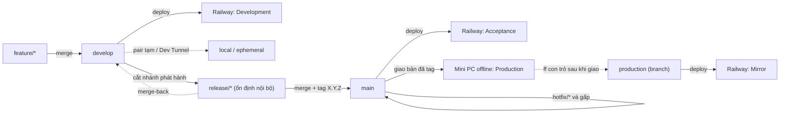

# Quy trình phát hành (release process)

Mảnh đầu tiên của việc chuẩn hoá SDLC. Tuân theo [SDLC Overview](2026-06-07-sdlc-overview-design.md) (ADR-001 mô hình, ADR-002 tài liệu/tri thức).

> **Cách đọc:** quyết định viết theo **ADR**: Bối cảnh → Quyết định → Lý do → Tradeoff → Phương án đã loại → Điều kiện xem lại → Trạng thái.

## Goals

- Đưa code từ máy dev tới khách **lặp lại được, có version rõ ràng, ép tuân thủ được**.
- **Chi phí thấp nhất**; **không phụ thuộc công cụ bị bỏ rơi**; tự động hoá tối đa.
- Tồn tại đồng thời nhiều version để khách **đối chiếu** (bản Mirror đang ở production vs bản Acceptance ứng viên).

## Non-Goals (cố ý KHÔNG làm ở mảnh này)

- Quy trình deploy production offline (đã có người lo) — chỉ chạm tới ở mức "nhận bản đã tag".
- Quy trình tiếp nhận yêu cầu, quản lý thay đổi/truy vết, vận hành/giám sát — là **mảnh SDLC khác** (xem [Backlog](#backlog)).
- Đồng bộ dữ liệu production lên Railway (không cần & không an toàn).

## Glossary (khoá nghĩa — không viết tắt)

| Thuật ngữ | Nghĩa |
|---|---|
| **Release candidate (rc)** | Bản ứng viên; tag `X.Y.Z-rc.N` (P4: **hiện không dùng** trong luồng deploy — Acceptance deploy thẳng `main`, xem ADR-005/008) |
| **Merge-back** | Sau khi `release/*`/`hotfix/*` xong, merge ngược về `develop` để fix không bị mất |
| **Acceptance** (môi trường nghiệm thu) | App trên Railway (env `acceptance`, nhãn `Acceptance`) chạy nhánh `main` — bản release mới nhất cho khách nghiệm thu |
| **Mirror** (môi trường đối chiếu) | App trên Railway (env `mirror`, nhãn `Mirror`) chạy version đang ở production (qua nhánh con trỏ `production`, ghim tag đã giao), để khách đối chiếu |
| **Development** (môi trường phát triển) | App trên Railway (env `development`, nhãn `Development`) chạy nhánh `develop` — bản đang phát triển, tiện đội xem |
| **Production** | Bản chạy thật trên Mini PC mạng LAN offline tại chỗ khách |
| **Promotion** | Đẩy một version từ tầng dưới (nghiệm thu) lên tầng trên (production) |

## Sơ đồ luồng nhánh ↔ môi trường

## Bối cảnh & vấn đề hiện tại

- `main` đang gánh **ba vai**: tích hợp + staging tự deploy + nơi tag release.
- Railway tự deploy mỗi khi push `main` → mọi merge **đè ngay**, kể cả commit chưa có version → không có mốc ổn định.
- **Không có CI, không có branch protection** → release 1.0.1 "đúng" nhờ làm tay, không có gì chặn.

---

## Quyết định (ADR)

### ADR-003: Mô hình nhánh — Git Flow áp cứng
- **Trạng thái:** Accepted · 2026-06-07
- **Bối cảnh:** Phát hành theo phiên bản rời rạc; có cổng khách nghiệm thu; giao bản offline; phải giữ một version ngoài thực địa; team nhỏ, bạn merge.
- **Quyết định:** Git Flow đầy đủ — `main`, `develop`, `feature/*`, `release/*`, `hotfix/*`; thao tác bằng git thường + automation.
- **Lý do:** Khớp đúng ngoại lệ chính tác giả Git Flow nêu: hợp khi "phần mềm được đánh version rõ ràng / cần hỗ trợ nhiều version ngoài thực địa" (xem nguồn nvie ở [Truy vết](#truy-vết)).
- **Tradeoff:** (+) tách rõ 3 môi trường, quy trình cố định dễ dạy, dễ tự động hoá. (−) phải kỷ luật **merge-back** (release/hotfix → *cả* `main` + `develop`); nặng hơn trunk-based; nuôi 2 nhánh sống.
- **Phương án đã loại:** *Trunk-based* (chuẩn 2026 cho đa số) — cần CI mạnh + deploy liên tục (chưa có), không hợp mô hình nghiệm thu/offline. *git-flow CLI (gitflow-avh)* — repo đã archive (rủi ro bỏ rơi).
- **Điều kiện xem lại:** chuyển sang continuous delivery, **hoặc** merge-back thủ công gây lỗi lặp lại → cân nhắc trunk-based + release branch.

### ADR-004: Đánh số version — SemVer + pre-release
- **Trạng thái:** Accepted · 2026-06-07
- **Bối cảnh:** Cần số version truyền đạt đúng mức độ thay đổi; có giai đoạn chờ nghiệm thu.
- **Quyết định:** SemVer `MAJOR.MINOR.PATCH`; bản chờ nghiệm thu dùng `X.Y.Z-rc.N`; chốt mới gắn `X.Y.Z`.
- **Lý do:** Chuẩn phổ biến; pre-release tag là cách chuẩn đánh dấu "đang chờ duyệt, có thể còn sửa".
- **Tradeoff:** (+) rõ ràng, công cụ hỗ trợ sẵn. (−) phải kỷ luật: số đi theo **nội dung** (thêm tính năng → MINOR `1.1.0`, không phải `1.0.2`), không +1 theo môi trường.
- **Phương án đã loại:** đánh số tuần tự tự do — mơ hồ, không truyền đạt mức thay đổi.
- **Điều kiện xem lại:** nếu khách yêu cầu sơ đồ version khác (vd theo ngày).
- **Ghi chú (P4, chốt 2026-06-08):** (1) **Không dùng `-rc.N` trong luồng deploy** — Acceptance deploy thẳng `main` (bản đã release); khách không ưng thì ra bản vá kế tiếp (xem ADR-005/008). (2) **Repo này là "hệ thống v2"** nhưng version phần mềm theo **SemVer từ `1.0.0`** — số MAJOR mang nghĩa tương thích/breaking, *không* phải "đời sản phẩm"; hệ thống v1 nằm ở project Railway riêng `electric-water-management-v1`. Sẽ ghi rõ một dòng trong `README.md`/`CHANGELOG.md` để khỏi nhầm.

### ADR-005: Môi trường & promotion
- **Trạng thái:** Accepted · 2026-06-07
- **Bối cảnh:** Railway **tính tiền theo tổng tài nguyên, không theo số environment**. Team có Docker local. Khách ở xa, dùng Railway online.
- **Quyết định:**
  - **Phát triển:** Docker local + preview tạm (VS Code Dev Tunnel / PR env) khi cần — `develop`/`feature/*`.
  - **Nghiệm thu:** 1 Railway env, bật **sleep** — `release/*` → `rc`.
  - **Mốc:** 1 Railway env, bật **sleep** — tag `main` (version đang ở production).
  - **Production:** Mini PC offline — tag `main`.
- **Lý do:** Tách env không đắt hơn gộp → tách cho sạch; sleep + dev local = chi phí gần thấp nhất.
- **Tradeoff:** (+) mỗi version một env riêng, rõ; rẻ. (−) sleep gây cold-start nhẹ khi khách mở lần đầu.
- **Phương án đã loại:** *nhồi 2 app vào 1 env* — loại (dựa trên hiểu nhầm "tính tiền theo env"); *env Phát triển host cố định* — loại (dev chạy local đủ).
- **Điều kiện xem lại:** khách phàn nàn cold-start → tắt sleep env Acceptance; hoặc cần env dev chung host.
- **Triển khai & điều chỉnh (P4, chốt 2026-06-08):** Sau brainstorming với chủ dự án, mô hình môi trường được cụ thể hoá và **điều chỉnh** so với quyết định gốc ở trên:
    - **Ba môi trường Railway** (tên tiếng Anh; *không hai* như bản gốc) trong project Railway `electric-water-management` sẵn có — không tạo project mới, không đụng project cũ `electric-water-management-v1` (đang idle):
        - `development` (nhãn `Development`) ← nhánh `develop` (tự deploy). *Bổ sung so với bản gốc:* bản gốc để Phát triển hoàn toàn local; nay thêm env Railway thường trực cho **tiện đội xem** (chủ dự án chấp nhận chi phí thêm; Dev Tunnel của ADR-010 vẫn dùng cho pair). ⇒ Đảo lại mục "*env Phát triển host cố định — loại*" ở "Phương án đã loại".
        - `acceptance` (nhãn `Acceptance`) ← nhánh **`main`** (bản release mới nhất), **không** phải `release/*`/rc như bản gốc. Khách nghiệm thu bản đã release; không ưng → ra bản vá kế tiếp (tự lên Acceptance). ⇒ Phần "rc/UAT deploy" mà ADR-008 (P3) để dành **không cần làm nữa** (xem ghi chú ADR-008).
        - `mirror` (nhãn `Mirror`) ← nhánh **`production`** (con trỏ deploy mới, *nằm dưới* `main`), **ghim đúng tag đang ở production** (hiện `v1.0.0`). *Sửa lỗ hổng* bản gốc viết "Mốc = tag `main`": `main` đã chạy lên `1.1.0` trong khi production (Mini PC) vẫn `v1.0.0` — nên Mirror phải bám **bản đã giao**, không bám `main`. Mỗi lần giao bản mới cho Mini PC thì **fast-forward** nhánh `production` tới tag đó (nhánh này không đụng release-please/CI/branch-guard — đã kiểm chứng: CI chỉ chạy trên pull request, release-please chỉ chạy push `main`).
    - **Production = Mini PC offline thật** (hiện `v1.0.0`); nhãn `Production` đặt tại chỗ trên Mini PC (ngoài Railway, ngoài phạm vi P4).
    - **Hai trục "environment" tách bạch (đừng gộp):** (a) *danh tính triển khai* — tên Railway env **=** `APPLICATION_ENVIRONMENT_LABEL` (cùng giá trị; app đọc `APPLICATION_ENVIRONMENT_LABEL` để hoạt động cả trên Mini PC offline — Mini PC không có `RAILWAY_ENVIRONMENT_NAME`); (b) *chế độ framework* — `RAILS_ENV=production` ở **cả ba** env Railway lẫn Mini PC (không đồng bộ với danh tính, nếu không app chạy sai chế độ). Xem mục "environment terminology" trong `AGENTS.md`.
    - **Sleep bật** cả ba app service (Postgres không sleep nhưng nhỏ vì chỉ chứa seed).
    - **Dữ liệu:** Mirror **giữ nguyên** Postgres + dữ liệu của env hiện tại (seed + dữ liệu khách tạo *trên Railway*) — đây là dữ liệu thử trên Railway, không phải dữ liệu thật từ Mini PC, nên vẫn đúng ADR-006. Schema `v1.0.0` ↔ hiện tại y hệt (26 migration) nên deploy `v1.0.0` lên data sẵn có không cần migration/seed lại. Acceptance + Development tạo mới → seed tươi theo version nhánh tương ứng (ADR-006).
    - **Public URL:** `electric-water-management-{development,acceptance,mirror}.up.railway.app` (domain trống cũ giữ làm alias cho `mirror` tạm thời).
    - **Vì sao chỉ 3 env** (so với chuỗi tầng chuẩn ngành Development → Testing/QA → Staging → UAT → Production): đây là **tập con có cơ sở** + 1 bổ sung đặc thù — Testing/QA đã nằm trong **CI** (rspec/system spec mỗi PR) nên không cần env riêng; **Staging ∪ UAT gộp làm `acceptance`** (đội diễn tập kỹ thuật bằng local Docker + CI; khách nghiệm thu trên `acceptance`); **`mirror` không thuộc chuỗi chuẩn** — nó tồn tại chỉ vì production của ta *offline*, cần một bản sinh đôi *online* để khách đối chiếu.

### ADR-006: Dữ liệu cho môi trường
- **Trạng thái:** Accepted · 2026-06-07
- **Bối cảnh:** Production offline, khách ở xa → không thể & không cần bơm dữ liệu thật lên Railway.
- **Quyết định:** **Mỗi version dùng seed riêng** (`db/seeds` tại version đó); không ép đồng bộ seed chéo. Đối chiếu là **định tính**.
- **Lý do:** Đơn giản; an toàn (dữ liệu thật không rời mạng offline).
- **Tradeoff:** (+) an toàn, gọn. (−) không phải A/B nghiêm ngặt trên cùng dữ liệu — chấp nhận được vì mục tiêu là nghiệm thu định tính.
- **Phương án đã loại:** *bơm dữ liệu production* — bất khả thi + rủi ro lộ; *ép cùng seed mọi version* — không cần.
- **Điều kiện xem lại:** nếu cần so sánh định lượng chính xác → dựng seed chung có kiểm soát.

### ADR-007: Enforce — miễn phí trước, có đường nâng cấp
- **Trạng thái:** Accepted · 2026-06-07
- **Bối cảnh:** GitHub branch protection/rulesets **không free cho repo private** (đòi Team ~$4/người/tháng). Repo phải private. Hiện một mình bạn merge.
- **Quyết định:** **Đường miễn phí trước** — CI Actions (test/lint/audit/schema/commitlint + branch-guard native) hiện trạng thái trên PR; release-please cổng-người-duyệt; `/code-review` local. **Đường nâng cấp:** GitHub Team khi cần khoá cứng.
- **Lý do:** Một mình bạn merge → rủi ro bypass gần như không; "quên" thì automation lo. Tiết kiệm tối đa.
- **Tradeoff:** (+) $0, tự động hoá cao. (−) chưa **chặn cứng** ở server (chỉ hiện đỏ) — không thành vấn đề khi 1 người merge.
- **Phương án đã loại:** *GitHub Team ngay* — chưa cần khi 1 người merge; *third-party "Branch Enforcement" Action* — rủi ro bỏ rơi → thay bằng vài dòng bash native.
- **Điều kiện xem lại:** có >1 người được merge, hoặc cần khoá cứng → nâng GitHub Team.

### ADR-008: Release automation — release-please
- **Trạng thái:** Accepted · 2026-06-07
- **Bối cảnh:** Thao tác lặp (bump version, changelog, tag, GitHub Release, merge-back) dễ quên; `gitflow-avh` đã chết.
- **Quyết định:** Dùng **release-please** (Google) — giữ "Release PR", chỉ phát hành khi **bạn merge** (cổng người duyệt); tự bump version + changelog + tag + Release. Cấu hình target `main` (+ release branch khi cần).
- **Lý do:** Maintained (v5.0.0/2026), hỗ trợ release branch, có cổng người duyệt đúng mô hình nghiệm thu.
- **Tradeoff:** (+) tự động hoá phần dễ quên, có cổng duyệt. (−) cần cấu hình để khớp Git Flow (release-please thiên trunk/GitHub-flow).
- **Phương án đã loại:** *semantic-release* — tự release mỗi push, không có cổng → không hợp nghiệm thu; *script tự viết toàn bộ* — tốn công bảo trì.
- **Triển khai (P3, chốt 2026-06-07):** release-please chạy trên `main` lo **bản phát hành chính thức** — release-type `simple`, tag tiền tố `v`, cập nhật `CHANGELOG.md` + `version.txt`, manifest mỏ neo `1.0.1`; đặt `target-branch: main` vì default branch là `develop`. Phần **rc/UAT để dành P4** (chưa có môi trường Nghiệm thu để deploy). Mở rộng branch-source guard cho phép nhánh `release-please--*` vào `main` (Release PR do bot tạo). release-please ghi `CHANGELOG.md`/`version.txt` lên `main` → sau mỗi release phải **đồng bộ `main` → `develop`** (gộp vào merge-back). Dùng `GITHUB_TOKEN` mặc định (miễn phí) — Release PR do bot tạo không tự kích hoạt CI, chấp nhận được vì chỉ sửa changelog/version.
- **Cập nhật (P4, chốt 2026-06-08):** Phần **rc/UAT** để dành ở trên **không triển khai** — môi trường **Acceptance** (P4) deploy thẳng nhánh `main` (bản release mới nhất) cho khách nghiệm thu, nên không cần tag `-rc.N` hay deploy `release/*` lên Railway. release-please vẫn chỉ chạy trên `main` cho bản phát hành chính thức. Chi tiết môi trường: xem ghi chú "Triển khai & điều chỉnh (P4)" ở **ADR-005**.
- **Yêu cầu setup (đúc kết khi cắt bản phát hành 1.1.0):**
    - **Cài đặt repository bắt buộc:** phải BẬT tùy chọn "Allow GitHub Actions to create and approve pull requests", nếu không release-please **thất bại** ngay ở bước tạo Release pull request (lỗi: *"GitHub Actions is not permitted to create or approve pull requests"*). Bật bằng: `gh api -X PUT repos/{owner}/{repo}/actions/permissions/workflow -F can_approve_pull_request_reviews=true` (quyền workflow mặc định vẫn để `read` được, vì workflow tự cấp `pull-requests: write` cho chính nó).
    - **Tránh changelog trùng dòng (phương thức merge):** **không có** cài đặt GitHub nào khiến merge commit trở thành "không theo Conventional Commits" — cả ba tổ hợp tiêu đề/nội dung merge hợp lệ đều nhét tiêu đề pull request vào tiêu đề hoặc thân của merge commit; riêng tổ hợp `MERGE_MESSAGE`+`BLANK` bị từ chối với lỗi HTTP 422. Vì vậy pull request loại `feature`/`fix` **phải squash-merge vào `develop`**, nếu không release-please đếm trùng (commit thật + merge commit) và changelog sinh dòng lặp. Repository nay đã đặt `squash_merge_commit_title=PR_TITLE` + `squash_merge_commit_message=BLANK`. Quy ước phương thức merge này đã ghi ở `CONTRIBUTING.md` mục 2 (squash cho `feature`/`fix` vào `develop`; merge commit cho `release/*`/`hotfix/*` và merge-back). Ngoài ra: đặt tiêu đề pull request của `release/*`/`hotfix/*`/merge-back bằng tiền tố **không thuộc loại sinh changelog** (ví dụ `release:`) để merge commit của chúng không thêm dòng changelog lạc.
- **Điều kiện xem lại:** nếu cấu hình release-please + Git Flow quá vướng → cân nhắc semantic-release hoặc script tối giản.

### ADR-009: Review code — AI local + người duyệt
- **Trạng thái:** Accepted · 2026-06-07
- **Bối cảnh:** Muốn AI hỗ trợ review; chỉ soi tay khi AI báo bất thường; tiết kiệm.
- **Quyết định:** Chạy **`/code-review` local trước khi push** (dùng Claude sẵn có, không tốn thêm); bạn duyệt cuối (mô hình B).
- **Lý do:** Đáp đúng nhu cầu, $0 thêm, không phụ thuộc bot trả phí.
- **Tradeoff:** (+) miễn phí, không dependency mới. (−) không tự chạy trên PR (phụ thuộc dev nhớ chạy local).
- **Phương án đã loại:** *PR bot AI tự động (Claude GitHub App)* — tốn token API; để dành khi cần.
- **Điều kiện xem lại:** dev quên chạy review → cân nhắc bot PR tự động.

### ADR-010: Pair local — VS Code Dev Tunnels
- **Trạng thái:** Accepted · 2026-06-07
- **Bối cảnh:** Cả team dùng VS Code/Cursor; muốn cùng test app đang chạy trên máy nhau **không qua push/deploy**; pair ngắn, không lo lộ lọt; sắp có Windows.
- **Quyết định:** **VS Code Dev Tunnels** (port forwarding tích hợp) — Private mặc định + đăng nhập GitHub. **Cloudflare Tunnel** làm dự phòng (URL ngoài editor / không cần đăng nhập). PR env tạm giữ cho người không phải dev.
- **Lý do:** Sẵn trong editor (0 cài đặt), free, kiểm soát truy cập có sẵn qua GitHub — hợp dự án nội bộ + đa nền tảng.
- **Tradeoff:** (+) gọn nhất cho team VS Code/Cursor. (−) có trang cảnh báo, không custom domain (không quan trọng cho pair).
- **Phương án đã loại:** *Tailscale/VPN* — quá mức cho pair ngắn; *ngrok* — free tier URL đổi mỗi lần; *symlink/nginx* — sai nhu cầu.
- **Điều kiện xem lại:** cần URL ổn định / chia sẻ ngoài team → Cloudflare Tunnel có tên.

### ADR-011: Nội dung CI
- **Trạng thái:** Accepted · 2026-06-07
- **Quyết định:** Workflow CI (free Actions) chạy trên PR: `rspec` (gồm system spec), `rubocop`, `brakeman`, `bundler-audit`, `rails zeitwerk:check`, kiểm schema không lệch, `commitlint`, **branch-source guard** (PR đích `main` mà nguồn ≠ `release/*`/`hotfix/*` → fail).
- **Lý do:** CLAUDE.md yêu cầu rubocop do CI cover; các bước còn lại bắt lỗi sớm; branch-guard ép luật Git Flow (native, không dependency).
- **Tradeoff:** (+) bắt lỗi trước khi tới khách. (−) system spec cần trình duyệt headless trên runner (cấu hình nhỉnh hơn — chi tiết để spec CI riêng).
- **Phân kỳ triển khai (chốt 2026-06-07):** P2 chỉ dựng tập **tĩnh, không cần Postgres/trình duyệt/boot app**: `rubocop`, `brakeman`, `bundler-audit`, `commitlint`, branch-source guard (grandfather vi phạm hiện có để lần CI đầu xanh, không sửa code app). Phần **chạy test** (`rspec` gồm system spec, kiểm schema không lệch, `rails zeitwerk:check`) cùng runner/cache/headless chuyển sang mảnh **"CI spec chi tiết"** (Backlog #1) — vì cần dựng dịch vụ Postgres + Chrome headless và quyết định runner/cache mà mảnh đó sở hữu. Lý do tách: tập tĩnh ép được ngay, chi phí thấp, giữ P2 gọn + nhanh; chạy test cần thêm hạ tầng.
- **Triển khai (P5, chốt 2026-06-07):** phần **chạy test** (`rspec` gồm system spec, kiểm schema không lệch, `zeitwerk:check`) cùng runner/cache/headless đã hiện thực ở mảnh "CI spec chi tiết" — xem **ADR-012** trong [`2026-06-07-ci-spec-design.md`](2026-06-07-ci-spec-design.md): runner native `ubuntu-latest` + service container `postgres:16-alpine` + Chrome qua Selenium Manager; một job `tests` gộp schema-drift + zeitwerk + rspec; bật cache gem (đổi luôn job tĩnh sang cache).
- **Điều kiện xem lại:** thời gian CI quá lâu → tách system spec / cache.

---

## Quy trình end-to-end

1. `feature/x` ← `develop`; làm; `/code-review` local; PR vào `develop`; CI xanh + bạn duyệt → merge. (`develop` tự deploy lên env **Development**.)
2. Đủ nội dung → `release/1.1` ← `develop`; ổn định nội bộ (local + CI), **không** deploy Railway.
3. Bạn quyết phát hành → merge `release/1.1` → `main`; release-please tạo Release PR; bạn merge → tag `X.Y.Z` trên `main` + GitHub Release. `main` **tự deploy lên env Acceptance**.
4. Khách nghiệm thu trên **Acceptance**. Không ưng → ra **bản vá kế tiếp** (vd `1.1.1`) cùng luồng → Acceptance tự cập nhật. Ưng → **giao bản đã tag xuống Mini PC (Production)**; sau khi giao, **fast-forward nhánh `production`** tới tag đó → env **Mirror** = bản đang ở production.
5. **Merge-back `release/1.1` → `develop`** + đồng bộ `main` → `develop` sau release (automation lo).
6. Production lỗi gấp → `hotfix/*` ← `main`; vá; tag (vd `1.1.2`); merge về `main` + `develop`; giao Mini PC + ff `production`.

## Tiêu chí thành công (đo được)

- Cắt & phát hành một version **không có lỗi quên merge-back** (fix không biến mất ở `develop`).
- Mỗi commit trên `main` đều có tag version tương ứng.
- CI bắt được lỗi lint/test/bảo mật **trước khi** tới môi trường Acceptance.
- Khách luôn có **bản Mirror (đang ở production) + bản Acceptance (ứng viên)** để đối chiếu; production (Mini PC) không bị đè ngoài ý muốn.
- Người mới onboarding hiểu quy trình chỉ qua `AGENTS.md` + spec này.

## Rủi ro & giảm thiểu + Rollback

| Rủi ro | Giảm thiểu |
|---|---|
| Quên merge-back | release-please/automation + checklist |
| CI đỏ vẫn merge được (free tier) | 1 người merge + kỷ luật; nâng GitHub Team khi cần |
| Khách không vào được Railway | xác nhận khách có Internet; URL + đăng nhập rõ ràng |
| Sleep cold-start làm khách bối rối | báo trước, hoặc tắt sleep env Acceptance/Mirror khi có lịch nghiệm thu |
| Lộ dữ liệu | dữ liệu thật **không** rời mạng offline; Railway chỉ seed giả |
| Secrets lộ | biến môi trường để trong Railway variables, không commit |

**Rollback production:** production chạy theo **tag**; gặp sự cố → deploy lại **tag trước đó** trên Mini PC (bản cũ vẫn còn nguyên vì tag không bị xoá). Lỗi cần vá → quy trình `hotfix/*`.

## Checklist phát hành (thực thi, vẫn duyệt tay)

- [ ] CI xanh (trên pull request vào `develop`/`main`).
- [ ] `/code-review` local không còn cảnh báo nghiêm trọng.
- [ ] Rà tài liệu current-state khớp ADR mới nhất (xem bản đồ tài liệu `docs/BAN_DO_TAI_LIEU.md`).
- [ ] Ghi chú phát hành tiếng Việt đã biên tập (release-please nháp → biên tập).
- [ ] Merge Release PR → tag trên `main` (tự deploy **Acceptance**).
- [ ] Khách xác nhận nghiệm thu trên **Acceptance** (với release thường).
- [ ] **Merge-back về `develop`** + đồng bộ `main` → `develop` đã chạy.
- [ ] Giao bản đã tag xuống Mini PC (Production) + **fast-forward nhánh `production`** → cập nhật env **Mirror**.

## Chi phí

- Railway: rất thấp (app nội bộ ít tải, tính theo phút). **3 env + sleep** → vài đô/tháng (app sleep gần $0 khi rảnh; chi phí chủ yếu là vài Postgres nhỏ chỉ chứa seed). Phát triển vẫn chạy local Docker $0.
- GitHub: free (CI ≤2000 phút/tháng). Nâng Team chỉ khi cần khoá cứng.
- v1: đã **dừng compute Postgres** (giữ volume + config; ~chỉ tiền lưu trữ). Xác minh 2026-06-08: project `electric-water-management-v1` idle (Postgres 0 deployment; app FAILED) — để nguyên.

## Truy vết

- Tài liệu nguồn: `docs/V2_XAC_NHAN_NGHIEP_VU.md`, `V2_THIET_KE_HE_THONG.md`, `V2_HANH_VI_HE_THONG.md`, `V2_CHIEU_TEST.md`, `V2_KICH_BAN_TEST.md`.
- Umbrella: [SDLC Overview](2026-06-07-sdlc-overview-design.md) (ADR-001, ADR-002).
- Nguồn Git Flow: Vincent Driessen, "A successful Git branching model" (ghi chú 2020) — https://nvie.com/posts/a-successful-git-branching-model/

## Backlog

**Mảnh SDLC còn lại (mỗi mảnh 1 spec, làm tuần tự):**
1. **✅ Đã hiện thực** (P5 — ADR-012, [`2026-06-07-ci-spec-design.md`](2026-06-07-ci-spec-design.md)): phần **chạy test trên CI** sau P2 — `rspec` (gồm system spec headless Chrome), kiểm schema không lệch, `rails zeitwerk:check`; runner native + service container Postgres + Chrome qua Selenium Manager; bật cache. (P2 đã dựng tập tĩnh: rubocop/brakeman/bundler-audit/commitlint/branch-source guard — xem ADR-011 "Phân kỳ triển khai".)
2. **✅ Đã hiện thực** (ADR-013..015, [`2026-06-08-truy-vet-quan-ly-thay-doi-design.md`](2026-06-08-truy-vet-quan-ly-thay-doi-design.md)): truy vết / quản lý thay đổi (yêu cầu → thiết kế → test → release). Hybrid (GitHub Issues cho luồng + repo cho dấu vết bền); anchor yêu cầu `NV-...` thêm dần + chuẩn hoá mục "Truy vết" của spec; template Issue change-request (`.github/ISSUE_TEMPLATE/change-request.md`) + pull request (`.github/pull_request_template.md`) + ADR (`docs/superpowers/ADR-TEMPLATE.md`); mục 9 trong `CONTRIBUTING.md` + pointer ở `AGENTS.md`.
3. **✅ Đã hiện thực** (ADR-016..018, [`2026-06-09-van-hanh-bao-tri-design.md`](2026-06-09-van-hanh-bao-tri-design.md)): vận hành / bảo trì — giám sát Mini PC offline (review khi giao bản, không nhịp định kỳ; nhật ký §20 tra theo yêu cầu); chính sách sao lưu/khôi phục trên tính năng 3 lớp đã có (Lớp 3 off-box bắt buộc; diễn tập khôi phục mỗi bản giao phía dev); tiếp nhận lỗi/sự cố mở rộng luồng Hybrid #2 — template bug-report (`.github/ISSUE_TEMPLATE/bug-report.md`) + mức độ 2 bậc → đường vá + nhãn `severity-critical`; mục 10 `CONTRIBUTING.md` + pointer `AGENTS.md`.
4. **✅ Đã hiện thực** (ADR-019..020, [`2026-06-09-tiep-nhan-uu-tien-cong-viec-design.md`](2026-06-09-tiep-nhan-uu-tien-cong-viec-design.md)): tiếp nhận & ưu tiên công việc — thừa hưởng intake Issue của #2/#3; nhãn `priority-high` tối thiểu trên nền milestone = version đích (`severity-critical` của #3 nằm ngoài thang); nhịp ad-hoc gộp vào bước phân loại #2; cổng release-readiness (mọi `priority-high` của milestone đã xong, việc không cờ reslot) làm rõ bước "Đủ nội dung → `release/*`"; mục 11 `CONTRIBUTING.md` + pointer `AGENTS.md`.

> **Bốn mảnh SDLC tuần tự đã hoàn tất.** Phần còn lại chỉ là *cải tiến optional* dưới đây — **mỗi mục kèm một *trigger* hồi sinh để không bỏ lửng**, không phải danh sách trần.

**Cải tiến optional (mỗi mục kèm *verdict* + *trigger* hồi sinh; một số đã làm khi chạm trigger):**

| Mục | Verdict | Trigger (điều kiện làm) |
|---|---|---|
| Cheat-sheet đầu `AGENTS.md` | ✅ Đã làm (2026-06-09, [#307](https://github.com/manhcuongdtbk/electric-water-management/issues/307)) — **không** nhồi cheat-sheet vào `AGENTS.md` (giữ ADR-002): tạo lối vào distill `docs/HUONG_DAN_SDLC.md` + pointer ở đầu `AGENTS.md`. Spec: [`2026-06-09-huong-dan-sdlc-onboarding-design.md`](2026-06-09-huong-dan-sdlc-onboarding-design.md) (ADR-022) | (đã chạm) |
| Checklist onboarding (`CONTRIBUTING.md`) | ✅ Đã làm (2026-06-09, [#307](https://github.com/manhcuongdtbk/electric-water-management/issues/307)) — thêm checklist onboarding ở `CONTRIBUTING.md` §1 trỏ `docs/HUONG_DAN_SDLC.md` | (đã chạm) |
| Lint định dạng ADR trong CI | Hoãn sâu — đã có `ADR-TEMPLATE.md`; kỷ luật + người duyệt đủ; linter niche, tốn bảo trì | ADR sai định dạng lặp lại nhiều lần |
| DORA metrics | Hoãn sâu — đội nhỏ, deploy offline thủ công nên phần lớn không đo được | Đội >5 người, hoặc giao hàng thành mối lo cần đo (≈ Điều kiện xem lại ADR-001) |
| Tách ADR ra `docs/adr/` | Hoãn — 20 ADR vẫn quản tốt theo spec + đánh số toàn cục + template | Khi tra/cross-link ADR thành cực hình (Điều kiện xem lại ADR-002) |

*(Template ADR/pull request/issue đã chuyển vào Backlog #2 — ADR-015.)*

## Lịch sử thay đổi

- **0.14.1 (2026-06-13):** Theo ADR-033 (#339): bỏ field frontmatter `status:` (nguồn duy nhất = inline `**Trạng thái:**`); lật trạng thái các ADR đã merge sang `Accepted`.
- **0.14.0 (2026-06-10):** Checklist phát hành thêm bước "Rà tài liệu current-state khớp ADR mới nhất" (ADR-023 — quản trị tài liệu; Issue #310).
- **0.13.0 (2026-06-09):** Hai mục "Cải tiến optional" *cheat-sheet `AGENTS.md`* + *checklist onboarding* → **✅ Đã làm** (Issue #307): tạo lối vào distill `docs/HUONG_DAN_SDLC.md` (ADR-022, spec [`2026-06-09-huong-dan-sdlc-onboarding-design.md`](2026-06-09-huong-dan-sdlc-onboarding-design.md)) + pointer `AGENTS.md`/`CONTRIBUTING.md`; **không** nhồi cheat-sheet vào `AGENTS.md` (giữ ADR-002). Kèm rà soát mạch lạc tài liệu canonical (bỏ drift `-rc.N`/env/nhánh).
- **0.12.0 (2026-06-09):** "Cải tiến optional" chuyển từ danh sách trần sang **bảng có *verdict* + *trigger* hồi sinh** cho từng mục (cheat-sheet `AGENTS.md`; checklist onboarding; lint định dạng ADR trong CI; DORA metrics; tách ADR ra `docs/adr/`) — để không mục nào bị bỏ lửng, nhất quán với discipline "Điều kiện xem lại" của ADR. Không đổi quyết định nào (vẫn YAGNI tới khi chạm trigger).
- **0.11.0 (2026-06-09):** Backlog #4 ("Tiếp nhận công việc / ưu tiên") **thiết kế + hiện thực xong** — spec mới [`2026-06-09-tiep-nhan-uu-tien-cong-viec-design.md`](2026-06-09-tiep-nhan-uu-tien-cong-viec-design.md) (ADR-019 cơ chế ưu tiên nhãn `priority-high` trên nền milestone; ADR-020 nhịp ad-hoc + cổng release-readiness); mục 11 `CONTRIBUTING.md` + pointer `AGENTS.md`; Backlog #4 → ✅ (bốn mảnh SDLC tuần tự hoàn tất).
- **0.10.0 (2026-06-09):** Backlog #3 ("Vận hành / bảo trì") **thiết kế + hiện thực xong** — spec mới [`2026-06-09-van-hanh-bao-tri-design.md`](2026-06-09-van-hanh-bao-tri-design.md) (ADR-016 giám sát offline; ADR-017 chính sách sao lưu/khôi phục; ADR-018 tiếp nhận lỗi/sự cố mở rộng #2); template `.github/ISSUE_TEMPLATE/bug-report.md` + nhãn `severity-critical`; anchor `NV-nhat-ky-he-thong`/`NV-sao-luu-phuc-hoi` trong tài liệu nghiệp vụ; mục 10 `CONTRIBUTING.md` + pointer `AGENTS.md`; Backlog #3 → ✅.
- **0.9.0 (2026-06-08):** Backlog #2 ("Truy vết / quản lý thay đổi") **thiết kế + hiện thực xong** — spec mới [`2026-06-08-truy-vet-quan-ly-thay-doi-design.md`](2026-06-08-truy-vet-quan-ly-thay-doi-design.md) (ADR-013 Hybrid GitHub Issues + repo; ADR-014 anchor yêu cầu `NV-...` + chuẩn hoá "Truy vết"; ADR-015 template); 3 template (Issue change-request, pull request, ADR) + mục 9 `CONTRIBUTING.md` + pointer `AGENTS.md`; Backlog #2 → ✅. Chuyển "template ADR/pull request/issue" từ danh mục optional sang Backlog #2.
- **0.8.0 (2026-06-08):** ADR-005 thêm ghi chú "Triển khai & điều chỉnh (P4)" — **3 Railway env tiếng Anh** `development`/`acceptance`/`mirror` trong project sẵn có (không tạo mới); **Acceptance ← `main`** (không rc); **Mirror ← nhánh con trỏ `production` ghim tag đã giao** (sửa lỗ hổng "Mốc = tag main"); **thêm env `development`** cho tiện đội (đảo "Phương án đã loại"); hai trục *danh tính* vs `RAILS_ENV=production`; sleep cả ba; Mirror giữ data; URL; lý do "tập con có cơ sở của chuỗi tầng chuẩn ngành". ADR-008 thêm ghi chú **rc/UAT deploy không còn cần**. ADR-004 thêm ghi chú không dùng `-rc.N` trong luồng deploy + làm rõ repo là *hệ thống v2* nhưng SemVer từ `1.0.0`. Cập nhật Glossary (tên env tiếng Anh + thêm Development), sơ đồ Mermaid, Goals, quy trình end-to-end, tiêu chí thành công, rủi ro, checklist phát hành, chi phí (3 env) cho khớp.
- **0.7.0 (2026-06-07):** Backlog #1 ("CI spec chi tiết") đánh dấu **đã hiện thực** (ADR-012) cho khớp ghi chú "Triển khai (P5)" trong ADR-011 — bỏ mâu thuẫn "còn lại" trong Backlog.
- **0.6.0 (2026-06-07):** ADR-011 thêm ghi chú "Triển khai (P5)" trỏ tới ADR-012 (`2026-06-07-ci-spec-design.md`) — phần chạy test trên CI (rspec/system + kiểm schema không lệch + zeitwerk; runner native + service container Postgres + Chrome qua Selenium Manager; bật cache gem) đã hiện thực.
- **0.5.0 (2026-06-07):** ADR-008 thêm sub-note "Yêu cầu setup" đúc kết khi cắt bản phát hành 1.1.0 — (1) phải bật cài đặt repository "Allow GitHub Actions to create and approve pull requests", nếu không release-please thất bại ở bước tạo Release pull request; (2) `feature`/`fix` phải squash-merge vào `develop` (GitHub không có cách biến merge commit thành "không theo Conventional Commits"; tổ hợp `MERGE_MESSAGE`+`BLANK` bị từ chối HTTP 422) để changelog không trùng dòng — repository đặt `squash_merge_commit_title=PR_TITLE` + `squash_merge_commit_message=BLANK`, và đặt tiêu đề `release/*`/`hotfix/*`/merge-back bằng tiền tố không sinh changelog; trỏ chéo `CONTRIBUTING.md` mục 2.
- **0.4.0 (2026-06-07):** ADR-008 thêm ghi chú triển khai P3: release-please trên `main` (final releases, `simple`, `version.txt`, manifest 1.0.1, `target-branch: main`); guard cho phép `release-please--*`; đồng bộ main→develop sau release; rc để dành P4.
- **0.3.0 (2026-06-07):** ADR-011 thêm "Phân kỳ triển khai" chốt ranh giới P2 (tập tĩnh: rubocop/brakeman/bundler-audit/commitlint/branch-source guard) ↔ mảnh "CI spec chi tiết" (rspec/system + schema-drift + zeitwerk + runner/cache/headless); làm rõ Backlog #1 tương ứng.
- **0.2.0 (2026-06-07):** Viết lại theo ADR-style; thêm Goals/Non-Goals, Glossary, sơ đồ Mermaid, tiêu chí thành công, rủi ro+rollback, truy vết; đổi pairing sang VS Code Dev Tunnels; thêm nguồn nvie; trỏ về SDLC Overview.
- **0.1.0 (2026-06-07):** Bản thảo đầu.
