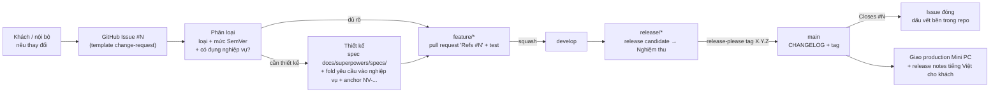

# Truy vết & quản lý thay đổi

Mảnh **thứ hai** của việc chuẩn hoá SDLC (Backlog #2 trong [quy trình phát hành](2026-06-07-quy-trinh-release-design.md)). Tuân theo [SDLC Overview](2026-06-07-sdlc-overview-design.md) (ADR-001 mô hình *Iterative/Incremental, design-first* + *Kanban*; ADR-002 chiến lược tài liệu/tri thức — nguồn sự thật trong repo, tự động hoá tối đa, đừng viết prose rồi mong người nhớ).

Mục tiêu: nối **yêu cầu → thiết kế → test → release** thành một chuỗi *truy vết được* và một *luồng thay đổi lặp lại được*, **chỉ dựa trên hạ tầng đã có** (GitHub Issues/pull request, Conventional Commits, release-please, CHANGELOG, Git Flow, tài liệu `docs/` có version). Không dựng quy trình nặng.

> **Cách đọc:** quyết định viết theo **ADR**: Bối cảnh → Quyết định → Lý do → Tradeoff → Phương án đã loại → Điều kiện xem lại → Trạng thái. ADR đánh số toàn cục, tiếp nối ADR-012 (mảnh CI). Mảnh này thêm **ADR-013, ADR-014, ADR-015**; bổ sung sau: **ADR-028** (cổng xác nhận khách trước build).

## Goals

- Một **yêu cầu/thay đổi của khách không rơi**: có luồng lặp lại từ tiếp nhận → phân loại → thiết kế → hiện thực + test → release → ghi nhận, ai cũng theo được.
- Trả lời được **truy vết xuôi**: cho một yêu cầu trong tài liệu nghiệp vụ, tìm ra **spec + test + release** nào hiện thực nó (và ngược lại, từ một release/commit lần về thay đổi — phần này gần như đã có sẵn nhờ git + Conventional Commits).
- **Tận dụng tối đa** cái đã có; dấu vết bền **tự rơi vào repo** chứ không phải bảng giữ tay; chi phí gần bằng không.

## Non-Goals (cố ý KHÔNG làm ở mảnh này)

- **Tiếp nhận lỗi production** + giám sát/bảo trì → **Backlog #3** (vận hành). Mảnh này chỉ bàn *thay đổi/yêu cầu*, không bàn quy trình sự cố.
- **Tiếp nhận & ưu tiên backlog công việc** (lập kế hoạch việc) → **Backlog #4**.
- **Cổng coverage tự động trong CI** (gắn mã yêu cầu vào test rồi để CI chặn yêu cầu thiếu test) → để dành; xem [Điều kiện xem lại ADR-014].
- **Bảng ma trận truy vết giữ tay**, **Change Control Board**, **đánh số lại toàn bộ tài liệu nghiệp vụ thành REQ-xxx** → loại theo YAGNI (xem Phương án đã loại trong từng ADR).
- **Bảng Kanban GitHub Projects bắt buộc** / nhãn trạng thái đầy đủ → loại (ADR-001 chọn "ít nghi thức"); để dành làm đường nâng cấp.

## Glossary (khoá nghĩa — không viết tắt)

| Thuật ngữ | Nghĩa |
|---|---|
| **Thay đổi (change)** | Một việc làm hệ thống khác đi: yêu cầu mới của khách, sửa hành vi, hoặc lỗi cần vá. Đơn vị theo dõi của luồng. |
| **GitHub Issue** | Phiếu trên GitHub đại diện cho một thay đổi; số `#N` là mã định danh thay đổi. |
| **Mã định danh yêu cầu** | Anchor ổn định `NV-<slug>` gắn vào một mục yêu cầu trong `docs/V2_XAC_NHAN_NGHIEP_VU.md`. |
| **Truy vết xuôi** | Từ một *yêu cầu* tìm ra *thiết kế → test → release* hiện thực nó. |
| **Truy vết ngược** | Từ một *thay đổi đã phát hành* (commit/release) lần về *yêu cầu/quyết định* sinh ra nó. |
| **Dấu vết bền** | Mẩu truy vết nằm trong repo (commit body, CHANGELOG, mục "Truy vết" của spec, anchor yêu cầu) — version-control, không phụ thuộc trí nhớ. |
| **Artifact tự mang trạng thái** | Trạng thái thay đổi *suy ra* từ artifact (Issue mở/đóng, có pull request liên kết, có trong CHANGELOG/tag), không gắn nhãn trạng thái tay. |

## Sơ đồ luồng thay đổi ↔ Git Flow

## Bối cảnh & hiện trạng

**Đã có sẵn (truy vết ngầm — phần lớn cho chiều ngược):**

- **Conventional Commits → release-please → `CHANGELOG.md` + `version.txt` + tag SemVer**: từ một release/commit luôn lần ngược được "đã đổi gì."
- **`docs/` có version + changelog riêng từng file** (ADR-002); **ADR đánh số toàn cục** (ADR-001..012) ghi quyết định + lý do.
- **Specs đã có mục "Truy vết"** nhưng chỉ trỏ *lên* tài liệu nguồn, **không nhất quán**, không có chiều ngược.
- **GitHub pull request** dùng nặng; Git Flow + branch-source guard (ADR-011) đã ép luật nhánh.

**Khoảng trống mảnh này lấp:**

1. **Chiều xuôi chưa tường minh.** Cho một yêu cầu trong `docs/V2_XAC_NHAN_NGHIEP_VU.md` (nguồn sự thật nghiệp vụ), không có cách biết spec/test/release nào hiện thực nó. Yêu cầu cũng **chưa có mã định danh ổn định** — chỉ là mục đánh số (`## 9`, `### 9.3`) dễ trượt khi tài liệu được khách bổ sung.
2. **Luồng tiếp nhận thay đổi chưa định nghĩa.** Khi khách gửi yêu cầu mới (ví dụ pull request #264 "bổ sung yêu cầu nghiệp vụ"), không có nơi/luồng chuẩn để nó không rơi giữa "khách nói" và "đã release."

---

## Quyết định (ADR)

### ADR-013: Mô hình quản lý thay đổi — Hybrid (GitHub Issues cho luồng, repo cho dấu vết bền)

- **Trạng thái:** Accepted · 2026-06-08
- **Bối cảnh:** Đội 2–3 người, chủ dự án duyệt & phát hành; Kanban "ít nghi thức" (ADR-001); nguồn sự thật trong repo (ADR-002). Khách chạy Mini PC offline, bối cảnh an ninh → **không có quyền truy cập repo private trên GitHub**. Đã dùng nặng GitHub pull request + release-please.
- **Quyết định:**
  1. **Hybrid.** *Luồng sống* của một thay đổi (tiếp nhận, phân loại, thảo luận) sống ở **GitHub Issue**; số `#N` là mã định danh thay đổi, tự liên kết pull request/commit. *Dấu vết bền* **không giữ tay** mà tự rơi vào repo: Conventional Commit body ghi `Refs #N`/`Closes #N` → `CHANGELOG.md` (release-please) → mục "Truy vết" của spec. **Không có bảng ma trận giữ tay.**
  2. **Vòng đời 6 bước**, ánh xạ thẳng Git Flow: (1) Tiếp nhận = mở Issue; (2) Phân loại = loại + mức SemVer + có đụng nghiệp vụ; (3) Thiết kế (nếu cần) = spec + fold yêu cầu vào tài liệu nghiệp vụ; (4) Hiện thực + test = `feature/*`, pull request `Refs #N`; (5) Release = `release/*` → release candidate → tag (release-please); (6) Đóng = `Closes #N`.
  3. **P1 — nhãn tối thiểu + artifact tự mang trạng thái.** Issue gắn **1 nhãn loại** (`change-request` / `enhancement` / `bug`) + nhãn `needs-design` khi cần spec. Trạng thái còn lại **đọc từ artifact** (có pull request liên kết = đang làm; merged = xong; có trong CHANGELOG/tag = đã release) — **không kéo thẻ, không đổi nhãn trạng thái tay**. Thêm **milestone = version đích** (gán một lần, không phải mỗi bước) để cả đội biết "việc gì nằm trong bản nào."
  4. **Lớp khách = mức release.** Khách thấy trạng thái qua **môi trường Nghiệm thu** (thử bản release candidate) + **release notes tiếng Việt** (đã có ở quy trình phát hành). Câu hỏi "đã nhận / đang làm chưa" trước release → **đội trả lời từ Issue/milestone list** rồi chuyển tiếp cho khách. Không mở board/issue cho khách (khách không có GitHub access).
- **Lý do:** Tránh được "sổ đăng ký giữ tay" — thứ chắc chắn rữa khi quên (đúng nguyên tắc ADR-002 "để máy/automation nhắc, đừng mong người nhớ"). Dấu vết bền vẫn nằm trong repo, **tự động** từ commit/CHANGELOG/spec. Tận dụng đúng công cụ đội đã dùng nặng — không thêm phụ thuộc, đúng ethos "miễn phí trước" của ADR-007. `#N` là mã định danh thay đổi rẻ nhất có thể và nuôi luôn truy vết.
- **Tradeoff:** (+) ít thao tác tay nhất (mở Issue + 1–2 nhãn), trạng thái luôn khớp thực tế vì suy ra từ artifact, dấu vết bền trong repo. (−) phần *thảo luận/triage* sống trên GitHub chứ không trong repo — chấp nhận được, đúng bằng tradeoff đã chấp nhận cho pull request. (−) không có một bảng tổng quan trực quan khi nhiều việc song song — để dành Projects làm đường nâng cấp.
- **Phương án đã loại:**
  - *Sổ đăng ký thay đổi trong repo (markdown giữ tay)* — hợp ADR-002 theo nghĩa đen nhất nhưng rủi ro rữa cao nhất + trùng việc với git/Issue. Loại.
  - *GitHub Issues thuần (không quy ước dấu vết trong repo)* — gần Hybrid nhưng mất khả năng **grep trong repo** để trả lời truy vết; phải mở GitHub. Hybrid thêm chút quy ước (chuẩn hoá "Truy vết" của spec) mà giá trị cao.
  - *Chỉ Kanban + commit, không formalize intake* — không diệt được "yêu cầu khách rơi" (mục tiêu chính). Thiếu.
  - *GitHub Projects Kanban đầy đủ / nhãn trạng thái đầy đủ* — bắt cập nhật trạng thái tay mỗi bước (đúng nghi thức ADR-001 muốn tránh); sinh **bản sao trạng thái thứ hai phải đồng bộ tay**, dễ lệch. Loại làm mặc định, giữ làm đường nâng cấp.
- **Điều kiện xem lại:** nhiều việc song song cần bảng tổng quan → bật **GitHub Projects** (không phá gì, chỉ thêm view); >5 người hoặc nhiều khách song song → cân nhắc cấu trúc chặt hơn (khớp Điều kiện xem lại ADR-001); khách có GitHub access thật → cân nhắc chia sẻ milestone/board read-only.

### ADR-014: Truy vết — mã định danh yêu cầu + liên kết

- **Trạng thái:** Accepted · 2026-06-08
- **Bối cảnh:** `#N` định danh *thay đổi*, nhưng *yêu cầu gốc* sống trong `docs/V2_XAC_NHAN_NGHIEP_VU.md` (nguồn sự thật nghiệp vụ) — cần neo riêng để spec/test/Issue trỏ tới **bền**. Tài liệu này chỉ có mục đánh số, không có mã; sẽ bị sửa khi khách bổ sung yêu cầu. Test corpus hiện tại (85 spec) đã được map độ phủ trong `docs/V2_KICH_BAN_TEST.md` + `docs/V2_CHIEU_TEST.md`.
- **Quyết định:**
  1. **Anchor yêu cầu tường minh, thêm dần (lazy).** Gắn `<a id="NV-<slug-chủ-đề>"></a>` ngay trước heading yêu cầu trong tài liệu nghiệp vụ, **chỉ khi lần đầu cần link tới** nó (thường là khi một thay đổi đụng tới). Slug **không dấu, theo chủ đề** (ví dụ `NV-phan-bo-bom-nuoc`), **không buộc vào số mục** để bền khi tài liệu chèn/đánh số lại. Granularity **cấp mục/tiểu mục**, không tới từng câu.
  2. **Chuẩn hoá mục "Truy vết" của spec.** Mỗi spec thiết kế kết bằng mục `## Truy vết` trỏ **lên**: yêu cầu (`NV-...`) + Issue (`#N`), và **liệt kê test** cover yêu cầu. Đây là nơi neo chiều xuôi trong repo.
  3. **Chiều ngược = grep anchor**, không giữ "down-link" trong tài liệu nghiệp vụ. Từ một yêu cầu `NV-...`, `grep` ra mọi spec/Issue tham chiếu nó. Tránh phải sửa tài liệu nghiệp vụ mỗi lần có thứ trỏ tới (chống churn).
  4. **Test ↔ yêu cầu = link phía spec/pull request, KHÔNG tag test code.** Spec "Truy vết" nêu file/khối test cover yêu cầu; pull request checklist xác nhận test cover. **Không** thêm metadata `requirement:` vào 85 spec. Corpus **cũ** (yêu cầu chưa có design spec) trỏ thẳng `docs/V2_KICH_BAN_TEST.md` / `docs/V2_CHIEU_TEST.md`.
- **Lý do:** Anchor tường minh sống sót khi đổi tên tiêu đề/đánh số lại (auto-anchor `#93-...` thì gãy đúng lúc khách sửa tài liệu). Lazy = chỉ trả chi phí cho yêu cầu thật sự được truy vết. Giữ link ở spec/pull request (thứ đằng nào cũng viết) thay vì nhồi vào test → **0 churn test**, vẫn grep được như khi tag. Corpus cũ đã có tài liệu test map sẵn → không boil-the-ocean.
- **Tradeoff:** (+) link bền, rẻ, grep được hai chiều, không đụng test. (−) chiều ngược cần một bước `grep` thay vì tra bảng dựng sẵn — chấp nhận được ở quy mô này. (−) anchor là thao tác tay khi fold yêu cầu — nhưng nằm gọn trong bước thiết kế, có pull request checklist nhắc.
- **Phương án đã loại:**
  - *Anchor cho toàn bộ ~27 mục một lượt* — churn tài liệu 68KB cho nhiều anchor có thể không bao giờ dùng. Loại.
  - *Chỉ auto-anchor sẵn có* — zero churn nhưng gãy khi sửa tiêu đề/đánh số lại. Loại.
  - *Mã REQ-xxx + sổ đăng ký yêu cầu* — chuẩn công nghiệp nhưng phải nuôi matrix tay; over-engineering cho đội 2–3 người. Loại.
  - *Tag metadata `requirement:` trong test code* — mở đường cổng coverage CI nhưng churn 85 spec + nuôi tag mãi; lợi ích coverage-gate hiện chưa cần. Loại (giữ làm đường nâng cấp).
- **Điều kiện xem lại:** cần **CI chặn yêu cầu thiếu test** → khi đó mới gắn tag `requirement:` vào test + viết script đối chiếu `NV-*` trong tài liệu với tag (đường nâng cấp từ phương án đã loại ở trên); số anchor nhiều tới mức khó quản → cân nhắc một mục "Danh mục mã yêu cầu" tự sinh.

### ADR-015: Artifact guardrail — template Issue / pull request / ADR

- **Trạng thái:** Accepted · 2026-06-08
- **Bối cảnh:** Luồng Hybrid (ADR-013) + quy ước truy vết (ADR-014) chỉ sống nếu **người làm nhớ áp dụng**. ADR-002 dạy: việc nào checklist/máy nhắc được thì đừng mong trí nhớ.
- **Quyết định:** Thêm 3 artifact mẫu (chỉ là file tĩnh, không thêm phụ thuộc):
  1. **`.github/ISSUE_TEMPLATE/change-request.md`** — form intake: ai yêu cầu (khách/nội bộ), mô tả, **có đụng nghiệp vụ không**, mức SemVer dự kiến (`feat`/`fix`/breaking), tiêu chí chấp nhận. Chuẩn hoá tiếp nhận → yêu cầu không rơi + đủ thông tin triage.
  2. **`.github/pull_request_template.md`** — checklist tự nhắc giữ chuỗi truy vết: có `Refs #N`? đã cập nhật mục "Truy vết" của spec (yêu cầu `NV-...` + test)? test đã cover yêu cầu? tài liệu `docs/` sửa thì đã bump version + changelog (ADR-002)?
  3. **Template ADR** — file mẫu codify đúng style 7 mục (Bối cảnh → Quyết định → Lý do → Tradeoff → Phương án đã loại → Điều kiện xem lại → Trạng thái) cho ADR-016+; đặt cạnh specs trong `docs/superpowers/`.
- **Lý do:** Guardrail nhẹ, $0, đúng tầng "checklist nhắc" của ADR-002; ép intake + ép link-back mà không cần tự động hoá phức tạp.
- **Tradeoff:** (+) giảm phụ thuộc trí nhớ, nhất quán. (−) template chỉ *nhắc*, không *ép cứng* (người vẫn có thể bỏ trống) — chấp nhận được khi một người merge + chủ dự án duyệt (đúng tinh thần ADR-007).
- **Phương án đã loại:**
  - *Bug report template* — tiếp nhận lỗi production thuộc Backlog #3 (vận hành); thêm bây giờ là lấn scope. Để #3 lo. (Nhãn `bug` vẫn dùng được cho lỗi nhỏ trong luồng phát triển.)
  - *GitHub Actions tự kiểm "pull request có Refs #N"* — tự động hoá guardrail; để dành, chưa cần khi một người merge.
- **Điều kiện xem lại:** template hay bị bỏ trống → cân nhắc Action kiểm tối thiểu; có quy trình sự cố (Backlog #3) → thêm bug/incident template ở mảnh đó.

### ADR-028: Cổng xác nhận khách trước build — tài liệu xác nhận versioned, Issue-anchored

- **Trạng thái:** Accepted · 2026-06-11 (Issue #320)
- **Bối cảnh:** ADR-013 đặt tương tác khách ở "mức release" (Nghiệm thu **sau** build), nhưng đội còn một bước thực tế: phân tích yêu cầu rồi **trình khách xác nhận TRƯỚC khi build**, thường qua **nhiều lượt** đến khi chốt. Bản trình khách vì thế là một tài liệu có vòng đời version riêng — ví dụ thực: `docs/V2_XAC_NHAN_NGHIEP_VU_BO_SUNG.md` đi v2.0.0 → 2.1.2 qua các vòng phản hồi (#264/#319). Cách cũ (#264) để bản này ở `docs/` gốc như một doc nghiệp vụ, lại có **trước** cả Issue → nguy cơ thành "nguồn canonical thứ hai", trái "sửa đừng thêm" (ADR-023) và đứt truy vết (ADR-013/014).
- **Quyết định:** Bổ sung "cổng xác nhận khách trước build" như một checkpoint trong **bước 3 (Thiết kế)**:
  1. **Issue-first.** Phải có Issue `#N` trước; tài liệu xác nhận mở đầu bằng `#N`; mỗi vòng trao đổi ghi vết comment ở Issue (khách duyệt/điều chỉnh gì, ngày nào).
  2. **Tài liệu xác nhận versioned trong repo**, đặt ở thư mục riêng `docs/xac-nhan-khach/` (tách khỏi `docs/` gốc để không trông như nguồn nghiệp vụ). Tạo thư mục khi lần đầu cần.
  3. **Version + changelog mỗi lượt** (đúng ADR-002): mỗi vòng khách phản hồi = bump version + một dòng changelog ("điều chỉnh X theo phản hồi ngày Y").
  4. **Vòng đời phân loại (per-file) trong `BAN_DO_TAI_LIEU.md`:** **current-state** khi đang chốt (tài liệu sống, sửa qua các lượt) → **lịch sử** khi đã chốt + đã fold (đông cứng, không viết lại). Per-file vì phân loại đổi theo vòng đời (không dùng glob).
  5. **Quy tắc thẩm quyền:** yêu cầu chỉ *ràng buộc* (được code theo) khi đã **fold vào `docs/V2_XAC_NHAN_NGHIEP_VU.md`** (canonical) + anchor `NV-...`. Trước đó tài liệu xác nhận chỉ là "đang đề xuất/đang chốt".
  6. **Vận hành AI-assisted:** trợ lý AI lo phần cơ học (soạn bản từ Issue/phân tích, đánh version, ghi vết, fold khi chốt); người giữ gate duyệt nội dung gửi khách, chuyển lời khách, duyệt fold. Nguyên tắc AI tổng quát: ADR-029 (Issue #322).
- **Lý do:** Tách hai vai mà #264 trộn — *nguồn yêu cầu* (Issue + canonical) vs *bản gửi khách* (deliverable phái sinh). "Có version" **không** đồng nghĩa "canonical": git + ADR-002 vốn là công cụ đúng cho tài liệu sửa nhiều lượt, nên giữ trong repo là hợp lý; chỉ cần thư mục riêng + phân loại + Issue-anchor + quy tắc fold để không lặp bẫy #264. Dùng đúng hạ tầng đã có, chi phí gần bằng không.
- **Tradeoff:** (+) bản gửi khách có version-control + changelog từng vòng, truy vết về Issue, không ô nhiễm canonical. (−) thêm một thư mục docs phải quản trị (doc-map) + thao tác đổi phân loại current-state→lịch sử khi graduate (per-file). (−) bản render đính kèm gửi khách (PDF/Excel) nếu không commit thì nằm ngoài repo — chấp nhận: nguồn chữ là markdown trong repo, render là phái sinh.
- **Phương án đã loại:**
  - *Bản gửi khách ad-hoc, không nằm repo (chỉ đính Issue)* — không làm được version + nhiều-lượt-trao-đổi mượt; mất changelog từng vòng. Loại.
  - *Luôn commit nhưng để `docs/` gốc cạnh nghiệp vụ* — đúng cách #264, dễ lại trông như canonical. Loại.
  - *Glob `docs/xac-nhan-khach/*` một phân loại trong doc-map* — gọn nhưng không diễn tả được vòng đời current-state→lịch sử của từng file. Loại, chọn per-file.
- **Điều kiện xem lại:** số tài liệu xác nhận nhiều tới mức per-file gây churn doc-map → cân nhắc glob + quy ước tách nhánh thư mục "đã chốt"; có công cụ render/gửi khách tự động → bổ sung bước sinh deliverable.

---

## Vòng đời thay đổi end-to-end (ví dụ thực tế)

**Tình huống:** Khách báo *"Cần thêm cột 'tháng trước' vào bảng tính tiền để đối chiếu."*

| Bước | Thao tác | Dấu vết bền để lại | Trạng thái suy ra từ đâu |
|---|---|---|---|
| 1. Tiếp nhận | Mở Issue bằng template change-request; điền ai yêu cầu, mô tả, có đụng nghiệp vụ, SemVer dự kiến `feat`. Gắn nhãn `enhancement` + `needs-design`. → **#42** | Issue `#42` | Tiếp nhận = Issue mở |
| 2. Phân loại | Đọc, xác nhận `feat` (MINOR), có đụng nghiệp vụ (thêm mô tả cột). | nhãn | `needs-design` đang treo |
| 3. Thiết kế | Brainstorm → spec; fold mô tả cột vào `V2_XAC_NHAN_NGHIEP_VU.md` §6, thêm ``. Spec kết bằng `## Truy vết` (yêu cầu `NV-cot-thang-truoc`, Issue `#42`, test dự kiến). **Gỡ** `needs-design`. | spec "Truy vết" ⇄ `#42`; anchor `NV-cot-thang-truoc` | Đang thiết kế = Issue mở, `needs-design`, chưa có pull request |
| 4. Hiện thực + test | `feature/cot-thang-truoc` từ `develop`; code + system spec cover cột. pull request vào `develop`, mô tả có `Refs #42`. | commit body, pull request | Đang làm = GitHub tự hiện "linked pull request" trên `#42` |
| 5. Release | Squash merge → `feat(billing): add previous-period column (#42)`. Gom vào `release/1.2` → release candidate → khách thử ở Nghiệm thu → release-please tag `1.2.0`. | `CHANGELOG.md` có dòng `(#42)`, tag | Đã release = thấy `#42` trong CHANGELOG 1.2.0 + tag |
| 6. Đóng | pull request release/merge-back; Issue đóng (`Closes #42`). Release notes tiếng Việt cho khách. | Issue đóng, link tự nối | Đóng = Issue closed |

**Truy vết về sau:**
- *"Cột tháng trước do ai/đâu yêu cầu?"* → `grep -rn "NV-cot-thang-truoc" docs/` → ra spec → mục "Truy vết" → Issue `#42` → mô tả khách.
- *"Yêu cầu này có test chưa?"* → spec "Truy vết" trỏ file test (yêu cầu mới); hoặc `V2_KICH_BAN_TEST.md` (yêu cầu cũ).
- *"Release nào giao nó?"* → `CHANGELOG.md` / git tag chứa commit `(#42)`.

Tổng thao tác *quản lý trạng thái bằng tay*: mở Issue + gắn/gỡ 1–2 nhãn + (tuỳ chọn) gán milestone `1.2`. Mọi trạng thái khác suy ra từ artifact.

## Tiêu chí thành công (đo được)

- Một yêu cầu khách đi trọn vòng đời mà **mở được Issue → ra spec → ra test → ra dòng CHANGELOG**, không đứt mắt xích nào.
- Từ một mã yêu cầu `NV-...`, `grep` ra **đúng** spec + Issue tham chiếu nó (chiều xuôi tường minh).
- Từ một dòng CHANGELOG/commit `(#N)`, mở ra **đúng** Issue → mô tả gốc (chiều ngược).
- Người mới onboarding hiểu luồng thay đổi chỉ qua `CONTRIBUTING.md` + spec này, không cần hỏi.
- **0 thay đổi code/test** do mảnh này (chỉ thêm template + tài liệu + quy ước); anchor thêm dần khi thực sự cần.

## Rủi ro & giảm thiểu

| Rủi ro | Giảm thiểu |
|---|---|
| Quên `Refs #N` / quên cập nhật "Truy vết" | pull request template nhắc; chủ dự án duyệt cuối. |
| Yêu cầu khách đến qua kênh ngoài (lời nói, chat) bị rơi | Quy ước: mọi thay đổi phải có Issue trước khi vào `feature/*`; đội mở Issue thay khách nếu cần. |
| Anchor `NV-...` đặt không nhất quán | Slug không dấu, theo chủ đề; quy tắc ghi rõ trong spec + `CONTRIBUTING.md`. |
| Sửa tài liệu nghiệp vụ để thêm anchor mà quên bump version/changelog | pull request template có mục kiểm; ADR-002 đã yêu cầu. |
| Khách muốn biết trạng thái nhưng không vào được GitHub | Lớp khách ở mức release (Nghiệm thu + release notes); đội chủ động chuyển tiếp từ Issue/milestone list. |
| Trạng thái trên milestone lệch | Milestone gán một lần theo version đích; reslot hiếm; không dùng làm trạng thái bước. |

## Truy vết

- **Yêu cầu nguồn (governs):** `docs/V2_XAC_NHAN_NGHIEP_VU.md` (nghiệp vụ — nguồn sự thật); thiết kế/hành vi/kiểm thử: `V2_THIET_KE_HE_THONG.md`, `V2_HANH_VI_HE_THONG.md`, `V2_CHIEU_TEST.md`, `V2_KICH_BAN_TEST.md`.
- **Umbrella:** [SDLC Overview](2026-06-07-sdlc-overview-design.md) — ADR-001 (mô hình), ADR-002 (tài liệu/tri thức).
- **Mảnh cha:** [Quy trình phát hành](2026-06-07-quy-trinh-release-design.md) — Backlog #2 (mảnh này); tận dụng ADR-008 (release-please/CHANGELOG), ADR-011/ADR-012 (CI), Git Flow (ADR-003).
- **Issue/thay đổi liên quan khi nghiệm thu thiết kế:** pull request #264 ("bổ sung yêu cầu nghiệp vụ cho khách xem") là *nội dung yêu cầu mẫu* mà luồng này sẽ quản lý — dùng để đối chiếu thiết kế; **không phải điều kiện chặn**.
- **Đã hiện thực** (plan [`2026-06-08-truy-vet-quan-ly-thay-doi.md`](../plans/2026-06-08-truy-vet-quan-ly-thay-doi.md)): `.github/ISSUE_TEMPLATE/change-request.md`, `.github/pull_request_template.md`, `docs/superpowers/ADR-TEMPLATE.md`; mục 9 "Quản lý thay đổi & truy vết" trong `CONTRIBUTING.md`; pointer trong `AGENTS.md`; Backlog #2 trong release spec đã chốt ✅.

## Changelog

- **0.3.1 (2026-06-13):** Theo ADR-033 (#339): bỏ field frontmatter `status:` (nguồn duy nhất = inline `**Trạng thái:**`); lật trạng thái các ADR đã merge sang `Accepted`.
- **0.3.0 (2026-06-11):** Thêm **ADR-028** (cổng xác nhận khách trước build — tài liệu xác nhận versioned trong `docs/xac-nhan-khach/`, Issue-anchored, current-state→lịch sử, fold-mới-ràng-buộc, vận hành AI-assisted). Issue #320; bối cảnh #264/#319.
- **0.2.0 (2026-06-08):** Hiện thực xong (xem plan `2026-06-08-truy-vet-quan-ly-thay-doi.md`): thêm 3 template (Issue change-request, pull request, ADR), mục 9 `CONTRIBUTING.md`, pointer `AGENTS.md`; cập nhật mục "Truy vết" sang trạng thái đã hiện thực.
- **0.1.0 (2026-06-08):** Bản thảo đầu — ADR-013 (Hybrid: GitHub Issues cho luồng + repo cho dấu vết bền; vòng đời 6 bước; P1 nhãn tối thiểu + artifact tự mang trạng thái + milestone; lớp khách mức release), ADR-014 (anchor yêu cầu `NV-...` tường minh thêm dần; chuẩn hoá "Truy vết" của spec; chiều ngược grep; test ↔ yêu cầu ở phía spec/pull request không tag test), ADR-015 (template Issue change-request + pull request + ADR). Hiện thực truy vết yêu cầu → thiết kế → test → release (Backlog #2). Chờ duyệt.
