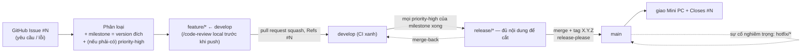

# Hướng dẫn onboarding SDLC (lối vào distill) + rà soát mạch lạc tài liệu

Hiện thực hai mục **"Cải tiến optional"** của [quy trình phát hành](2026-06-07-quy-trinh-release-design.md) (*cheat-sheet `AGENTS.md`* + *checklist onboarding*) khi **trigger đã chạm**, và — theo yêu cầu chủ dự án — **rà soát mạch lạc** các tài liệu canonical đã lệch sau loạt thay đổi SDLC. Truy vết: GitHub Issue [`#307`](https://github.com/manhcuongdtbk/electric-water-management/issues/307).

**Ba bối cảnh định hình mảnh này:**

1. **Người đọc chính là intern/junior rất non kỹ thuật** (ngoài chủ dự án). **Nguyên tắc "viết dễ hiểu cho người non" áp cho MỌI file human-facing động đến trong mảnh này**, không riêng guide — xem [Nguyên tắc viết](#nguyên-tắc-viết-cho-người-rất-non-cross-cutting). **Dễ hiểu ưu tiên hơn ngắn gọn**; dài hơn cũng được.
2. **Tài liệu canonical đã lệch sau loạt thay đổi SDLC gần đây.** Một loạt audit (đã kiểm chứng với ADR + grep) cho thấy nhiều `.md` còn mô tả mô hình **cũ** (`-rc.N`, env "Nghiệm thu/Mốc/Staging", cắt nhánh từ `main`) — đúng cái chủ dự án nghi ngờ ("append không tích hợp"). Mảnh này **sửa cho khớp ADR hiện tại** (không đổi quyết định).
3. **Giao làm hai giai đoạn / hai pull request** (chủ dự án chốt) để dễ duyệt — xem [Phạm vi](#phạm-vi-hiện-thực-hai-giai-đoạn).

Tuân theo [SDLC Overview](2026-06-07-sdlc-overview-design.md): **ADR-001** (Kanban *"ít nghi thức"*) và **ADR-002** (*repo là nguồn sự thật duy nhất; distill chứ không trùng; file meta gốc không versioned, docs/ có version*). Mảnh này thêm **ADR-022**.

> **Cách đọc:** quyết định viết theo **ADR**: Bối cảnh → Quyết định → Lý do → Tradeoff → Phương án đã loại → Điều kiện xem lại → Trạng thái. ADR đánh số toàn cục, tiếp nối ADR-021 (`ci-spec`).

## Goals

- **Người rất non đọc hiểu được:** sau khi đọc `docs/HUONG_DAN_SDLC.md`, một intern chưa có nền hiểu *vòng đời một thay đổi* và *tra chi tiết ở đâu* — không phải mở 6 spec.
- **Mọi file human-facing động đến đều dễ hiểu cho người non** (guide, `CONTRIBUTING.md`, `README.md`, các guide versioned được sửa) — giải thích thuật ngữ, câu ngắn.
- **Distill + giải thích, không chép nguyên thủ tục:** guide chứa mental model + giải thích khái niệm + **trỏ** `CONTRIBUTING §x` / `ADR-NNN` (DRY — ADR-002).
- **Giữ `AGENTS.md` ngắn/canonical:** chỉ pointer + sửa drift, **không** nhồi cheat-sheet (chủ dự án đã chốt — người non học qua guide, không qua `AGENTS.md`).
- **Tài liệu canonical hết drift:** khớp ADR hiện tại (đặc biệt bỏ mô hình `-rc.N`/"Staging"/"Nghiệm thu-Mốc"; nhánh cắt từ `develop`). **Không đổi quyết định nào.**
- **Chi phí gần bằng không, 0 thay đổi code/test** — *docs-only*; CI bỏ qua job test (ADR-021).

## Non-Goals (cố ý KHÔNG làm)

- **Viết lại nội dung 6 spec** → guide chỉ distill + trỏ (tránh nguồn sự thật thứ hai, ADR-002).
- **Nhồi cheat-sheet / làm `AGENTS.md` dài dòng** → loại; `AGENTS.md` giữ ngắn/mệnh lệnh (cũng phục vụ công cụ AI).
- **Sửa các bản ghi versioned/lịch sử** — `docs/superpowers/plans/*`, các spec cũ (trừ release spec ở phần đánh dấu optional) → **loại**; chúng là dấu vết thời điểm, có changelog riêng, không phản ánh "trạng thái hiện tại".
- **Đụng tài liệu ngoài phạm vi SDLC** — `docs/V2_*` (nghiệp vụ/thiết kế/test), `docs/hdsd/*` (hướng dẫn người dùng cuối), `CHANGELOG.md` (release-please tự sinh) → **loại**.
- **Rewrite toàn bộ file canonical** → loại; audit kết luận cấu trúc đúng, chỉ **sửa có mục tiêu**.
- **Ép độ dài ≤1 trang** → bỏ (mâu thuẫn "dễ hiểu cho người non").

## Glossary (khoá nghĩa — không viết tắt)

| Thuật ngữ | Nghĩa |
|---|---|
| **Lối vào distill (onboarding guide)** | `docs/HUONG_DAN_SDLC.md` — bản cô đọng, dễ hiểu, *bản đồ* trỏ tới nguồn chi tiết, không phải nguồn sự thật mới. |
| **Doc current-state** | Tài liệu mô tả *trạng thái hiện tại* mà đội đọc như sự thật: `AGENTS.md`, `CONTRIBUTING.md`, `README.md`, các guide trong `docs/` (deploy, Docker), template `.github`. **Phải đúng bây giờ.** |
| **Bản ghi versioned/lịch sử** | `docs/superpowers/plans/*`, các design spec — dấu vết thời điểm, có changelog riêng. **Không viết lại** dù nhắc mô hình cũ. |
| **Rà soát mạch lạc** | Đọc lại *toàn file* để gỡ trùng, sửa mô hình/tham chiếu lỗi thời, làm rõ chỗ khó hiểu — **giữ nguyên ý**, chỉ đồng bộ ADR hiện tại. |
| **Append không tích hợp** | Nhét mục mới mà không đọc lại tổng thể → trùng/lệch (đúng cái audit phát hiện: drift `-rc.N`, "Staging"). |

## Sơ đồ vòng đời một thay đổi (sẽ nằm trong guide)

## Bối cảnh & hiện trạng

- **4 mảnh SDLC tuần tự đã xong** → tri thức trải trên **6 spec** (ADR-001..021) + `CONTRIBUTING.md` 11 mục + `AGENTS.md`. Lượng lớn; đội còn lại **intern/junior rất non** — chưa có lối vào đủ dễ. Bảng "Cải tiến optional" treo hai mục này ở **Hoãn** với trigger "có người mới onboard"; **trigger đã chạm**.
- **Kết quả rà soát toàn bộ `.md` (đã kiểm chứng):** tách bạch *doc current-state* (phải đúng) vs *bản ghi versioned/lịch sử* (giữ nguyên). Drift thật nằm ở doc current-state:

  | File | Loại | Phát hiện (đã verify) | Mức |
  |---|---|---|---|
  | `AGENTS.md` | meta | dòng tóm tắt Git Flow còn `-rc.N`; dòng "ba môi trường (Development / Nghiệm thu + Mốc...)" cũ; thiếu mệnh đề kiểu merge | cao |
  | `CONTRIBUTING.md` | meta | `-rc.N` ở §2 (release/* "deploy Nghiệm thu" + tag rc), §6 (tóm tắt), §8 ("rc/UAT để dành P4"); §8 chưa rõ ✅/⏳; §4 không trỏ cổng §11 | cao |
  | `README.md` | meta | dòng ~43 worktree "tách nhánh mới từ **main**" → phải **develop** (Git Flow); phần env đã đúng mô hình mới | cao (1 điểm) |
  | `docs/KIEN_THUC_DOCKER.md` | guide (versioned) | §11 bảng + sơ đồ Mermaid dùng "Development/Test/**Staging**/Production" cũ + URL Railway đơn; thiếu acceptance/mirror, `APPLICATION_ENVIRONMENT_LABEL`, nguồn nhánh Git Flow | cao, nhiều |
  | `docs/HUONG_DAN_DEPLOY.md` | guide (versioned) | cụm sao lưu/khôi phục: thiếu cảnh báo "tạo backup Lớp 1 **trước** restore" (verify khớp `CONTRIBUTING §10` + ADR-017); vai trò Lớp 1 (snapshot) vs Lớp 3 (nguồn cậy chính, off-box, 7 bản) chưa rõ | vừa |
  | `.github/*` (templates, pull request) | meta | **OK** — đã current (env mới, `severity-critical`, `Refs #N`, ADR-002, merge §2). Không sửa | — |
  | `docs/superpowers/plans/*`, spec cũ, `docs/V2_*`, `docs/hdsd/*`, `CHANGELOG.md` | lịch sử/nghiệp vụ/auto | **loại** (xem Non-Goals) | — |

---

## Nguyên tắc viết (cho người rất non — cross-cutting)

Áp cho **mọi file human-facing động đến** (guide mới, và phần được sửa trong `CONTRIBUTING.md`, `README.md`, `KIEN_THUC_DOCKER.md`, `HUONG_DAN_DEPLOY.md`):

- Giải thích **mỗi thuật ngữ kỹ thuật bằng một câu tiếng Việt đời thường ngay lần đầu** (nhánh/branch, commit, pull request, merge, squash, tag, CI, SemVer, milestone, hotfix, restore…).
- Câu ngắn, chủ động, xưng "bạn"; **không giả định** người đọc đã biết Git Flow / Docker.
- Ưu tiên ví dụ cụ thể; nêu *vì sao* chứ không chỉ *làm gì*.
- **Không viết tắt** (trừ CI/ADR/CRUD/UI); tiếng Việt 100%.
- **DRY:** giải thích để *hiểu*, rồi trỏ tới nguồn cho *lệnh/thủ tục chính xác*; không chép khối lệnh dài.
- **Ngoại lệ `AGENTS.md`** (chủ dự án chốt): giữ **ngắn/mệnh lệnh** (canonical + phục vụ công cụ AI); chỉ sửa rõ drift + thêm pointer; **không** thêm giải thích dài — người non được dẫn sang guide.

## Quyết định (ADR)

### ADR-022: Lối vào onboarding distill cho SDLC + rà soát mạch lạc tài liệu canonical
- **Trạng thái:** Proposed · 2026-06-09
- **Bối cảnh:** Tri thức SDLC trải trên 6 spec + `CONTRIBUTING.md` + `AGENTS.md`; người đọc chính là intern/junior rất non. Bảng "Cải tiến optional" treo "cheat-sheet" + "checklist onboarding" ở Hoãn (sợ phình/lệch `AGENTS.md`, ADR-002); trigger đã chạm. Audit còn cho thấy nhiều doc current-state lệch ADR (mô hình `-rc.N`, "Staging", cắt nhánh từ `main`).
- **Quyết định:** (1) Tạo **một** lối vào distill `docs/HUONG_DAN_SDLC.md` (versioned), viết **cho người rất non**, distill + trỏ. (2) **Không** cheat-sheet trong `AGENTS.md`: chỉ **pointer** + **checklist onboarding ngắn** ở `CONTRIBUTING.md §1`. (3) **Rà soát mạch lạc** các doc current-state lệch (sửa drift cho khớp ADR hiện tại, giữ `AGENTS.md` ngắn) — **không** đụng bản ghi versioned/lịch sử. (4) Nguyên tắc "viết dễ hiểu cho người non" áp cho mọi file human-facing động đến (ngoại lệ `AGENTS.md` giữ ngắn). (5) Giao **hai giai đoạn / hai pull request** để dễ duyệt.
- **Lý do:** Giải nhu cầu "lối vào dễ hiểu" mà không vi phạm lý do Hoãn cũ (distill ở `docs/`, không ở `AGENTS.md`); pointer giữ file gốc ngắn. Rà soát kèm theo là bắt buộc — vô nghĩa nếu lối vào trỏ tới tài liệu đang lệch. Tách current-state vs lịch sử để sửa đúng chỗ, không nhiễu bản ghi thời điểm. Hai pull request giữ mỗi lần review gọn cho người (đội non).
- **Tradeoff:** (+) lối vào ai cũng theo được; `AGENTS.md` ngắn; doc current-state hết drift; review nhẹ. (−) guide dài hơn một trang (chấp nhận); thêm file `docs/` phải giữ đồng bộ (giảm thiểu: chỉ mental model + pointer); phải bump version 3 guide versioned (KIEN_THUC_DOCKER, HUONG_DAN_DEPLOY, guide mới) — chi phí nhỏ, đúng ADR-002.
- **Phương án đã loại:** *Cheat-sheet trong `AGENTS.md`* (phình/lệch — lý do Hoãn cũ); *guide ≤1 trang kiểu cheat-sheet* (người non không theo nổi); *chỉ thêm pointer, không rà soát* (lối vào trỏ tài liệu lệch); *sửa cả plans/spec lịch sử* (nhiễu dấu vết thời điểm); *gộp một pull request 7 file* (review nặng); *rewrite toàn bộ file canonical* (thừa, rủi ro mất nuance).
- **Điều kiện xem lại:** guide bắt đầu chép thủ tục chi tiết (lệch DRY) → cắt về mental model + pointer; đội >5 người / nhiều khách (≈ ADR-001) → onboarding sâu hơn / tách trang.

---

## Phạm vi hiện thực (hai giai đoạn)

**Nguyên tắc chung cho mọi sửa đổi (bắt buộc):** *đọc lại TOÀN BỘ file trước khi sửa* (tích hợp, không append); giữ nguyên ý; mỗi sửa drift phải khớp ADR được trích; file `docs/` có version → **bump version + entry changelog trong cùng commit** (ADR-002); file meta gốc (`AGENTS.md`/`CONTRIBUTING.md`/`README.md`) **không** versioned.

### Giai đoạn 1 — pull request 1 (onboarding + rà soát meta)

**A. File mới `docs/HUONG_DAN_SDLC.md`** (versioned `1.0.0`; header `> **Phiên bản:**`/`> **Ngày:** 09/06/2026`/`> **Đối tượng:** thành viên mới, kể cả người chưa quen Git/CI` + `## Lịch sử thay đổi`). Nội dung:
1. Mục đích (2–3 câu) + "đọc cái này trước, chi tiết ở `CONTRIBUTING` + spec".
2. **Từ vựng nhanh** — bảng giải nghĩa thuật ngữ cốt lõi bằng tiếng Việt đời thường.
3. Sơ đồ vòng đời (Mermaid ở trên).
4. **Vòng đời một thay đổi** — 6 bước, mỗi bước: *chuyện gì xảy ra (đời thường) → vì sao → chi tiết ở `CONTRIBUTING §`*.
5. **Bảng tra cứu nhanh** (gộp khi viết cho vừa) — ánh xạ chủ đề → quy tắc 1 dòng → `CONTRIBUTING §x` + ADR:

   | Chủ đề | Quy tắc cốt lõi | Chi tiết |
   |---|---|---|
   | Nhánh & merge | Git Flow; `feature/*` ← `develop`, **squash** vào `develop`; `release//hotfix` → `main` **merge-commit**; merge-back | `§2` · ADR-003 |
   | Commit ↔ version | Conventional Commits (tiếng Anh): `feat`→MINOR, `fix`→PATCH, `BREAKING`→MAJOR; release-please tự bump/changelog/tag | `§3, §6` · ADR-004, ADR-008 |
   | Vòng đời & Issue | Mọi việc bắt đầu từ Issue `#N`; pull request ghi `Refs/Closes #N` | `§4, §9` · ADR-013 |
   | Truy vết | Anchor `NV-<slug>`; spec kết `## Truy vết`; grep 2 chiều | `§9` · ADR-014, ADR-015 |
   | Ưu tiên & cổng release | `severity-critical` > `priority-high` theo milestone > còn lại; cắt `release/*` khi mọi `priority-high` xong | `§11` · ADR-019, ADR-020 |
   | Sự cố 2 bậc | Thường → `feature/*`; nghiêm trọng (`severity-critical`) → `hotfix/*` ← `main` | `§10` · ADR-018 |
   | Vận hành & backup | Review khi giao bản; backup Lớp 3 off-box bắt buộc; restore tạo Lớp 1 trước | `§10` · ADR-016, ADR-017 |
   | CI | Job tĩnh luôn chạy; job test chỉ khi đụng code (path filter, fail-safe) | `§8` · ADR-011, ADR-012, ADR-021 |
   | Nhánh xếp chồng | Việc B cần A chưa merge → `feature/B` từ nhánh A; sau khi A merged `rebase --onto develop` | `§4` · ADR-021 |
   | Môi trường | Dev local Docker; **3 env Railway** `development`/`acceptance`(←`main`)/`mirror`(←tag production); Production = Mini PC offline; **không `-rc.N`** | release spec · ADR-005, ADR-006 |
   | Cộng tác & review | `/code-review` local trước push; pair qua VS Code Dev Tunnel | `§4, §5` · ADR-009, ADR-010 |
   | Tài liệu | `docs/` versioned → bump version+changelog; file meta gốc không versioned | `AGENTS.md` · ADR-002 |
6. Mini-box "quy ước sống còn": tài liệu/giao diện tiếng Việt; commit + tiêu đề pull request tiếng Anh; không viết tắt (trỏ bảng "Từ viết tắt được phép" ở `AGENTS.md`); luôn worktree riêng + Docker.
7. Footer: "Chi tiết & lý do → `CONTRIBUTING.md` + `docs/superpowers/specs/` (ADR-001..022)."

*(Bổ sung theo review chủ dự án — v0.4.0):* guide thêm các mục **"Mô hình nhánh: Git Flow"** (làm rõ Git Flow là mô hình nhánh cụ thể + link bài gốc nvie), **"Ba nghĩa của môi trường"** (application/Rails/Railway + mặc định = application environment), **"Lỗi thường vs lỗi nghiêm trọng"** (bảng so sánh); **link hoá** mọi tham chiếu file/spec/ADR; **đồng nhất "merge"** (bỏ "gộp"); **bỏ từ "distill"** trong guide; định nghĩa **"chủ dự án"**, **"canonical"**, **rebase**; **ghi chú công cụ** (hiện chỉ Claude Code). Ưu tiên dễ hiểu hơn ngắn (guide có thể dài hơn).

**B. Pointer + checklist onboarding + làm rõ thuật ngữ (meta, không versioned).**
- `AGENTS.md`: thêm **1–2 dòng pointer** gần đầu trỏ guide là *lối vào cho người mới*; **giải thích "canonical"** ngay lần đầu dùng; thêm **ghi chú công cụ** (hiện chỉ Claude Code, các tự động hoá là tính năng Claude Code); thêm **bảng "Từ viết tắt được phép"** (CI/ADR/CRUD/UI/SDLC/SemVer) làm nguồn tập trung duy nhất, sửa quy tắc "Nguyên tắc viết" trỏ về bảng. Vẫn giữ ngắn.
- `CONTRIBUTING.md §1`: thêm **checklist onboarding ngắn** trỏ guide (không đánh số lại 11 mục); gloss "canonical" ở lần dùng đầu.

**C. Sửa drift meta (đã verify).**
- `AGENTS.md`: dòng tóm tắt Git Flow — bỏ *"kèm hậu tố `-rc.N`"*, nêu **không dùng `-rc.N`** (Acceptance deploy thẳng `main`), thêm mệnh đề **kiểu merge** (squash `feature`→`develop`; merge-commit cho `release`·`hotfix`), trỏ `CONTRIBUTING §2` + ADR-004/005/008; cập nhật dòng "ba môi trường" sang `development`/`acceptance`/`mirror` + Production Mini PC (tên tiếng Anh, trỏ ADR-005). Giữ ngắn.
- `CONTRIBUTING.md`: §2 — `release/*` **không** deploy Railway / **không** `-rc.N` (Acceptance chạy `main`); §6 — tóm tắt bỏ *"deploy Nghiệm thu (`-rc.N`)"* → *merge `main` → release-please tag → Acceptance (chạy `main`) cho khách nghiệm thu*; §8 — *"rc/UAT để dành P4"* → *"không dùng rc/UAT; Acceptance deploy `main` (ADR-005/008)"* + đánh dấu **✅ đã làm / ⏳ hoãn** cho từng automation; §4 — thêm dòng trỏ cổng "release-readiness" (§11).
- `README.md`: dòng ~43 — `# tách nhánh mới từ main` → **từ `develop`** (Git Flow); rà nhanh phần còn lại đã khớp mô hình mới.

**D. Cập nhật release spec + bump.** `docs/superpowers/specs/2026-06-07-quy-trinh-release-design.md` — 2 dòng bảng "Cải tiến optional" (verdict Hoãn → **✅ Đã làm**, ghi rõ giải bằng `HUONG_DAN_SDLC.md` + pointer + rà soát mạch lạc, **vẫn tôn trọng ADR-002**) + **bump version** + entry `## Changelog`. *File NÓNG: fetch `develop` lại trước khi tạo pull request; develop di chuyển thì merge vào rồi đẩy version/changelog mình lên trên.*

### Giai đoạn 2 — pull request 2 (rà soát guide ops versioned)

**E. `docs/KIEN_THUC_DOCKER.md`** (versioned → bump + changelog). §11 "4 môi trường": bảng + sơ đồ Mermaid + mô tả — thay mô hình cũ "Development/Test/**Staging**/Production" (một env Railway) bằng mô hình hiện tại: **3 env Railway** `development`(←develop)/`acceptance`(←main)/`mirror`(←tag production) + **Production = Mini PC offline**; thêm biến `APPLICATION_ENVIRONMENT_LABEL` (phân biệt env khi `RAILS_ENV=production`); thêm ghi chú ngắn nguồn nhánh Git Flow (feature/release ← develop; hotfix ← main); làm rõ thuật ngữ cho người non. Trỏ ADR-005. (README dòng mô tả file này — "4 môi trường" — chỉnh cho khớp nếu cần.)

**F. `docs/HUONG_DAN_DEPLOY.md`** (versioned → bump + changelog). Cụm sao lưu/khôi phục: thêm cảnh báo **tạo backup Lớp 1 trước khi restore** (khớp `CONTRIBUTING §10` + ADR-017); làm rõ **Lớp 1** = snapshot tạm trước thao tác nguy hiểm, **Lớp 3** = nguồn cậy chính (cron, off-box, 7 bản); nhắc backup trước bước cập nhật phiên bản. *Đọc đúng các mục thực tế trước khi sửa (số dòng audit chỉ là gợi ý).*

## Tiêu chí thành công (đo được)

- **Một intern chưa có nền** đọc `HUONG_DAN_SDLC.md` hiểu được vòng đời một thay đổi + biết tra đâu, không phải mở 6 spec; mọi thuật ngữ được giải thích.
- Guide distill + trỏ (không chép thủ tục); mọi mục trỏ `CONTRIBUTING §x` / ADR.
- `AGENTS.md` vẫn ngắn (chỉ +pointer +mệnh đề merge +sửa drift); `CONTRIBUTING.md` +checklist onboarding.
- **Không file current-state nào còn nhắc `-rc.N` / "Staging" / "deploy Nghiệm thu từ release/*" / cắt nhánh từ `main`**; mô tả môi trường khớp ADR-005 (development/acceptance/mirror).
- `HUONG_DAN_DEPLOY.md` nêu rõ "backup Lớp 1 trước restore" + vai trò Lớp 1/3; `KIEN_THUC_DOCKER.md` §11 + Mermaid khớp mô hình hiện tại.
- 2 dòng bảng "Cải tiến optional" → **✅ Đã làm**; mọi file `docs/` versioned được sửa đã bump version + changelog.

## Truy vết

- **Issue:** [`#307`](https://github.com/manhcuongdtbk/electric-water-management/issues/307) (`change-request`) — `Refs #307` ở cả hai pull request; `Closes #307` ở pull request cuối (giai đoạn 2).
- **Lên:** bảng "Cải tiến optional" trong [`2026-06-07-quy-trinh-release-design.md`](2026-06-07-quy-trinh-release-design.md) (trigger) + [`2026-06-07-sdlc-overview-design.md`](2026-06-07-sdlc-overview-design.md) ADR-002. Phần rà soát drift đồng bộ với **ADR-003** (nhánh từ `develop`), **ADR-004/005/008** (bỏ `-rc.N`, env mới), **ADR-016/017** (sao lưu/khôi phục).
- **Test:** không — *docs-only*; CI path filter (ADR-021) bỏ qua job test.
- **Anchor `NV-...`:** không — không đụng tài liệu nghiệp vụ.

## Changelog

- **0.4.0 (2026-06-09):** Sau review của chủ dự án trên `docs/HUONG_DAN_SDLC.md` (PR1) — tinh chỉnh guide cho dễ hiểu hơn nữa: (1) **link** tới mọi file/spec/ADR được nhắc; (2) **đồng nhất thuật ngữ** với GitHub — luôn dùng "merge" (bỏ "gộp"), giải nghĩa thuật ngữ trước khi dùng; (3) **bỏ từ "distill"** trong guide (khó hiểu) — dùng "lối vào/tổng quan"; (4) thêm mục **"Mô hình nhánh: Git Flow"** (làm rõ Git Flow là mô hình nhánh cụ thể + link bài gốc nvie); (5) thêm mục **"Ba nghĩa của môi trường"** (application/Rails/Railway + mặc định = application environment); (6) thêm mục **"Lỗi thường vs lỗi nghiêm trọng"** dạng bảng so sánh; (7) định nghĩa **"chủ dự án"** (project owner, không phải GitHub Projects) + **rebase**; (8) **ghi chú công cụ**: hiện chỉ dùng Claude Code, các tự động hoá là tính năng Claude Code. Kèm rà soát canonical: thêm **bảng "Từ viết tắt được phép"** (nguồn tập trung duy nhất: CI/ADR/CRUD/UI/SDLC/SemVer) + giải thích **"canonical"** + ghi chú công cụ vào `AGENTS.md`; gloss "canonical" + pointer guide ở `CONTRIBUTING.md`. Không đổi quyết định nào.
- **0.3.0 (2026-06-09):** Sau phản hồi chủ dự án — (1) nguyên tắc "dễ hiểu cho người non" thành **cross-cutting** cho mọi file human-facing động đến (ngoại lệ `AGENTS.md` giữ ngắn, đã chốt); (2) **mở rộng rà soát toàn bộ `.md`**: thêm verified drift ở `README.md` (cắt nhánh từ `main`), `KIEN_THUC_DOCKER.md` (mô hình "Staging" cũ), `HUONG_DAN_DEPLOY.md` (sao lưu/khôi phục); tách *doc current-state* vs *bản ghi versioned/lịch sử* (loại plans/spec/V2_*/hdsd/CHANGELOG); (3) chia phạm vi **hai giai đoạn / hai pull request**; (4) thêm nguyên tắc bump version cho guide versioned. ADR-022 cập nhật.
- **0.2.0 (2026-06-09):** Audience đổi sang intern/junior rất non (bỏ ràng buộc ≤1 trang, thêm Từ vựng + Nguyên tắc viết); mở rộng phạm vi rà soát `AGENTS.md` + `CONTRIBUTING.md` theo audit (drift `-rc.N` verify với ADR-004/005/008); gắn Issue `#307`.
- **0.1.0 (2026-06-09):** Bản thảo đầu — ADR-022 (lối vào distill + pointer, không cheat-sheet trong `AGENTS.md`); Goals/Non-Goals/Glossary; sơ đồ; phạm vi 4 thay đổi; tiêu chí; truy vết.
