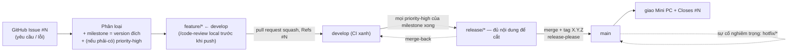

# Hướng dẫn onboarding SDLC (lối vào distill)

Hiện thực hai mục trong bảng **"Cải tiến optional"** của [quy trình phát hành](2026-06-07-quy-trinh-release-design.md) — *"Cheat-sheet đầu `AGENTS.md`"* và *"Checklist onboarding (`CONTRIBUTING.md`)"* — khi **trigger hồi sinh đã chạm**: đội cần ôn lại toàn bộ SDLC. Truy vết: GitHub Issue [`#307`](https://github.com/manhcuongdtbk/electric-water-management/issues/307).

**Hai bối cảnh quan trọng định hình mảnh này:**

1. **Người đọc chính là intern/junior rất non kỹ thuật** (ngoài chủ dự án). Hướng dẫn phải **dễ hiểu là trên hết** — người chưa biết Git Flow / pull request / CI / SemVer đọc vẫn theo được. **Dài hơn một trang cũng chấp nhận** nếu cần để dễ hiểu; ưu tiên *hiểu được* hơn *ngắn gọn*.
2. **Tài liệu canonical (`AGENTS.md`, `CONTRIBUTING.md`) đã lệch sau loạt thay đổi SDLC gần đây** — một audit (xem [Bối cảnh](#bối-cảnh--hiện-trạng)) xác nhận chúng **mô tả mô hình cũ `-rc.N`** trong khi ADR-004/005/008 đã bỏ. Nên mảnh này **kèm một lượt rà soát mạch lạc** hai file đó, không chỉ thêm pointer.

Tuân theo [SDLC Overview](2026-06-07-sdlc-overview-design.md): **ADR-001** (Kanban *"ít nghi thức"*, đội nhỏ) và **ADR-002** (chiến lược tài liệu — *repo là nguồn sự thật duy nhất, đừng sinh sổ song song, distill chứ không trùng*). Mảnh này thêm **ADR-022**.

> **Cách đọc:** quyết định viết theo **ADR**: Bối cảnh → Quyết định → Lý do → Tradeoff → Phương án đã loại → Điều kiện xem lại → Trạng thái. ADR đánh số toàn cục, tiếp nối ADR-021 (`ci-spec`).

## Goals

- **Người rất non đọc hiểu được:** sau khi đọc `docs/HUONG_DAN_SDLC.md`, một intern chưa có nền hiểu *vòng đời một thay đổi đi xuyên hệ thống thế nào* và *tra chi tiết ở đâu* — không phải mở 6 spec.
- **Distill + giải thích, không chép nguyên thủ tục:** guide chứa mental model + giải thích thuật ngữ bằng tiếng Việt đời thường + **trỏ** tới `CONTRIBUTING §x` / `ADR-NNN` cho thủ tục/lệnh chi tiết (DRY — ADR-002). Giải thích *khái niệm* để hiểu ≠ chép *quy tắc/thủ tục* (cái đó vẫn ở `CONTRIBUTING`).
- **Giữ `AGENTS.md` ngắn/canonical:** chỉ thêm pointer, **không** nhồi cheat-sheet (tôn trọng đúng lý do "Hoãn" cũ trong bảng optional).
- **`AGENTS.md` + `CONTRIBUTING.md` mạch lạc trở lại:** sửa các điểm *lệch / append không tích hợp* mà audit tìm ra (đặc biệt mô hình `-rc.N` lỗi thời), để hai file khớp ADR hiện tại — **không đổi quyết định nào**, chỉ cập nhật cho đúng.
- **Chi phí gần bằng không, 0 thay đổi code/test** — thay đổi *docs-only* nên CI bỏ qua job test (ADR-021).

## Non-Goals (cố ý KHÔNG làm)

- **Viết lại nội dung 6 spec** → loại; guide chỉ distill + trỏ (tránh nguồn sự thật thứ hai, ADR-002).
- **Nhồi cheat-sheet dài vào `AGENTS.md`** → loại (phình file canonical, nội dung quy trình dễ lệch — chính lý do Hoãn cũ).
- **Rewrite toàn bộ `AGENTS.md`/`CONTRIBUTING.md`** → loại; audit kết luận cấu trúc đã đúng, chỉ cần **sửa có mục tiêu** (~10 dòng `AGENTS.md`, ~20 dòng `CONTRIBUTING.md`).
- **Đổi bất kỳ quyết định SDLC nào** (ADR-001..021 giữ nguyên) → mảnh này chỉ *thêm lối vào* + *đồng bộ tài liệu với ADR đã chốt*.
- **Ép độ dài ≤1 trang** → bỏ ràng buộc cứng này (mâu thuẫn với "dễ hiểu cho người non"); thay bằng *"ngắn nhất có thể mà người rất non vẫn theo được"*.

## Glossary (khoá nghĩa — không viết tắt)

| Thuật ngữ | Nghĩa |
|---|---|
| **Lối vào distill (onboarding guide)** | `docs/HUONG_DAN_SDLC.md` — bản cô đọng, dễ hiểu, là *bản đồ* trỏ tới nguồn chi tiết, không phải nguồn sự thật mới. |
| **Pointer** | 1–2 dòng dẫn trong file canonical (`AGENTS.md`) / quy trình (`CONTRIBUTING.md`) trỏ tới lối vào — không lặp lại nội dung. |
| **Vòng đời một thay đổi** | Chuỗi Issue → phân loại → `feature/*` → `develop` → `release/*` → `main`/tag → giao + đóng Issue — mạch xuyên suốt nối mọi mảnh SDLC. |
| **Rà soát mạch lạc** | Đọc lại toàn file để gỡ trùng lặp, sửa tham chiếu/ mô hình lỗi thời, làm rõ chỗ khó hiểu — **giữ nguyên ý**, chỉ đồng bộ với ADR hiện tại. |
| **Append không tích hợp** | Lỗi thường gặp: nhét mục mới vào file mà không đọc lại tổng thể → trùng/lệch/mâu thuẫn (đúng cái audit phát hiện ở mô hình `-rc.N`). |

## Sơ đồ vòng đời một thay đổi (sẽ nằm trong guide)

## Bối cảnh & hiện trạng

- **4 mảnh SDLC tuần tự đã xong** → tri thức trải trên **6 spec SDLC** (ADR-001..021) + `CONTRIBUTING.md` **11 mục** + `AGENTS.md` (canonical). Lượng đủ lớn để *ngay cả chủ dự án* thấy khó nắm nhanh; đội còn lại là **intern/junior rất non** — không có lối vào nào đủ dễ.
- Bảng **"Cải tiến optional"** của release spec treo hai mục này ở verdict **Hoãn**, lý do *"`AGENTS.md` vốn ngắn/canonical, cheat-sheet dễ trùng & lệch (ADR-002)"*, kèm trigger *"có người mới onboard / gia nhập đội"*. **Trigger nay đã chạm.**
- **Audit `AGENTS.md` + `CONTRIBUTING.md` (đã chạy, đã kiểm chứng với spec)** kết luận hai file *mạch lạc về cơ bản* nhưng có drift thật, chứng minh nghi ngờ "append không tích hợp":
  - **(Cao — sửa)** Cả hai còn mô tả mô hình **`-rc.N` / "deploy Nghiệm thu từ `release/*`"** đã bị **ADR-004 (ghi chú P4), ADR-005 (P4), ADR-008 (P4)** bỏ: **không dùng `-rc.N`**, **Acceptance deploy thẳng `main`**, ba env Railway `development`/`acceptance`/`mirror`. Vị trí: `AGENTS.md` dòng tóm tắt Git Flow (*"kèm hậu tố `-rc.N`"*); `CONTRIBUTING.md` mục 2 (dòng ~19), mục 6 (dòng ~89), mục 8 (dòng ~106 *"rc/UAT để dành P4"*).
  - **(Vừa — làm rõ)** `CONTRIBUTING.md` mục 8 (tự động hoá) không phân biệt rõ *đã làm* vs *còn hoãn*; mục 4 không trỏ tới cổng "release-readiness" (mục 11); `AGENTS.md` không nhắc **kiểu merge** (squash vào `develop` / merge-commit cho `release`·`hotfix`) — quan trọng với release-please.
  - **(Kết luận audit)** *Không cần rewrite.* Sửa có mục tiêu là đủ.

---

## Quyết định (ADR)

### ADR-022: Lối vào onboarding distill cho SDLC — guide dễ hiểu + pointer, kèm rà soát mạch lạc; không cheat-sheet trong `AGENTS.md`
- **Trạng thái:** Proposed · 2026-06-09
- **Bối cảnh:** Tri thức SDLC trải trên 6 spec (ADR-001..021) + `CONTRIBUTING.md` 11 mục + `AGENTS.md`. Người đọc chính là intern/junior rất non. Bảng "Cải tiến optional" treo "cheat-sheet đầu `AGENTS.md`" + "checklist onboarding" ở Hoãn vì sợ phình file canonical + lệch nội dung (ADR-002); trigger đã chạm. Audit còn cho thấy `AGENTS.md`/`CONTRIBUTING.md` đã lệch ADR (mô hình `-rc.N`).
- **Quyết định:** (1) Tạo **một** lối vào distill `docs/HUONG_DAN_SDLC.md` (versioned theo quy ước docs/), viết **cho người rất non** — sơ đồ vòng đời + vòng đời một thay đổi (6 bước, giải thích thuật ngữ) + bảng tra cứu (chủ đề → quy tắc 1 dòng → trỏ `CONTRIBUTING §x` + `ADR`). Ưu tiên dễ hiểu hơn ngắn; **không** chép thủ tục/lệnh chi tiết (trỏ về `CONTRIBUTING`). (2) **Không** nhồi cheat-sheet vào `AGENTS.md`: chỉ thêm 1–2 dòng **pointer** ở đầu + **checklist onboarding ngắn** ở §1 `CONTRIBUTING.md`, cả hai trỏ guide. (3) **Rà soát mạch lạc** `AGENTS.md` + `CONTRIBUTING.md` theo audit — sửa drift (đặc biệt `-rc.N`) để khớp ADR hiện tại, giữ `AGENTS.md` ngắn.
- **Lý do:** Giải đúng nhu cầu "lối vào dễ hiểu" mà **không vi phạm lý do Hoãn cũ** — phần distill nằm trong `docs/` (đúng chỗ cho nội dung versioned), không trong `AGENTS.md` canonical; pointer giữ hai file gốc ngắn. Distill + *giải thích khái niệm* + trỏ giữ một nguồn sự thật (ADR-002): thủ tục/quy tắc vẫn ở spec/`CONTRIBUTING`. Rà soát kèm theo là bắt buộc — vô nghĩa nếu lối vào trỏ tới tài liệu đang lệch.
- **Tradeoff:** (+) một lối vào ai cũng theo được; `AGENTS.md` vẫn ngắn; tài liệu canonical hết drift; không nguồn sự thật thứ hai. (−) guide dài hơn một trang (chấp nhận, vì người non cần giải thích); thêm một file `docs/` phải giữ đồng bộ khi quy trình đổi — giảm thiểu bằng cách chỉ chứa mental model + pointer, tuyệt đối không chép chi tiết.
- **Phương án đã loại:** *Cheat-sheet trực tiếp trong `AGENTS.md`* — phình file canonical, dễ lệch (lý do Hoãn cũ, ADR-002). *Guide siêu ngắn ≤1 trang kiểu cheat-sheet* — người rất non không theo nổi. *Chỉ thêm pointer, không rà soát* — lối vào trỏ tới tài liệu đang lệch `-rc.N`, sai. *Rewrite toàn bộ hai file canonical* — thừa, rủi ro mất nuance; audit nói cấu trúc đã đúng.
- **Điều kiện xem lại:** guide bắt đầu chép thủ tục/lệnh chi tiết (lệch DRY) → cắt về mental model + pointer; hoặc đội >5 người / nhiều khách (≈ Điều kiện xem lại ADR-001) cần onboarding sâu hơn → tách trang chuyên đề.

---

## Phạm vi hiện thực

### A. File mới `docs/HUONG_DAN_SDLC.md` (lối vào dễ hiểu cho người non)

Header: `# Title` + blockquote `> **Phiên bản:** 1.0.0` / `> **Ngày:** 09/06/2026` / `> **Đối tượng:** thành viên mới (kể cả người chưa quen Git/CI)` + `## Lịch sử thay đổi` (theo quy ước docs/ guide như `HUONG_DAN_DEPLOY.md`).

**Nguyên tắc viết (cho người rất non):**
- Giải thích **mỗi thuật ngữ kỹ thuật bằng một câu tiếng Việt đời thường ngay lần đầu** (nhánh/branch, commit, pull request, merge, squash, tag, CI, SemVer, milestone, hotfix…). Có thể có một mục "Từ vựng nhanh".
- Câu ngắn, chủ động, xưng "bạn"; **không giả định** người đọc đã biết Git Flow.
- Dùng **một ví dụ xuyên suốt** (vd: "thêm cột so sánh kỳ") đi hết vòng đời để người đọc bám theo.
- Vẫn **không viết tắt** (trừ CI/ADR/CRUD/UI); tiếng Việt 100%.
- **DRY:** giải thích để *hiểu*, rồi trỏ `CONTRIBUTING §x` cho *lệnh/thủ tục chính xác*. Không chép nguyên khối lệnh dài.

**Nội dung:**
1. **Mục đích** (2–3 câu): đọc cái này trước để nắm toàn cục; chi tiết & lý do ở `CONTRIBUTING.md` + `docs/superpowers/specs/`.
2. **Từ vựng nhanh** — bảng nhỏ giải nghĩa thuật ngữ cốt lõi bằng tiếng Việt đời thường.
3. **Sơ đồ vòng đời** (Mermaid ở trên).
4. **Vòng đời một thay đổi** — 6 bước, mỗi bước: *chuyện gì xảy ra (đời thường) → vì sao → lệnh/chi tiết ở `CONTRIBUTING §`*.
5. **Bảng tra cứu nhanh** — nguồn ánh xạ (gộp khi viết để vừa phải):

   | Chủ đề | Quy tắc cốt lõi (1 dòng) | Chi tiết |
   |---|---|---|
   | Nhánh & merge | Git Flow; `feature/*` ← `develop`, **squash** vào `develop`; `release//hotfix` → `main` **merge-commit**; merge-back bắt buộc | `CONTRIBUTING §2` · ADR-003 |
   | Commit ↔ version | Conventional Commits (tiếng Anh): `feat`→MINOR, `fix`→PATCH, `BREAKING`→MAJOR; release-please tự bump + changelog + tag | `§3, §6` · ADR-004, ADR-008 |
   | Vòng đời & Issue | Mọi việc bắt đầu từ GitHub Issue `#N`; pull request ghi `Refs/Closes #N` | `§4, §9` · ADR-013 |
   | Truy vết | Anchor `NV-<slug>` trong tài liệu nghiệp vụ; spec kết `## Truy vết`; grep 2 chiều | `§9` · ADR-014, ADR-015 |
   | Ưu tiên & cổng release | `severity-critical` > `priority-high` theo milestone > còn lại; cắt `release/*` khi mọi `priority-high` của milestone đã xong (việc không cờ → reslot) | `§11` · ADR-019, ADR-020 |
   | Sự cố 2 bậc | Thường → `feature/*`; nghiêm trọng (`severity-critical`) → `hotfix/*` ← `main` (cân nhắc rollback tag trước) | `§10` · ADR-018 |
   | Vận hành & backup | Review khi giao bản; backup Lớp 3 off-box bắt buộc; diễn tập restore mỗi bản giao | `§10` · ADR-016, ADR-017 |
   | CI | Job tĩnh luôn chạy; job test **chỉ khi đụng code** (path filter, fail-safe) | `§8` · ADR-011, ADR-012, ADR-021 |
   | Nhánh xếp chồng | Việc B cần A chưa merge → cắt `feature/B` từ nhánh A; sau khi A merged `rebase --onto develop` | `§4` · ADR-021 |
   | Môi trường | Dev local Docker; **3 env Railway** `development`/`acceptance`(←`main`)/`mirror`(←tag production); Production = Mini PC offline; **không dùng `-rc.N`** | release spec · ADR-005, ADR-006 |
   | Cộng tác & review | `/code-review` local trước khi push, chủ dự án duyệt cuối; pair qua VS Code Dev Tunnel | `§4, §5` · ADR-009, ADR-010 |
   | Tài liệu | `docs/` versioned → bump version + changelog khi sửa; file meta gốc (`README`/`AGENTS`/`CONTRIBUTING`/`CLAUDE`) không versioned | `AGENTS.md` · ADR-002 |

6. **Mini-box "quy ước sống còn":** tài liệu/giao diện tiếng Việt; commit + tiêu đề pull request tiếng Anh; không viết tắt (trừ CI/ADR/CRUD/UI); luôn worktree riêng + Docker.
7. **Footer:** "Chi tiết & lý do → `CONTRIBUTING.md` + `docs/superpowers/specs/` (ADR-001..022)."

### B. Pointer ở `AGENTS.md` + checklist onboarding ở `CONTRIBUTING.md`

- **`AGENTS.md`** — thêm **1–2 dòng pointer** gần đầu (sau blockquote mở đầu) trỏ `docs/HUONG_DAN_SDLC.md` là *lối vào nhanh cho người mới*. KHÔNG cheat-sheet. File meta gốc → **không** versioned.
- **`CONTRIBUTING.md`** — thêm **checklist onboarding ngắn** lồng vào **§1 "Trước khi bắt đầu"** (không đánh số lại 11 mục) trỏ guide. File meta gốc → **không** versioned.

### C. Rà soát mạch lạc `AGENTS.md` + `CONTRIBUTING.md` (theo audit, đã kiểm chứng)

Nguyên tắc: **đọc lại toàn file, tích hợp chứ không append; giữ nguyên ý; chỉ đồng bộ với ADR hiện tại; giữ `AGENTS.md` ngắn.**

- **Sửa drift `-rc.N` (Cao — đúng đắn, đã kiểm chứng ADR-004/005/008):**
  - `AGENTS.md`: dòng tóm tắt Git Flow — bỏ *"kèm hậu tố `-rc.N` cho bản chờ nghiệm thu"*; nêu **không dùng `-rc.N`** (Acceptance deploy thẳng `main`), trỏ ADR-004/005/008. Cập nhật dòng "ba môi trường" sang `development`/`acceptance`/`mirror` + Production Mini PC (tên tiếng Anh, trỏ ADR-005).
  - `CONTRIBUTING.md` §2: `release/*` **không** deploy Railway / **không** tag `-rc.N` (Acceptance chạy `main`). §6: tóm tắt phát hành bỏ *"deploy Nghiệm thu (`-rc.N`)"* → *merge `main` → release-please tag → Acceptance (chạy `main`) cho khách nghiệm thu*. §8: dòng *"rc/UAT để dành P4"* → *"không dùng rc/UAT; Acceptance deploy `main` trực tiếp (ADR-005/008)"*.
- **Làm rõ / liên kết (Vừa — trong phạm vi, đừng quá tay):**
  - `CONTRIBUTING.md` §8: đánh dấu rõ **✅ đã làm** vs **⏳ còn hoãn** cho từng automation (CI tĩnh, CI test, path-filter, hooks đã làm; rc/UAT không làm).
  - `CONTRIBUTING.md` §4: thêm một dòng trỏ tới cổng "release-readiness" ở §11 (khi nào cắt `release/*`).
  - `AGENTS.md`: thêm mệnh đề ngắn về **kiểu merge** (squash `feature`→`develop`; merge-commit cho `release`·`hotfix`) trong dòng tóm tắt quy trình, trỏ `CONTRIBUTING §2`.
- **Không làm:** rewrite cấu trúc; đổi quyết định; thêm chi tiết dài vào `AGENTS.md`.

> Mọi đề xuất sửa cụ thể (số dòng) sẽ chốt trong implementation plan; bước hiện thực **đọc lại toàn bộ hai file** trước khi sửa (đúng tinh thần "tích hợp không append").

### D. Cập nhật release spec + bump

`docs/superpowers/specs/2026-06-07-quy-trinh-release-design.md` — cập nhật **2 dòng** bảng "Cải tiến optional" (verdict "Hoãn" → **✅ Đã làm**, ghi rõ giải bằng `HUONG_DAN_SDLC.md` + pointer + rà soát mạch lạc, **vẫn tôn trọng ADR-002**) + **bump version** + entry `## Changelog`. *File NÓNG: fetch `develop` lại trước khi tạo pull request; nếu develop di chuyển thì merge vào rồi đẩy version/changelog của mình lên trên.*

## Tiêu chí thành công (đo được)

- **Một intern chưa có nền** đọc `HUONG_DAN_SDLC.md` hiểu được **vòng đời một thay đổi** + biết tra chi tiết ở đâu, **không phải mở 6 spec**; mọi thuật ngữ kỹ thuật đều được giải thích.
- Guide **distill + trỏ** — không chép thủ tục/lệnh chi tiết; mọi mục trỏ `CONTRIBUTING §x` / `ADR-NNN`.
- `AGENTS.md` vẫn ngắn (chỉ +pointer +mệnh đề merge); `CONTRIBUTING.md` +checklist onboarding (không đánh số lại).
- `AGENTS.md` + `CONTRIBUTING.md` **không còn nhắc `-rc.N`/"deploy Nghiệm thu từ `release/*`"**; mô tả môi trường khớp ADR-005 (development/acceptance/mirror).
- Hai dòng bảng "Cải tiến optional" của release spec → **✅ Đã làm**; version release spec đã bump + có entry changelog.

## Truy vết

- **Issue:** [`#307`](https://github.com/manhcuongdtbk/electric-water-management/issues/307) (`change-request`) — `Refs #307` trong pull request hiện thực.
- **Lên:** bảng "Cải tiến optional" trong [`2026-06-07-quy-trinh-release-design.md`](2026-06-07-quy-trinh-release-design.md) (hai mục: *cheat-sheet `AGENTS.md`* + *checklist onboarding*) — trigger hồi sinh; [`2026-06-07-sdlc-overview-design.md`](2026-06-07-sdlc-overview-design.md) ADR-002 (chiến lược tài liệu). Phần rà soát mạch lạc đồng bộ `AGENTS.md`/`CONTRIBUTING.md` với **ADR-004/005/008** (ghi chú P4).
- **Test:** không — thay đổi *docs-only*; CI path filter (ADR-021) bỏ qua job test.
- **Anchor `NV-...`:** không — không đụng tài liệu nghiệp vụ.

## Changelog

- **0.2.0 (2026-06-09):** Sau phản hồi chủ dự án — (1) audience đổi sang **intern/junior rất non**, ưu tiên dễ hiểu hơn ngắn (bỏ ràng buộc ≤1 trang), thêm "Nguyên tắc viết" + "Từ vựng nhanh"; (2) **mở rộng phạm vi: rà soát mạch lạc `AGENTS.md` + `CONTRIBUTING.md`** dựa trên audit (drift `-rc.N` đã kiểm chứng với ADR-004/005/008 + vài điểm làm rõ); (3) gắn Issue `#307` vào Truy vết. ADR-022 cập nhật cho khớp.
- **0.1.0 (2026-06-09):** Bản thảo đầu — ADR-022 (lối vào distill `docs/HUONG_DAN_SDLC.md` + pointer, không cheat-sheet trong `AGENTS.md`); Goals/Non-Goals/Glossary; sơ đồ vòng đời; phạm vi 4 thay đổi + nội dung guide; tiêu chí thành công; truy vết.
