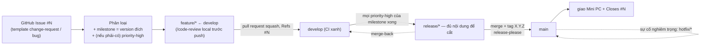

# Hướng dẫn onboarding SDLC (lối vào distill)

Hiện thực hai mục trong bảng **"Cải tiến optional"** của [quy trình phát hành](2026-06-07-quy-trinh-release-design.md) — *"Cheat-sheet đầu `AGENTS.md`"* và *"Checklist onboarding (`CONTRIBUTING.md`)"* — khi **trigger hồi sinh đã chạm**: đội 2–3 người cần ôn lại toàn bộ SDLC mà không phải đọc hết 6 spec + `CONTRIBUTING.md` 11 mục.

Tuân theo [SDLC Overview](2026-06-07-sdlc-overview-design.md): **ADR-001** (Kanban *"ít nghi thức"*, đội nhỏ) và **ADR-002** (chiến lược tài liệu — *repo là nguồn sự thật duy nhất, đừng sinh sổ song song, distill chứ không trùng*). Mảnh này thêm **ADR-022**.

> **Cách đọc:** quyết định viết theo **ADR**: Bối cảnh → Quyết định → Lý do → Tradeoff → Phương án đã loại → Điều kiện xem lại → Trạng thái. ADR đánh số toàn cục, tiếp nối ADR-021 (`ci-spec`).

## Goals

- **Lối vào ngắn (~1 trang, đọc ~10 phút)** để một thành viên nắm được *vòng đời một thay đổi đi xuyên hệ thống thế nào* rồi biết tra chi tiết ở đâu.
- **Distill, không trùng:** guide chỉ chứa mental model + **trỏ** tới `CONTRIBUTING §x` + `ADR-NNN`; KHÔNG chép lại nội dung spec/`CONTRIBUTING` (DRY — ADR-002).
- **Giữ `AGENTS.md` ngắn/canonical:** chỉ thêm pointer, **không** nhồi cheat-sheet (tôn trọng đúng lý do "Hoãn" cũ trong bảng optional).
- **Chi phí gần bằng không, 0 thay đổi code/test** — thay đổi *docs-only* nên CI bỏ qua job test (ADR-021).

## Non-Goals (cố ý KHÔNG làm)

- **Viết lại nội dung 6 spec hay `CONTRIBUTING.md`** → loại; chỉ distill + trỏ (tránh nguồn sự thật thứ hai, ADR-002).
- **Nhồi cheat-sheet dài vào `AGENTS.md`** → loại (phình file canonical, nội dung quy trình dễ lệch spec — chính lý do Hoãn cũ).
- **Tạo tài liệu onboarding nhiều trang / sổ tay quy trình** → loại (YAGNI; mục tiêu là *giảm* lượng đọc, không tăng).
- **Đổi bất kỳ quyết định SDLC nào** (ADR-001..021 giữ nguyên) → chỉ thêm một *lối vào*.

## Glossary (khoá nghĩa — không viết tắt)

| Thuật ngữ | Nghĩa |
|---|---|
| **Lối vào distill (onboarding guide)** | `docs/HUONG_DAN_SDLC.md` — bản cô đọng ~1 trang, là *bản đồ* trỏ tới nguồn chi tiết, không phải nguồn sự thật mới. |
| **Pointer** | 1–2 dòng dẫn trong file canonical (`AGENTS.md`) / quy trình (`CONTRIBUTING.md`) trỏ tới lối vào — không lặp lại nội dung. |
| **Vòng đời một thay đổi** | Chuỗi Issue → phân loại → `feature/*` → `develop` → `release/*` → `main`/tag → giao + đóng Issue — mạch xuyên suốt nối mọi mảnh SDLC. |

## Sơ đồ vòng đời một thay đổi (sẽ nằm trong guide)

## Bối cảnh & hiện trạng

- **4 mảnh SDLC tuần tự đã xong** → tri thức trải trên **6 spec SDLC** (ADR-001..021) + `CONTRIBUTING.md` **11 mục** + `AGENTS.md` (canonical). Tổng lượng đủ lớn để *ngay cả chủ dự án* thấy quá nhiều — không có một lối vào ngắn.
- Bảng **"Cải tiến optional"** của release spec đã treo hai mục này ở verdict **Hoãn**, lý do *"`AGENTS.md` vốn ngắn/canonical, cheat-sheet dễ trùng & lệch (ADR-002)"*, kèm trigger *"có người mới onboard / gia nhập đội"*. **Trigger nay đã chạm.**
- **Khoảng trống mảnh này lấp** (là *quy ước/tài liệu*, không phải tính năng): thiếu một bản distill cho người mới/người ôn nắm toàn cục nhanh rồi mới đào sâu đúng chỗ.

---

## Quyết định (ADR)

### ADR-022: Lối vào onboarding distill cho SDLC — guide + pointer, không cheat-sheet trong `AGENTS.md`
- **Trạng thái:** Proposed · 2026-06-09
- **Bối cảnh:** Tri thức SDLC trải trên 6 spec (ADR-001..021) + `CONTRIBUTING.md` 11 mục + `AGENTS.md`. Đội 2–3 người cần ôn lại toàn bộ nhưng lượng đọc quá lớn. Bảng "Cải tiến optional" treo "cheat-sheet đầu `AGENTS.md`" + "checklist onboarding `CONTRIBUTING.md`" ở Hoãn vì sợ phình file canonical + lệch nội dung (ADR-002); trigger "có người mới onboard / gia nhập đội" đã chạm.
- **Quyết định:** Tạo **một** lối vào distill `docs/HUONG_DAN_SDLC.md` (~1 trang, versioned theo quy ước docs/) gồm: sơ đồ vòng đời + mô tả vòng đời một thay đổi (6 bước) + **bảng tra cứu** (chủ đề → quy tắc 1 dòng → trỏ `CONTRIBUTING §x` + `ADR-NNN`). **Không** nhồi cheat-sheet vào `AGENTS.md`: chỉ thêm 1–2 dòng **pointer** ở đầu `AGENTS.md` và một **checklist onboarding ngắn** lồng vào §1 `CONTRIBUTING.md`, cả hai trỏ về guide.
- **Lý do:** Giải đúng nhu cầu "lối vào ngắn" mà **không vi phạm chính lý do Hoãn cũ** — phần distill (có thể đổi theo quy trình) nằm trong `docs/` (đúng chỗ cho nội dung versioned), không trong `AGENTS.md` canonical; pointer giữ `AGENTS.md`/`CONTRIBUTING.md` ngắn. Guide *distill + trỏ* nên giữ một nguồn sự thật (ADR-002): chi tiết vẫn ở spec/`CONTRIBUTING`, guide chỉ là bản đồ.
- **Tradeoff:** (+) một lối vào ~10 phút; `AGENTS.md` vẫn ngắn; không sinh nguồn sự thật thứ hai (guide chỉ trỏ). (−) thêm một file `docs/` phải giữ đồng bộ khi quy trình đổi — giảm thiểu bằng cách chỉ chứa mental model + pointer (ít thay đổi), tuyệt đối không chép chi tiết.
- **Phương án đã loại:** *Cheat-sheet trực tiếp trong `AGENTS.md`* — phình file canonical, nội dung quy trình dễ lệch spec (đúng lý do Hoãn cũ, ADR-002). *Chỉ một file `docs/` độc lập, không pointer* — người mới khó tìm lối vào, hai mục optional chưa thực sự khép. *Giữ nguyên Hoãn / không làm* — trigger đã chạm, đội cần ôn lại.
- **Điều kiện xem lại:** guide phình quá ~1 trang hoặc bắt đầu chép nội dung chi tiết (lệch DRY) → cắt về mental model + pointer; hoặc đội >5 người / nhiều khách song song (≈ Điều kiện xem lại ADR-001) cần onboarding sâu hơn → cân nhắc tách trang chuyên đề.

---

## Phạm vi hiện thực (4 thay đổi)

1. **File mới `docs/HUONG_DAN_SDLC.md`** (~80–110 dòng), có `> **Phiên bản:** 1.0.0` + `## Lịch sử thay đổi` (theo quy ước docs/ guide như `HUONG_DAN_DEPLOY.md`). Nội dung: xem mục dưới.
2. **`AGENTS.md`** — thêm **1–2 dòng pointer** gần đầu (sau blockquote mở đầu) trỏ `docs/HUONG_DAN_SDLC.md` là *lối vào nhanh*. KHÔNG cheat-sheet. File meta gốc → **không** versioned.
3. **`CONTRIBUTING.md`** — thêm **checklist onboarding ngắn** lồng vào **§1 "Trước khi bắt đầu"** (không đánh số lại 11 mục) trỏ guide. File meta gốc → **không** versioned.
4. **`docs/superpowers/specs/2026-06-07-quy-trinh-release-design.md`** — cập nhật **2 dòng** bảng "Cải tiến optional" (verdict "Hoãn" → **✅ Đã làm**, ghi rõ giải bằng `HUONG_DAN_SDLC.md` + pointer, **vẫn tôn trọng ADR-002**) + **bump version** + thêm entry `## Changelog` (ADR-002). *File NÓNG: fetch `develop` lại trước khi tạo pull request; nếu develop di chuyển thì merge vào rồi đẩy version/changelog của mình lên trên.*

### Nội dung `docs/HUONG_DAN_SDLC.md`

1. **Mục đích** (2 câu): đọc ~10 phút để nắm toàn cục; chi tiết & lý do ở `CONTRIBUTING.md` + `docs/superpowers/specs/`.
2. **Sơ đồ vòng đời** (Mermaid ở trên).
3. **Vòng đời một thay đổi** — 6 bước text ngắn, mỗi bước trỏ `CONTRIBUTING §`.
4. **Bảng tra cứu nhanh** — nguồn ánh xạ (khi viết guide gộp lại để giữ ≤1 trang):

   | Chủ đề | Quy tắc cốt lõi | Chi tiết |
   |---|---|---|
   | Nhánh & merge | Git Flow; `feature/*` ← `develop`, **squash** vào `develop`; `release//hotfix` → `main` **merge-commit**; merge-back bắt buộc | `CONTRIBUTING §2` · ADR-003 |
   | Commit ↔ version | Conventional Commits (tiếng Anh): `feat`→MINOR, `fix`→PATCH, `BREAKING`→MAJOR; release-please tự bump + changelog + tag | `§3, §6` · ADR-004, ADR-008 |
   | Vòng đời & Issue | Mọi việc bắt đầu từ GitHub Issue `#N`; pull request ghi `Refs/Closes #N` | `§4, §9` · ADR-013 |
   | Truy vết | Anchor `NV-<slug>` trong tài liệu nghiệp vụ; spec kết `## Truy vết`; grep 2 chiều | `§9` · ADR-014, ADR-015 |
   | Ưu tiên & cổng release | `severity-critical` > `priority-high` theo milestone > còn lại; cắt `release/*` khi mọi `priority-high` của milestone đã xong (việc không cờ → reslot) | `§11` · ADR-019, ADR-020 |
   | Sự cố 2 bậc | Thường → `feature/*`; nghiêm trọng (`severity-critical`) → `hotfix/*` ← `main` (cân nhắc rollback tag trước) | `§10` · ADR-018 |
   | Vận hành & backup | Review khi giao bản; backup Lớp 3 off-box bắt buộc; diễn tập restore mỗi bản giao | `§10` · ADR-016, ADR-017 |
   | CI | Job tĩnh luôn chạy; job test **chỉ khi đụng code** (path filter, fail-safe) | `§8` · ADR-011, ADR-012, ADR-021 |
   | Nhánh xếp chồng | Việc B cần A chưa merge → cắt `feature/B` từ nhánh A; sau khi A merged `rebase --onto develop` | `§4` · ADR-021 |
   | Môi trường | Dev local Docker; Acceptance ← `main`; Mirror ← tag production; Production = Mini PC offline | release spec · ADR-005, ADR-006 |
   | Cộng tác & review | `/code-review` local trước push, chủ dự án duyệt cuối; pair qua VS Code Dev Tunnel | `§4, §5` · ADR-009, ADR-010 |
   | Tài liệu | `docs/` versioned → bump version + changelog khi sửa; file meta gốc (`README`/`AGENTS`/`CONTRIBUTING`/`CLAUDE`) không versioned | `AGENTS.md` · ADR-002 |

5. **Mini-box "quy ước sống còn":** tài liệu/giao diện tiếng Việt; commit + tiêu đề pull request tiếng Anh; không viết tắt (trừ CI/ADR/CRUD/UI); luôn worktree riêng + Docker.
6. **Footer:** "Chi tiết & lý do → `CONTRIBUTING.md` + `docs/superpowers/specs/` (ADR-001..022)."

## Tiêu chí thành công (đo được)

- Một thành viên nắm được **vòng đời một thay đổi** + biết tra chi tiết ở đâu **chỉ qua `HUONG_DAN_SDLC.md`**, không phải mở 6 spec.
- Guide **≤ ~1 trang**; **mọi** mục trỏ tới `CONTRIBUTING §x` / `ADR-NNN` — không chép nội dung chi tiết.
- `AGENTS.md` vẫn ngắn (chỉ +pointer); `CONTRIBUTING.md` chỉ +checklist onboarding ngắn (không đánh số lại).
- Hai dòng bảng "Cải tiến optional" của release spec → **✅ Đã làm**; version release spec đã bump + có entry changelog.

## Truy vết

- **Lên:** bảng "Cải tiến optional" trong [`2026-06-07-quy-trinh-release-design.md`](2026-06-07-quy-trinh-release-design.md) (hai mục: *cheat-sheet `AGENTS.md`* + *checklist onboarding*) — trigger hồi sinh; [`2026-06-07-sdlc-overview-design.md`](2026-06-07-sdlc-overview-design.md) ADR-002 (chiến lược tài liệu).
- **Issue:** *chưa mở.* Theo ADR-013 mọi thay đổi nên có Issue — đề xuất chủ dự án mở Issue *change-request* và điền `Refs #N` vào pull request khi hiện thực.
- **Test:** không — thay đổi *docs-only*; CI path filter (ADR-021) bỏ qua job test.
- **Anchor `NV-...`:** không — không đụng tài liệu nghiệp vụ.

## Changelog

- **0.1.0 (2026-06-09):** Bản thảo đầu — ADR-022 (lối vào distill `docs/HUONG_DAN_SDLC.md` + pointer `AGENTS.md`/`CONTRIBUTING.md`, không cheat-sheet trong `AGENTS.md`); Goals/Non-Goals/Glossary; sơ đồ vòng đời; phạm vi 4 thay đổi + nội dung guide; tiêu chí thành công; truy vết.
