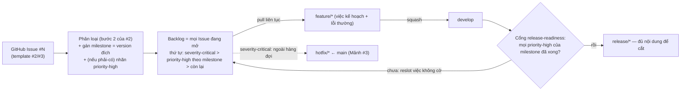

# Tiếp nhận & ưu tiên công việc

Mảnh **thứ tư và cuối** của việc chuẩn hoá SDLC (Backlog #4 trong [quy trình phát hành](2026-06-07-quy-trinh-release-design.md)). Tuân theo [SDLC Overview](2026-06-07-sdlc-overview-design.md) (ADR-001 mô hình *Iterative/Incremental, design-first* + *Kanban* **"ít nghi thức"**; ADR-002 chiến lược tài liệu/tri thức — nguồn sự thật trong repo, **đừng sinh sổ song song giữ tay**) và **hoàn tất** luồng đã dựng ở [Truy vết & quản lý thay đổi](2026-06-08-truy-vet-quan-ly-thay-doi-design.md) (Mảnh #2, ADR-013..015) + [Vận hành & bảo trì](2026-06-09-van-hanh-bao-tri-design.md) (Mảnh #3, ADR-016..018).

Mục tiêu: trả lời hai câu hỏi *"trong đống Issue đang mở, làm cái nào trước?"* và *"khi nào một release đủ nội dung để cắt?"* — bằng **cơ chế nhẹ nhất có thể**, không sinh nguồn sự thật thứ hai, không thêm nghi thức.

> **Cách đọc:** quyết định viết theo **ADR**: Bối cảnh → Quyết định → Lý do → Tradeoff → Phương án đã loại → Điều kiện xem lại → Trạng thái. ADR đánh số toàn cục, tiếp nối ADR-018 (Mảnh #3). Mảnh này thêm **ADR-019, ADR-020**.

## Goals

- **Có thứ tự rõ:** từ danh sách Issue đang mở, biết *làm cái nào kế tiếp* mà không phải hỏi miệng mỗi lần.
- **"Release đủ nội dung để cắt" thành quy tắc kiểm được**, không còn là phán đoán mơ hồ ở bước 2 quy trình phát hành.
- **Một backlog, một thứ tự ưu tiên:** việc đã lên kế hoạch (#2), lỗi thường (#3), sự cố nghiêm trọng (#3) chia chung *một* danh sách + *một* quy tắc thứ tự — không sổ thứ hai phải đồng bộ tay.
- **Chi phí gần bằng không; 0 thay đổi code/test;** tận dụng nguyên hạ tầng đã có (GitHub Issue + label + milestone).

## Non-Goals (cố ý KHÔNG làm ở mảnh này)

- **Tiếp nhận (intake) artifact mới** — đã đủ ở #2/#3 (mọi việc là một GitHub Issue qua template *Yêu cầu thay đổi* / *Báo lỗi*). Mảnh này **chỉ lo ưu tiên**, thừa hưởng nguyên intake.
- **Bảng Kanban GitHub Projects bắt buộc / nhãn trạng thái đầy đủ** → loại (ADR-001 "ít nghi thức"); giữ làm **đường nâng cấp** (đúng Điều kiện xem lại ADR-013).
- **Thang ưu tiên nhiều bậc (P0–P3)** → loại; **sổ backlog markdown giữ tay** (danh sách thứ tự trong repo) → loại (sổ song song rữa cao, ADR-002 cấm); **Scrum/sprint/story points/estimation/grooming định kỳ** → loại (ADR-001 chọn Kanban, đội nhỏ).
- **Quản lý phụ thuộc giữa Issue, lập kế hoạch năng lực (capacity planning), roadmap nhiều quý** → quá nặng cho quy mô; YAGNI.

## Glossary (khoá nghĩa — không viết tắt)

| Thuật ngữ | Nghĩa |
|---|---|
| **Backlog** | Tập hợp **mọi GitHub Issue đang mở** (mọi loại: yêu cầu, thay đổi, lỗi). Là một *view* trên Issue, **không** phải file riêng. |
| **`priority-high`** | Nhãn cờ **duy nhất** đánh dấu "**phải có** cho milestone của nó". Issue **không** gắn = nên-có / thường. |
| **Milestone = version đích** | Trục *"khi nào / bản nào"* (đã có ở Mảnh #2): gán một lần, cho biết Issue dự kiến vào bản phát hành nào. |
| **Cổng release-readiness** | Quy tắc kiểm được: một milestone *sẵn sàng cắt* `release/*` khi **mọi** Issue `priority-high` của nó đã xong. |
| **Reslot** | Chuyển milestone của một Issue **chưa xong** sang version sau, để việc nên-có không chặn release. |
| **Pull (kéo việc)** | Lấy việc kế tiếp từ backlog theo thứ tự ưu tiên (Kanban — luồng liên tục), **không** theo lịch sprint. |

## Sơ đồ luồng ưu tiên ↔ Git Flow

## Bối cảnh & hiện trạng

**Đã có sẵn (mảnh này KHÔNG dựng lại):**

- **Mảnh #2:** GitHub Issue cho luồng sống + `#N` là mã định danh; **milestone = version đích** (gán một lần); nhãn loại tối thiểu (`change-request`/`enhancement`/`bug` + `needs-design`); **trạng thái suy ra từ artifact** (không nhãn trạng thái tay). Vòng đời 6 bước, **bước 2 là "Phân loại"** — đúng nơi gán nhãn + milestone.
- **Mảnh #3:** lỗi/sự cố cũng là Issue; nhãn `severity-critical` đánh dấu bậc Nghiêm trọng → đường `hotfix/*` (vá gấp, ngoài luồng phát hành thường).
- **Quy trình phát hành:** bước 2 nói *"Đủ nội dung → `release/*` ← `develop`"* nhưng **"đủ" chưa được định nghĩa**.

**Khoảng trống mảnh này lấp (đều là *quy ước*, không phải tính năng):**

1. **Thiếu tín hiệu "làm trước / phải có" trong cùng tập Issue.** Milestone trả lời *"bản nào"* nhưng **không** phân biệt *phải-có* vs *nên-có* trong cùng một bản; nhiều Issue cùng mở không có thứ tự pull rõ.
2. **"Đủ nội dung để cắt release" chưa thành quy tắc** — dễ cắt thiếu việc quan trọng, hoặc chờ vô hạn một việc phụ chưa xong.

---

## Quyết định (ADR)

### ADR-019: Cơ chế ưu tiên — nhãn `priority-high` tối thiểu trên nền milestone

- **Trạng thái:** Proposed · 2026-06-09
- **Bối cảnh:** Đội 2–3 người, chủ dự án quyết & phát hành; Kanban "ít nghi thức" (ADR-001); nguồn sự thật trong repo, **đừng sinh sổ song song giữ tay** (ADR-002). Đã dùng nặng Issue + milestone (#2); #3 đã có `severity-critical` cho sự cố. Khoảng trống: thiếu tín hiệu *phải-có / làm-trước* trong cùng tập Issue/milestone.
- **Quyết định:**
  1. Đúng **một nhãn cờ `priority-high`** (kebab-case khớp `severity-critical`; tiếng Anh như mọi nhãn vận hành; **tạo lười** — `gh label create` lần đầu cần). Mọi Issue **không** gắn = backlog thường.
  2. **Hai trục độc lập:** `milestone` = *"khi nào / bản nào"* (đã có), `priority-high` = *"phải có"*. **Không** tạo nhãn version, **không** tạo cột trạng thái.
  3. **Nguồn sự thật = chính Issue;** lọc bằng `gh issue list --label priority-high [--milestone <ver>]`. **Không** bảng/view thứ hai.
  4. **`severity-critical` (#3) là ưu tiên tuyệt đối, NẰM NGOÀI thang planned-priority** — đi `hotfix/*` ngay, **không** gắn kèm `priority-high` (tránh mã hoá hai lần). Thứ tự pull tổng: **`severity-critical`** (hotfix, ngoài hàng đợi) → **`priority-high`** (theo milestone) → **còn lại**.
- **Lý do:** Một nhãn là tín hiệu **rẻ nhất** đóng đúng khoảng trống tiebreak; dùng đúng primitive đã có (label + milestone) nên **0 hạ tầng mới, 0 sổ song song** (ADR-002), đúng ethos "miễn phí trước" (ADR-007) và "ít nghi thức" (ADR-001). Một trục cờ + một trục milestone đủ diễn đạt *"phải có ở bản nào"* mà không cần ma trận ưu tiên.
- **Tradeoff:** (+) thao tác tay tối thiểu (1 nhãn lúc triage), greppable bằng `gh`, khớp mô hình #2/#3, không nguồn sự thật thứ hai. (−) không có thứ tự **tuyệt đối** trong nhóm cùng cờ + cùng milestone — chấp nhận: nhóm này nhỏ ở quy mô 2–3 người, chủ dự án pull tại chỗ. (−) không có view trực quan tổng — để dành Projects.
- **Phương án đã loại:**
  - *GitHub Projects board / nhãn trạng thái đầy đủ* — bắt cập nhật view thứ hai mỗi bước (nghi thức ADR-001 muốn tránh) + sinh **nguồn sự thật thứ hai phải đồng bộ tay**. Giữ làm đường nâng cấp (khớp Điều kiện xem lại ADR-013).
  - *Thang P0–P3* — bậc giữa không đổi hành động ở quy mô này; `severity-critical` đã lo bậc khẩn; nghi thức thừa.
  - *Sổ backlog markdown giữ tay (ordered list trong repo)* — đúng nghĩa đen "trong repo" nhưng là **sổ song song** rữa cao, trùng việc với Issue (ADR-002 loại).
  - *Trường ưu tiên trong template Issue* — ưu tiên là quyết định lúc **triage** (sau khi mở), không phải lúc người báo điền; để ở **label** đúng hơn + **không churn template**.
- **Điều kiện xem lại:** nhiều việc song song cần bảng tổng quan / thứ tự tuyệt đối → **bật GitHub Projects** (chỉ thêm view, không phá gì); nhóm cùng cờ + cùng milestone lớn tới mức chủ dự án khó pull tại chỗ → cân nhắc thêm một bậc hoặc một thứ tự tường minh.

### ADR-020: Nhịp ưu tiên ad-hoc + cổng "release đủ nội dung"

- **Trạng thái:** Proposed · 2026-06-09
- **Bối cảnh:** ADR-001 chọn Kanban "ít nghi thức", chủ dự án là người quyết duy nhất. Vòng đời thay đổi #2 đã có **bước 2 "Phân loại"** — nơi gán nhãn + milestone. Quy trình phát hành bước 2 nói *"Đủ nội dung → `release/*`"* nhưng **"đủ" chưa định nghĩa** → rủi ro cắt thiếu việc phải-có hoặc chờ vô hạn việc phụ.
- **Quyết định:**
  1. **Ưu tiên là việc ad-hoc, gộp vào bước Phân loại đã có của #2** — chủ dự án gán `priority-high` (+ milestone) ngay lúc triage; xem lại cơ hội khi cắt release. **Không** thêm bước mới, **không** họp grooming định kỳ.
  2. **Cổng release-readiness:** một milestone (= version đích) **sẵn sàng cắt `release/*`** khi **mọi** Issue `priority-high` thuộc milestone đó **đã xong** (merged vào `develop`). Issue **không cờ** chưa xong → **reslot** sang milestone sau, **không chặn** release. Kiểm bằng một lệnh: `gh issue list --label priority-high --milestone <ver> --state open` trả về **rỗng**. Đây là cách **làm rõ** *"Đủ nội dung → `release/*`"* của quy trình phát hành (diễn giải, **không** sửa ADR release).
  3. **Một backlog, một thứ tự:** backlog = mọi Issue đang mở; việc kế hoạch (#2), lỗi thường (#3), sự cố (#3) dùng **chung** danh sách + **chung** quy tắc thứ tự ở ADR-019. Không hai luồng phải đồng bộ tay.
- **Lý do:** Gộp vào triage = **0 ceremony mới**, không phụ thuộc lịch mà đội không nhắc được từ xa (chắc chắn rữa — ADR-002). Cổng release biến *"đủ nội dung"* mơ hồ thành **quy tắc kiểm được** bằng `gh issue list`, mà vẫn để chủ dự án phán xét nội dung. Một backlog tránh phân mảnh + tránh sổ song song.
- **Tradeoff:** (+) không ceremony, quy tắc release kiểm được, một nguồn sự thật. (−) *"phải có"* do chủ dự án phán đoán, có thể sai → chấp nhận: sai chỉ đổi *một Issue vào bản này hay bản sau*, dấu vết không mất; reslot rẻ. (−) không nhịp rà soát định kỳ nên Issue cũ có thể nằm im — chấp nhận ở quy mô này; Điều kiện xem lại mở sẵn.
- **Phương án đã loại:**
  - *Grooming định kỳ (tuần / sprint)* — ceremony theo lịch, rữa với đội nhỏ không ai nhắc; ADR-001 chọn pull liên tục.
  - *Cổng release "mọi Issue trong milestone phải xong"* — quá cứng, việc phụ chặn release; **reslot** mềm hơn và đủ.
  - *Không cổng (giữ phán đoán thuần)* — lặp lại điểm yếu "chỉ milestone"; release-readiness vẫn mơ hồ (đã loại lúc brainstorm).
- **Điều kiện xem lại:** backlog phình tới mức Issue cũ bị bỏ quên → thêm một **nhịp rà soát tối thiểu**; tranh cãi lặp lại về *"phải có / không"* → tiêu chí phân loại rõ hơn hoặc thêm bậc; >5 người / nhiều khách song song → cân nhắc cấu trúc chặt hơn (khớp Điều kiện xem lại ADR-001/ADR-013).

---

## Vòng đời ưu tiên end-to-end (ví dụ thực tế)

**Tình huống:** Ba Issue đang mở cùng nhắm bản **1.3.0**: **#61** (enhancement, xuất thêm cột — khách cần gấp cho kỳ tới), **#62** (enhancement, sửa một nhãn giao diện nhỏ), **#63** (bug thường, sai định dạng ngày trong báo cáo). Chủ dự án muốn cắt 1.3.0 đúng hạn kỳ.

| Bước | Thao tác | Kết quả / suy ra từ đâu |
|---|---|---|
| Triage #61 | `enhancement` + milestone `1.3.0` + **`priority-high`** (khách cần gấp). | #61 = phải-có cho 1.3.0 |
| Triage #62 | `enhancement` + milestone `1.3.0` (**không** cờ). | #62 = nên-có |
| Triage #63 | `bug` + milestone `1.3.0` + **`priority-high`** (đụng đối chiếu số liệu). | #63 = phải-có |
| Pull | Đội làm **#61, #63 trước** (`priority-high`), #62 nếu còn thời gian. | Thứ tự đọc thẳng từ nhãn, không hỏi miệng |
| Sự cố chen ngang | Khách báo lỗi **sai số tiền** → Issue **#64** `bug` + **`severity-critical`** → `hotfix/*` ngay (ngoài hàng đợi 1.3.0); **không** gắn `priority-high`. | severity-critical ưu tiên tuyệt đối |
| Cổng release | #61 + #63 merged; #62 chưa → **reslot #62 sang `1.4.0`**. `gh issue list --label priority-high --milestone 1.3.0 --state open` → **rỗng**. | Milestone 1.3.0 đủ nội dung phải-có |
| Cắt | `release/1.3` ← `develop` → bản ứng viên → … (quy trình phát hành). | 1.3.0 cắt với đúng việc phải-có |

**Truy vết về sau** giống Mảnh #2 (`grep -rn "NV-..." docs/`; `(#N)` trong `CHANGELOG.md`). Ưu tiên **không để lại dấu vết bền riêng** — nó là *trạng thái sống* của backlog, đóng Issue là xong (đúng tinh thần "artifact tự mang trạng thái" của ADR-013); không cần gỡ cờ khi đóng.

## Tiêu chí thành công (đo được)

- Từ danh sách Issue đang mở, **bất kỳ ai** cũng đọc ra thứ tự làm (`severity-critical` → `priority-high` theo milestone → còn lại) mà không hỏi miệng.
- Quyết định cắt release **kiểm được bằng một lệnh**: `gh issue list --label priority-high --milestone <ver> --state open` trả về rỗng.
- Việc kế hoạch + lỗi nằm **chung một backlog**, không sổ thứ hai.
- Người mới onboarding hiểu cách ưu tiên chỉ qua `CONTRIBUTING.md` mục 11 + spec này.
- **0 thay đổi code/test;** chỉ thêm **1 nhãn** (tạo lười) + tài liệu + quy ước.

## Rủi ro & giảm thiểu

| Rủi ro | Giảm thiểu |
|---|---|
| Issue quan trọng không được gắn cờ → bị bỏ sót | Chủ dự án gán lúc triage (bước 2 #2 đã có); review cuối; cổng release **chỉ tính cờ** nên việc phải-có buộc phải được cân nhắc gắn cờ. |
| Lạm dụng `priority-high` (gắn mọi thứ) → cờ vô nghĩa | Quy ước: cờ = "**phải có cho bản này**", phần còn lại để trống; chủ dự án là người gác. |
| Issue cũ nằm im vì không có nhịp rà soát | Chấp nhận ở quy mô này; Điều kiện xem lại ADR-020 mở thêm nhịp tối thiểu nếu cắn. |
| `severity-critical` + `priority-high` gắn chồng → nhầm đường | Quy ước rõ: `severity-critical` **ngoài** thang, **không** kèm `priority-high`. |
| Reslot milestone nhiều lần → nhiễu | Reslot là thao tác **mềm**, hiếm; milestone vốn gán một lần (#2). |
| Cờ bị hiểu thành "trạng thái" phải đồng bộ | Cờ chỉ là **tín hiệu ưu tiên**; trạng thái vẫn suy ra từ artifact (ADR-013); **không** bắt buộc gỡ cờ khi đóng Issue. |

## Truy vết

- **Yêu cầu nguồn (governs):** `docs/V2_XAC_NHAN_NGHIEP_VU.md` (nghiệp vụ — nguồn sự thật).
- **Umbrella:** [SDLC Overview](2026-06-07-sdlc-overview-design.md) — ADR-001 (Kanban "ít nghi thức"), ADR-002 (repo là nguồn sự thật, không sổ song song).
- **Mảnh cha:** [Quy trình phát hành](2026-06-07-quy-trinh-release-design.md) — Backlog #4 (mảnh này); **làm rõ** bước "Đủ nội dung → `release/*`"; tái dùng milestone/Issue.
- **Mảnh #2:** [Truy vết & quản lý thay đổi](2026-06-08-truy-vet-quan-ly-thay-doi-design.md) — ADR-013 (Hybrid; milestone = version; trạng thái từ artifact), ADR-014 (anchor + "Truy vết"); #4 dùng nguyên **backlog + milestone** của #2.
- **Mảnh #3:** [Vận hành & bảo trì](2026-06-09-van-hanh-bao-tri-design.md) — ADR-018 (`severity-critical`); #4 đặt `severity-critical` **ngoài** thang planned-priority.
- **Đã hiện thực** (plan [`2026-06-09-tiep-nhan-uu-tien-cong-viec.md`](../plans/2026-06-09-tiep-nhan-uu-tien-cong-viec.md)): mục 11 "Ưu tiên công việc (backlog)" trong `CONTRIBUTING.md` + sửa câu trỏ cuối mục 9; pointer trong `AGENTS.md`; Backlog #4 trong release spec → ✅ + bump version; nhãn `priority-high` (tạo lười — lệnh trong `CONTRIBUTING.md` mục 11). **0 thay đổi code/test.**

## Changelog

- **0.2.0 (2026-06-09):** Hiện thực xong (xem plan `2026-06-09-tiep-nhan-uu-tien-cong-viec.md`): mục 11 `CONTRIBUTING.md` + sửa câu trỏ mục 9; pointer `AGENTS.md`; Backlog #4 trong release spec → ✅; nhãn `priority-high` (tạo lười). Cập nhật mục "Truy vết" sang trạng thái đã hiện thực.
- **0.1.0 (2026-06-09):** Bản thảo đầu — ADR-019 (cơ chế ưu tiên: nhãn `priority-high` tối thiểu trên nền milestone; `severity-critical` ngoài thang), ADR-020 (nhịp ad-hoc gộp vào bước Phân loại của #2; cổng release-readiness = mọi `priority-high` của milestone đã xong, việc không cờ reslot; một backlog một thứ tự). Backlog #4. Chờ duyệt.
