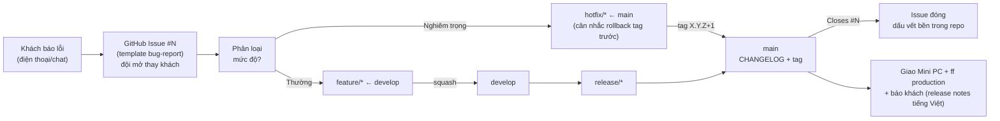

# Vận hành & bảo trì

Mảnh **thứ ba** của việc chuẩn hoá SDLC (Backlog #3 trong [quy trình phát hành](2026-06-07-quy-trinh-release-design.md)). Tuân theo [SDLC Overview](2026-06-07-sdlc-overview-design.md) (ADR-001 mô hình *Iterative/Incremental, design-first* + *Kanban*; ADR-002 chiến lược tài liệu/tri thức — nguồn sự thật trong repo, tự động hoá tối đa, **đừng viết prose rồi mong người nhớ**) và **mở rộng** [Truy vết & quản lý thay đổi](2026-06-08-truy-vet-quan-ly-thay-doi-design.md) (Mảnh #2, ADR-013..015).

Mục tiêu: định nghĩa *quy trình* vận hành và bảo trì hệ thống đã triển khai — **giám sát** hộp Mini PC offline, **chính sách sao lưu/khôi phục**, và **tiếp nhận lỗi/sự cố** từ khách — **chỉ dựa trên tính năng và hạ tầng đã có**, không build tính năng mới, không viết lại how-to đã có trong deploy guide.

> **Cách đọc:** quyết định viết theo **ADR**: Bối cảnh → Quyết định → Lý do → Tradeoff → Phương án đã loại → Điều kiện xem lại → Trạng thái. ADR đánh số toàn cục, tiếp nối ADR-015 (Mảnh #2). Mảnh này thêm **ADR-016, ADR-017, ADR-018**.

## Goals

- **Mini PC offline không chết âm thầm:** có cách giám sát thực tế cho hộp không Internet, không phụ thuộc kỷ luật lịch mà đội không nhắc được từ xa.
- **Backup là backup thật:** dữ liệu sống sót khi ổ chính hỏng, và backup được *kiểm chứng restore được* trước khi cần đến — không phải "có file là yên tâm."
- **Lỗi/sự cố khách không rơi:** một luồng tiếp nhận → phân loại → vá → giao chuẩn, **tái dùng** mô hình thay đổi của Mảnh #2; phân biệt việc vá-gấp với việc gồn-bản-sau.
- **Chi phí gần bằng không:** đặt *chính sách* lên trên tính năng đã có; 0 thay đổi code.

## Non-Goals (cố ý KHÔNG làm ở mảnh này)

- **Build tính năng vận hành mới** (trang health/đĩa trong app, cron cảnh báo, prune nhật ký…) — tính năng backup/nhật ký/health đã có; mảnh này chỉ thêm *quy trình*.
- **Viết lại how-to vận hành** (khởi động lại, xem logs, restore từng bước, sao lưu off-box) — đã có trong `docs/HUONG_DAN_DEPLOY.md` + `docs/KIEN_THUC_DOCKER.md` §10; mảnh này **trỏ tới**, không sao chép.
- **Quy trình deploy production thực tế trên Mini PC** — đang hoãn (chưa có quyền truy cập vật lý); mảnh này là *thiết kế quy trình*, hiện thực khi có production (đúng như Mảnh #2 thiết kế trước, dùng sau).
- **Tiếp nhận & ưu tiên backlog công việc** (lập kế hoạch việc) → **Backlog #4**.
- **APM/cloud monitoring, on-call, SLA, ITIL incident management** → loại theo YAGNI (xem Phương án đã loại trong ADR-016/ADR-018); để dành làm đường nâng cấp.

## Glossary (khoá nghĩa — không viết tắt)

| Thuật ngữ | Nghĩa |
|---|---|
| **Lỗi (bug)** | Hệ thống chạy sai so với nghiệp vụ nhưng **vẫn dùng được**; vá theo luồng phát triển bình thường, gồn vào bản phát hành kế. |
| **Sự cố (nghiêm trọng)** | Lỗi khiến **prod không dùng được / sai số tiền / mất hoặc nguy cơ mất dữ liệu**; đi đường `hotfix/*`, vá gấp. |
| **Giám sát khi giao bản** | Checklist nhẹ đội chạy tại điểm chạm production duy nhất — lúc giao một phiên bản mới xuống Mini PC. |
| **Diễn tập khôi phục (restore drill)** | Chạy thử `backups:restore` ở phía dev/nghiệm thu để chứng minh cơ chế khôi phục của version sắp giao hoạt động. |
| **3 lớp sao lưu** | Lớp 1 = backup qua giao diện (tối đa 3, trong container); Lớp 2 = khôi phục qua dòng lệnh; Lớp 3 = cron tự động sang ổ phụ (giữ 7). Đã có sẵn. |
| **Off-box** | Bản sao lưu nằm **ngoài** ổ chính của Mini PC (Lớp 3 sang ổ phụ) — sống sót khi ổ chính hỏng. |

## Sơ đồ luồng lỗi/sự cố ↔ Git Flow

## Bối cảnh & hiện trạng

**Đã có sẵn (tính năng + how-to) — mảnh này KHÔNG dựng lại:**

- **Sao lưu/khôi phục (§21):** mô hình 3 lớp đã build đủ. Lớp 1 backup qua giao diện (`app/services/backup_service.rb` — `pg_dump`, tối đa 3 bản, vai trò kỹ thuật viên); Lớp 2 khôi phục qua dòng lệnh (`lib/backup_restore_runner.rb`, `rails backups:restore`, hỏi `YES`, không có nút UI vì ghi đè toàn bộ DB); Lớp 3 cron tự động sang ổ phụ (`script/setup-auto-backup`, 2:00 sáng, giữ 7 bản). How-to: deploy guide §Sao lưu dữ liệu + docker guide §10.
- **Nhật ký hệ thống (§20):** PaperTrail ghi mọi thao tác; UI xem nhật ký (`audit_logs_controller`, lọc theo event/model/người/ngày); chỉ **quản trị viên hệ thống** + **kỹ thuật viên hệ thống** xem được.
- **Health & version:** `/up` (Rails health check chuẩn) + endpoint `/version` (spec [app-version-reporting](2026-06-07-app-version-reporting-design.md)) cho biết bản đang chạy.
- **Hạ tầng prod:** Docker `compose.yml` — 3 container (postgres/app/nginx), named volume cho DB + backup, `restart: unless-stopped`. How-to vận hành hàng ngày + xử lý sự cố: deploy guide §Vận hành hàng ngày, §Xử lý sự cố.
- **Đường vá gấp + rollback:** `hotfix/*` ← `main` (ADR-003) và rollback "deploy lại tag trước đó trên Mini PC" (release spec, mục Rollback).
- **Luồng thay đổi Hybrid + truy vết (Mảnh #2):** GitHub Issue cho luồng sống, repo cho dấu vết bền (`Refs #N`/`Closes #N`, anchor `NV-...`, milestone = version, trạng thái suy ra từ artifact); template Issue/pull request/ADR.

**Khoảng trống mảnh này lấp (đều là *chính sách/quy trình*, không phải tính năng):**

1. **Giám sát hộp offline chưa có chính sách:** khi nào kiểm tra, kiểm cái gì, ai kiểm — chưa định nghĩa. Đội **không có quyền truy cập từ xa** vào Mini PC (cùng bối cảnh an ninh khiến khách không có GitHub access).
2. **Backup thiếu chính sách:** lớp nào là nguồn cậy chính, off-box có bắt buộc không, và **backup có được kiểm chứng restore được** không — đều chưa được chốt thành quy ước.
3. **Tiếp nhận lỗi/sự cố chưa có luồng:** Mảnh #2 **cố ý hoãn** template báo lỗi production cho mảnh này (ADR-015). Chưa có nơi/luồng chuẩn để lỗi khách không rơi và để phân biệt vá-gấp với gồn-bản-sau.

---

## Quyết định (ADR)

### ADR-016: Giám sát production offline — review khi giao bản, không nhịp định kỳ

- **Trạng thái:** Accepted · 2026-06-09
- **Bối cảnh:** Production = Mini PC mạng LAN **offline**, không Internet (bối cảnh an ninh). Đội phát triển **không có quyền truy cập từ xa** vào hộp; **điểm chạm production duy nhất của đội là lúc giao phiên bản**. Đã có sẵn: `/up`, `/version`, nhật ký §20 (quản trị viên hệ thống + kỹ thuật viên xem), cron auto-backup Lớp 3 chạy nền bất kể có ai giám sát. Hộp ít người đụng tới; tải nội bộ thấp.
- **Quyết định:** Giám sát gồm đúng ba thành phần:
  1. **Review khi giao phiên bản** — checklist nhẹ tại hộp: 3 container `Up` (`docker compose ps`); `/up` xanh + `/version` đúng bản vừa giao; dung lượng đĩa còn chỗ (`df -h`, `docker system df`); cron auto-backup Lớp 3 có chạy (log + file mới ở ổ phụ).
  2. **Lưới an toàn nền** = cron auto-backup Lớp 3 **sẵn có**, không phụ thuộc người — lo phần "mất dữ liệu" (rủi ro nặng nhất) bất kể có giám sát hay không.
  3. **Nhật ký §20 tra theo yêu cầu** khi điều tra sự cố — không soi định kỳ.

  **Không** có nhịp giám sát định kỳ theo lịch.
- **Lý do:** Offline ⇒ không thể có cảnh báo tự động/cloud APM (không gửi được email/SMS, không có agent gọi về). Checklist theo lịch trên hộp ít người đụng + đội không nhắc được từ xa ⇒ **chắc chắn rữa** (đúng nguyên tắc ADR-002). Neo review vào **điểm chạm production duy nhất** (giao bản) đặt việc kiểm vào đúng lúc *chắc chắn* có người có kỹ năng đang nhìn vào hộp. Auto-backup nền lo rủi ro nặng nhất độc lập với giám sát.
- **Tradeoff:** (+) gần như $0 công sức, không tính năng mới, không phụ thuộc kỷ luật lịch. (−) đĩa đầy / cron backup chết có thể không bị phát hiện *giữa* hai lần giao bản (cửa sổ mù) — chấp nhận được vì tải nội bộ thấp, backup Lớp 1 (3) + Lớp 3 (7) đều có trần dung lượng, và đội kiểm khi giao.
- **Phương án đã loại:**
  - *APM / cloud monitoring* — bất khả thi trên hộp offline.
  - *Cảnh báo email/SMS* — offline không gửi được.
  - *Cron tự đo đĩa/health rồi cảnh báo tại chỗ* — là **tính năng mới** (phạm vi đã chốt "chỉ lớp quy trình"); để dành đường nâng cấp.
  - *Checklist định kỳ theo lịch (tuần/tháng)* — rữa trên hộp không người nhắc; YAGNI cho tải hiện tại.
- **Điều kiện xem lại:** nếu xảy ra (hoặc suýt) sự cố do **đĩa đầy / auto-backup chết âm thầm** giữa hai lần giao, **hoặc** chu kỳ giao bản dài ra → thêm một nhịp giám sát định kỳ tối thiểu, hoặc nâng "cron tự đo đĩa/backup" thành tính năng.

### ADR-017: Chính sách sao lưu & khôi phục (đặt trên tính năng 3 lớp đã có)

- **Trạng thái:** Accepted · 2026-06-09
- **Bối cảnh:** §21 yêu cầu: kỹ thuật viên tạo backup toàn bộ data; restore qua dòng lệnh (không UI vì ghi đè toàn bộ DB quá rủi ro); tối đa 3 bản. Tính năng đã build đủ (3 lớp, xem Hiện trạng) và how-to đã có trong deploy guide + docker guide §10. **Thiếu là *chính sách***: lớp nào là nguồn cậy chính, off-box có bắt buộc không, và backup có được *kiểm chứng restore được* không.
- **Quyết định:**
  1. **Phân vai 3 lớp tường minh.** Lớp 3 (auto, ổ phụ, 7 bản) = **bản sao lưu nguồn cậy chính, BẮT BUỘC** (sống sót khi ổ chính hỏng). Lớp 1 (UI, 3 bản, trong container) = **snapshot trước thao tác nguy hiểm** (cập nhật phiên bản, trước khi restore). Giữ nguyên hai con số **3** và **7** — **không đụng code**: 3 là yêu cầu §21 cho backup UI; 7 là vòng xoay off-box độc lập.
  2. **Diễn tập khôi phục mỗi lần giao phiên bản, phía dev/nghiệm thu.** Trước khi giao một bản, đội chạy `backups:restore` trên môi trường dev (hoặc Acceptance) với một backup sinh ra ở đó, chứng minh cơ chế khôi phục của **đúng version sắp giao** hoạt động. **Không diễn tập trên prod** (ghi đè toàn bộ DB prod) và đội **không lấy file backup prod về** (offline + an ninh).
  3. **Trên prod: chỉ khôi phục thật khi sự cố**, và **luôn tạo backup Lớp 1 trước khi restore** (để lùi lại được nếu restore sai bản/sai file).
- **Lý do:** "Backup chưa test = chưa có backup" — diễn tập là việc rẻ nhất diệt được rủi ro nặng nhất, ghép gọn vào khâu chuẩn bị giao bản đội vốn làm. Off-box là điều kiện sống còn thực sự (ổ chính hỏng thì 3 bản UI trong container chết theo) → nâng "bắt buộc" trong deploy guide thành *chính sách*. Phân vai rõ tránh ngộ nhận "đã có 3 bản UI là an toàn."
- **Tradeoff:** (+) có chứng cứ restore được cho từng bản giao; không đụng prod; không đổi code/số. (−) diễn tập chứng minh *cơ chế + version*, không chứng minh *chính file backup prod* restore được (không lấy được file về) — chấp nhận: cùng binary + cùng lệnh, rủi ro còn lại chỉ là media ổ phụ, đã giảm bằng off-box + xoay vòng 7 bản.
- **Phương án đã loại:**
  - *Diễn tập định kỳ trên prod* — ghi đè DB prod, nguy hiểm; không người nhắc trên hộp offline.
  - *Mang file backup prod về để test* — vi phạm "dữ liệu thật không rời mạng offline" (rủi ro lộ, khớp ADR-006).
  - *Đổi retention (gộp 3 và 7, hay tăng số)* — không cần, YAGNI; 3 phục vụ §21, 7 là off-box, hai mục đích khác nhau.
- **Điều kiện xem lại:** nếu nghi ngờ hỏng media ổ phụ → cần quy trình lấy mẫu kiểm *chính file prod* có kiểm soát **tại chỗ khách**; nếu dung lượng đĩa buộc đổi retention → mở lại con số.

### ADR-018: Tiếp nhận lỗi/sự cố khách — mở rộng luồng Hybrid #2

- **Trạng thái:** Accepted · 2026-06-09
- **Bối cảnh:** Mảnh #2 (ADR-013..015) đã dựng luồng thay đổi Hybrid + truy vết, nhưng **cố ý hoãn** template báo lỗi/sự cố production cho mảnh này (ADR-015, mục Phương án đã loại + Điều kiện xem lại). Lỗi production do khách báo cần intake chuẩn để không rơi và cần phân luồng vá (có cái gồn bản sau, có cái vá gấp). Khách **không có GitHub access**. Đã có sẵn `hotfix/*` ← `main` (ADR-003) + rollback "deploy lại tag trước" (release spec).
- **Quyết định:**
  1. **Lỗi/sự cố là một "thay đổi" trong mô hình #2** — cùng `#N` (mã định danh), `Refs #N`/`Closes #N`, anchor `NV-...` nếu đụng nghiệp vụ, milestone = version đích, trạng thái suy ra từ artifact. **Tái dùng nguyên**, không dựng luồng sự cố riêng song song.
  2. **Một template `.github/ISSUE_TEMPLATE/bug-report.md`** (hoàn thành phần ADR-015 hoãn): ai báo (khách/nội bộ), môi trường (Production Mini PC / Acceptance / Development), bản đang chạy (`/version`), bước tái hiện, kết quả mong đợi vs thực tế, **mức độ**, có đụng dữ liệu/tiền không, trích nhật ký §20 nếu có.
  3. **Mức độ 2 bậc → đường vá** (đúng một quyết định nhị phân lúc phân loại):
     - **Nghiêm trọng** (prod không dùng được / sai số tiền / mất hoặc nguy cơ mất dữ liệu) → `hotfix/*` ← `main`; vá gấp; tag patch; merge về `main` + `develop`; giao Mini PC + fast-forward `production`. Cân nhắc **rollback tag trước** làm bước chữa cháy tức thì trước khi vá xong.
     - **Thường** (hệ thống vẫn dùng được, kết quả sai/khó chịu) → luồng phát triển bình thường `feature/*` → `develop` → `release/*`, gồn vào bản phát hành kế.
  4. **Nhãn:** tái dùng nhãn `bug` của #2 cho mọi lỗi; thêm **một nhãn cờ `severity-critical`** đánh dấu bậc Nghiêm trọng (đi đường hotfix). Bậc Thường không cần nhãn thêm.
  5. **Lớp khách:** khách báo qua kênh ngoài (điện thoại/chat) → **đội mở Issue thay khách** (quy ước #2); sau khi vá + giao → **đội báo lại khách** kèm release notes tiếng Việt.
- **Lý do:** Lỗi chỉ là một dạng thay đổi → tái dùng #2 là rẻ nhất và nhất quán (một mô hình, không hai luồng phải đồng bộ tay). Mức độ 2 bậc khớp đúng một điểm rẽ thật sự (vá ngay hay gồn bản sau); thêm bậc giữa chỉ tăng nghi thức mà không đổi đường vá. Template thêm đúng các trường gỡ lỗi mà change-request thiếu (tái hiện/môi trường/version/nhật ký).
- **Tradeoff:** (+) một mô hình thống nhất, intake chuẩn, truy vết sẵn có, ít nhãn. (−) ranh giới "Nghiêm trọng vs Thường" đôi khi phải phán đoán — chấp nhận: chủ dự án phân loại cuối, và phân loại sai chỉ đổi *tốc độ* vá, không mất dấu vết.
- **Phương án đã loại:**
  - *Hai template (bug + incident) tách* — nuôi 2 form + mơ hồ lúc intake; YAGNI cho đội 2–3 người.
  - *Severity nhiều bậc (S1–S4)* — bậc giữa không đổi đường vá; nghi thức thừa.
  - *Quy trình sự cố/ITIL riêng (incident management, on-call, SLA)* — quá nặng cho đội nhỏ + app nội bộ ít tải.
  - *Dùng nguyên change-request template* — thiếu trường gỡ lỗi; ADR-015 đã hẹn template lỗi riêng cho mảnh này.
- **Điều kiện xem lại:** nếu sự cố nghiêm trọng xảy ra thường xuyên cần phối hợp nhiều người → cân nhắc quy ước on-call/SLA nhẹ; nếu phân loại 2 bậc gây tranh cãi lặp lại → thêm bậc hoặc tiêu chí phân loại rõ hơn.

---

## Vòng đời sự cố end-to-end (ví dụ thực tế)

**Tình huống:** Khách gọi điện báo *"Bảng tính tiền ra tổng sai — cộng nhầm phần điện bơm nước, số tiền lệch."* (đụng tiền → **Nghiêm trọng**, đi đường hotfix.)

| Bước | Thao tác | Dấu vết bền để lại | Trạng thái suy ra từ đâu |
|---|---|---|---|
| 1. Tiếp nhận | Đội mở Issue bằng template bug-report (khách không có GitHub): môi trường **Production**, version `1.2.0` (từ `/version`), bước tái hiện, mong đợi vs thực tế, mức độ **Nghiêm trọng**, trích nhật ký §20. Nhãn `bug` + `severity-critical`. → **#57** | Issue `#57` | Tiếp nhận = Issue mở |
| 2. Phân loại | Xác nhận Nghiêm trọng → đường hotfix. (Tuỳ chọn: hướng dẫn khách **rollback tag `1.1.0`** tạm trên Mini PC để dùng ngay trong khi chờ vá.) | nhãn | `severity-critical` đang treo |
| 3. Vá + test | `hotfix/sai-tong-bom-nuoc` ← `main`; sửa + system spec cover; pull request mô tả `Refs #57`. | commit body, pull request | Đang vá = GitHub hiện "linked pull request" trên `#57` |
| 4. Phát hành | Merge → release-please tag `1.2.1` trên `main` + GitHub Release; merge-back `develop`. | `CHANGELOG.md` có dòng `(#57)`, tag `1.2.1` | Đã release = thấy `#57` trong CHANGELOG `1.2.1` |
| 5. Giao + đóng | Giao bản `1.2.1` xuống Mini PC + fast-forward `production` (Mirror = `1.2.1`); Issue đóng (`Closes #57`); báo khách + release notes tiếng Việt. | Issue đóng, link tự nối | Đóng = Issue closed |

**Truy vết về sau:**
- *"Lỗi tính tiền này do đâu, vá ở đâu?"* → mở `#57` → mô tả + pull request → commit `(#57)` → tag `1.2.1`.
- *"Có test cover chưa?"* → spec/pull request `#57` trỏ system spec; nếu đụng nghiệp vụ thì anchor `NV-...` trong tài liệu nghiệp vụ.
- *"Bản nào giao bản vá?"* → `CHANGELOG.md` / git tag chứa `(#57)`.

*Trường hợp **Thường*** đi đúng vòng đời thay đổi của Mảnh #2 (`feature/*` → `develop` → `release/*`), chỉ khác nhãn `bug` thay vì `enhancement`.

## Tiêu chí thành công (đo được)

- Một lỗi khách báo đi trọn vòng đời: **mở Issue (bug-report) → phân loại đúng đường (hotfix/thường) → ra dòng CHANGELOG → đóng Issue**, không rơi mắt xích nào.
- Giám sát khi giao bản **phát hiện được** container chết / đĩa cạn / version sai **trước khi đội rời hộp**.
- Mỗi bản giao đều đã qua **diễn tập khôi phục** (có chứng cứ `backups:restore` chạy của đúng version).
- Backup off-box (Lớp 3) **tồn tại + có file mới** (kiểm khi giao).
- Người mới onboarding hiểu luồng vận hành + xử lý sự cố chỉ qua `CONTRIBUTING.md` mục 10 + spec này.
- **0 thay đổi code/test** do mảnh này (chỉ thêm 1 template + tài liệu + quy ước + anchor).

## Rủi ro & giảm thiểu

| Rủi ro | Giảm thiểu |
|---|---|
| Đĩa đầy giữa hai lần giao (cửa sổ mù giám sát) | Trần dung lượng backup (Lớp 1 = 3, Lớp 3 = 7); `docker system prune` trong xử lý sự cố; kiểm khi giao; Điều kiện xem lại ADR-016 nếu cắn. |
| Auto-backup Lớp 3 chết âm thầm | Kiểm log + file mới ở ổ phụ khi giao bản; off-box là **bắt buộc** (ADR-017). |
| Backup không restore được khi cần | Diễn tập khôi phục mỗi bản giao, phía dev (ADR-017). |
| Restore nhầm/ghi đè prod sai | Tạo backup Lớp 1 trước restore; lệnh hỏi `YES`; chỉ qua dòng lệnh (không nút UI). |
| Khôi phục bậc nghiêm trọng chậm | Rollback tag trước làm bước chữa cháy tức thì (release spec) trước khi vá xong. |
| Khách báo lỗi qua kênh ngoài bị rơi | Quy ước: mọi lỗi phải có Issue trước khi vào nhánh vá; đội mở Issue thay khách. |
| Nhật ký §20 phình theo thời gian | Tải nội bộ thấp, chưa cần prune; để dành (đường nâng cấp). |
| Lộ dữ liệu khi gỡ lỗi | Không mang dump prod ra ngoài; chỉ trích nhật ký tối thiểu cần thiết trong Issue. |

## Truy vết

- **Yêu cầu nguồn (governs):** `docs/V2_XAC_NHAN_NGHIEP_VU.md` — §20 Nhật ký hệ thống (anchor `NV-nhat-ky-he-thong`), §21 Sao lưu và phục hồi (anchor `NV-sao-luu-phuc-hoi`).
- **Umbrella:** [SDLC Overview](2026-06-07-sdlc-overview-design.md) — ADR-001 (mô hình), ADR-002 (tài liệu/tri thức).
- **Mảnh cha:** [Quy trình phát hành](2026-06-07-quy-trinh-release-design.md) — Backlog #3 (mảnh này); tái dùng ADR-003 (`hotfix/*`), mục Rollback, ADR-008 (release-please/CHANGELOG).
- **Mảnh #2 (mở rộng):** [Truy vết & quản lý thay đổi](2026-06-08-truy-vet-quan-ly-thay-doi-design.md) — ADR-013 (Hybrid), ADR-014 (anchor `NV-...` + "Truy vết"), ADR-015 (template) — mảnh này **hoàn thành** template báo lỗi mà ADR-015 đã hoãn.
- **Tính năng + how-to liên quan (đã có, chỉ trỏ — không lặp lại):** sao lưu `app/models/backup.rb`, `app/services/backup_service.rb`, `lib/backup_restore_runner.rb`, `script/setup-auto-backup`; nhật ký `app/controllers/audit_logs_controller.rb`; version reporting spec `2026-06-07-app-version-reporting-design.md`; deploy guide `docs/HUONG_DAN_DEPLOY.md` (§Vận hành hàng ngày, §Sao lưu dữ liệu, §Xử lý sự cố); docker guide `docs/KIEN_THUC_DOCKER.md` §10.
- **Đã hiện thực** (plan [`2026-06-09-van-hanh-bao-tri.md`](../plans/2026-06-09-van-hanh-bao-tri.md)): `.github/ISSUE_TEMPLATE/bug-report.md` + nhãn `severity-critical`; anchor `NV-nhat-ky-he-thong`/`NV-sao-luu-phuc-hoi` trong `docs/V2_XAC_NHAN_NGHIEP_VU.md`; mục 10 "Vận hành & xử lý sự cố" trong `CONTRIBUTING.md`; pointer trong `AGENTS.md`; Backlog #3 trong release spec → ✅.

## Lịch sử thay đổi

- **0.2.1 (2026-06-13):** Theo ADR-033 (#339): bỏ field frontmatter `status:` (nguồn duy nhất = inline `**Trạng thái:**`); lật trạng thái các ADR đã merge sang `Accepted`.
- **0.2.0 (2026-06-09):** Hiện thực xong (xem plan `2026-06-09-van-hanh-bao-tri.md`): template `bug-report` + nhãn `severity-critical`; anchor `NV-nhat-ky-he-thong`/`NV-sao-luu-phuc-hoi`; mục 10 `CONTRIBUTING.md`; pointer `AGENTS.md`; Backlog #3 → ✅. Cập nhật mục "Truy vết" sang trạng thái đã hiện thực.
- **0.1.0 (2026-06-09):** Bản thảo đầu — ADR-016 (giám sát production offline = review khi giao bản + lưới auto-backup nền + nhật ký §20 tra theo yêu cầu; không nhịp định kỳ), ADR-017 (chính sách sao lưu/khôi phục trên tính năng 3 lớp đã có: Lớp 3 off-box bắt buộc là nguồn cậy chính, Lớp 1 là snapshot trước thao tác; diễn tập khôi phục mỗi bản giao phía dev; backup Lớp 1 trước restore thật trên prod), ADR-018 (tiếp nhận lỗi/sự cố = mở rộng luồng Hybrid #2; một template bug-report + mức độ 2 bậc → đường vá hotfix/thường; nhãn `severity-critical`; đội mở Issue thay khách). Backlog #3. Chờ duyệt.
