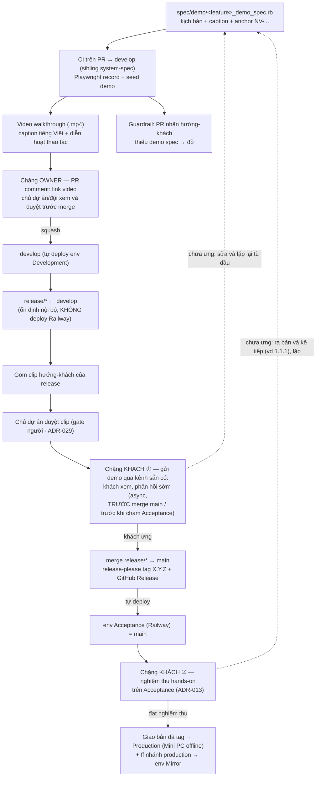

# Tự động hoá demo

Thiết kế cho [#343](https://github.com/manhcuongdtbk/electric-water-management/issues/343). Mục tiêu: thay việc **test tay rồi quay màn hình thủ công** bằng một **engine demo** chạy theo quy trình, phục vụ hai chặng — chủ dự án xem/duyệt **trước merge**, và khách (đơn vị quân đội) xem **trước khi release deploy vào Production (Mini PC)** để phản hồi sớm.

Liên quan: tương tác khách mức release & nghiệm thu hands-on trên Acceptance (ADR-013 trong [truy vết & quản lý thay đổi](2026-06-08-truy-vet-quan-ly-thay-doi-design.md)); Acceptance = nhánh `main`, **không** dùng `-rc.N`, promotion (ADR-005/008 trong [quy trình release](2026-06-07-quy-trinh-release-design.md)); **phân biệt** với cổng xác nhận *yêu cầu* trước build (ADR-028 — duyệt tài liệu, chưa có phần mềm; demo thì xem phần mềm đã build); anchor `NV-...` và dấu vết bền trong repo (ADR-013/014); tốc-độ system spec trên CI tách ở [#344](https://github.com/manhcuongdtbk/electric-water-management/issues/344).

> **Cách đọc:** quyết định viết theo **ADR** (Trạng thái → Bối cảnh → Quyết định → Lý do → Tradeoff → Phương án đã loại → Điều kiện xem lại). ADR đánh số toàn cục, tiếp nối **ADR-033**; spec này thêm **ADR-036 … ADR-041**.

## Goals

- **Không phải quay tay**: chủ dự án không test tay + record màn hình thủ công nữa — CI tự sinh walkthrough.
- **Một artifact, hai chặng**: cùng một walkthrough phục vụ chủ dự án (trước merge) và khách (trước release); chặng khách = bản đã-duyệt của chặng owner.
- **Không lệch (anti-drift)**: demo là spec CI **xanh-mới-merge** — feature đổi mà demo không khớp thì CI đỏ.
- **Khách xem hiểu được**: video tiếng Việt, **thấy rõ máy đang thao tác cái gì** (diễn hoạt con trỏ/tô sáng), dữ liệu trông thật.
- **Người giữ gate**: AI/CI lo phần cơ học (sản xuất); chủ dự án duyệt rồi mới gửi khách (khớp ADR-029).
- **Tận dụng cái đã có**: dựng trên hạ tầng Capybara/system spec + CI sẵn có; không dựng quy trình nặng.

## Non-Goals (cố ý KHÔNG làm ở vòng này)

- **Lồng tiếng TTS tiếng Việt** — để dành cấp nâng (ADR-039). Vòng đầu chỉ caption chữ.
- **Ghép clip thành "release reel"** — vòng đầu gửi bộ clip rời theo tính năng (ADR-041).
- **Trang "Demo tính năng mới" trong app Acceptance** — giao bằng kênh sẵn có, không build trang/host trong app (ADR-041). Để dành làm đường nâng cấp.
- **Quay trên Acceptance thật** — render trong CI từ seed demo để nhất quán (ADR-041).
- **Migrate toàn bộ system spec sang Playwright/Cuprite** — Playwright chỉ phạm vi `spec/demo`; tốc-độ suite là **việc riêng [#344](https://github.com/manhcuongdtbk/electric-water-management/issues/344)** (ADR-038).
- **Slideshow / GIF** — đã loại; khách muốn video "thật" (ADR-039).
- **Bắt mọi PR có thay đổi UI phải có demo** — chỉ bắt buộc PR hướng-khách (ADR-040).
- **Thay nghiệm thu hands-on trên Acceptance** — demo là vòng phản hồi sớm *trước* khâu hands-on, không thay nó (xem "Hai vòng phản hồi của khách").

## Glossary (khoá nghĩa — không viết tắt; bổ sung vào `docs/THUAT_NGU.md` khi triển khai)

| Thuật ngữ | Nghĩa |
|---|---|
| **Demo spec** | Một system spec trong `spec/demo/` mô tả hành trình một tính năng theo kịch bản kể-chuyện, mỗi bước kèm câu chú thích tiếng Việt; chạy trong CI như mọi spec. |
| **Recorder** | Lớp mỏng bọc Capybara: lái trình duyệt qua Playwright để **quay video native**, chèn **diễn hoạt thao tác** + **caption banner** vào trang trước mỗi bước. |
| **Diễn hoạt thao tác** | Hiệu ứng nhìn-thấy-được chèn qua DOM khi demo thao tác: con trỏ tổng hợp trượt tới phần tử, tô sáng phần tử, gợn (ripple) khi click, tô sáng ô khi nhập. |
| **Caption banner** | Khung chữ tiếng Việt cố định trong trang hiện câu chú thích của bước hiện tại (một phần DOM → tự lọt vào video). |
| **Seed demo** | Bộ dữ liệu mẫu có chủ đích (tách `db/seeds.rb`), version trong repo; mọi clip sống trong cùng một "thế giới" nhất quán. |
| **PR hướng-khách** | PR mang một nhãn (ví dụ `customer-facing`) do người gắn ở triage, báo rằng thay đổi này khách sẽ thấy → bắt buộc có demo spec. |
| **Chặng owner** | Sản xuất + xem demo trên PR trước merge (chủ dự án/đội). |
| **Chặng khách** | Ở cửa sổ `release/*` (trước merge `main`): lọc bộ clip hướng-khách, chủ dự án duyệt rồi forward cho khách để phản hồi sớm — đứng *trước* nghiệm thu hands-on (vòng ②). |
| **Capability levels** | Các cấp độ hoàn thiện demo: MVP = screencast + caption; nâng = + TTS. Cấp cao chưa xong thì cấp dưới vẫn giao được. |

## Sơ đồ luồng



### Hai vòng phản hồi của khách (đọc kèm sơ đồ)

Theo SDLC dự án, khách vốn có **hai mốc** tương tác: xác nhận *yêu cầu* **TRƯỚC build** (ADR-028 — duyệt tài liệu trong `docs/xac-nhan-khach/`, chưa có phần mềm) và **nghiệm thu hands-on SAU build** trên **Acceptance** (ADR-013). Lưu ý mốc thứ hai bám đúng cơ chế release: Acceptance = nhánh **`main`** đã tag, **không** dùng `-rc.N`, `release/*` **không** deploy Railway (ADR-005/008). Demo **chèn một mốc ở giữa** — xem phần mềm *đã build* nhưng *trước* khi nghiệm thu hands-on — và **không thay** nghiệm thu:

1. **Vòng ① — xem demo (sớm, async, ở cửa sổ `release/*`).** Clip render trong CI từ **seed** ngay khi feature vào `develop` (ADR-041), *không phụ thuộc* Acceptance. Trong lúc `release/*` ổn định nội bộ (chưa lên Railway), chủ dự án duyệt rồi gửi bộ clip → khách xem, phản hồi **trước khi merge `main` / trước khi chạm Acceptance**. Lỗi/hiểu-nhầm lộ ở đây sửa sớm, *trước cả khi tag release*.
2. **Vòng ② — nghiệm thu hands-on (ADR-013).** Khách ưng demo → merge `release/* → main`, release-please tag `X.Y.Z`, `main` **tự deploy Acceptance**; khách (đã được demo định hướng) tự thao tác nghiệm thu. Chưa ưng → **ra bản vá kế tiếp** (vd `1.1.1`) cùng luồng (ADR-005 §P4).
3. **Đạt nghiệm thu ②** → giao bản đã tag xuống **Production (Mini PC)**; fast-forward nhánh `production` → env **Mirror**.

Cả ① và ② nếu phát hiện vấn đề đều **lặp lại từ đầu**, *không* vá tắt trên `release`: nhánh fix ← `develop` → PR (demo **tự chạy lại** + owner duyệt; guardrail ADR-040 vẫn áp) → `develop` → `release/*` (→ tag bản vá nếu đã tới ②). Giá trị của demo: **rút ngắn vòng lặp** — bắt lỗi/định hướng *trước* khâu hands-on tốn công và *trước* khi tag, đúng tinh thần "người giữ gate" (ADR-029).

## Bối cảnh & hiện trạng

- Đã có **Capybara system spec + headless Chrome** (12 file `spec/system/`, shared examples). Demo dựng trên hạ tầng này.
- Đã có **CI chạy full rspec (gồm system spec) trên mỗi PR** (ADR-012/021), **seed** ở `db/seeds.rb`, launch `docker-dev` (preview).
- Trong các session trước, demo **làm thủ công** qua bộ preview (điều khiển headless browser) — chứng minh luồng demo **script hoá được**.
- Hai môi trường khách-liên-quan: **Acceptance** (Railway, khách thử nghiệm thu) và **Production** (Mini PC offline). Khách **truy cập được** Acceptance nhưng (B) không rõ phải thử gì, (C) muốn phản hồi sớm/async, (D) muốn chủ dự án đỡ việc tay.

## Kiến trúc & thành phần

### 1. Demo spec (`spec/demo/`)
- Một file/tính năng: `spec/demo/<feature>_demo_spec.rb`, `type: :demo`.
- **Không gọi Capybara thô** mà gọi DSL recorder có chú thích, ví dụ:
  ```ruby
  demo.narrate("Đăng nhập với vai trò quản trị viên đơn vị")
  demo.visit(meter_entries_path, caption: "Mở trang Chỉ số đầu mối kỳ 06/2026")
  demo.fill(field: "Chỉ số mới", with: "1234", caption: "Nhập chỉ số công tơ")
  demo.click(button: "Lưu", caption: "Lưu — hệ thống tính lại tiêu thụ")
  demo.expect_text("Đã lưu")   # vẫn là assertion thật → xanh-mới-merge
  ```
- Gắn **anchor `NV-...`** (metadata example) trỏ về `docs/V2_XAC_NHAN_NGHIEP_VU.md` / chiều trong `docs/V2_CHIEU_TEST.md` → truy vết.
- Vì là spec thật, mọi `expect` phải đúng → **chống lệch** (ADR-037).

### 2. Recorder (lớp bọc, dùng Playwright)
- Driver: **`capybara-playwright-driver`** đăng ký riêng cho `type: :demo`; video native lấy qua `on_save_screenrecord` (WebM). Suite còn lại **giữ Selenium** (ADR-038).
- **Diễn hoạt thao tác** (chèn JS/CSS vào trang, không cần driver hỗ trợ): trước mỗi `click`/`fill`, cuộn phần tử vào tầm nhìn → tô sáng → con trỏ tổng hợp trượt tới → ripple/typing thấy được → **dừng một nhịp** (đọc kịp) → thực thi thao tác thật → gỡ tô sáng. (Bắt buộc tự chèn vì **không driver nào quay con trỏ hệ điều hành**.)
- **Caption banner**: phần tử cố định hiện `caption` bước hiện tại; là DOM nên tự vào video.
- **Transcode WebM→MP4** một lần ở cuối (ffmpeg chỉ đổi định dạng, không capture) cho tương thích kênh khách.
- Nhịp/giây mỗi bước: tham số cấu hình (mặc định chốt ở plan), đủ để người xem theo kịp và giảm flaky.

### 3. Seed demo (`db/seeds/demo.rb` hoặc tương đương)
- Dataset có chủ đích: tên khu vực/đơn vị thật-như-thật, kỳ mẫu (vd 06/2026), chỉ số công tơ hợp lý. Version trong repo.
- Mỗi demo spec thêm **delta** trên nền seed (mở kỳ, nhập liệu cụ thể) trong transaction.

### 4. CI job `demo`
- **Sibling** của job system-spec: cài Playwright browser binaries (+ Node runtime), nạp seed demo, chạy `spec/demo` ở chế độ có ghi hình.
- Upload video làm **artifact**; với mỗi tính năng → một mp4 có nhãn.
- Chạy **trong CI từ seed** (không trên Acceptance) để nhất quán/tái lập (ADR-041).

### 5. Surface trên PR (chặng owner)
- Bot đăng **một PR comment** chứa **link video** (mở để xem). Tùy chọn kèm 1–2 ảnh tĩnh làm thumbnail lướt nhanh (quyết ở plan — GitHub không nhúng mp4 do bot gọn gàng).

### 6. Guardrail (bắt buộc demo cho PR hướng-khách)
- Script CI cùng họ với guardrail i18n/chiều-test/adr-status: nếu PR có **nhãn hướng-khách** mà **không** thêm/sửa file `spec/demo/**` tương ứng → CI đỏ + nhắc. PR không nhãn → miễn.

### 7. Đóng gói & giao (chặng khách)
- Release lọc các tính năng hướng-khách kể từ release trước → **bộ clip rời theo tính năng** (không ghép).
- Chủ dự án **duyệt** (gate người, khớp ADR-029) → **forward** qua kênh đang dùng với khách (Zalo/email/USB). Đặt ở **cửa sổ `release/*`** (trước merge `main`) để khách phản hồi sớm.

## Quyết định (ADR)

### ADR-036: Engine demo hợp nhất — một artifact, hai chặng
- **Trạng thái:** Accepted · 2026-06-13
- **Bối cảnh:** Cần demo cho chủ dự án (trước merge, kỹ thuật) và cho khách (trước release, nghiệp vụ tiếng Việt). Hai nhu cầu khác đối tượng nhưng cùng nội dung "tính năng này làm gì".
- **Quyết định:** Một engine sinh **một artifact** (walkthrough/tính năng) chạy theo PR; chủ dự án xem/duyệt ở chặng owner; ở release, **chính artifact đã-duyệt** được lọc + forward cho khách (chặng khách). Khách dùng chung caption tiếng Việt với owner.
- **Lý do:** Owner kiểu gì cũng phải xem để duyệt trước khi gửi khách → việc owner xem video *là* bước review; làm thêm định dạng riêng cho owner là thừa một thứ phải nuôi. Một nguồn → ít drift.
- **Tradeoff:** (+) Một nguồn, ít trùng, owner review sớm cả câu chữ sẽ gửi khách. (−) Owner xem qua link/tải (video không nhúng gọn trên PR) thay vì cuộn-xem-ngay.
- **Phương án đã loại:** *Hai hệ tách rời (ảnh kỹ thuật cho owner / video cho khách)* — tốn gấp đôi, dễ lệch nhau. *Một engine hai profile đầu ra* — phức tạp hoá hậu kỳ mà lợi ích nhỏ khi caption đã dùng chung.
- **Điều kiện xem lại:** Nếu owner cần chú thích kỹ thuật mà khách không nên thấy → cân nhắc tách lớp caption.

### ADR-037: Demo là spec xanh-mới-merge + caption metadata + anchor NV
- **Trạng thái:** Accepted · 2026-06-13
- **Bối cảnh:** Kịch bản demo tách rời code sẽ âm thầm lệch khi feature đổi, đến lúc gửi khách mới lộ.
- **Quyết định:** Viết **demo spec riêng** trong `spec/demo/` dùng hạ tầng Capybara, mỗi bước kèm metadata caption, gắn anchor `NV-...`; **CI chạy như mọi spec — xanh mới merge**.
- **Lý do:** Cơ chế chống-lệch duy nhất đáng tin là "demo phải chạy được và assert đúng mới merge". Spec riêng (không tái dùng system spec) cho phép kể chuyện mạch lạc + giọng khách, tách khỏi test edge-case.
- **Tradeoff:** (+) Không drift; mạch lạc; truy vết NV. (−) Phải viết thêm spec/tính năng (chính là điểm — viết một lần).
- **Phương án đã loại:** *Tái dùng system spec hiện có* — chúng dựng data trực tiếp DB (không bấm đủ để quay), assert edge-case, không có caption, không phải hành trình. *Sinh từ V2_CHIEU_TEST/NV* — tài liệu không chạy được, cần lớp dịch nặng và vẫn cần lớp chạy chống drift.
- **Điều kiện xem lại:** Nếu chi phí viết demo spec quá lớn, cân nhắc sinh khung từ system spec rồi bồi caption.

### ADR-038: Recorder dùng Playwright, cô lập `spec/demo`; giữ Selenium cho suite
- **Trạng thái:** Accepted · 2026-06-13
- **Bối cảnh:** Cần ra **file video hoàn chỉnh** ít pipeline nhất. Suite đang chạy Selenium (không quay video native → phải Xvfb+ffmpeg x11grab, nặng/flaky). Cuprite/Ferrum có screencast nhưng trả **khung hình rời** (phải tự ghép bằng ffmpeg). Playwright quay **video native (WebM)**, headless, không cần Xvfb/ffmpeg-capture; có `capybara-playwright-driver` giữ được spec Capybara.
- **Quyết định:** Dùng **`capybara-playwright-driver`** cho **chỉ `spec/demo`**; thêm **một bước transcode WebM→MP4**. **Giữ Selenium** cho ~1378 case còn lại. Lớp diễn hoạt thao tác chèn qua DOM (độc lập driver).
- **Lý do:** Playwright là đường ngắn nhất tới video hoàn chỉnh; cô lập phạm vi `spec/demo` để **không rủi ro** cho suite đang xanh. ffmpeg chỉ còn vai trò đổi định dạng một lần (nhẹ, không flaky).
- **Tradeoff:** (+) Video native, bỏ x11grab; suite không đụng. (−) Thêm stack thứ hai (Playwright + Node runtime) trong CI; hai bộ gotcha (confirm-dialog-trong-block, whitespace).
- **Phương án đã loại:** *Selenium + Xvfb + ffmpeg x11grab* — nặng, flaky, nhiều mảnh. *Cuprite + ffmpeg ghép khung* — vẫn phải tự viết bộ mã hoá + xử lý nhịp khung, không cho video hoàn chỉnh. *Migrate cả suite sang Playwright/Cuprite ngay* — phá cô lập; là việc riêng [#344](https://github.com/manhcuongdtbk/electric-water-management/issues/344).
- **Điều kiện xem lại:** Khi [#344](https://github.com/manhcuongdtbk/electric-water-management/issues/344) quyết tăng tốc suite: nếu migrate sang Playwright-khắp-nơi thì hợp nhất một stack (Selenium nghỉ hưu); tránh bẫy ba-driver.

### ADR-039: Capability levels — MVP screencast + caption; TTS hoãn
- **Trạng thái:** Accepted · 2026-06-13
- **Bối cảnh:** Khách muốn video "thật" (thấy thao tác), không phải slideshow/GIF. Lồng tiếng TTS tiếng Việt cho thuật ngữ/tên đơn vị quân đội dễ đọc sai, toolchain nặng.
- **Quyết định:** Giao theo cấp, mỗi cấp tự đủ dùng: **MVP = screencast mượt + caption banner tiếng Việt + diễn hoạt thao tác** (chưa tiếng nói) → **nâng = + lồng tiếng TTS**. Bỏ hẳn slideshow/GIF.
- **Lý do:** Graceful degradation — cấp cao chưa xong thì MVP vẫn giao được. Caption chữ kiểm soát được từ ngữ; tránh rủi ro TTS ngay từ đầu.
- **Tradeoff:** (+) Ra giá trị sớm, ít rủi ro. (−) MVP chưa có thuyết minh bằng giọng.
- **Phương án đã loại:** *Slideshow ảnh+caption* — có video thật rồi thì thừa. *TTS ngay từ MVP* — rủi ro phát âm thuật ngữ, nặng, chưa cần để đạt mục tiêu B/C.
- **Điều kiện xem lại:** Khi có TTS tiếng Việt chất lượng kiểm soát được phát âm thuật ngữ → mở cấp nâng.

### ADR-040: Bắt buộc demo cho PR hướng-khách bằng guardrail
- **Trạng thái:** Accepted · 2026-06-13
- **Bối cảnh:** Demo tùy chọn sẽ thành "thỉnh thoảng có"; đúng lúc cần gửi khách thì tính năng hot lại thiếu demo. Nhưng bắt mọi PR-UI phải có demo thì quá tải (PR nội bộ vô nghĩa với khách).
- **Quyết định:** PR gắn **nhãn hướng-khách** (người quyết ở triage) mà thiếu demo spec tương ứng → **guardrail CI nhắc/chặn** (cùng họ guardrail i18n/chiều-test/adr-status). PR không nhãn → miễn.
- **Lý do:** Khớp văn hoá guardrail của dự án; đảm bảo không tính năng hướng-khách nào tới khách mà thiếu demo, nhưng không tạo gánh nặng cho việc nội bộ.
- **Tradeoff:** (+) Phủ chắc đúng phần cần. (−) Phụ thuộc người gắn nhãn đúng ở triage (gate người, chấp nhận được).
- **Phương án đã loại:** *Khuyến khích không bắt buộc* — dễ rơi rớt. *Bắt mọi PR-UI* — quá tải.
- **Điều kiện xem lại:** Nếu nhãn hay bị quên → cân nhắc suy luận "hướng-khách" từ path/loại thay đổi.

### ADR-041: Đóng gói clip rời theo tính năng; render trong CI từ seed; gate người + forward
- **Trạng thái:** Accepted · 2026-06-13
- **Bối cảnh:** Cần quyết (a) gói release thế nào, (b) quay ở đâu/dữ liệu gì, (c) tới tay khách thế nào.
- **Quyết định:** (a) **Bộ clip rời theo tính năng**, không ghép reel; (b) render **trong CI từ seed demo riêng** (không trên Acceptance); (c) chủ dự án **duyệt** rồi **forward** qua kênh sẵn có với khách.
- **Lý do:** Clip rời đơn giản nhất, async-friendly (khách tua từng mục), hợp capability-levels. Seed riêng cho nhất quán/trông thật; render CI tái lập được. Forward thủ công khớp "AI lo cơ học, người giữ gate" (ADR-029) — bước gửi là gate có chủ đích.
- **Tradeoff:** (+) Ít build, ít rủi ro, modular. (−) Chưa có một-file-gọn để gửi; bước forward thủ công.
- **Phương án đã loại:** *Ghép release reel* — cần lớp ghép/manifest, để dành. *Trang demo trong app Acceptance* — phải build trang + host. *Quay trên Acceptance thật* — data biến động, không nhất quán. *Gắn GitHub Release* — khách không dùng GitHub.
- **Điều kiện xem lại:** Khi số tính năng/release lớn, khách muốn một video gọn → mở cấp ghép reel; hoặc dựng trang demo trong app.

## Truy vết

- Issue: [#343](https://github.com/manhcuongdtbk/electric-water-management/issues/343) (intake change-request). Spike tốc-độ suite: [#344](https://github.com/manhcuongdtbk/electric-water-management/issues/344).
- Mỗi demo spec mang anchor `NV-...` trỏ về yêu cầu nghiệp vụ + chiều test tương ứng (truy vết xuôi).
- Guardrail (ADR-040) đảm bảo dấu vết "tính năng hướng-khách ↔ demo spec" không rơi.

## Lịch sử thay đổi

| Phiên bản | Ngày | Thay đổi |
|---|---|---|
| 0.1.0 | 2026-06-13 | Bản đầu: thiết kế tự động hoá demo (#343). Thêm ADR-036..041. |
| 0.1.1 | 2026-06-13 | Sửa sơ đồ luồng: tách rõ hai vòng phản hồi khách (① xem demo sớm → ② nghiệm thu hands-on Acceptance → Production); thêm mục "Hai vòng phản hồi" + Non-Goal "không thay nghiệm thu Acceptance". |
| 0.1.2 | 2026-06-13 | Vòng phản hồi ①/② quay về đầu pipeline (nhánh fix → PR → demo lại → owner duyệt → release), không vá tắt trên release; làm rõ bản vá vẫn qua đúng các cổng. |
| 0.1.3 | 2026-06-13 | Sửa sơ đồ/prose cho khớp SDLC canonical: bỏ "release candidate" (ADR-008 không dùng rc), Acceptance = `main` sau tag (ADR-005), vòng ① đặt ở cửa sổ `release/*` trước merge `main`; dẫn đúng ADR (ADR-013 nghiệm thu hands-on, ADR-029 gate người) và phân biệt với ADR-028 (xác nhận yêu cầu trước build). |
| 0.1.4 | 2026-06-13 | Sửa lỗi cú pháp mermaid: nhãn cạnh nét đứt chuyển sang dạng `-.->\|"..."\|` (bọc nháy kép) để nuốt được ký tự đặc biệt (dấu chấm trong 1.1.1, ngoặc, dấu hai chấm). |
| 0.1.5 | 2026-06-13 | Tinh chỉnh Glossary "Chặng khách" cho khớp vị trí đã sửa (cửa sổ `release/*` trước merge `main`, đứng trước nghiệm thu hands-on ②). |
| 0.1.6 | 2026-06-13 | Đánh số lại ADR của spec này: 034..039 → **036..041**, tránh trùng — ADR-034 đã thuộc #328 (merged `develop`, spec `khac-zone-direct-sua-duoc`), ADR-035 đang ở PR #346 (#342). Cập nhật mọi tham chiếu trong spec/plan/code. |
