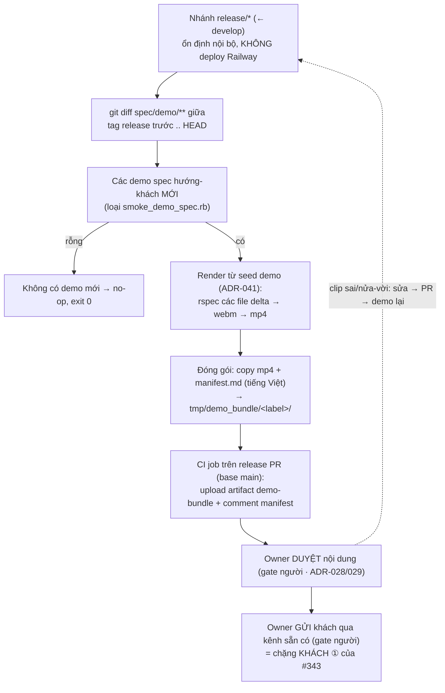

# Bán-tự-động gom bộ demo hướng-khách theo delta release

Thiết kế cho [#351](https://github.com/manhcuongdtbk/electric-water-management/issues/351) — follow-up của [#343](https://github.com/manhcuongdtbk/electric-water-management/issues/343) (tự động hoá demo, đã merge, ships 1.2.0). Mục tiêu: **bán-tự-động hoá phần *gom*** chặng KHÁCH ① — máy tính ra "demo nào mới trong release" + render + đóng gói + trình owner duyệt; **người vẫn duyệt + gửi**.

Liên quan: engine demo + chặng owner/khách + render-from-seed (ADR-036..041 trong [tự động hoá demo](2026-06-13-tu-dong-hoa-demo-design.md)); guardrail bắt PR hướng-khách phải có demo spec (ADR-040); gate người "AI lo cơ học — người giữ quyết định" (ADR-029) và cổng duyệt nội dung trước khi tới khách (ADR-028) trong [SDLC](2026-06-07-sdlc-overview-design.md); môi trường/promotion, `release/*` không deploy Railway, Acceptance = `main` (ADR-005/008 trong [quy trình release](2026-06-07-quy-trinh-release-design.md)); dấu vết bền trong repo, anchor `NV-...` (ADR-013/014 trong [truy vết & quản lý thay đổi](2026-06-08-truy-vet-quan-ly-thay-doi-design.md)).

> **Cách đọc:** quyết định viết theo **ADR** (Trạng thái → Bối cảnh → Quyết định → Lý do → Tradeoff → Phương án đã loại → Điều kiện xem lại). ADR đánh số toàn cục, tiếp nối **ADR-046**; spec này thêm **ADR-047 … ADR-048**.

## Bối cảnh: MVP #343 để chặng gom thủ công (có chủ đích)

MVP #343 (ADR-041) cố ý để chặng KHÁCH ① — "gom bộ demo hướng-khách của một release rồi gửi khách" — **thủ công**: chủ dự án tự nhớ tính năng nào mới, tự render/tải clip, tự gói, tự duyệt, tự gửi. Việc này có **hai phần khác bản chất**:

- **Máy làm được (phần *gom*):** tính delta demo của release → render từ seed → đóng gói thành một bộ có nhãn. Cơ học, lặp lại được, không cần phán đoán.
- **Người giữ gate (KHÔNG bỏ được):** **duyệt nội dung trước khi tới khách** — bắt clip dữ-liệu-sai / nửa-vời / không nên để khách (đơn vị quân đội) xem (ADR-028/029) — và **hành động gửi ra ngoài** tới đơn vị khách (outward-action, luôn người bấm). Auto-gửi clip *chưa duyệt* cho khách là rủi ro.

Mức tự động cao nhất hợp lý: **máy gom sẵn → trình owner duyệt một-nơi → owner gửi.** Spec này hiện thực đúng phần *gom*; giữ nguyên hai gate người.

## Goals

- **Đỡ việc tay phần cơ học:** một lệnh tính ra "demo nào mới trong release", render từ seed, gói thành bộ — owner không tự dò/gói tay.
- **Đúng delta:** chỉ gói **cái mới của version đó** (không gửi tất-cả demo — tránh chôn vùi cái mới, tránh phình vô hạn).
- **Một nơi trình duyệt:** bộ clip + manifest tiếng Việt trình owner ở **release PR** (comment + artifact) — hợp với phần còn lại của hệ CI.
- **Giữ gate người:** duyệt nội dung + gửi khách **vẫn là bước người** (ADR-028/029). Không auto-gửi.
- **Tận dụng cái đã có:** dựng trên engine demo #343 (recorder Playwright, seed demo, `demo:transcode`, guardrail `customer-facing`); không dựng quy trình mới.

## Non-Goals (cố ý KHÔNG làm ở vòng này)

- **Tự động gửi khách** — bước forward giữ thủ công (gate người, ADR-028/029). Chỉ tự động *gom + trình duyệt*.
- **Ghép release reel (một video gọn)** — vẫn bộ clip rời theo tính năng (giữ ADR-041); ghép để dành đường nâng cấp.
- **Catalog nội bộ tất-cả-demo (regression reference)** — khác bản chất gói gửi khách; nêu ở "Điều kiện xem lại" ADR-047, không làm ở vòng này (ưu tiên thấp, YAGNI).
- **Generator/scaffold demo spec mới** — việc của [#352](https://github.com/manhcuongdtbk/electric-water-management/issues/352); spec này KHÔNG đụng.
- **Trang demo trong app / host video** — giữ Non-Goal #343 (ADR-041); giao bằng kênh sẵn có.
- **TTS / lồng tiếng** — giữ Non-Goal #343 (ADR-039).

## Glossary (khoá nghĩa — không viết tắt; bổ sung `docs/THUAT_NGU.md` khi triển khai)

| Thuật ngữ | Nghĩa |
|---|---|
| **Bộ demo delta** | Tập clip mp4 của *các tính năng hướng-khách mới trong một release* (delta so với release trước), kèm manifest — đối tượng owner duyệt rồi gửi khách. Khác "tất cả demo". |
| **Range release** | Khoảng commit của một release để tính delta: từ **tag release trước** (`vX.Y.Z`) tới **HEAD nhánh `release/*`**. |
| **Manifest bộ demo** | File `manifest.md` (tiếng Việt) liệt kê: range, mỗi clip ↔ demo spec ↔ anchor `NV-...`, cảnh báo clip thiếu. Bề mặt owner đọc-lướt khi duyệt. |
| **Sidecar manifest** | File `tmp/demo_videos/manifest.jsonl` recorder ghi mỗi dòng `{video, description, file, nv}` lúc lưu video — nguồn ánh xạ *authoritative* clip→spec→NV cho lệnh gom (không tự suy lại từ tên file). |

## Sơ đồ luồng

## Kiến trúc & thành phần

### 1. Lệnh gom — rake task `demo:bundle[since,head]`
Cốt lõi cơ học. Các bước:

1. **Range.** `since` mặc định = tag release gần nhất reachable (`git describe --tags --abbrev=0 --match 'v*'`); `head` mặc định `HEAD`. Cả hai truyền tay được (CI truyền tag trên `main`).
2. **Delta.** `git diff --name-only <since>..<head> -- spec/demo/` → các file demo spec **thêm/sửa**; **loại `spec/demo/smoke_demo_spec.rb`** (smoke hạ tầng, không phải tính năng khách). Rỗng → in thông báo "không có demo hướng-khách mới trong range" và **exit 0** (no-op hợp lệ, không lỗi).
3. **Render từ seed (ADR-041).** Dọn `tmp/demo_videos/`, chạy `rspec <các file delta>` với `DEMO=1` (driver Playwright + seed demo) → webm, rồi `demo:transcode` → mp4. **Chỉ render delta** — đúng tinh thần "chỉ cái mới"; clip nhất quán vì render từ seed, không phụ thuộc artifact PR rời rạc.
4. **Đóng gói.** Tạo `tmp/demo_bundle/<label>/` (`<label>` = `<since>_to_<head-short>`); copy các mp4 + ghi `manifest.md`. Manifest đọc **sidecar `manifest.jsonl`** để ánh xạ clip ↔ spec ↔ `NV-...` (authoritative). **Cảnh báo to** nếu một spec delta render mà không sinh ra clip mong đợi (fail-loud trong tổng kết, không nuốt lỗi âm thầm).
5. **Tổng kết.** In: range, danh sách clip đã gom, clip thiếu (nếu có), đường dẫn bộ — để owner mở duyệt cục bộ.

> Lệnh **không gửi** gì ra ngoài. Đầu ra là một thư mục + manifest cho người.

### 2. Sidecar manifest (sửa nhỏ recorder)
`spec/support/demo_recorder_config.rb` (`on_save_screenrecord`) ngoài việc đổi tên webm còn **append một dòng** vào `tmp/demo_videos/manifest.jsonl`: `{video, description, file, nv}` (lấy từ `RSpec.current_example`). Vô hại với demo job hiện có — upload artifact của job đó glob `*.mp4` nên không đụng tới `manifest.jsonl`. Đây là nguồn ánh xạ tin cậy để manifest gói khỏi phải tự suy lại `parameterize`.

### 3. CI job `demo-bundle` (bề mặt trình owner duyệt)
Job mỏng, **chỉ chạy trên PR base `main`** (= release PR; nhận biết qua `github.base_ref == 'main'`). Tái dùng pattern job `demo` + `post-demo-comment.sh`:

1. Cài Playwright + ffmpeg + seed (giống job `demo`).
2. `bin/rails demo:bundle[<tag-mới-nhất-trên-main>,HEAD]` — render delta + gói.
3. Upload `tmp/demo_bundle/**` làm artifact `demo-bundle`.
4. Post **một comment** lên release PR: nội dung `manifest.md` + link artifact (script `post-bundle-comment.sh`, cùng họ `post-demo-comment.sh`, một marker → giữ một comment tươi).

Owner xem comment + tải artifact → **duyệt** → forward thủ công. PR không base `main` → job skip (không tốn Actions).

### 4. Gate người (giữ nguyên, KHÔNG tự động)
- **Duyệt nội dung:** owner xem clip + manifest, bắt clip dữ-liệu-sai / nửa-vời / nhạy cảm (ADR-028/029). Clip có vấn đề → sửa qua đúng pipeline (nhánh fix ← `develop` → PR → demo chạy lại), **không vá tắt trên `release`** (khớp #343).
- **Gửi khách:** owner forward qua kênh sẵn có (Zalo/email/USB) — outward-action, luôn người bấm.

## Quyết định (ADR)

### ADR-047: Tín hiệu chọn "demo hướng-khách mới của release" = git diff `spec/demo/**` trong range
- **Trạng thái:** Accepted · 2026-06-14
- **Bối cảnh:** Để gom "đúng delta hướng-khách của version", cần một tín hiệu xác định *demo nào mới trong release*. Ba ứng viên: (A) nhãn `customer-facing` trên các PR đã merge trong khoảng commit; (B) metadata milestone khai trong từng demo spec; (C) các file `spec/demo/**` thêm/sửa giữa tag release trước và HEAD `release/*`.
- **Quyết định:** Dùng **(C)** — `git diff --name-only <tag-trước>..<HEAD> -- spec/demo/`, loại `smoke_demo_spec.rb`. Mỗi file demo spec còn lại = một tính năng hướng-khách (theo định nghĩa engine #343).
- **Lý do:** Dấu vết bền của dự án nằm **trong repo** (ADR-013/014), không ở trạng thái GitHub sau-merge. Guardrail ADR-040 đã **ràng buộc** PR `customer-facing` ⟺ chạm `spec/demo/**`; nên "demo spec đổi trong range" *là* "tính năng hướng-khách mới" — không cần tín hiệu thứ hai. (C) chạy offline thuần git, tái lập, không phụ thuộc network/API hay nhãn còn đúng sau squash.
- **Tradeoff:** (+) Đơn giản, offline, tái lập, khớp guardrail sẵn có, không thêm ceremony. (−) Một demo spec sửa *thuần kỹ thuật* (đổi selector, không đổi nội dung khách thấy) vẫn lọt vào delta → owner lọc ở bước duyệt (gate người vốn có, chấp nhận được). Phụ thuộc kỷ luật "một feature ↔ một demo spec".
- **Phương án đã loại:** *(A) nhãn PR trong range* — cần GitHub API, phụ thuộc nhãn còn đúng sau merge/squash, lệch với dấu vết repo. *(B) milestone trên spec* — thêm metadata phải nhớ cập nhật mỗi spec, trùng vai trò với nhãn PR, dễ quên/lệch.
- **Điều kiện xem lại:** Nếu cần phân biệt "sửa kỹ thuật" với "đổi nội dung khách thấy" ở mức máy (vd để dựng **catalog regression nội bộ** tách khỏi gói khách) → cân nhắc thêm metadata phân loại trên demo spec.

### ADR-048: Gom = render-from-seed qua rake `demo:bundle`, trình owner ở release PR; forward giữ gate người, delta-only
- **Trạng thái:** Accepted · 2026-06-14
- **Bối cảnh:** Sau khi biết *demo nào* (ADR-047), cần quyết (a) lấy clip từ đâu, (b) đóng gói/trình owner thế nào, (c) ranh giới tự-động ↔ người.
- **Quyết định:** (a) **Render lại từ seed demo** chỉ các spec delta (rake `demo:bundle`), không gom artifact PR rời rạc; (b) gói = thư mục clip + `manifest.md` tiếng Việt, trình owner qua **CI job trên release PR** (artifact `demo-bundle` + comment manifest) — và rake chạy cục bộ được; (c) **duyệt nội dung và gửi khách giữ là bước người** (ADR-028/029); chỉ gói **delta** của version (không gửi tất-cả).
- **Lý do:** Render từ seed cho clip **nhất quán/tái lập** (ADR-041) — artifact PR hết hạn, rải rác nhiều run, không đáng tin để gom. Trình ở release PR khớp nơi owner đã làm việc + pattern `demo`/`post-demo-comment` sẵn có → ít bề mặt mới. Giữ forward thủ công vì gửi clip chưa-duyệt cho khách quân đội là rủi ro (ADR-028) và outward-action luôn cần người (ADR-029). Delta-only để cái mới không bị chôn.
- **Tradeoff:** (+) Clip nhất quán, ít bề mặt mới, gate người an toàn, owner duyệt đúng nơi. (−) Render lại tốn thêm thời gian CI ở release PR (chấp nhận: chỉ delta, hiếm khi nhiều); chưa có một-file-gọn để gửi; forward vẫn thủ công (có chủ đích).
- **Phương án đã loại:** *Gom artifact từ các PR job `demo`* — artifact hết hạn/rải rác, fragile, không tái lập. *Auto-gửi sau khi gom* — bỏ gate duyệt nội dung, rủi ro lộ clip sai cho khách. *Gửi tất-cả demo mỗi release* — chôn vùi cái mới, phình vô hạn (ngược Goal). *Ghép release reel ngay* — cần lớp ghép/manifest video, để dành (giữ ADR-041 clip rời).
- **Điều kiện xem lại:** Khi số tính năng/release lớn và khách muốn một video gọn → mở cấp ghép reel; hoặc khi cần gửi định kỳ tự động hơn → cân nhắc một bước phát hành có chữ-ký-duyệt thay vì forward tay.

## Truy vết

- Issue: [#351](https://github.com/manhcuongdtbk/electric-water-management/issues/351) (follow-up [#343](https://github.com/manhcuongdtbk/electric-water-management/issues/343)). Tách bạch với generator/scaffold [#352](https://github.com/manhcuongdtbk/electric-water-management/issues/352).
- Bộ demo delta mang theo manifest trỏ về anchor `NV-...` của từng demo spec (truy vết xuôi yêu cầu → demo → bộ gửi khách).
- Gate người (duyệt + gửi) khớp ADR-028/029; ranh giới tự-động giữ đúng "AI lo cơ học — người giữ quyết định".

## Lịch sử thay đổi

| Phiên bản | Ngày | Thay đổi |
|---|---|---|
| 0.1.0 | 2026-06-14 | Bản đầu: bán-tự-động gom bộ demo hướng-khách theo delta release (#351). Thêm ADR-047 (tín hiệu = git diff `spec/demo/**` trong range) + ADR-048 (render-from-seed qua rake `demo:bundle`, trình owner ở release PR, forward giữ gate người, delta-only). |
