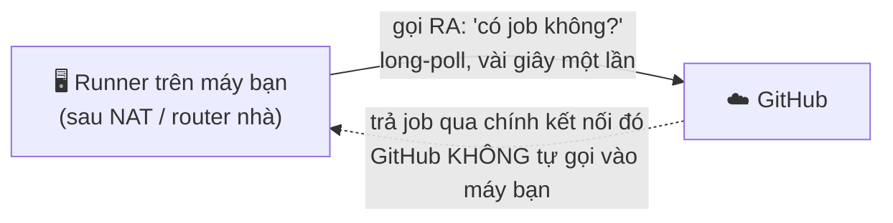
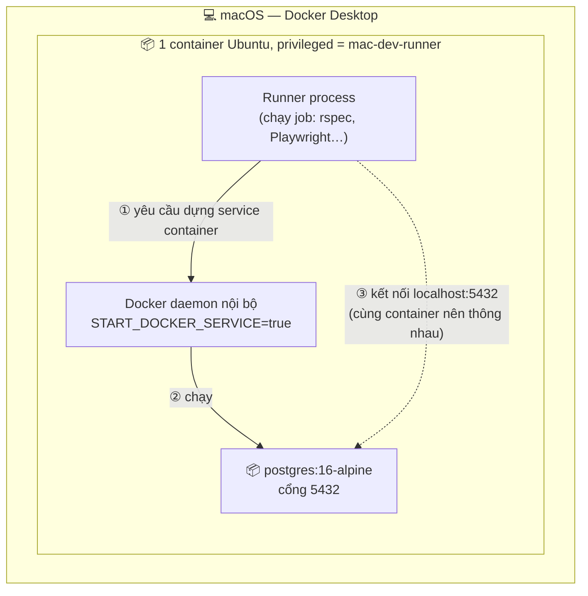
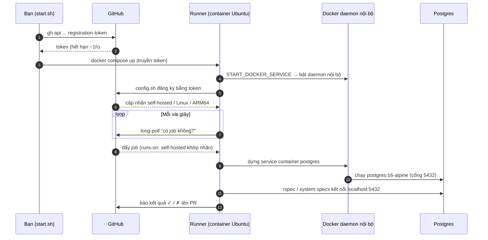

# Self-hosted GitHub Actions runner cho `electric-water-management`

> Tài liệu vận hành + giải thích cơ chế cho self-hosted CI runner. **Giải pháp
> tạm thời** để CI không tiêu phút GitHub-hosted khi quota đã hết (quota reset
> đầu mỗi tháng). Bản ghi *vì sao / quyết định / ngõ cụt* xem `DECISIONS.md` cùng
> thư mục. (Thư mục `tools/` nằm ngoài `docs/` nên không bị doc-governance ép
> version/changelog — nhưng vẫn là một phần của repo, ai cũng dùng được.)

---

## TL;DR — dùng hằng ngày

```bash
tools/self-hosted-runner/start.sh    # bật runner (tự lấy token đăng ký qua gh)
tools/self-hosted-runner/stop.sh     # tắt + gỡ đăng ký runner
docker logs -f ewm-gh-runner   # xem log runner
```

Sau khi tắt máy / Docker Desktop khởi động lại: chạy lại `start.sh`.
**Runner phải đang bật thì CI mới chạy** — nếu tắt, các job sẽ treo ở "queued".

---

## 1. Vấn đề & cách giải quyết

CI cần một cái máy để chạy. Có 2 loại:

- **GitHub-hosted** (`runs-on: ubuntu-latest`): GitHub dựng máy ảo mới mỗi lần,
  chạy xong xoá. Tiện nhưng **tính phút** (tài khoản free có 2.000 phút/tháng).
- **Self-hosted** (`runs-on: self-hosted`): *bạn* cung cấp máy. GitHub gửi job
  tới đó. **Không tính phút.**

Giải pháp: dựng một self-hosted runner trên máy dev (qua Docker Desktop) và đổi
`ci.yml` sang `runs-on: self-hosted`. Từ đó CI chạy free trên máy bạn.

### Điểm dễ hiểu sai (quan trọng)

**Runner chủ động "gọi ra" GitHub, GitHub KHÔNG "gọi vào" máy bạn.** Runner là
một tiến trình chạy nền, cứ vài giây long-poll GitHub: *"có job nào cho tôi
không?"*. Vì nó gọi ra ngoài nên **không cần mở cổng, không cần IP tĩnh, không
đụng firewall/NAT** — chạy sau router nhà vẫn được. Đây là lý do self-hosted
runner cài được trên cả laptop.



---

## 2. Các thành phần (file trong thư mục này)

| File | Vai trò |
|---|---|
| `docker-compose.yml` | Định nghĩa container runner (image, privileged, env đăng ký, DinD) |
| `start.sh` | Lấy registration token mới qua `gh` rồi `docker compose up` |
| `stop.sh` | `docker compose down` — tắt + gỡ đăng ký runner |
| `README.md` | File này |

Container dùng image cộng đồng **`myoung34/github-runner:ubuntu-noble`** — đóng
gói sẵn bộ runner *chính thức của GitHub* trên nền Ubuntu 24.04, nên không phải
tự cài từng thứ. Khi container khởi động, nó tự chạy `config.sh` (đăng ký) rồi
`run.sh` (bắt đầu long-poll).

---

## 3. Cơ chế — chuyện gì xảy ra để CI chạy được self-hosted

Ngoài việc sửa `ci.yml` (`ubuntu-latest` → `self-hosted`), phần "thật sự làm cho
nó chạy" gồm 4 mảnh:

### 3.1. Đăng ký runner cần một token

Để một máy được phép nhận job của repo, nó phải đăng ký bằng **registration
token** (token ngắn hạn, hết hạn ~1 giờ). Lấy qua `gh` (cần quyền chủ repo):

```bash
gh api -X POST \
  repos/manhcuongdtbk/electric-water-management/actions/runners/registration-token \
  -q .token
```

`start.sh` tự làm bước này mỗi lần bật, nên token hết hạn không thành vấn đề.

### 3.2. Chạy runner trong container Ubuntu (không cài thẳng lên macOS)

Workflow giả định **Ubuntu Linux** (`sudo apt-get install ffmpeg`, image
`postgres:16-alpine`…). macOS không có `apt-get`. Nên runner chạy **bên trong
một container Ubuntu** để môi trường khớp y hệt `ubuntu-latest`.

Các dòng quan trọng trong `docker-compose.yml`:

```yaml
image: myoung34/github-runner:ubuntu-noble   # runner + Ubuntu 24.04
privileged: true                             # cần cho Docker-in-Docker (xem 3.3)
environment:
  REPO_URL: https://github.com/manhcuongdtbk/electric-water-management
  RUNNER_TOKEN: ${RUNNER_TOKEN}              # token ở 3.1 (start.sh truyền vào)
  LABELS: self-hosted,linux,mac-dev          # nhãn để workflow tìm (xem 3.4)
  START_DOCKER_SERVICE: "true"               # bật Docker daemon nội bộ (xem 3.3)
```

### 3.3. Mẹo khó nhất: Docker-trong-Docker (DinD)

Job `tests` và `demo` có service container:

```yaml
services:
  postgres:
    image: postgres:16-alpine
    ports: [5432:5432]
```

GitHub Actions chạy service container này **bằng Docker**, rồi job kết nối tới
`localhost:5432`. Nghĩa là **máy chạy runner phải có Docker** để dựng Postgres.

Nhưng runner đã nằm trong một container rồi, mà container thường không có Docker
bên trong. Hai env giải quyết:

- **`privileged: true`** — cho phép container chạy một Docker daemon riêng bên
  trong nó.
- **`START_DOCKER_SERVICE: "true"`** — image khởi động Docker daemon đó lúc boot
  (bạn sẽ thấy log `Starting docker service ... done`).

Kết quả: runner và Postgres chạy **trong cùng một container** → `localhost:5432`
thông nhau y hệt môi trường GitHub thật. Đây là điều khiến `tests`/`demo` chạy
được thay vì lỗi "không kết nối được database".



### 3.4. Nối runner với workflow qua "labels"

Khi đăng ký xong, GitHub tự gán nhãn cho runner: `self-hosted`, `Linux`, `ARM64`
(máy Apple Silicon). Trong `ci.yml`, `runs-on: self-hosted` nghĩa là *"giao job
cho bất kỳ runner nào có nhãn `self-hosted`"*. Đó là sợi dây nối:
**`runs-on` khớp với label của runner.** Không có runner mang nhãn đó → job treo
mãi ở "queued".

### Chuỗi đầy đủ



---

## 4. Đặc điểm vận hành cần biết

- **Chạy tuần tự, không song song.** Một runner mặc định chạy *một job tại một
  thời điểm*. Ngoài ra các job map cổng cố định `5432:5432`, nếu chạy song song
  hai job cùng bind cổng đó sẽ đụng nhau — nên để tuần tự là an toàn. Hệ quả:
  một PR có ~10 job sẽ chạy lần lượt → chậm hơn GitHub-hosted, nhưng free.
- **Runner phải online.** Repo private không có fallback GitHub-hosted; runner
  tắt thì checks treo "queued" đến khi bật lại.
- **Yêu cầu:** Docker Desktop đang chạy; `gh` đã đăng nhập (chủ repo).
- **Tài nguyên:** test suite + Chrome + Playwright khá nặng. Nếu chậm/OOM, tăng
  RAM ở Docker Desktop → Settings → Resources.

---

## 5. Chi phí

Phút chạy trên **self-hosted runner KHÔNG tính vào quota GitHub-hosted** và nằm
ngoài spending limit của GitHub Actions (theo tài liệu GitHub) — đổi lại bạn tự
lo máy chạy runner. Đây là cách giữ CI **$0** khi quota GitHub-hosted đã dùng hết
mà repo vẫn private. Đánh đổi: chậm hơn GitHub-hosted (xem mục 4).

---

## 6. Gỡ bỏ / quay lại GitHub-hosted (sau khi quota reset)

1. `tools/self-hosted-runner/stop.sh`
2. Trong repo, đổi lại `.github/workflows/ci.yml`: mọi `runs-on: self-hosted`
   → `runs-on: ubuntu-latest` (header của file đã ghi chú điều này).
3. (Tuỳ chọn) dọn cả volume Docker: chạy `docker compose down -v` trong
   `tools/self-hosted-runner/` (tự xoá đúng volume của project, khỏi đoán tên).

Hoặc cứ giữ runner và dùng tiếp vĩnh viễn — nó vẫn free.

---

## 7. Troubleshoot nhanh

| Triệu chứng | Nguyên nhân thường gặp |
|---|---|
| Checks treo mãi "queued" | Runner chưa bật → chạy `start.sh`; hoặc nhãn không khớp |
| `start.sh` báo lỗi token | `gh` chưa đăng nhập / hết hạn → `gh auth status` |
| Job `tests`/`demo` lỗi kết nối DB `localhost:5432` | Docker daemon nội bộ chưa lên → kiểm tra log `Starting docker service`; cần `privileged: true` + `START_DOCKER_SERVICE: true` |
| Job chậm / bị kill (OOM) | Tăng RAM Docker Desktop |
| Trùng runner offline trong Settings → Actions → Runners | Lần bật trước chưa gỡ sạch; xoá thủ công trong UI hoặc dùng `stop.sh` trước khi `start.sh` |

---

## 8. Ghi chú: chạy test song song trên runner này (nghiên cứu #383)

Cho ai muốn chạy `rspec` (gồm system specs Selenium) song song trên runner này.
Các fix tương ứng nằm ở `ci.yml`, `bin/test-processes`, `spec/support/system_test_config.rb`,
`spec/spec_helper.rb` (nhánh `claude/dazzling-rubin-334f1e`), kèm comment tại chỗ.

- **Số process tự dò** (`bin/test-processes`): `min(nproc, RAM_khả_dụng / ~1100MB)` — mọi máy tự vừa, không cần chỉnh tay; đọc RAM *khả dụng* nên máy bận tự giảm.
- **chromedriver tranh cổng khoá 9514** khi chạy song song → mỗi process một cổng riêng `9515 + TEST_ENV_NUMBER*10` (trong `system_test_config.rb`).
- **chromedriver crash (ECONNREFUSED) khi quá nhiều Chrome đồng thời** trên Docker lồng/Mac → **tách 2 pha**: non-system full parallel, **system specs `-n 2`**.
- **Zombie chromedriver** tích tụ trong lúc chạy (tini chỉ reap zombie mồ côi) — vô hại, được dọn khi worker thoát.
- **`parallel_test` nuốt `--tag` thành file** (`File.stat('--tag')`): truyền **danh sách file tường minh** (`find spec ... -not -path 'spec/system/*'`), không dùng `--`/`-o '--tag'`.
- **SimpleCov + parallel**: `command_name` theo process+phase + `merge_timeout`; `minimum_coverage` chỉ gate khi **chạy đơn-process** (parallel báo coverage một phần → fail giả).
- Runner 1 con = job chạy **tuần tự**, chậm hơn GitHub-hosted ~2–4× (xem mục 4). Đây là giải pháp **$0-khi-private**, không phải giải pháp tốc độ.

### Trạng thái & ngõ cụt đã gặp (cập nhật 2026-06-14)

**Non-system specs chạy song song OK.** Nhưng **system specs (Selenium/headless Chrome) CHƯA chạy xanh ổn định** trên runner này — đây là **ngõ cụt đang tạm dừng**, KHÔNG phải đã xong:

- Per-process port đã trị **tranh cổng khoá 9514**. Nhưng qua một lần chạy ~55 phút với hàng trăm system example, chromedriver **vẫn `ECONNREFUSED` rải rác kể cả ở `-n 2`** — chromedriver tự chết, không phải lỗi cấu hình. **Kết luận: tuning concurrency không trị được; đây là flakiness môi trường của headless Chrome trên Docker-lồng-trên-Mac.**

**Hướng thử khi quay lại (chưa làm):**
1. **System specs chạy đơn-process** (`bundle exec rspec spec/system`, port mặc định ngẫu nhiên — bỏ per-process port) để giảm tối đa stress lên Chrome.
2. **`rspec-retry`** giới hạn cho `type: :system`, chỉ retry `Selenium::WebDriver::Error::WebDriverError` (dung thứ ECONNREFUSED tạm thời).
3. Chấp nhận runner self-hosted chỉ chạy **non-system specs**; system specs để GitHub-hosted.
